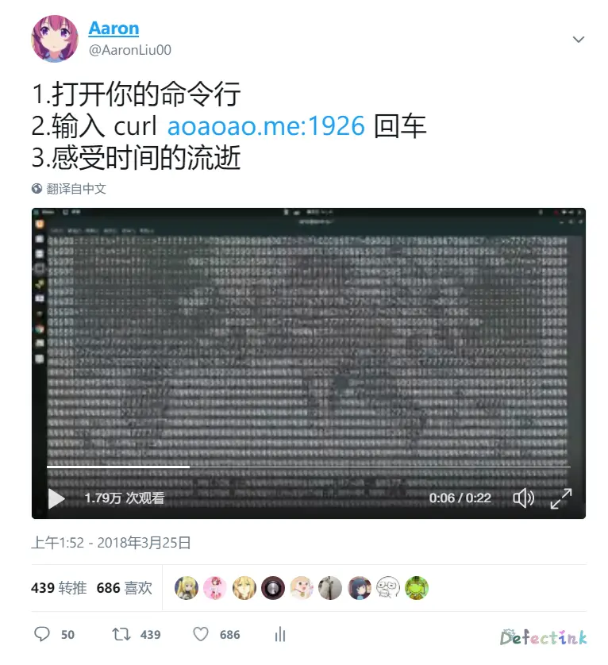
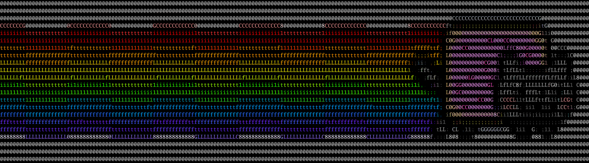

什么是ASCII？

来自百度百科的解释：
ASCII（American Standard Code for Information Interchange，美国信息交换标准代码）是基于拉丁字母的一套电脑编码系统，主要用于显示现代英语和其他西欧语言。它是现今最通用的单字节编码系统，并等同于国际标准ISO/IEC 646。

应该很多小伙伴们都非常熟悉ASCII码了，它也是现今最能玩的一套编码了吧（雾💊

那么ascii视频流又是啥呢？

这是来自某位大佬胡乱起的名字。🤣



## 那么如何安装呢？

根据[大佬的文章](https://file.aoaoao.me/2018/03/26/e6-9e-84-e5-bb-ba-e4-b8-80-e4-b8-aa-e5-9c-a8-e7-ba-bfascii-e8-a7-86-e9-a2-91-e6-b5-81-e6-9c-8d-e5-8a-a1/#如何搭建这么一个服务？)与开源项目。首先我们需要：

1. ffmpeg
2. [hit9/img2txt](https://github.com/hit9/img2txt)
3. [HFO4/plus1s.live](https://github.com/HFO4/plus1s.live)
4. node.js/Go/Python运行环境

### 使用ffmpeg截取视频片段

安装ffmpeg：

**CentOS**
由于CentOS没有官方FFmpeg rpm软件包。但是，我们可以使用第三方YUM源（Nux Dextop）完成此工作。

```centos7
sudo rpm --import http://li.nux.ro/download/nux/RPM-GPG-KEY-nux.ro
sudo rpm -Uvh http://li.nux.ro/download/nux/dextop/el7/x86_64/nux-dextop-release-0-5.el7.nux.noarch.rpm
sudo rpm --import http://li.nux.ro/download/nux/RPM-GPG-KEY-nux.ro
sudo rpm -Uvh http://li.nux.ro/download/nux/dextop/el6/x86_64/nux-dextop-release-0-2.el6.nux.noarch.rpm
```

**Ubuntu**
Ubuntu的源里默认就有ffmpeg的软件包，所以我们直接安装就ok了。

```
apt install ffmpeg
```

拥有了ffmpeg之后，我们可以使用如下命令：

```
ffmpeg -i demo.mp4 -r 5 -ss 00:01:13 -t 00:00:15 %03d.png
```

将demo视频的第1分13秒后的15秒以每秒5帧的速度保存为图像，图像名格式为001.png 002.png ……
效果如下：


```bash
➜  ~ ls time
001.png  005.png  009.png  013.png  017.png  021.png  025.png  029.png  033.png  037.png  041.png  045.png  049.png  053.png  057.png  061.png  065.png  069.png  073.png
002.png  006.png  010.png  014.png  018.png  022.png  026.png  030.png  034.png  038.png  042.png  046.png  050.png  054.png  058.png  062.png  066.png  070.png  074.png
003.png  007.png  011.png  015.png  019.png  023.png  027.png  031.png  035.png  039.png  043.png  047.png  051.png  055.png  059.png  063.png  067.png  071.png  075.png
004.png  008.png  012.png  016.png  020.png  024.png  028.png  032.png  036.png  040.png  044.png  048.png  052.png  056.png  060.png  064.png  068.png  072.png
```

### 使用修改过的hit9/img2txt将图像转换为ASCII画

> 原版hit9/img2txt只能单张转换，我稍微改了下，可以批量转换并保存为txt。修改后的版本：https://github.com/HFO4/img2txt/blob/gh-pages/img2txt.py

可能大佬都是说改就改的吧。
完事我们clone下来后修改img2txt.py第246行的目录为上一步存放图像的目录：

```
246         imgname = "/root/time/"+str(i).zfill(3)+".png"
```

然后再执行：

```
pip install img2txt.py
python img2txt.py h
```

稍等片刻，ASCII字符文件便会存放到与img2txt.py同级的pic目录下。若提示无pic文件夹导致的错误，手动创建一个名为`pic`的文件夹再运行一次即可。

### 部署在线服务

最后，使用大佬的[HFO4/plus1s.live](https://github.com/HFO4/plus1s.live)来部署在线播放的服务。

将上一步使用img2txt的pic文件夹中的图片放到改项目下的pic文件夹内，然后修改stream.go的第13行为你得到的单帧图像的总个数。保存后执行：

```
go build stream.go
./stream
```

然后程序会默认开放一个暴力的端口，使用`curl 您的ip:1926`命令即可查看效果。

## 另一款强大的软件

> 📺ASCIIPlayer : Golang写的ASCII码播放器


如同作者自己所说的，该软件是Go语言写的一款强大的Ascii码的转码加播放器。

* [ASCIIPlayer : Golang写的ASCII码播放器](https://segmentfault.com/a/1190000016976239)

* [asciiplayer](https://github.com/qeesung/asciiplayer)

### 安装

```
go get -u github.com/qeesung/asciiplayer
```

安装后若提示：

```
zsh: command not found: asciiplayer
```

则在当前目录下会缓存一个`go`文件夹，在`go/bin/`文件夹内会有一个可执行的asciiplayer。我们将其copy至`/usr/bin/`目录下，并重连ssh即可解决。

```
cp -a asciiplayer /usr/bin
```

### 三种工作模式

该软件强大的地方就是在此了，对于转换为ascii码，它拥有三个工作模式：

- 输出到一个一般文件中(Encode模式)： 这里我们只能逐帧，逐像素的将转化以后的ASCII图像写到文件中去。
- 输出到终端(Play模式): 直接将转换以后的图像按照一定的频率输出到终端即可。
- 输出到远端客户端(Server模式): 这里和输出到终端的原理类似，只是输出到了远端客户端所在的终端。

```
                 +---------------+                                                  +---------+
                 |               |                                                  |         |
          +------> Gif Decoder   |                                              +---> Encoder +---> file
          |      |               |                                              |   |         |
          |      +---------------+                                              |   +---------+
          |      +---------------+                +-------------+               |   +---------+
          |      |               |                |             |               |   |         |
Input File+------> Image Decoder +---> Frames +-->+ Image2ASCII +->ASCII Frames-+---> Player  +---> stdout
          |      |               |                |             |               |   |         |
          |      +---------------+                +-------------+               |   +---------+
          |      +---------------+                                              |   +---------+
          |      |               |                                              |   |         |
          +------> Video Decoder |                                              +---> Server  +---> socket
                 |               |                                                  |         |
                 +---------------+                                                  +---------+
```

以至于它一款软件就能够直接实现我们是上述将视频中抽去图片再挨个转换为文本的ASCII码的工作了。除了不能将我们需要的输出为文本保存以外，其他都很完美。
唯一一个缺点就是目前还不支持直接读取视频文件，只能先使用ffmpeg将视频转换为gif中，在用此软件读取。作者目前也说后续会支持视频的。🎉

### 常用的命令

- play

通过适配屏幕的方式播放GIF

```
asciiplayer play demo.gif
```

缩小为原来的十分之一，然后播放GIF

```
asciiplayer play demo.gif -r 0.1
```

缩放成固定的长和宽，然后播放GIF

```
asciiplayer play demo.gif -w 100 -h 40
```

播放一个PNG图片

```
asciiplayer play demo.png
```

- encode

将一个GIF文件demo.gif编码为ASCII的Gif文件output.gif

```
asciiplayer encode demo.gif -o output.gif
```

指定输出ASCII字符大小的情况下，讲一个GIF文件demo.gif编码成ASCII的GIF动图文件output.gif

```
asciiplayer encode demo.gif -o output.gif --font_size=5
```

将GIF动图demo.gif缩放为原来的十分之一，然后编码成ASCII的GIF动图文件output.gif

```
asciiplayer encode demo.gif -o output.gif -r 0.1
```

编码一个jpeg文件，然后输出一个ASCII的output.png文件

```
asciiplayer encode demo.jpeg -o output.png
```

- Server

输入demo.gif，并以默认端口8080启动一个http服务器

```
asciiplayer server demo.gif
```

输入demo.gif，并以自定义端口8888启动一个http服务器

```
asciiplayer server demo.gif --port 8888
```

输入一个demo.png图片，并且启动http 服务器

```
asciiplayer server demo.png
```

## 大佬们

[ASCIIPlayer : Golang写的ASCII码播放器](https://segmentfault.com/a/1190000016976239#articleHeader0)
[构建一个在线ASCII视频流服务](https://file.aoaoao.me/2018/03/26/e6-9e-84-e5-bb-ba-e4-b8-80-e4-b8-aa-e5-9c-a8-e7-ba-bfascii-e8-a7-86-e9-a2-91-e6-b5-81-e6-9c-8d-e5-8a-a1/#如何搭建这么一个服务？)

## Try it ?

```
curl time.defect.ink:1926
```