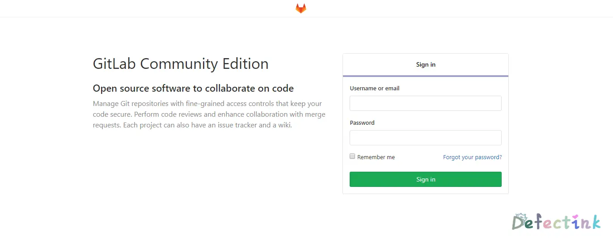

## Gitlab?

**GitLab**是由GitLab Inc.开发，使用[MIT许可证](https://zh.wikipedia.org/wiki/MIT許可證)的基于[网络](https://zh.wikipedia.org/wiki/互联网)的[Git](https://zh.wikipedia.org/wiki/Git)[仓库](https://zh.wikipedia.org/wiki/仓库_(版本控制))管理工具，且具有[wiki](https://zh.wikipedia.org/wiki/Wiki)和[issue跟踪](https://zh.wikipedia.org/wiki/事务跟踪管理系统)功能。

它是一款和常见的Github很像仓库管理工具，大体使用上和Github很像。前端页面也很好看，主要的是安装非常的方便，它集成了自身需要的nginx的服务端。

起初是由Ruby写成，后来部分由Go语言重写。

最早，它是完全免费的开源软件，按照 MIT 许可证分发。毕竟人家是公司，后来Gitlab被拆分成GitLab CE（社区版）和 GitLab EE（企业版）。和如今的模式一样，ce是完全免费使用的社区版，而ee是可以进行试用且更多功能的收费版。


## 安装部署

[官方](https://about.gitlab.com/install/)拥有详细的安装操作文档，并且对于不同的Linux发行版也有着不同的软件仓库源。除此之外，我们还可以选择其他的安装方式，如Docker等。

我当前是部署在Ubuntu上的，系统信息：


	官方是推荐系统空闲内存在4GB以上的，对于类似我们这样的个人使用的较少的来说，推荐空闲内存是2GB以上。毕竟它会自己运行一套nginx、redis等服务端。

自家的开源地址：[Gitlab](https://gitlab.com/gitlab-org/gitlab-ce/)

相对于从源码安装来说，自家提供的相应的软件包更加的方便，也更不会容易出错。我们只需要选择相应的操作系统即可。

这里仅以Ubunt示例：

首先安装需要的相关依赖：

```
sudo apt-get update
sudo apt-get install -y curl openssh-server ca-certificates
```

如果我们不使用外部的SMTP来发邮件的话，Gitlab可以使用postfix来进行发邮件。当然对我们完全不需要发邮件的这个需求的话，这步完全可以跳过。

```
sudo apt-get install -y postfix
```

基本依赖安装完后，随后可以添加Gitlab的源来进行安装软件了：

```
curl https://packages.gitlab.com/install/repositories/gitlab/gitlab-ce/script.deb.sh | sudo bash
curl https://packages.gitlab.com/install/repositories/gitlab/gitlab-ee/script.deb.sh | sudo bash
```

*注意ce和ee的区别*

接下来，我们就可以使用`apt`来进行安装GItlab-ce了。修改下方命令的`https://gitlab.example.com`为自己Gitlab运行的域名。安装程序将自动配置该网址启动Gitlab

对于需要启用`https`的小伙伴们，Gitlab可以自动请求[[Let's Encrypt](https://docs.gitlab.com/omnibus/settings/ssl.html#lets-encrypthttpsletsencryptorg-integration)]的证书，方便我们一步到位。当然我们也可以使用自己的证书。

```
sudo EXTERNAL_URL="https://gitlab.example.com" apt-get install gitlab-ce
```

到这里就安装的差不多了，此时我们可以打开自己的Gitlab。第一次访问时会被重定向到设定`root`密码的界面。设置完成后我们的Gitlab就安装完成了。初始管理员的账户就是`root`

由官方给我们提供的安装方式是不是相对来说非常的简单呢?

## 使用



简洁多彩的界面也时非常的好看的。默认没有配置邮件的情况下是可以随意注册的，我们也可以在后台配置里关闭自动注册，作为一个私人的git仓库。也可以手动添加用户给想尝鲜的小伙伴们。

当然，Gitlab只是一个仓库源的管理工具，提供了类似与Github的功能。对于我们终端使用git来说，还是和Github一模一样。并且我们可以将其部署在国内的主机上，来提升某些情况到Github速度奇慢无比的问题。

## 启动与管理

```
$ sudo gitlab-ctl reconfigure
$ sudo gitlab-ctl status
$ sudo gitlab-ctl stop
$ sudo gitlab-ctl restart
$ sudo ps aux | grep runsvdir
```