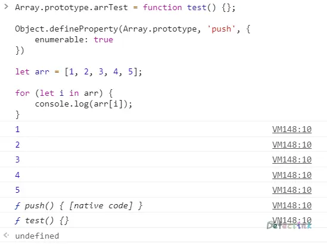
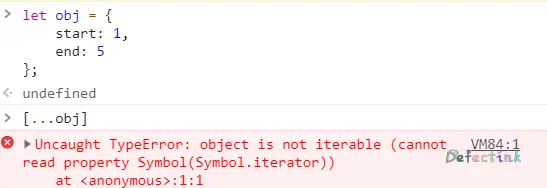

## Iterable object（可迭代对象）

可迭代（Iterable） 对象是数组的泛化。这个概念是说任何对象都可以被定制为可在`for...of`循环中使用的对象。数组是可迭代的。但不仅仅是数组，很多其他的内建对象也是可迭代的。例如字符串就是可迭代的。

## 总最早开始

可能十年前或者更加久远的年代，我们遍历一个数组需要这样：

```js
let arr = [1, 2, 3, 4, 5];

for (let i = 0; i < arr.length; i++) {
    console.log(arr[i]);
}
```

或许也不是很久，在我最初学习js的时候就是这样去尝试理解for循环的。

后来我们发现这样写或许太复杂了，于是有了`for...in`。我们遍历一个数组就变成了这样：

```js
for (let i in arr) {
    console.log(arr[i]);
}
```

是不是和for循环有点类似，`for...in`便是循环遍历对象的一个方式。

ES6也给了我们一个专门操作遍历数组的方法：`forEach()`

```js
arr.forEach(element => {
    console.log(element);
});
```

与其他的方法不同的是，`forEach()`同数组的`push()`、`pop()`等方法一样，是在Array对象的原型上的，也就是`Array.prototype.forEach()`。并且它除了抛出异常以外，没有办法中止或跳出`forEach()`循环。如果我们需要中止或跳出循环`forEach()`方法不是应当使用的工具。

### 弥补不足

我们有多种可以轻松遍历数组的方法，不过他们各有各的不足之处。`for...of`便是代替`for...in`来循环数组而诞生的。

首先来看看`for...in`对数组的小问题：

1. `for...in`是为对象设计的，它遍历的是key，而不是value。
2. `for...in`会一直查找可枚举的属性，直至原型链顶端。

先看第一条，`for...in`和直接for循环遍历数组类似，他们循环的是数组的key，需要使用数组的标准访问写法才能得到值。

```js
let arr = [1, 2, 3, 4, 5];

for (let i in arr) {
    console.log(arr[i]);
    // 1, 2, 3, ,4, 5
}

for (let i in arr) {
    console.log(i);
    // 0, 1, 2, 3, ,4
}
```

不过这看上去无伤大雅，第二条的问题就不像这么温柔了。在当前数组的原型链上的所有的可枚举的属性都会被遍历出来。

```js
Array.prototype.arrTest = function test() {};

Object.defineProperty(Array.prototype, 'push', {
    enumerable: true
})

let arr = [1, 2, 3, 4, 5];

for (let i in arr) {
    console.log(arr[i]);
}
```

无论是我们自定义的函数，还是修改属性为可枚举，`for...in`一条都不会放过。



## 迭代协议

通常的对象是不可迭代的，它不是数组。通过自己创建一个不可迭代的对象，我们就可以轻松地掌握可迭代的概念。

首先来看一个最基本的对象，我们尝试使用`for...of`去遍历它，会得到一个其不是可迭代对象的是错误：

```js
let obj = {
    start: 1,
    end: 5
};

for (num of obj) {
    console.log(num);
}
```

```
VM155:6 Uncaught TypeError: obj is not iterable
```

这是因为我们的Object对象不是可迭代的对象。而迭代协议可以使其成为一个可迭代的对象。

迭代协议作为 ECMAScript 2015 的一组补充规范，迭代协议并不是新的内置实现或语法，而是协议。这些协议可以被任何遵循某些约定的对象来实现。

### 迭代器

为了让`obj`对象可迭代（也就让`for..of`可以运行）我们需要为对象添加一个名为`Symbol.iterator`的方法（一个专门用于使对象可迭代的内置symbol）。

1. 当 `for..of` 循环启动时，它会调用这个方法（如果没找到，就会报错）。这个方法必须返回一个 **迭代器（iterator）** —— 一个有 `next` 方法的对象。
2. 从此开始，`for..of` **仅适用于这个被返回的对象**。
3. 当 `for..of` 循环希望取得下一个数值，它就调用这个对象的 `next()` 方法。
4. `next()` 方法返回的结果的格式必须是 `{done: Boolean, value: any}`，当 `done=true` 时，表示迭代结束，否则 `value` 是下一个值。

```js
let obj = {
    start: 1,
    end: 5
};

// for..of 调用首先会调用这个：
obj[Symbol.iterator] = function () {
    return {
           // 这个function还是属于obj，所以this指向obj。
        //接下来，for..of 仅与此迭代器一起工作，要求它提供下一个值
        current: this.start,
        last: this.end,
        // next() 在 for..of 的每一轮循环迭代中被调用
        // 所以通常next都带有一个判断语句
        next() {
            // Symbol.iterator返回的是一个对象，this不会多级指向，所以这里用到了刚刚定义的属性
            if (this.current <= this.last) {
                return {
                    value: this.current++,
                    done: false
                }
            } else {
                return {
                    done: true
                }
            }
        }       
    }
};

// 可以迭代啦
for (let num of obj) {
    console.log(num);
};
```

第一次见到迭代器的时候感觉它还是挺复杂的，但仔细研究过后就会发现，其实它大部分还都是固定搭配的。不过这里的this还是比较容易浑人的。

仔细观察下其核心的功能，发现迭代器是通过一个名为`Symbol.iterator`的方法返回的对象中的：

1. `obj` 自身没有 `next()` 方法。
2. 相反，是通过调用 `obj[Symbol.iterator]()` 创建了另一个对象，即所谓的“迭代器”对象，并且它的 `next` 会为迭代生成值

那么，既然都是对象，所以迭代器应该是可以放在`obj`自身的。

```js
let obj = {
    start: 1,
    end: 5,
    // Symbol.iterator负责返回一个对象，其对象中包含next方法，这里直接返回this，在obj中定义一个next方法
    // this.count用于计数
    [Symbol.iterator]() {
        this.count = this.start;
        return this;
    },
    next() {
        if (this.count <= this.end) {
            return {
                value: this.count++,
                done: false
            }
        } else {
            return {
                done: true
            }
        }
    }
};

for (let num of obj) {
    console.log(num);
};
```

这里的`[Symbol.iterator]()`定义为`obj`的一个属性，同时`[Symbol.iterator]()`需要返回一个带有`next()`方法的对象。所以直接将`next()`方法定义在`obj`身上，`[Symbol.iterator]()`通过返回this来返回这个对象。

这样的写法会比在外部定义`[Symbol.iterator]()`方法更加简洁，this指向也更加清晰。但是在`[Symbol.iterator]()`方法中定义的属性会被添加到`obj`上。

```js
obj.count // 6
```

并且迭代器只用一个，现在不能在该对象上同时运行多个`for...of`循环了，它们将共享迭代状态，因为只有一个迭代器，即对象本身。但是两个并行的 for..of 是很罕见的，即使在异步情况下。

> 无穷迭代器
> 无穷迭代器也是可能的。例如，将`obj`设置为`obj.to = Infinity`，这时`obj`则成为了无穷迭代器。或者我们可以创建一个可迭代对象，它生成一个无穷伪随机数序列。也是可能的。
> `next`没有什么限制，它可以返回越来越多的值，这是正常的。
> 当然，迭代这种对象的`for..of`循环将不会停止。但是我们可以通过使用`break`来停止它。

### 展开语法

展开语法(Spread syntax), 可以在函数调用/数组构造时, 将数组表达式或者string在语法层面展开；还可以在构造字面量对象时, 将对象表达式按key-value的方式展开。

字面量也就是常见的`[1, 2, 3]`或者`{name: "mdn"}`这种简洁的构造方式。

展开语法与`for...of`及其相似，无法迭代的对象也无法使用展开语法。错误信息也是一样：



展开语法不仅仅只是和`for...of`行为比较像，它还有更多的用法。不过在此赘述也是没有多少意义了。

## 可迭代的字符串

在我最早学习js的基本类型的时候，就被告知字符串可以被循环处理。类似于这样：

```js
let str = 'xfy';
for (let i = 0; i < str.length; i++) {
    console.log(str[i]);
}
// x, f, y;
```

虽然无法理解是什么一回事，但当时就感觉字符串和数组很相似，非常神奇。

根据包装对象的原理，很容易就联想到字符串可迭代是因为其构造函数`String`可迭代（当然也有length属性）。要验证这非常简单，只需要找下`String`上有没有迭代器必备的`[Symbol.iterator]()`方法就可以了。

虽然包装对象的过程我们无法看到，但是我们可以对一个字符串的原型链向上寻找就ok了。直接调用其原型链上的方法便会触发包装对象，就像调用`toString()`一样，

```js
let str = 'xfy';
str.__proto__[Symbol.iterator];
```

直接访问原型链上的`[Symbol.iterator]()`方法，就会发现有这个方法存在，正是有它的存在，字符串才是可迭代的。

### 显式调用迭代器

为了能够更加深入的了解迭代器的工作，我们可以不使用`for...of`，反而使用显式的去操作迭代器：

```js
let str = 'xfy';

// 接收迭代器
let iterator = str[Symbol.iterator]();
let res;

while(true) {
    res = iterator.next();
    if (res.done) break;
    console.log(res.value);
}
```

只要弄弄清楚了迭代器的工作方式，就能很轻松的理解显式调用。最终我们根据`next()`方法返回的固定格式的值来判断什么适合需要跳出循环以及取值。

正常情况下我们不需要显式的去迭代一个对象，但是这样做比`for...of`给了我们更多的控制权。我们可以拆分迭代的步骤，并在中途做一些其他的事情。

## 可迭代与类数组

可迭代对象与类数组很相似，但他们是两种不同的对象，有着不同的正式术语：

- **Iterable** 如上所述，是实现了 `Symbol.iterator` 方法的对象。
- **Array-like** 是有索引和 `length` 属性的对象，所以它们看起来很像数组。

当然也有两种特性都有的对象，例如字符串就是可迭代同时也是类数组（有数值索引和 `length` 属性）。

当光是类数组的对象是无法迭代的

```js
let obj = {
    0: 'x',
    1: 'f',
    2: 'y',
    length: 3
}
// Uncaught TypeError: object is not iterable
[...obj];
```

可迭代对象和类数组对象通常都**不是数组**，他们也没有数组的一些方法。不过出了字符串以外，我们手动创建的类数组可以使用`call`来改变数组方法的指向，从而使其能够使用一些数组的方法：

```js
Array.prototype.push.call(obj, 1);
obj[3];
// 1
```

而包装后的字符串其`length`属性是只读的，所以我们无法通过数组的方法去操作它：

```js
let str = 'xfy';
// Uncaught TypeError: Cannot assign to read only
Array.prototype.push.call(str, 1);
```

### Array.from

`Array.from`可以从一个类似数组或可迭代对象创建一个新的，浅拷贝的数组实例。通过创建一个浅拷贝的数组，就可以对其使用数组的方法了。

```js
let obj = {
    0: 'x',
    1: 'f',
    2: 'y',
    length: 3
};

let arr = Array.from(obj);

arr.push('嘤嘤嘤');
```

Array.from 方法接受对象，检查它是一个可迭代对象或类数组对象，然后创建一个新数组，并将该对象的所有元素浅拷贝到这个新数组。可迭代的对象也是同理。

```js
let obj = {
    0: 'x',
    1: 'f',
    [Symbol.iterator]() {
        this.sw = true;
        return this;
    },
    next() {
        if (this.sw) {
            this.sw = false;
            return {
                value: Object.keys(this),
                done: false
            }
        } else {
            return {
                done: true
            }
        }
    }
}

let arr = Array.from(obj);
```

`Array.from`还有一个可选的参数，提供了类似于`forEach`的参数选项。

```js
Array.from(obj[, mapFn, thisArg])
```

可选的第二个参数 `mapFn` 可以是一个函数，该函数会在对象中的元素被添加到数组前，被应用于每个元素，此外 `thisArg` 允许我们为该函数设置 `this`。

```js
Array.from([1, 2, 3], x => x + x);
// [2, 4, 6]
```

### 可用于代理对

对于代理对（surrogate pairs）（ UTF-16 的扩展字符），`Array.from`也可以正常识别并拷贝为数组。对于普通的字符串，虽然能够使用`slice()`方法，但是对于代理对的操作会导致乱码，两个不同 UTF-16 扩展字符碎片拼接的结果。

```js
let str = '𝒳😂𩷶';

console.log(str);
// "𝒳😂𩷶"
str.slice(1,3)
// "��"
```

我们可以利用`Array.from`对代理对的正确操作特性来重写创建代理感知（surrogate-aware）的`slice`方法。

```js
let str = '𝒳😂𩷶';
function aSlice(arr, star, end) {
    return Array.from(arr).slice(star, end).join('');
}
```

## 总结

可以应用 `for..of` 的对象被称为 **可迭代的**。

- 技术上来说，可迭代对象必须实现 `Symbol.iterator`方法。
  - `obj[Symbol.iterator]` 的结果被称为 **迭代器（iterator）**。由它处理进一步的迭代过程。
  - 一个迭代器必须有 `next()` 方法，它返回一个 `{done: Boolean, value: any}` 对象，这里 `done:true` 表明迭代结束，否则 `value` 就是下一个值。
- `Symbol.iterator` 方法会被 `for..of` 自动调用，但我们也可以直接调用它。
- 展开语法的操作结果与`for..of`类似。
- 内置的可迭代对象例如字符串和数组，都实现了 `Symbol.iterator`。
- 字符串迭代器能够识别代理对（surrogate pair）。

有索引属性和 `length` 属性的对象被称为 **类数组对象**。这种对象可能还具有其他属性和方法，但是没有数组的内建方法。

## 补充

### this

```ts
const ourOwnIterator = {
  next() {
    return {
      value: "It's works.",
      done: true,
    };
  },
};
const myIteratorable = {
  values: 0,
  [Symbol.iterator]() {
    // iterator 得将 this return 出去，next 方法才能使用 this
    return this;
  },
  next() {
    if (this.values === 10) {
      return {
        value: null,
        done: true,
      };
    } else {
      return {
        value: this.values++,
        done: false,
      };
    }
  },
};
for (let i of myIteratorable) {
  console.log(i);
}
```

> 2021年4月5日 00点28分

## 参考&推荐

* [迭代协议](https://developer.mozilla.org/zh-CN/docs/Web/JavaScript/Reference/Iteration_protocols)
* [迭代器和生成器](https://developer.mozilla.org/zh-CN/docs/Web/JavaScript/Guide/Iterators_and_Generators)
* [yield*](https://developer.mozilla.org/zh-CN/docs/Web/JavaScript/Reference/Operators/yield*)
* [展开语法](https://developer.mozilla.org/zh-CN/docs/Web/JavaScript/Reference/Operators/Spread_syntax)
* [Iterable object（可迭代对象）](https://zh.javascript.info/iterable)