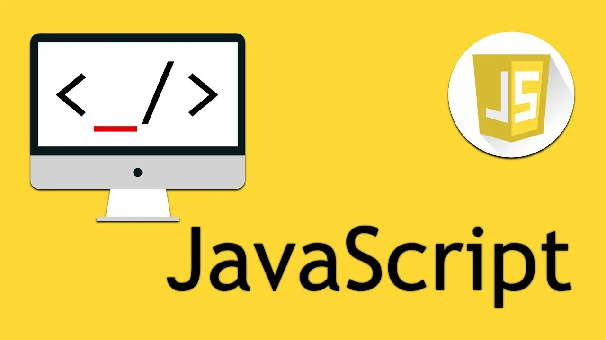

> 这是来自Professional JavaScript for Web Develops第五章的笔记。



## 基本类型和引用类型

基本类型值指的是简单的数据段。

引用类型值指那些可能由多个值构成的对象。

JS的五种基本数据类型就是基本类型值。这五种基本数据类型是按值访问的，因为可以操作保存在变量中的实际的值。

引用类型的值是保存在内存中的对象。js不允许直接访问内存中的位置，也就是说不能直接操作对象的内存空间。在复制保存着对象的某个变量时，操作的是变量的引用。但为变量添加属性时，操作的是实际的对象。

传递参数只有按值传递，没有按引用传递：

```js
let person = {};
undefined
function setName(ojb) {
ojb.name = 'xfy';
}
undefined
setName(person);
undefined
person.name;
"xfy"
```

当在函数内，将ojb2重新声明为一个新的对象。如果参数是按引用传递的，person对象应该自动修改name属性值指向`'notxfy'`。

```js
function setName2(ojb2) {
ojb2.name = 'xfy2';
ojb2 = {};
ojb2.name = 'notxfy';
}
undefined
setName2(person);
undefined
person.name
"xfy2"
```

js引用类型的值（对象）是引用类型的一个实例。引用类型是一种数据结构，用于将数据和功能组织在一起。虽然引用类型和类看起来类似，但是它们不是相同的概念。

对象是某个特定引用类型的实例。

## Object类型

Object是目前ECMAScript中使用最多的一个语言。虽然Object实例不具备多少功能，对对于在应用程序中存储和传输数据而言，它们确实是非常理想的选择。

### 创建Object实例

创建方式有两种。第一种是new操作符后接Object构造函数。构造函数本身就是一个函数，只不过它时出于创建新对象的目的而定义的。

```js
let person = new Object();
person.name = "Defectink";
person.age = 8;
```

另外一种是使用对象字面量：

```js
let person2 = {
    name = "xfy",
    age = 88
}
```

左边的花括号表示对象字面量的开始，因为它出现在表达式上下文（expression context）中。同样的花括号如果出现在一个语句上下文（statement context）中，则表示一个语句块的开始。例如if语句的花括号。

在对象字面量中使用逗号来分隔不同的属性。最后一个属性不添加逗号。

在使用对象字面量语法时，属性名也可以使用字符串。

对象字面量还有另外一种写法：

```js
let person3 = {};
person3.name = 'xxx';
person3.age = 3;
```

#### 传递大量参数

对象字面量也是想函数传递大量可选参数的首选方式。

```js
let output = "";
function showInfo(args){
    if (typeof args.name == "string"){
        output += "the Name: " + args.name + "\n";
    }
    if (typeof args.age == "number"){
        output += "the Age: " + args.age + "\n";
    }
    alert(output);
}
showInfo({
    name:"test",
    age: 128
})
```

函数showInfo()接收一个名为args的参数。这个参数可能带有名为name或age的属性，又或者这两个属性都有或没有。每次都可以使用一个对象字面量来传递不同的可选数据。

通常访问对象属性都是用点表示法。在js中也可以使用方括号表示法来访问对象的属性。

```js
console.log(personn.name);
console.log(person["name"]);
```

这两种方法没有任何区别。但方括号的优点时可以通过变量来访问属性。

```js
let personAnotherName = 'test';
console.log(person[personAnotherName]);
```

## Array类型

js的数组是数据的有序列表。数组的每一项都都可以用来保存任何类型的数据。数组的大小也是可以动态调整的，即可以随着数据的添加自动增长以容纳新数据。

### 创建数组

使用Array构造函数：

```js
let colors = new Array();
```

Array构造函数可以传递数组的数量，创建十个数组：

```js
let colors = new Array(10);
```

传递的参数还能用于创建数组的内容，但是不能创建纯数字的内容：

```js
        let colors = new Array(3);      //create an array with three items
        let names = new Array("Greg");  //create an array with one item, the string "Greg"
```

可以省略new操作符：

```js
        let colors = Array(3);      
        let names = Array("Greg");
```

使用字面量表示法：

```js
        let colors = ["red", "blue", "green"]; //creates an array with three strings
        let names = [];                        //creates an empty array
        let values = [1,2,];                   //AVOID! Creates an array with 2 or 3 items
        let options = [,,,,,];                 //AVOID! creates an array with 5 or 6 items
```

### 读取数组

使用方括号并提供相应值的基于0的数字索引：

```js
let colors = ['red','blue','green'];
colors[0];
colors[2] = 'test';		//修改
colors[3] = 'new one';		//新增
```

数组的项数保存在length属性中，这个属性始终都会返回0或更大的值。

```js
let colors = ['red','blue','green'];
colors.length;
3
```

length属性不是只读的，可以通过设置这个属性来向数组的末尾添加或移除内容。

```js
        let colors = ["red", "blue", "green"];    //creates an array with three strings
        colors.length = 2;
        alert(colors[2]);        //undefined

        let colors = ["red", "blue", "green"];    //creates an array with three strings
        colors.length = 4;
        alert(colors[3]);        //undefined
```

数组的最后一项索引始终都是length-1，所以可以使用length方便在末尾添加内容。

```js
        let colors = ["red", "blue", "green"];    //creates an array with three strings
        colors[colors.length] = "black";          //add a color
        colors[colors.length] = "brown";          //add another color

        alert(colors.length);    //5
        alert(colors[3]);        //black
        alert(colors[4]);        //brown
```

> 数组最多可以包含4 294 967 295个项

join()方法可以重现toString()的输出。定义数组分隔符。如果不给join()方法传入任何值，或者传入undefineed，则使用逗号。

```js
        let colors = ["red", "green", "blue"];
        alert(colors.join(","));      //red,green,blue
        alert(colors.join("||"));     //red||green||blue
```

### 栈方法

栈是一种可以限制插入和删除项的数据结构。栈是一种LIFO（Last-In-First-Out，后进先出）的数据结构。

栈项中的插入（推入）和移除（弹出）只发生在一个位置——栈的顶部。数组有push()和pop()方法实现了类似栈的行为。

push()将参数逐个添加到数组的末尾，并返回修改后数组的长度。

pop()将从数组末尾中移除一项，减少length的值，并返回移除的项。

```js
        let colors = new Array();                      //create an array
        let count = colors.push("red", "green");       //push two items
        alert(count);  //2
        
        count = colors.push("black");                  //push another item on
        alert(count);  //3
        
        let item = colors.pop();                       //get the last item
        alert(item);   //"black"
        alert(colors.length);  //2
```

栈方法可以和其他数组方法连用。

```js
        let colors = ["red", "blue"];
        colors.push("brown");              //add another item
        colors[3] = "black";               //add an item
        alert(colors.length);  //4

		let item = colors.pop();
		item;		//"black"
		colors;		// ["red", "blue", "brown"]
```

### 队列方法

队列数据结构的访问顺序是FIFO（First-In-First-Out，先进先出）。数组有shift()方法，它能够移除数组的第一个项，减少length值，并返回该项。它就像和pop()方法相反的操作。

结合shift()和push()方法，可以像队列一样使用数组。

```js
        let colors = new Array();                      //create an array
        let count = colors.push("red", "green");       //push two items
        alert(count);  //2
        
        count = colors.push("black");                  //push another item on
        alert(count);  //3
        
        let item = colors.shift();                     //get the first item
        alert(item);   //"red"
        alert(colors.length);  //2
```

数组还有个unshift()方法，它在数组前端添加添加任意个项，并返回修改后数组的长度。它就像和push()相反的操作。

结合unshift()和pop()方法可以反向模拟队列操作。

```js
        let colors = new Array();                      //create an array
        let count = colors.unshift("red", "green");    //push two items
        alert(count);  //2
        
        count = colors.unshift("black");               //push another item on
        alert(count);  //3
        
        let item = colors.pop();                     //get the first item
        alert(item);   //"green"
        alert(colors.length);  //2
```

### 重排序方法

数组中有两个可以重排序的方法：reverse()和sort()。

reverse()对数组反向排序：

```js
        let values = [1, 2, 3, 4, 5];
        values.reverse();
        alert(values);       //5,4,3,2,1
```

sort()按升序排列数组——即最小的值位于最前面。sort()会调用每个数组项的toString()转型方法。然后比较得到的字符串。

```js
        let values = [0, 1, 5, 10, 15];
        values.sort();
        alert(values);    //0,1,10,15,5
```

由于1<5，所有10会被排在5前面。所以sort()可以接受一个比较函数来重新排序。

```js
function compare(v1,v2){
    if (v1 < v2){
        return -1;
    }else if(v1 > v2){
        return 1;
    }else{
        return 0;
    }
}
let values = [0, 1, 5, 10, 15];
values.sort(compare);
(5) [0, 1, 5, 10, 15]
```

> reverse()和sort()返回的是经过排序之后的数组。

对于数值类型或者其valueOf()方法会返回数值类型的对象类型，可以使用一个更简单的比较函数。只要有第二个值减第一个值即可。

```js
function compare2(v1,v2){
    v2 - v1;
}
values.sort(compare2);
(5) [0, 1, 5, 10, 15]
```

### 操作方法

concat()基于当前数组中所有项目创建一个新的数组。它会先创建一个数组副本，然后将参数添加到这个副本的末尾，返回新构建的数组。没有传递参数时，它只是返回副本。

```js
        let colors = ["red", "green", "blue"];
        let colors2 = colors.concat("yellow", ["black", "brown"]);
        
        alert(colors);     //red,green,blue        
        alert(colors2);    //red,green,blue,yellow,black,brown
```

```js
let colors = ['red','blue','green'];
undefined
let color2 = ['1','2','3'];
undefined
color2.concat(colors);
(6) ["1", "2", "3", "red", "blue", "green"]
```

slice()基于当前数组中的指定位置创建一个新的数组。它接受两个参数，即起始位置和结束位置（不返回结束位置的项）。当只有 一个参数时，返回直到数组末尾的所有项。

```js
        let colors = ["red", "green", "blue", "yellow", "purple"];
        let colors2 = colors.slice(1);
        let colors3 = colors.slice(1,4);
        
        alert(colors2);   //green,blue,yellow,purple
        alert(colors3);   //green,blue,yellow
```

splice()是功能更全面的数组操作方法。

* 删除：可以删除任意数量的项，指定两个参数：要删除的第一项位置和要删除的项数。`splice(0,2)`
* 插入：可以向指定位置插入任意数量的项。指定三个参数：起始位置、0（要删除的项数）和需要插入的项。`splice(2,0,'red','green')`
* 替换：可以向指定位置插入任意数量的项，且同时删除任意数量的项。指定三个参数：起始位置、要删除的项数和要插入的项。`splice(2,1,'red','blcak')`

插入和删除都在起始位开始。

```js
        let colors = ["red", "green", "blue"];
        let removed = colors.splice(0,1);              //remove the first item
        alert(colors);     //green,blue
        alert(removed);    //red - one item array
        
        removed = colors.splice(1, 0, "yellow", "orange");  //insert two items at position 1
        alert(colors);     //green,yellow,orange,blue
        alert(removed);    //empty array

        removed = colors.splice(1, 1, "red", "purple");    //insert two values, remove one
        alert(colors);     //green,red,purple,orange,blue
        alert(removed);    //yellow - one item array
```

### 位置方法

ECMAScript5为数组添加了两个位置方法：indexOf()和lastIndexOf()。他们都接受两个参数：要查找的项和（可选）起始位置的索引。

indexOf()从数组开头索引，lastIndexOf()从数组末尾开始索引。

接受两个参数：要查找的项和（可选）表示查找位置地点的索引。返回查找到的位置索引，没找返回-1。比较查找项时会使用全等操作。

```js
let arr = [1,2,3,4,5,4,3,2,1];
console.log(arr.indexOf(3));
console.log(arr.lastIndexOf(3));

console.log(arr.indexOf(3,3));
console.log(arr.lastIndexOf(3,5));

let person = { name: "Nicholas" };
let people = [{ name: "Nicholas" }];
let morePeople = [person];
alert(people.indexOf(person));     //-1
alert(morePeople.indexOf(person)); //0
```

### 迭代方法

* every()：对数组的每一项运行给定的函数，每一项都返回ture，则返回ture。
* filter()：对数组的每一项运行给定的函数，返回函数会返回ture组成的数组。
* forEach()：对数组的每一项运行给定的函数，没有返回值。
* map()：对数组的每一项运行给定的函数，返回函数调用结果。
* some()：对数组的每一项运行给定的函数，任意一项返回ture，返回ture。

所有方法都不会修改数组中的包含的值。

every()

```js
let dd = input => input < 9;
// let dd = function (input) {
//     return input < 9;
// }
let arr = [1,2,3,4,5];
console.log(arr.every(dd));		//ture
```

filter()

```js
let ff = word => word.length > 5;
let arr2 = ['spray', 'limit', 'elite', 'exuberant', 'destruction', 'present'];
console.log(arr2.filter(ff));
```

forEach()，可以用来遍历数组

```js
let arr3 = ['a','b','c',1,2,3];
arr3.forEach(ele => console.log(ele));
```

map()

```js
let arr4 = [1,2,3,4,5,6];
console.log(arr4.map(sx => (sx + 1) * 2 / 3));
```

some()

```js
let arr5 = [1,2,3,4,5,6,7,8,9];
console.log(arr5.some(qy => qy % 2 === 0));
```

### 归并方法

reduce()和reduceRight()。这两个方法都会迭代数组的所有项，然后构建一个最终返回值。reduceRgiht()从数组的最后一项开始遍历到开头。

他们都接受四个参数：

1. Accumulator (acc) (累计器)
2. Current Value (cur) (当前值)
3. Current Index (idx) (当前索引)
4. Source Array (src) (源数组)

```js
let arr = [1,2,3,4,5,6];
console.log(arr.reduce((a1,a2) => a1 + a2));

console.log(arr.reduceRight((a1,a2) => a1 + a2));
```

## Date类型

Date类型使用自1970年1月1日开始以来的毫秒数来保存日期。

创建日期对象，使用new操作符和Date构造函数。

```js
let dd = new Date();
let d2 = new Date(2017, 02, 01);
let d3 = new Date(Date.UTC(2000, 2, 3, 21, 23, 31));
```

Date()构造函数会假设第一个参数是年份，第二个参数是月份，以此类推。

Date.now()返回调用这个方法时日期和时间的毫秒数，可以用来做一个简单计时。

```js
let start = Date.now();
console.log(start);
let arr = [1,2,3,4,5,666,745,23,441,323,123123,123,123,85858585,,3,23,1,23,123123123123];
console.log(arr.reduce((a1, a2) => a1 + a2));
let stop = Date.now();
console.log(stop);
let result = stop - start;
console.log(result);
```

使用+操作符获取Date对象的时间戳也可以达到同样的目的。

```js
let test = +new Date();
```

### 继承的方法

与其他的引用类型一样，Date也重写了toLocalString()、toString()和valueOf()方法。

`toLocaleString()` 方法返回该日期对象的字符串，该字符串格式因不同语言而不同。

`toString()` 方法返回一个字符串，表示该Date对象。

```js
let d4 = new Date();
console.log(d4.toLocaleString());
console.log(d4.toString())
// 3/5/2020, 10:00:01 PM
// Thu Mar 05 2020 22:00:01 GMT+0800 (China Standard Time)
```

`valueOf() `方法返回一个 Date 对象的原始值。即返回毫秒数。

## RegExp类型

js通过RegExp类型来支持正则表达式。

创建使用字面量, 构造函数和工厂符号都是可以的：

```js
/pattern/flags
new RegExp(pattern [, flags])
RegExp(pattern [, flags])
```

Flags：

* g：全局匹配;找到所有匹配，而不是在第一个匹配后停止
* i：忽略大小写
* m：多行; 将开始和结束字符（^和$）视为在多行上工作（也就是，分别匹配每一行的开始和结束（由 \n 或 \r 分割），而不只是只匹配整个输入字符串的最开始和最末尾处。

使用构造函数创建时，参数需要使用字符串：

```js
let pattern2 = new RegExp("[bc]at","g");
```

所以在构造函数的情况下可能需要双重转义

```js
let pattern3 = new RegExp("\\[bc\\]at","g");
```

由于实例属性不会重置，所以在循环中再次调用test()方法会失败。第一次找到了cat，第二次会从上一次匹配的末尾开始寻找。

```js
let re = null,
    i;

for (i = 0; i < 10; i++) {
    re = /cat/g;
    re.test('catastrophe');
}

for (i = 0; i < 10; i++) {
    re = new RegExp("cat","g");
    re.test('catastrophe')
}
```

### 实例属性

  `RegExp.prototype.constructor`

  创建该正则对象的构造函数。

  [`RegExp.prototype.global`](https://developer.mozilla.org/zh-CN/docs/Web/JavaScript/Reference/Global_Objects/RegExp/global)

  是否开启全局匹配，也就是匹配目标字符串中所有可能的匹配项，而不是只进行第一次匹配。

  [`RegExp.prototype.ignoreCase`](https://developer.mozilla.org/zh-CN/docs/Web/JavaScript/Reference/Global_Objects/RegExp/ignoreCase)

  在匹配字符串时是否要忽略字符的大小写。

  [`RegExp.prototype.lastIndex`](https://developer.mozilla.org/zh-CN/docs/Web/JavaScript/Reference/Global_Objects/RegExp/lastIndex)

  下次匹配开始的字符串索引位置。

  [`RegExp.prototype.multiline`](https://developer.mozilla.org/zh-CN/docs/Web/JavaScript/Reference/Global_Objects/RegExp/multiline)

  是否开启多行模式匹配（影响 ^ 和 $ 的行为）。

  [`RegExp.prototype.source`](https://developer.mozilla.org/zh-CN/docs/Web/JavaScript/Reference/Global_Objects/RegExp/source)

  正则对象的源模式文本。

```js
console.log(pattern.global);
console.log(pattern.ignoreCase);
console.log(pattern.multiline);
console.log(pattern.lastIndex);
console.log(pattern.source);
```

### 实例方法

exec()和test()。

exec()设置了全局模式也只会返回一个匹配项，多次调用一次返回向后匹配到的值。而不设置全局模式则只返回第一次匹配到的匹配项。

```js
        var text = "cat, bat, sat, fat";        
        var pattern1 = /.at/;
        
        var matches = pattern1.exec(text);        
        alert(matches.index);    //0
        alert(matches[0]);       //"cat"
        alert(pattern1.lastIndex);//0

        matches = pattern1.exec(text);        
        alert(matches.index);    //0
        alert(matches[0]);       //"cat"
        alert(pattern1.lastIndex);//0

        var pattern2 = /.at/g;
        
        var matches = pattern2.exec(text);        
        alert(matches.index);    //0
        alert(matches[0]);       //"cat"
        alert(pattern2.lastIndex);//0

        matches = pattern2.exec(text);        
        alert(matches.index);    //5
        alert(matches[0]);       //"bat"
        alert(pattern2.lastIndex);//0
```

test()接受一个字符串参数，在模式与该参数匹配的情况下返回ture。通常与if语句一起使用。

```js
let text = '123-00-12345';
let pattern4 = /\d{3}-\d{2}-\d{4}/;
if (pattern4.test(text)) {
    console.log('all matched');
}
```

## Function类型

函数实际上是对象，函数名是指针。所以函数名与包装对象指针的其他变量没有什么不同。

```js
function sum (a,b) {
    return a + b;
}
let anotherSum = sum;
console.log(anotherSum(1,2));

sum = null;
console.log(anotherSum(1,2));
```

构造函数用来创建对象。

### 函数声明提升

解析器会率先读取函数声明，并使其在执行任何代码之前可以访问。至于函数表达式，则必须等到解析器执行到它所在的代码行，才会被真正的解析执行。

就像var的提升一样！

```js
console.log(sum2(10,20));
function sum2(a,b) {
    return a * b;
}
```

但使用函数表达式就不存在这种情况了。

```js
console.log(sum3(10,20));
let sum3 = function (a,b) {
    return a * b;
}
```

由于函数在一个初始化语句中，（就算使用var，也只有var的声明会提升，语句并没有初始化）而不是函数声明。

### 作为参数传递

因为函数名本身就是变量，所以函数也可以作为值来使用。(回调)

```js
function add(num) {
    return num + 10;
}
function addd(ff,num) {
    return ff(num);
}
console.log(addd(add,1));
```

另一种就是从一个函数中返回另一个函数，实际上就是一个函数嵌套了另一个函数。（闭包）

例如对对象数组进行按照对象属性排序：

```js
let data = [
    {
        name: 'xfy',
        age: 18
    },
    {
        name: 'dfy',
        age: 81
    }
]
function com(propertyName) {
    return function (object1,object2) {
        let value1 = object1[propertyName];
        let value2 = object2[propertyName];
        if (value1 < value2) {
            return -1;
        } else if (value1 > value2) {
            return 1;
        } else {
            return 0;
        }
    }
}
console.log(data.sort(com('name')));
```

### 函数内部属性

在函数内部，有两个特殊的对象：arguments和this。arguments的主要作用是保存函数参数，但它还有一个callee的属性。该属性是一个指针，指针指向拥有这个arguments对象的函数。

一个经典的递归函数：

```js
function test(num) {
    if (num <= 1) {
        return 1;
    }
    return num + test(num - 1);
}
console.log(test(100));
```

当遇到使用函数表达式重新指向函数时

```js
function test(num) {
    if (num <= 1) {
        return 1;
    }
    return num + test(num - 1);
}
console.log(test(100));

let test2 = test;
test = function() {
    return 1;
}
console.log(test2(100));    // 101 test2不能完成回调，因为函数中还是test(num -1)
console.log(test(100));
```

使用callee就能解决这个问题，类似于对象的this。

```js
function cb(num) {
    if (num <= 1) {
        return 1;
    }
    return num + arguments.callee(num - 1);
}
console.log(cb(100));
let cb2 = cb;       // 指针交换
cb = function() {
    return 0;
}
console.log(cb2(100));
console.log(cb(100));
```

> 函数的名字仅仅只是一个包含指针的变量而已。

ECMAScript5还定义了一个函数对象的属性：caller。它保存着调用当前函数的函数的引用。如果是在全局作用域中调用当前函数，它的值为null。

```js
function outer() {
    return inner();
}
function inner() {
    return inner.caller;
}
console.log(outer());
```

甚至还能更进一步解耦合：

```js
function outer() {
    return inner();
}
function inner() {
    return arguments.callee.caller;
}
```

在严格模式下，访问`arguments.callee`和`arguments.caller`都会导致访问错误。且不能为函数的caller属性赋值，否则会导致错误。

### 函数属性与方法

js中的函数也是对象，所以函数也有属性和方法。每个函数都包含两个属性：length和prototype。

length属性表示函数希望接受的命名参数的个数。

```js
function test(arg1,arg2) {
    return arg1 + arg2;
}
console.log(test.length);
```

对于引用类型而言，prototype是保存它们所有实例方法的真正所在。prototype属性是不可枚举的，所以用for-in是无法发现的。

每个函数都包含两个非继承而来的方法：apply()和call()。它们常用来动态改变this的值。call()与apply()相同，它们区别仅在接受参数的方式不同。第一个参数是this值，第二个参数分别是逐个传参和数组传参。

```js
function fruits() {};

fruits.prototype = {
    color: 'red',
    say: function() {
        console.log('the color is : ' + this.color);
    }
}
let apple = new fruits();
console.log(apple);
console.log(apple.say());

let banana = {
    color: 'yellow'
}
console.log(apple.say.apply(banana));
```

除了在对象中的应用，call和apply真正的用武之地是扩充函数的作用于。

```js
window.color = 'red';
let o = {
    color: 'blue'
};
function sayColor() {
    return this.color;
}
sayColor()
"red"
sayColor.call(o)
"blue"
sayColor.call(window)
"red"
```

除此之外还有一个方法：bind()。这个方法会创建一个函数的实例，其this值会被绑定到传给bind()函数的值。

```js
window.color = 'red';
let o = {
    color: 'blue'
};
function sayColor() {
    return this.color;
}

let sayAnotherColor = sayColor.bind(o);
sayAnotherColor();
"blue"
```

### 基本包装类型

三个特殊的引用类型：Boolean、Number和String。

包装对象都会经过三个步骤：

1. 创建String或其他类型的一个实例；
2. 在实例上调用指定的方法；
3. 销毁这个实例；

也就是类似于这样的操作：

```js
let s1 = new String('some string');
let s2 = s1.length;
s1 = null;
```

引用类型与基本包装类型的主要区别就是对象的生存期。使用new操作符创建的引用类型的实例，在执行流离开当前作用域之前一直都保存在内存中。而包装对象，则只存在执行代码的一瞬间，然后立即被销毁。所以不能在运行时为基本类型添加属性和方法。

```js
let s1 = 'xfy';
s1.color = 'pink';
console.log(s1.color);	// undefined
```

在第二行创建的String对象在执行第三行代码时就已经被销毁了，第三行代码则又创建自己String对象，而没有第二行创建color属性。

Object构造函数也会像工厂方法一样，根据传入值的类型来返回相应基本包装类型的实例。

```js
let test = new Object('xfy');
typeof test
"object"
test instanceof String
true
test instanceof Number
false
test instanceof Object
true
```

使用new调用资本包装类型的构造函数，与直接调用同名的转型函数是不一样的。

```js
let value = '25';
let test = Number(value);
typeof test
"number"

let test2 = new Number(25);
typeof test2;
"object"
```

> 不建显式的创建基本包装类型的对象。

## Boolean类型

Boolean有基本类型与引用类型。使用Boolean对象构造的值为引用类型。Boolean类型的实例重写了valueOf()与toString()。

```js
let b = new Boolean(false);     // falseObject
let bb = true;
let b2 = false;     // falseValue
console.log(b && bb);   //true
console.log(b2 && bb);  //false
```

布尔表达式中所有对象都会被转为true，因此引用类型的Boolean都会被转为true。

基本类型与引用类型的Boolean还有两个区别：

* typeof对基本类型返回”Boolean“。对引用类型返回”Object“；
* Boolean对象是Boolean类型的实例，所以instanceof会返回true。而基本类型则返回false；

> 建议不要使用Boolean对象。

## Number类型

Number类型也重写了valueOf()、toLocaleString()和toString()。

toString()可以传递一个表示基数的参数，将返回进制化数值的字符串形式。

```js
let num = 123;
console.log(num.toString(2));
console.log(num.toString(8));
console.log(num.toString(16));
```

除了继承的方法之外，Number类型还提供了一些用于将数值格式化为字符串的方法。toFixed()方法返回指定位数的小数。

当小数比指定位数还多一位的情况下，就会舍入。

```js
let num = 123;
console.log(num.toFixed(2));
console.log(num.toFixed(20));
num = 12.005;
console.log(num.toFixed(2));
```

> 通常情况下toFixed()可以表示0-20位小数，但这只是标准实现的范围。有些运行环境可以支持更多。

也有用于格式化为指数表示法的方法，toExponential()（e表示法）。toExponential()接受一个参数，指定输出结果的小数的位数。返回也是字符串形式。

```js
let num = 123;
let num2 = num.toExponential(10);
console.log(num2);  // 1.2300000000e+2
```

还有toPrecision()会根据情况来使用toFixed()或者是toExponential()。

```js
let num = 123;

console.log(num.toPrecision(1));
console.log(num.toPrecision(2));
console.log(num.toPrecision(3));
console.log(num.toPrecision(4));
console.log(num.toPrecision(5));
console.log(num.toPrecision(6));

1e+2
1.2e+2
123
123.0
123.00
123.000
```

Number与Boolean一样，实例化Number类型在使用typeof和instanceof时，会有完全不同的结果。

```js
let num = 123;
let num2 = new Number(123);
console.log(typeof num);		// "Number"
console.log(typeof num2);		// "Object"
console.log(num instanceof Number);		// false
console.log(num2 instanceof Number);	// true
```

## String类型

String类型是字符串的对象包装类型。

```js
let str = new String('xfy');
```

访问特定字符方法：charAt()和charCodeAt()，接受一个参数，从0开始的字符位置。

```js
let str = 'xfy';
console.log(str.charAt(1));
console.log(str.charCodeAt(1));
```

还有另一个访问个别字符的方法，类似于访问数组

```js
console.log(str[1]);
```

操作方法

除了`+`拼接字符串，还有类似于数组的concat()方法。用于将一个或多个字符串拼接起来，返回新的字符串。

```js
let str2 = 'yyy';
console.log(str.concat('abc',str2));
```

还有三个基于字符串创建新字符串的方法，基于字符串修改或裁减。返回新的字符串。slice()、substr()和substring()。它们都接受两个参数，第一个参数指定字符串开始的位置，第二个参数（可选）表示字符串到哪里结束。

```js
let str = 'xiaofeiyang';
console.log(str.slice(4));
console.log(str.substr(4));
console.log(str.substring(4));
console.log('---');
console.log(str.slice(4,7));
console.log(str.substr(4,7));
console.log(str.substring(4,7));

feiyang
feiyang
feiyang
---
fei
feiyang
fei
```

