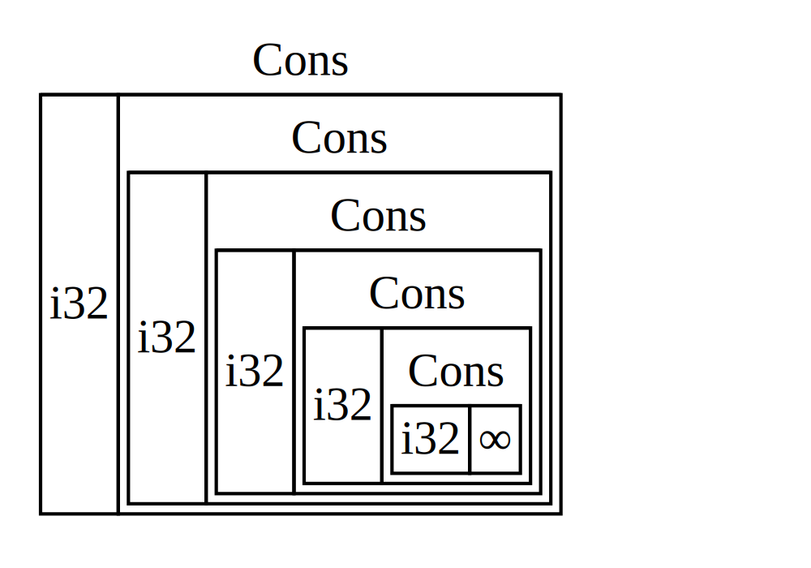
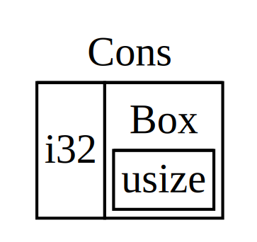

是的，Rust 是一门注重内存安全的语言，它独特的所有权与生命周期能够帮助我们在编译时就找到可能存在的内存泄露的问题。

但为了一些特殊场景，Rust 标准库中也提供了一些让我们能够在运行时检查所有权并修改值的方法。并让循环引用、多个所有权成为可能。

## 递归类型

除了一些特殊值，通常我们的值都是存放在栈中，在栈中的值 Rust 需要在编译时就知道类型的占用空间。而这种情况无法处理的就是 **递归类型**（_recursive type_），这种值的一部分会是相同类型的另一个值，理论上可以无限嵌套下去。

由于递归类型在理论上可以无限递归下去，所以我们就无法在编译时就知道类型的占用空间。这样就无法使用常规的方法来创建一个具有递归的的类型了。

例如我们尝试创建一个 c*ons list*，一个函数式编程语言中的常见类型：

```rust
enum List<T> {
    Cons(T, List<T>),
    Nil,
}
```

这时候编译器应该就会提示我们这个类型 “有无限的大小”。其原因是 `List` 的一个成员被定义为是递归的：它直接存放了另一个相同类型的值。这意味着 Rust 无法计算为了存放 `List` 值到底需要多少空间。

```bash
insert some indirection (e.g., a `Box`, `Rc`, or `&`) to make `List` representable: `Box<`, `>`
```

编译器尝试计算出储存一个 `List` 枚举需要多少内存，并开始检查 `Cons` 成员，那么 `Cons` 需要的空间等于 `i32` 的大小加上 `List` 的大小。为了计算 `List` 需要多少内存，它检查其成员，从 `Cons` 成员开始。`Cons`成员储存了一个 `i32` 值和一个`List`值，这样的计算将无限进行下去：



### 使用 Box 创建递归类型

最简单直接的智能指针是 _box_，其类型是 `Box<T>`。box 运行我们将一个数据放在堆上而不是栈上。留在栈上的则是指向堆数据的指针。

除了数据被储存在堆上而不是栈上之外，box 没有性能损失。不过也没有很多额外的功能。它们多用于如下场景：

- 当有一个在编译时未知大小的类型，而又想要在需要确切大小的上下文中使用这个类型值的时候
- 当有大量数据并希望在确保数据不被拷贝的情况下转移所有权的时候
- 当希望拥有一个值并只关心它的类型是否实现了特定 trait 而不是其具体类型的时候

因为 `Box<T>` 是一个指针，我们总是知道它需要多少空间：指针的大小并不会根据其指向的数据量而改变。这意味着可以将 `Box` 放入 `Cons` 成员中而不是直接存放另一个 `List` 值。

`Box` 会指向另一个位于堆上的 `List` 值，而不是存放在 `Cons` 成员中。我们可以这样去修改 List 枚举类型：

```rust
#[derive(Debug)]
enum List<T> {
    Cons(T, Box<List<T>>),
    Nil,
}
```

因为指针的大小并不会根据其指向的数据量而改变，这样就不会出现在编译时无法知道确切大小的问题了。

以泛型 `T` 为 `i32` 为例，`Cons` 成员将会需要一个 `i32` 的大小加上储存 box 指针数据的空间。`Nil` 成员不储存值，所以它比 `Cons` 成员需要更少的空间。现在我们知道了任何 `List` 值最多需要一个 `i32` 加上 box 指针数据的大小。通过使用 box ，打破了这无限递归的连锁，这样编译器就能够计算出储存 `List` 值需要的大小了。



## 多个所有权

在一般情况下，Rust 中的值只能同时被一个变量拥有所有权。位于堆上的数据会直接进行所有权转移（_move_），如果是实现了 `Copy` trait，可以直接复制值。

所有权被转移了之后，我们就不能够再访问先前的变量了。这就是 Rust 保证内存安全的一种方式：

```rust
let s1 = "xfy".to_string();
let s2 = s1;
println!("s1: {}", s1)
// move occurs because `s1` has type `String`, which does not implement the `Copy` trait
```

如果我们需要多个变量指向同一个堆数据，则可以借用数据。其本质上就是 `s2` 存储了 `s1` 的指针：

```rust
let s1 = "xfy".to_string();
let s2 = &s1;
println!("s1: {:p}", &s1);
println!("s2: {:p}", s2);
// s1: 0x81805ef9f8
// s2: 0x81805ef9f8
```

我们可以通过指针解引用来修改 `s1` 的值：

```rust
let mut s1 = "xfy".to_string();
let s2 = &mut s1;
*s2 = "dfy".to_string();

let s2 = &s1;
println!("s1: {}", s1);
println!("s2: {}", s2);
```

这是 Rust 的基本操作，大部分情况下所有权是非常明确的：可以准确地知道哪个变量拥有某个值。然而，有些情况单个值可能会有多个所有者。例如，在图数据结构中，多个边可能指向相同的节点，而这个节点从概念上讲为所有指向它的边所拥有。节点直到没有任何边指向它之前都不应该被清理。

为了启用多所有权，Rust 有一个叫做 `Rc<T>` 的类型。其名称为 **引用计数**（_reference counting_）的缩写。引用计数意味着记录一个值引用的数量来知晓这个值是否仍在被使用。如果某个值有零个引用，就代表没有任何有效引用并可以被清理。

### 使用 Rc 共享数据

回到我们的 `List<T>`，这次我们希望创建两个共享第三个列表所有权的列表，看起来可能像这样：


如果我们接着使用 `Box` 来创建，就会发生所有权的问题，因为 `Box::new()` 方法会转移所有权：

```rust
fn main() {
    let a = Cons(5,
        Box::new(Cons(10,
            Box::new(Nil))));
    let b = Cons(3, Box::new(a));
    let c = Cons(4, Box::new(a));
}
```

```bash
error[E0382]: use of moved value: `a`
  --> src/main.rs:13:30
   |
12 |     let b = Cons(3, Box::new(a));
   |                              - value moved here
13 |     let c = Cons(4, Box::new(a));
   |                              ^ value used here after move
   |
   = note: move occurs because `a` has type `List`, which does not implement
   the `Copy` trait
```

`Cons` 成员拥有其储存的数据，所以当创建 `b` 列表时，`a` 被移动进了 `b` 这样 `b` 就拥有了 `a`。接着当再次尝试使用 `a` 创建 `c` 时，这不被允许，因为 `a` 的所有权已经被移动。

或许我们可以修改 `Cons` 成员不拥有其储存的数据，转而使用获取一个引用。不过接着必须指定生命周期参数。通过指定生命周期参数，表明列表中的每一个元素都至少与列表本身存在的一样久。例如，借用检查器不会允许 `let a = Cons(10, &Nil);` 编译，因为临时值 `Nil` 会在 `a`获取其引用之前就被丢弃了。

所以我们需要利用 `Rc` 来创建一个允许多所有权的引用类型：

```rust
use std::rc::Rc;

#[derive(Debug)]
enum List<T> {
    Cons(T, Rc<List<T>>),
    Nil,
}

use List::*;

fn main() {
    let a = Rc::new(Cons(5, Rc::new(Nil)));

    let b = Cons(3, Rc::clone(&a));
    let c = Cons(4, Rc::clone(&a));
}
```

> 需要使用 `use` 语句将 `Rc<T>` 引入作用域，它不在 prelude 中。

这样，`b` 和 `c` 就同时都拥有了 `a` 的所有权。

### 引用计数

在一般情况下，所有权保证了我们的内存安全，以确保不会出现空指针的情况。`Rc` 的多所有权利用了引用计数来确保变量不会被意外回收。（有点类似于早期 IE 上的 JavaScript 引用计数的 GC）。

可以使用 `Rc::strong_count()` 来查看一个变量的强引用。

```rust
fn main() {
    let a = Rc::new(Cons(5, Rc::new(Nil)));
    println!("count after created a = {}", Rc::strong_count(&a));
    {
        let b = Cons(3, Rc::clone(&a));
        println!("count after created b = {}", Rc::strong_count(&a));
        let c = Cons(4, Rc::clone(&a));
        println!("count after created c = {}", Rc::strong_count(&a))
    }
    println!("count after out of scope = {}", Rc::strong_count(&a));
}

// count after created a = 1
// count after created b = 2
// count after created c = 3
// count after out of scope = 1
```

我们能够看到 `a` 中 `Rc<List>` 的初始引用计数为 1，接着每次调用 `clone`，计数会增加 1。当 `c` 离开作用域时，计数减 1。不必像调用 `Rc::clone` 增加引用计数那样调用一个函数来减少计数；`Drop` trait 的实现当 `Rc<T>` 值离开作用域时自动减少引用计数。

使用 `Rc<T>` 允许一个值有多个所有者，引用计数则确保只要任何所有者依然存在其值也保持有效。

## 内部可变性

**内部可变性**（_Interior mutability_）是 Rust 中的一个设计模式，它允许你即使在有不可变引用时也可以改变数据，这通常是借用规则所不允许的。为了改变数据，该模式在数据结构中使用 `unsafe` 代码来模糊 Rust 通常的可变性和借用规则。

不同于 `Rc<T>`，`RefCell<T>` 代表其数据的唯一的所有权。

一般情况下的借用规则：

1. 在任意给定时刻，只能拥有一个可变引用或任意数量的不可变引用  **之一**（而不是两者）。
2. 引用必须总是有效的。

对于引用和 `Box<T>`，借用规则的不可变性作用于编译时。对于 `RefCell<T>`，这些不可变性作用于 **运行时**。

对于引用，如果违反这些规则，会得到一个编译错误。而对于 `RefCell<T>`，如果违反这些规则程序会 panic 并退出。

> 类似于 `Rc<T>`，`RefCell<T>` 只能用于单线程场景。

`Box<T>`，`Rc<T>` 或 `RefCell<T>` 的区别：

- `Rc<T>`  允许相同数据有多个所有者；`Box<T>`  和  `RefCell<T>`  有单一所有者。
- `Box<T>`  允许在编译时执行不可变或可变借用检查；`Rc<T>`仅允许在编译时执行不可变借用检查；`RefCell<T>`  允许在运行时执行不可变或可变借用检查。
- 因为  `RefCell<T>`  允许在运行时执行可变借用检查，所以我们可以在即便  `RefCell<T>`  自身是不可变的情况下修改其内部的值。

在不可变值内部改变值就是 **内部可变性** 模式。

## 循环引用

Rust 的内存安全性保证使其难以意外地制造永远也不会被清理的内存（被称为 **内存泄漏**（_memory leak_）），但并不是不可能。与在编译时拒绝数据竞争不同， Rust 并不保证完全地避免内存泄漏，这意味着内存泄漏在 Rust 被认为是内存安全的。这一点可以通过 `Rc<T>` 和 `RefCell<T>` 看出：创建引用循环的可能性是存在的。这会造成内存泄漏，因为每一项的引用计数永远也到不了 0，其值也永远不会被丢弃。

### 制造引用循环

我们将 `List` 简单修改一下，现在 `Cons` 成员的第二个元素是 `RefCell<Rc<List<T>>>`。这意味着能够修改 `Cons` 成员所指向的 `List`。这里还增加了一个 `tail` 方法来方便我们在有 `Cons` 成员的时候访问其第二项。

```rust
#[derive(Debug)]
enum List<T> {
    Cons(T, RefCell<Rc<List<T>>>),
    Nil,
}

impl<T> List<T> {
    fn tail(&self) -> Option<&RefCell<Rc<List<T>>>> {
        match self {
            Cons(_, item) => Some(item),
            Nil => None,
        }
    }
}
```

再结合 `Rc` 的强引用计数来看

```rust
fn main() {
    let a = Rc::new(Cons(5, RefCell::new(Rc::new(Nil))));

    println!("a initial rc count = {}", Rc::strong_count(&a));
    println!("a next item = {:?}", a.tail());

    let b = Rc::new(Cons(6, RefCell::new(Rc::clone(&a))));

    println!("a rc count after b creation = {}", Rc::strong_count(&a));
    println!("b initial rc count = {}", Rc::strong_count(&b));
    println!("b next item = {:?}", b.tail());

    if let Some(item) = a.tail() {
        *item.borrow_mut() = Rc::clone(&b);
    }

    println!("b rc count after changing a = {}", Rc::strong_count(&b));
    println!("a rc count after changing a = {}", Rc::strong_count(&a));
}
```

可以看到将列表 `a` 修改为指向 `b` 之后， `a` 和 `b` 中的 `Rc<List>` 实例的引用计数都是 2。在 `main` 的结尾，Rust 首先丢弃变量 `b`，这会使 `b` 中 `Rc<List>` 实例的引用计数减 1。然而，因为 `a` 仍然引用 `b` 中的 `Rc<List>`，`Rc<List>` 的引用计数是 1 而不是 0，所以 `b` 中的 `Rc<List>` 在堆上的内存不会被丢弃。接下来 Rust 会丢弃 `a`，这同理会将 `a` 中 `Rc<List>` 实例的引用计数从 2 减为 1。这个实例的内存也不能被丢弃，因为其他的 `Rc<List>` 实例仍在引用它。这些列表的内存将永远保持未被回收的状态。


创建引用循环并不容易，但也不是不可能。如果你有包含 `Rc<T>` 的 `RefCell<T>` 值或类似的嵌套结合了内部可变性和引用计数的类型，请务必小心确保你没有形成一个引用循环；你无法指望 Rust 帮你捕获它们。创建引用循环是一个程序上的逻辑 bug，你应该使用自动化测试、代码评审和其他软件开发最佳实践来使其最小化。

### 避免循环引用

`Rc` 允许我们拥有多个所有权，调用 `Rc::clone` 会增加 `Rc<T>` 实例的 `strong_count`。只有当其 `strong_count` 为 0 时才会清理 `Rc<T>` 的实例。当不适当的使用 `Rc` 时，会导致可怕的循环引用的问题：两个引用互相引用，`strong_count` 将一直不为 0。

好在 `Rc` 可以通过调用 `Rc::downgrade` 并传递 `Rc<T>` 实例的引用来创建其值的 **弱引用**（_weak reference_）。不同于将 `Rc<T>` 实例的 `strong_count` 加 1，调用 `Rc::downgrade` 会将 `weak_count` 加 1。`Rc<T>` 类型使用 `weak_count` 来记录其存在多少个 `Weak<T>` 引用，类似于 `strong_count`。其区别在于 `weak_count` 无需计数为 0 就能使 `Rc<T>` 实例被清理。

强引用代表如何共享 `Rc<T>` 实例的所有权，但弱引用并不属于所有权关系。他们不会造成引用循环，因为任何弱引用的循环会在其相关的强引用计数为 0 时被打断。

因为 `Weak<T>` 引用的值可能已经被丢弃了，为了使用 `Weak<T>` 所指向的值，我们必须确保其值仍然有效。为此可以调用 `Weak<T>` 实例的 `upgrade` 方法，这会返回 `Option<Rc<T>>`。如果 `Rc<T>` 值还未被丢弃，则结果是 `Some`；如果 `Rc<T>` 已被丢弃，则结果是 `None`。因为 `upgrade` 返回一个 `Option<T>`，我们确信 Rust 会处理 `Some` 和 `None` 的情况，所以它不会返回非法指针。

为此，我们来创建一个与 `List` 不同的结构，它能够知道其父项。

```rust
use std::{cell::RefCell, rc::Rc};

#[derive(Debug)]
struct Node<T> {
    value: T,
    children: RefCell<Vec<Rc<Node<T>>>>,
}
```

我们希望能够 `Node` 拥有其子节点，同时也希望通过变量来共享所有权，以便可以直接访问树中的每一个 `Node`，为此 `Vec<T>` 的项的类型被定义为 `Rc<Node>`。我们还希望能修改其他节点的子节点，所以 `children` 中 `Vec<Rc<Node>>` 被放进了 `RefCell<T>`。

为了使子节点知道其父节点，需要在 `Node` 结构体定义中增加一个 `parent` 字段。问题是 `parent` 的类型应该是什么。我们知道其不能包含 `Rc<T>`，因为这样 `leaf.parent` 将会指向 `branch` 而 `branch.children` 会包含 `leaf` 的指针，这会形成引用循环，会造成其 `strong_count` 永远也不会为 0。

现在换一种方式思考这个关系，父节点应该拥有其子节点：如果父节点被丢弃了，其子节点也应该被丢弃。然而子节点不应该拥有其父节点：如果丢弃子节点，其父节点应该依然存在。这正是弱引用的例子！

所以  `parent`  使用  `Weak<T>`  类型而不是  `Rc<T>`，具体来说是  `RefCell<Weak<Node>>`。现在  `Node`  结构体定义看起来像这样：

```rust
use std::{
    cell::RefCell,
    rc::{Rc, Weak},
};

#[derive(Debug)]
struct Node<T> {
    value: T,
    parent: RefCell<Weak<Node<T>>>,
    children: RefCell<Vec<Rc<Node<T>>>>,
}
```

为了更加方便的设置子项与父项，我们再添加几个简单的方法：

```rust
impl<T> Node<T> {
    fn new(value: T, parent: Weak<Node<T>>, children: Vec<Rc<Node<T>>>) -> Rc<Node<T>> {
        Rc::new(Node {
            value,
            parent: RefCell::new(parent),
            children: RefCell::new(children),
        })
    }

    fn set_parent(&self, parent: &Rc<Node<T>>) {
        *self.parent.borrow_mut() = Rc::downgrade(parent)
    }

    fn set_child(&self, child: &Rc<Node<T>>) {
        self.children.borrow_mut().push(Rc::clone(child));
    }
}
```

当创建  `branch`  节点时，其也会新建一个  `Weak<Node>`  引用，因为  `branch`  并没有父节点。`leaf`  仍然作为  `branch`  的一个子节点。一旦在  `branch`  中有了  `Node`  实例，就可以修改  `leaf`  使其拥有指向父节点的  `Weak<Node>`  引用。这里使用了  `leaf`  中  `parent`  字段里的  `RefCell<Weak<Node>>`  的  `borrow_mut`  方法，接着使用了  `Rc::downgrade`  函数来从  `branch`  中的  `Rc<Node>`  值创建了一个指向  `branch`  的  `Weak<Node>`  引用。

当再次打印出  `leaf`  的父节点时，这一次将会得到存放了  `branch`  的  `Some`  值：现在  `leaf`  可以访问其父节点了！

```rust
fn main() {
    let leaf = Node::new("xfy", Weak::new(), vec![]);

    println!(
        "leaf strong = {}, weak = {}",
        Rc::strong_count(&leaf),
        Rc::weak_count(&leaf),
    );

    {
        let branch = Node::new("dfy", Weak::new(), vec![Rc::clone(&leaf)]);

        println!(
            "leaf strong = {}, weak = {}",
            Rc::strong_count(&leaf),
            Rc::weak_count(&leaf),
        );
        println!(
            "branch strong = {}, weak = {}",
            Rc::strong_count(&branch),
            Rc::weak_count(&branch),
        );

        leaf.set_parent(&branch);

        println!(
            "branch strong = {}, weak = {}",
            Rc::strong_count(&branch),
            Rc::weak_count(&branch),
        );
    }

    println!("leaf parent = {:?}", leaf.parent.borrow().upgrade());
    println!(
        "leaf strong = {}, weak = {}",
        Rc::strong_count(&leaf),
        Rc::weak_count(&leaf),
    );
}
```

一旦创建了 `leaf`，其 `Rc<Node>` 的强引用计数为 1，弱引用计数为 0。在内部作用域中创建了 `branch` 并与 `leaf` 相关联，此时 `branch` 中 `Rc<Node>` 的强引用计数为 1，弱引用计数为 1（因为 `leaf.parent` 通过 `Weak<Node>` 指向 `branch`）。这里 `leaf` 的强引用计数为 2，因为现在 `branch` 的 `branch.children` 中储存了 `leaf` 的 `Rc<Node>` 的拷贝，不过弱引用计数仍然为 0。

当内部作用域结束时，`branch` 离开作用域，`Rc<Node>` 的强引用计数减少为 0，所以其 `Node` 被丢弃。来自 `leaf.parent` 的弱引用计数 1 并不会影响丢弃 `Node`，所以并没有产生任何内存泄漏！

如果在内部作用域结束后尝试访问  `leaf`  的父节点，会再次得到  `None`。在程序的结尾，`leaf`  中  `Rc<Node>`  的强引用计数为 1，弱引用计数为 0，因为现在  `leaf`  又是  `Rc<Node>`  唯一的引用了。

所有这些管理计数和值的逻辑都内建于  `Rc<T>`  和  `Weak<T>`  以及它们的  `Drop` trait 实现中。通过在  `Node`  定义中指定从子节点到父节点的关系为一个`Weak<T>`引用，就能够拥有父节点和子节点之间的双向引用而不会造成引用循环和内存泄漏。

## 参考

- [智能指针 - Rust 程序设计语言 简体中文版](https://kaisery.github.io/trpl-zh-cn/ch15-00-smart-pointers.html)
