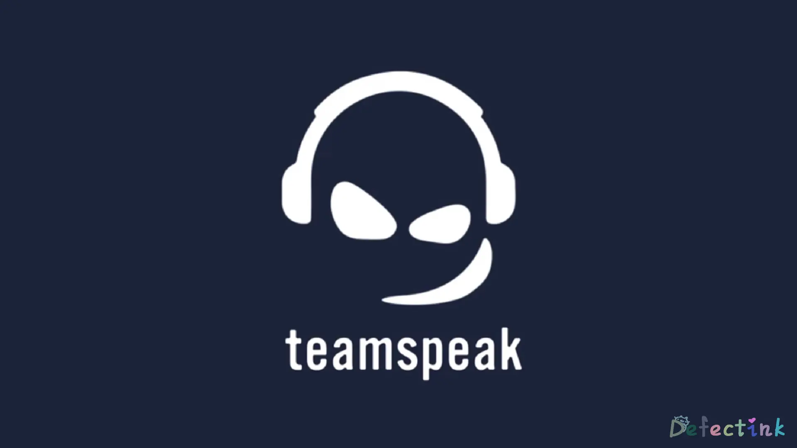
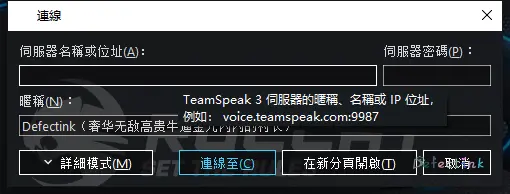
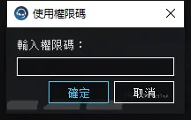
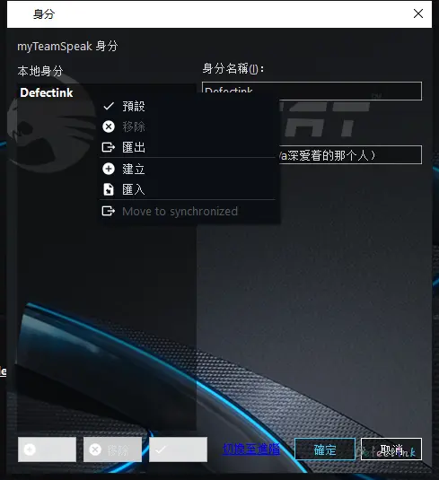
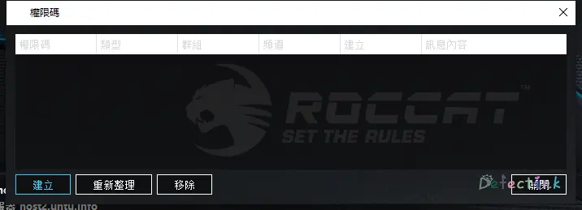
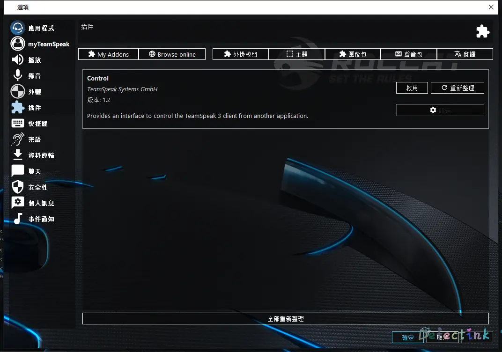
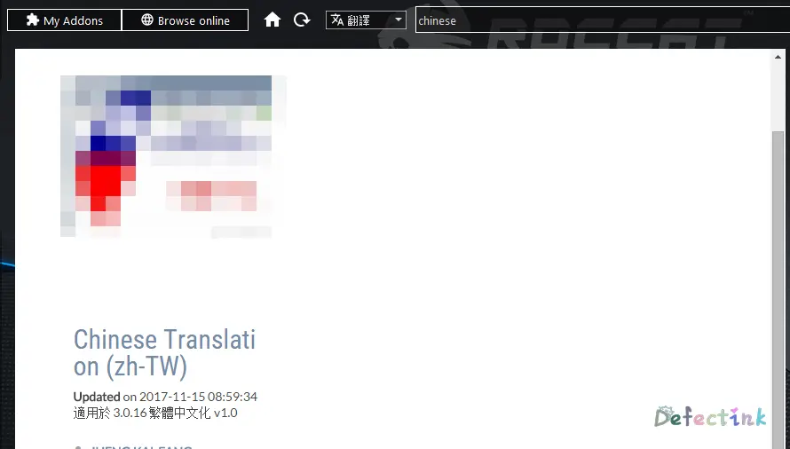
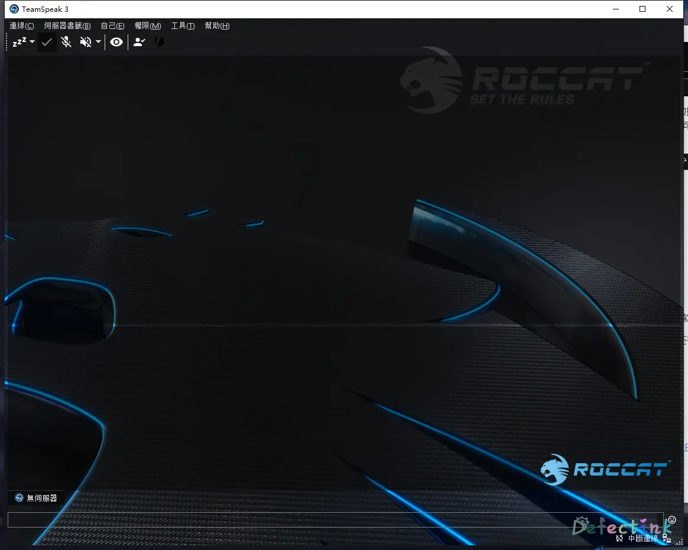

>  与小伙伴的开黑之路🤞

## Teamspeak？



Teamspeak是一套专有的VoIP软件。所谓VoIP软件，就是基于网络协议的语音通话。而Teamspeak就是和现在市面上大多数即时通讯软件差不多，可以发送即时消息以及多人语音通话。

它是以S(erver) -> C(lient)架构基于Internet的运作方式，但是与其他多数软件不同的是，它允许自己搭建服务器。也就是说它的服务端也是可以下载安装的。

而且Teamspeak是一款多平台的软件，这就意味着，如果我们想，可以让在任何机器上运行成为服务端。它甚至支持离线/局域网的通信。

除此之外，它对自己的通信频道有着完全自定义的控制。设置官方称可以为整个服务器或只是特定通道启用基于AES的加密。

我主要喜欢它的地方在于，完全不需要注册账号。可以建立在私人服务器上并有着很完成的控制权限。

## 服务端

废话了半天，我们了解它是一款可以搭建在自己私人服务器上的一款即时通讯软件。所以接下来就是安装操作了。

### 服务器环境

首先，我用做服务端的环境：

* Server：阿里云ECS
* Bandwidth：1M
* OS：Ubuntu 18.04 bionic

```
                          ./+o+-       root@Cruiser
                  yyyyy- -yyyyyy+      OS: Ubuntu 18.04 bionic
               ://+//////-yyyyyyo      Kernel: x86_64 Linux 4.15.0-041500-generic
           .++ .:/++++++/-.+sss/`      Uptime: 26d 11h 31m
         .:++o:  /++++++++/:--:/-      Packages: 1031
        o:+o+:++.`..```.-/oo+++++/     Shell: zsh 5.4.2
       .:+o:+o/.          `+sssoo+/    WM: 
  .++/+:+oo+o:`             /sssooo.   CPU: Intel Xeon E5-2682 v4 @ 2.494GHz
 /+++//+:`oo+o               /::--:.   GPU: cirrusdrmfb
 \+/+o+++`o++o               ++////.   RAM: 588MiB / 1993MiB
  .++.o+++oo+:`             /dddhhh.  
       .+.o+oo:.          `oddhhhh+   
        \+.++o+o``-````.:ohdhhhhh+    
         `:o+++ `ohhhhhhhhyo++os:     
           .o:`.syhhhhhhh/.oo++o`     
               /osyyyyyyo++ooo+++/    
                   ````` +oo+++o\:    
                          `oo++.      
```

（主要是内存有点多的空闲……

### 下载地址

既然是安装，首先是下载用于作为服务端的软件。据我所知，TS是不开源的。

→[官方下载地址](https://www.teamspeak.com/zh-CN/downloads/)

客户端平台：

* LINUX
* MACOS
* WINDOWS
* ANDROID
* IOS

听说两个移动端都不怎么样。

当然，我们主要搭建的是服务端，服务端的平台也不少：

* MACOS
* WINDOWS
* FREEBSD
* LINUX

这些都是我们常见的服务器操作系统。也就是说搭建服务端对系统没有多大挑剔性了。

### 开始动手

从上述的下载地址中，我们下将服务端的软件下载到我们的服务器上：

```
wget https://files.teamspeak-services.com/releases/server/3.6.1/teamspeak3-server_linux_amd64-3.6.1.tar.bz2
```

(这条命令的软件版本可能会随着TS的更新而失效)

由于下载下来的是`tar.bz2`的压缩格式，所以我们使用`-xjvf`来进行解压操作：

```
tar -xjvf teamspeak3-server_linux_amd64-3.6.1.tar.bz2
```

解压之后的文件夹目录：

```
CHANGELOG  libts3db_mariadb.so  libts3_ssh.so  LICENSE-THIRDPARTY  serverquerydocs  ts3server                       ts3server_startscript.sh
doc        libts3db_sqlite3.so  LICENSE        redist              sql              ts3server_minimal_runscript.sh  tsdns
```

我们可以了解到它有一堆各种各样的文件，我们不需要去一个个的了解。据说是专有软件，也就是不开源。所以我们也更不需要去编译等操作了。这些文件肯定都是已经编译好的了。

要运行服务端的软件，首先我们要同意它的许可协议。（如果有人愿意看的话

```
touch .ts3server_license_accepted
```

`touch`这样一个文件在刚刚解压出的目录就意味着我们同意License了。

同意过后，我们执行它的启动脚本：

```
./ts3server_startscript.sh start
```

如果是root用户运行的话，会在启动时提示为了”安全起见，不要使用root用户运行“：

```
WARNING ! For security reasons we advise: DO NOT RUN THE SERVER AS ROOT
!!!!!!!!!!!
```

当然等最后几个感叹号出现完之后，服务端软件就会正常运行了。就可以继续快乐的当root敢死队了🎉。当然使用什么用户运行取决于你自己。我这边是和自己的小伙伴开黑用的，几乎就是私用，不会将服务器做为公用。所以我并不怕死😈。

警告⚠我们过后，就是正常启动了

```
Starting the TeamSpeak 3 server
TeamSpeak 3 server started, for details please view the log file
                                                                                                                                                                  
------------------------------------------------------------------
                      I M P O R T A N T                           
------------------------------------------------------------------
               Server Query Admin Account created                 
         loginname= "serveradmin", password= "dxxxxxxAa"
------------------------------------------------------------------

 ○ 
------------------------------------------------------------------
                      I M P O R T A N T                           
------------------------------------------------------------------
      ServerAdmin privilege key created, please use it to gain 
      serveradmin rights for your virtualserver. please
      also check the doc/privilegekey_guide.txt for details.

       token=HxxxxxxxxxxxxxxxxxxxxxxxxxxxxxxxxxxxxxRL
------------------------------------------------------------------

```

机会将等会会在客户端用的admin账户以及token显示在我们的终端上了。serveradmin账户和token都是TS的最高权限账户，可修改服务器设置。下文会用到

进程：

```
 ○ ps -aux | grep ts3 
root      4031  0.4  1.1 689336 22820 pts/0    Sl   10:44   0:07 ./ts3server
```

### 防火墙

如果我们的服务器有启用防火墙来限制网络的话，ts需要一些TCP/UDP的端口来和客户端进行通信。

目前的Teamspeak 3需要这些端口：

* UDP: 9987
* TCP: 10011
* TCP: 30033

可以在`iptables`中添加：

```
iptables -A INPUT -p udp --destination-port 9987 -j ACCEPT
iptables -A INPUT -p tcp --dport  10011 -j ACCEPT
iptables -A INPUT -p tcp --dport  30033 -j ACCEPT
```

亦或者使用`firewalld`：

```
rewall-cmd --zone=public --add-port=9987/udp --permanent
firewall-cmd --zone=public --add-port=10011/tcp --permanent
firewall-cmd --zone=public --add-port=30033/tcp --permanent
firewall-cmd --reload
```

对于一些特殊的发行版可能需要特殊操作，例如我当前的ECS机器，它的防火墙（iptables）的工作方式不是以进程方式运行的。（虽然我也不懂…… 

但是新建防火墙的规则与上述不同，具体可以了解我很早以前[水过的一篇文章](https://www.defectink.com/defect/23.html)

### 开机启动

当前已经添加过了端口并且已经成功启动了，我们基本上就可以正常连接了。当然还少了一个重要的一步，那就是开机自启了。
由于是使用脚本启动了，而没有使用`systemd`来进行控制，所以服务端需要使用`Crontab`来进行开机启动的控制

```
@reboot /root/teamspeak/teamspeak3-server_linux_amd64/ts3server_startscript.sh start
```

在crontab文件中添加对应的ts脚本启动位置，来实现开机启动ts服务端的效果。
添加完成后我们可以使用`crontab -l`来查看添加完成后的crontab文件，确认是否添加成功。
至此，运行于Ubuntu上的Teamspeak服务端就运行成功了。

## 客户端

上述我们介绍过客户端软件支持的平台以及服务端的安装搭建。客户端的[下载地址](https://www.teamspeak.com/en/downloads/)于服务端是同一个地址，可以找的适用于自己的平台的安装包来进行下载安装。

### 连接服务端

前面有介绍过TS使用的是C/S架构，我们搭建好了服务端当然是为了连接它。连接它比我们想象的要简单的多，打开软件后直接在工具栏就能找到连接这一选项。
单击连接，就可以根据服务器地来连接我们搭建好的服务端了。



我们可以看到有三个选项框，第一个是服务器地址，其次是服务器密码，最后是用于展示给其他人的昵称
默认新安装的服务端是没有密码的，如果我们是连接一个新服务器的话，是可以将密码留空登陆。
**这里的昵称只用于展示于其他人，不等于我们的用户名。**

### Token

在上述我们的安装服务端的操作中，第一次启动后会给我们一个serveradmin账户一段token码。ts这个软件不是那么的强调用户。我们登陆至服务器是不需要创建一个拥有密码的账户的。这和我们目前常用的微信、QQ等软件是略有不同的。

但是ts它也是有用户身份的，因为ts大部分对于服务器的控制操作都是可以在客户端完成的。这时候我们就需要一个有高等级权限的用户身份来完成这个操作。同样需要识别出其他连接进来的用户没有修改服务器的权限。

如果是第一次连接至ts的新服务器，那么我们连接成功后就会立马弹出一个用于输入token的对话框。我们将刚刚创建服务器时给我们的token填入即可。这样就可以直接在客户端修改自己的服务器了。



因为ts默认在使用客户端时会自动创建一个用户身份，每个身份都是不相同的。**那如果我们更换电脑连接自己的服务器时，或者想给其他人一个修改服务器的权限时该怎么办呢？**

- 导出当前的用户身份

在工具栏的“工具-身份”这个标签中，我们可以看到自己当前账户身份。直接右击便可以执行导出操作。在其他地方使用相同方法导入就可以继续使用这个身份了。


- 新建token码

当我们想给其他身份的用户修改服务器的权限的时候，我们可以使用新建权限码的方式来提升其他用户的权限。
在工具栏的“权限-权限码清单”中就可以找的新建权限码的按钮以及已经新建过的权限码清单。新建时也可以选择不同的权限来进一步控制。使用权限码就和我们第一次使用时一样操作即可。


### 翻译插件

如何安装软件这里就不再做赘述。ts默认是英文版本的，可以自己在其他地方下载拥有中文汉化的第三方做的包来使用。也可以自己在原版的基础上添加汉化文件。亦或者是自己安装中文翻译的插件（目前中文插件仅有繁体中文）。

打开软件后，打开“工具-选项”(Alt+P)，找到“插件(add-ons)”这一选项卡。



默认看到的是当前本地的插件，我们可以选择“Browse online"来查看在线可以下载安装的插件。选择筛选器为”翻译“然后输入”Chinese“就可以找到一款繁体中文的插件。点击进入插件的详情页面就可以看到”install“。单击安装即可。



Install完成之后重新打开软件就会应用上翻译了。如果没有成功应用，可以再去刚刚插件地方看看有没有启用。
除了翻译插件之外，TS还有很多种类的插件，以及界面皮肤等。和刚刚安装翻译插件的方法一摸一样。



## 参考

* [Teamspeak 3 Server Ports](https://forum.teamspeak.com/threads/46486-Teamspeak-3-Server-Ports)