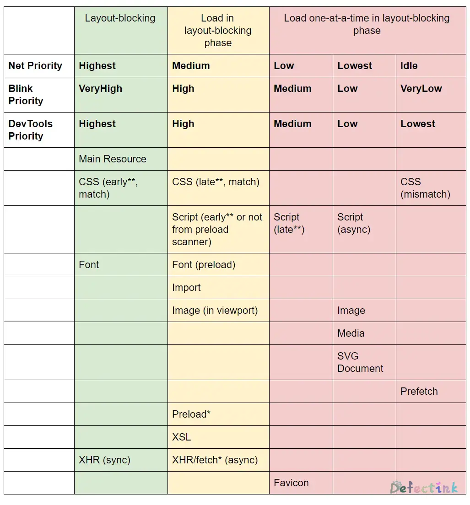

图片懒加载是一个常见的应用，它旨在不影响用户体验的情况下提示首屏的加载速度。原理很简单，在当前可视视口（Viewport）外的图片等到进入了视口内再进行加载（按需加载）。

## 资源处理请求

浏览器对于不同资源的下载请求有着不同的优先级。在基于 Chromium 的浏览器中，有着这样的优先级：



在默认情况下，那些在可视视口外的图片可能有着更高的加载优先级。而可视视口外的图片提前加载是没有必要的，这就可能会造成其他关键的资源（如首屏时间、`xhr call`等）加载缓慢。

> 目前的 Chromium 可能会智能一点，视口外的图片优先级没有那么高

## 最基础实现

这里主要使用一张小图作为占位图片（placeholder)，然后再使用 JavaScript 去加载真正的图片。

这里的核心就是加载图片的`loadImg()`方法。它通过将图片的 src 属性进行替换，替换为提前设置的真正图片的地址`data-src`。实现加载真正的图片。

光靠这一个方法还不行，通过`document.querySelectorAll('img[data-src]')`取得的所有 img 标签的集合为一个 NodeList。还需要使用`forEach()`方法来为每个图片执行`loadImg()`方法。

后续的懒加载还需要使用到`loadImg()`方法来加载真正的图片。

```js
function createImg() {
  let frag = document.createDocumentFragment();
  let num = 28;
  for (let i = 0; i < 9; i++) {
    let img = document.createElement('img');
    // placeholder 地址
    img.src = './img/placeholder.gif';
    // 图片真实地址
    img.setAttribute('data-src', `./img/file_49639${num}.png`);
    num++;
    frag.append(img);
  }
  return frag;
}
let images = createImg();
document.body.append(images);

// 选中所有懒加载的图片
let allImg = document.querySelectorAll('img[data-src]');
// 接受一个 img 元素作为参数
function loadImg(img) {
  img.src = `${img.getAttribute('data-src')}`;
  // 加载完成后移除 data-src 属性
  img.addEventListener('load', loadHandler);
  function loadHandler() {
    img.removeAttribute('data-src');
    // 执行一次后移除 load 监听器
    img.removeEventListener('load', loadHandler);
  }
}
// forEach 遍历，加载每个图片
allImg.forEach((val) => {
  loadImg(val);
});
```

## 懒加载的实现

懒加载的主要实现还是靠一个新兴的 API ：Intersection Observer API。

早期通过检查元素`Element.getBoundingClientRect()`的 top 值与浏览器可视高度`document.documentElement.clientHeight`是否相交也是个不错的办法。但 Intersection Observer API 毕竟还是原生的 API，用起来也更加方便（~~买新不买旧~~）。

在[兼容性](https://developer.mozilla.org/zh-CN/docs/Web/API/Intersection_Observer_API#%E6%B5%8F%E8%A7%88%E5%99%A8%E5%85%BC%E5%AE%B9%E6%80%A7)方面，除了 IE 几乎新版浏览器都支持该 API。

> 当然 IE 是不支持的。

Intersection Observer API 会注册一个回调函数，每当被监视的元素进入或者退出另外一个元素时（或者 viewport），或者两个元素的相交部分大小发生变化时，该回调方法会被触发执行。

通过 Intersection Observer 来监听图片与可视视口是否相交，也就是监听图片是否进入了可视区域。当图片可视时，就调用回调函数，替换 placehol 加载真正的图片。

Intersection observer 支持多个 options。options 为可选配置，对于图片懒加载，默认的配置就足够了。默认监听 target 与可视视口的相交。

回调函数接受两个参数：IntersectionObserverEntry 和 observe 自身。其中 IntersectionObserverEntry 就是主要用到的参数。它有多个属性：

* `IntersectionObserverEntry.boundingClientRect`只读

  返回包含目标元素的边界信息的 DOMRectReadOnly. 边界的计算方式与  `Element.getBoundingClientRect()`相同。

* `IntersectionObserverEntry.intersectionRatio`只读

  返回 intersectionRect 与 boundingClientRect 的比例值.

* `IntersectionObserverEntry.intersectionRect`只读

  返回一个 DOMRectReadOnly 用来描述根和目标元素的相交区域.

* `IntersectionObserverEntry.isIntersecting`只读

  返回一个布尔值, 如果目标元素与交叉区域观察者对象(intersection observer) 的根相交，则返回 true .如果返回 true, 则 IntersectionObserverEntry 描述了变换到交叉时的状态; 如果返回 false, 那么可以由此判断,变换是从交叉状态到非交叉状态.

* `IntersectionObserverEntry.rootBounds`只读

  返回一个 DOMRectReadOnly 用来描述交叉区域观察者(intersection observer)中的根.

* `IntersectionObserverEntry.target`只读

  与根出现相交区域改变的元素 (Element).

* `IntersectionObserverEntry.time`只读

  返回一个记录从 IntersectionObserver 的时间原点(time origin)到交叉被触发的时间的时间戳(DOMHighResTimeStamp).

其中 isIntersecting 和 target 就是本次需要用到的属性。原理很简单，当图片与视口相交时（isIntersecting），就将图片（target）运行指定的函数，以加载真正的图片。

```js
// 创建一个 observer 对象，接受一个回调
let observer = new IntersectionObserver((entries, observer) => {
  // IntersectionObserverEntry 参数
  // console.log(entries);
  // entries 就是 IntersectionObserverEntry 的集合。
  entries.forEach((entry) => {
    // 当 IntersectionObserverEntry 的 isIntersecting 为 true 时，则图片出现
    if (entry.isIntersecting) {
      // 使用加载函数 加载目标，entry.target 就是目标图片
      loadImg(entry.target);
      // 加载完成后取消监听图片
      observer.unobserve(entry.target);
    }
  });
});
// 为所有图片监听
allImg.forEach((val) => {
  observer.observe(val);
});
```

## 内容抖动

内容抖动指的是在替换 placehol 到真正的图片时大小不一致导致的布局变化。

由于每张图片的大小（宽高）可能都不一样，在加载了真正图片之后，布局被图片所撑开或缩小。内容抖动在浏览体验上可能影响不是非常大，但解决内容抖动也是图片懒加载的必要。

解决内容抖动有很多影响的因素，选择一个合适的 placeholder 是一个重要的步骤。根据图片的尺寸来选择合适的 placeholder ：

 * 图片的尺寸已知
  
    这种情况下可以手动制作一个等比例的 placeholder 或者使用类似 [placeholder.com](https://placeholder.com/) 这样的网站来制作合适的 placeholder。

 * 图片的尺寸未知

    在图片尺寸未知的情况下，可以考虑使用一些在线的云服务（如 CDN 的图片处理）来动态的根据图片制作 placeholder。

## 解决内容抖动

制作了等比例的 placeholder 还不能解决所有的问题。由于``标签的特性，在图片为加载时，该标签的尺寸是无法确定的。它会随着图片的大小变化。而正是这一特性，它和图片一样只指定一个宽或高时，会等比缩放。

除了特殊需求外，图片几乎都是等比缩放。所以只需要给图片的宽和高设置一个值即可。

### Aspect Ratio Boxes

长宽比盒子。在一个盒子模型中，`padding-top`与`padding-bottm`属性设置为百分比时，依据的是盒子的宽度。

也就是说，只要确定了盒子的宽度，就能够使用`padding`设置为百分比来画出一个等比例的盒子。

例如一个 16:9 的长方形：

<p class="codepen" data-height="321" data-theme-id="light" data-default-tab="css,result" data-user="Defectink" data-slug-hash="GRNzGam" data-preview="true" style="height: 321px; box-sizing: border-box; display: flex; align-items: center; justify-content: center; border: 2px solid; margin: 1em 0; padding: 1em;" data-pen-title="Aspect Ratio Boxes">
  <span>See the Pen <a href="https://codepen.io/Defectink/pen/GRNzGam">
  Aspect Ratio Boxes</a> by Defectink (<a href="https://codepen.io/Defectink">@Defectink</a>)
  on <a href="https://codepen.io">CodePen</a>.</span>
</p>
<script async src="https://cpwebassets.codepen.io/assets/embed/ei.js"></script>

```css
.wrapper {
  overflow: hidden;
  height: 0;
  padding-top: 56.25%;
  background-color: red;
  position: relative;
}
```

上述 div 的宽度默认为 100%，而`padding-top`的值就是`9 / 16 * 100% = 56.25%`得出的值。当为指定比例的比值时，由内边距绘制出的盒子将一直保持着 16:9 的比例。

这种等比例的盒子对图片内容防抖动也有一定的用处，将图片包裹在一个等于图片比例的盒子内。由于 img 标签的特性，在图片未加载时，其本身和父元素均没有高度。而 div 元素本身的宽度默认为 100%，利用这一点，就可以在图片未加载完成时，先使用长宽比盒子为图片提供一个占位符。等图片懒加载完成后再覆盖内边距。

<p class="codepen" data-height="265" data-theme-id="light" data-default-tab="css,result" data-user="Defectink" data-slug-hash="ZEBwMyL" data-preview="true" style="height: 265px; box-sizing: border-box; display: flex; align-items: center; justify-content: center; border: 2px solid; margin: 1em 0; padding: 1em;" data-pen-title="长宽比盒子占位">
  <span>See the Pen <a href="https://codepen.io/Defectink/pen/ZEBwMyL">
  长宽比盒子占位</a> by Defectink (<a href="https://codepen.io/Defectink">@Defectink</a>)
  on <a href="https://codepen.io">CodePen</a>.</span>
</p>
<script async src="https://cpwebassets.codepen.io/assets/embed/ei.js"></script>

### 手动设置尺寸

上述长宽比盒子解决防抖动时是需要知道图片的比例的。如果图片都是一样的比例，那么使用长宽比盒子来防抖动也是个不错的选择。

但既然已经知道了图片的尺寸，那么直接给 img 标签添加对应的宽度来防止内容的抖动。将尺寸特别小的 placeholder 放大时，再配合上`filter: blur(10px)`来添加一个模糊。一个丝滑的图片懒加载就做好了。

通常从后端拿到的图片数据格式可能是这样的，其中会包含图片的尺寸信息：

```js
{
  src: './img/file_4963928.webp',
  ph: './img/placeholder/file_4963928.webp',
  w: 450,
  h: 512,
},
```

在生成图片时只需要设置长或宽其中一个尺寸即可：

```js
function createImg2() {
  let frag = document.createDocumentFragment();
  for (let i of requestImg) {
    let img = document.createElement('img');
    // placeholder 地址
    img.src = `${i.ph}`;
    // 图片真实地址
    img.setAttribute('data-src', `${i.src}`);
    // 根据请求的图片尺寸动态设置尺寸
    img.style.width = `${i.w}px`;
    // img.style.height = `${i.h}px`;
    frag.append(img);
  }
  frag.append(document.createElement('hr'));
  return frag;
}
```

## Demo

在线 [Demo](https://codesandbox.io/s/defectingcatlazy-load-image-wbiz0)

## 参考

* [Chrome Resource Priorities and Scheduling](https://docs.google.com/document/d/1bCDuq9H1ih9iNjgzyAL0gpwNFiEP4TZS-YLRp_RuMlc/edit#)
* [浏览器里的资源请求](https://blog.windstone.cc/front-end/browser-env/browser/browser-requests.html)
* [Intersection Observer API](https://developer.mozilla.org/zh-CN/docs/Web/API/Intersection_Observer_API)
* [IntersectionObserverEntry](https://developer.mozilla.org/zh-CN/docs/Web/API/IntersectionObserverEntry)
* [Aspect Ratio Boxes](https://css-tricks.com/aspect-ratio-boxes/)
