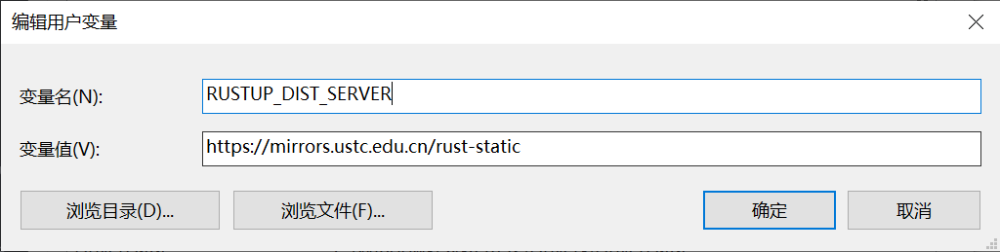

最近迁移了自己的小服务器，也顺便把本机的环境重新设置了一下，其中环节还是有点复杂的小细节的。所以打算整理下思路，方便以后再设置同样环境。

## 对于服务器

目前常用的系统主要是 Ubuntu 和 FreeBSD，到手第一步便是更换到国内的镜像源。

对于 FreeBSD 目前可用的有中科大的源，pkg 的配置文件位置为：`/etc/pkg/FreeBSD.conf`。

```bash
FreeBSD: {
  url: "pkg+http://mirrors.ustc.edu.cn/freebsd-pkg/${ABI}/latest",
  mirror_type: "srv",
  signature_type: "fingerprints",
  fingerprints: "/usr/share/keys/pkg",
  enabled: yes
}
```

对于 Ubuntu，随便选一个就可以了。配置文件位于：`/etc/apt/sources.list`。清华大学开源软件镜像站的 [Ubuntu 镜像使用帮助](https://mirrors.tuna.tsinghua.edu.cn/help/ubuntu/)

```bash
# 默认注释了源码镜像以提高 apt update 速度，如有需要可自行取消注释
deb https://mirrors.tuna.tsinghua.edu.cn/ubuntu/ focal main restricted universe multiverse
# deb-src https://mirrors.tuna.tsinghua.edu.cn/ubuntu/ focal main restricted universe multiverse
deb https://mirrors.tuna.tsinghua.edu.cn/ubuntu/ focal-updates main restricted universe multiverse
# deb-src https://mirrors.tuna.tsinghua.edu.cn/ubuntu/ focal-updates main restricted universe multiverse
deb https://mirrors.tuna.tsinghua.edu.cn/ubuntu/ focal-backports main restricted universe multiverse
# deb-src https://mirrors.tuna.tsinghua.edu.cn/ubuntu/ focal-backports main restricted universe multiverse
deb https://mirrors.tuna.tsinghua.edu.cn/ubuntu/ focal-security main restricted universe multiverse
# deb-src https://mirrors.tuna.tsinghua.edu.cn/ubuntu/ focal-security main restricted universe multiverse

# 预发布软件源，不建议启用
# deb https://mirrors.tuna.tsinghua.edu.cn/ubuntu/ focal-proposed main restricted universe multiverse
# deb-src https://mirrors.tuna.tsinghua.edu.cn/ubuntu/ focal-proposed main restricted universe multiverse
```

### 更换 Shell

Ubuntu 和 FreeBSD 默认 shell 分别是 bash 和 sh，下一步就是切换到 zsh。

```bash
# Ubuntu
apt install zsh -y

# FreeBSD
pkg install zsh
```

Oh my zsh 的安装非常的简单，复制一条命令即可。但困难的地方在于我的服务器可能经常连不上 Github，因为它是通过 clone Github 上的仓库来进行安装的。

```bash
sh -c "$(curl -fsSL https://raw.githubusercontent.com/robbyrussell/oh-my-zsh/master/tools/install.sh)"
```

研究了一下，可以找个 Github 的镜像站手动安装。不过这种方法还是有*一定风险*的，毕竟是直接从别人的站点下载的东西。比较推荐的还是 Gitee 的 [镜像](https://gitee.com/mirrors)。还有个 [fastgit](https://hub.fastgit.org/) 目前也是能用的。

Oh my zsh 也写了详细了 [manual-installation](https://github.com/ohmyzsh/ohmyzsh#manual-installation) 参考着修改下源的地址就可以了。

```bash
# Clone the repository
git clone https://gitee.com/mirrors/ohmyzsh.git ~/.oh-my-zsh
# Create a new zsh configuration file
cp ~/.oh-my-zsh/templates/zshrc.zsh-template ~/.zshrc
# Change your default shell
chsh -s $(which zsh)
```

### Plugins

我比较常用的是 zsh-autosuggestions 与 zsh-syntax-highlighting，比较可惜的是这俩 Gitee mirror 上都还没有。所以我用的是 fastgit。

```bash
git clone https://hub.fastgit.org/zsh-users/zsh-autosuggestions.git $ZSH_CUSTOM/plugins/zsh-autosuggestions
git clone https://hub.fastgit.org/zsh-users/zsh-syntax-highlighting.git $ZSH_CUSTOM/plugins/zsh-syntax-highlighting

# Add to .zshrc
plugins=(git zsh-autosuggestions zsh-syntax-highlighting)
```

### Theme

通常用的是 powerlevel10k 或者 random。

对于 powerlevel10k 可以：

```bash
git clone --depth=1 https://github.com/romkatv/powerlevel10k.git ${ZSH_CUSTOM:-$HOME/.oh-my-zsh/custom}/themes/powerlevel10k
# or
git clone --depth=1 https://gitee.com/romkatv/powerlevel10k.git ${ZSH_CUSTOM:-$HOME/.oh-my-zsh/custom}/themes/powerlevel10k
```

还需要添加一下环境变量

```bash
# To customize prompt, run `p10k configure` or edit ~/.p10k.zsh.
[[ ! -f ~/.p10k.zsh ]] || source ~/.p10k.zsh
POWERLEVEL9K_DISABLE_CONFIGURATION_WIZARD=true
```

## 对于语言

目前常用的主要是 Node.js 与 Rustup，这俩官方地址的速度也是时好时坏。好在淘宝和中科大有他们的镜像源。

### Node.js

主要用的是 nvm，类似于 Oh my zsh，可以 [manual-install](https://github.com/nvm-sh/nvm#git-install)。

```bash
git clone https://gitee.com/mirrors/nvm.git .nvm
```

然后导出对应的变量到当前的 shell 配置文件中：

```bash
export NVM_DIR="$HOME/.nvm"
[ -s "$NVM_DIR/nvm.sh" ] && \. "$NVM_DIR/nvm.sh"  # This loads nvm
[ -s "$NVM_DIR/bash_completion" ] && \. "$NVM_DIR/bash_completion"  # This loads nvm bash_completion
```

其次就是安装 Node.js 本身了，nodejs.org 的速度大部分情况下都是很快的，偶尔也会抽风，nvm 也支持对应的 [环境变量](https://github.com/nvm-sh/nvm#use-a-mirror-of-node-binaries)

```bash
export NVM_NODEJS_ORG_MIRROR=https://npm.taobao.org/mirrors/node
```

### Rustup

Rustup 要相对更加简单的一点，Rustup 默认会读取两个环境变量，将其修改为镜像站点即可：

```bash
export RUSTUP_DIST_SERVER=https://mirrors.ustc.edu.cn/rust-static
export RUSTUP_UPDATE_ROOT=https://mirrors.ustc.edu.cn/rust-static/rustup
```

然后再用官方的脚本。

```bash
curl https://sh.rustup.rs -sSf | sh

source $HOME/.cargo/env
```

对于 Windoiws 环境则需要在“设置”-“高级系统设置”-“环境变量”中添加对应的变量到用户/系统变量中。



当然这几个主要的变量可以放在 `.zshrc` 中，以后更新还会用到的。

### Crate.io

`~/.cargo/config` [清华大学](https://mirrors.tuna.tsinghua.edu.cn/help/crates.io-index.git/)赛高。

```
[source.crates-io]
replace-with = 'tuna'

[source.tuna]
registry = "https://mirrors.tuna.tsinghua.edu.cn/git/crates.io-index.git"
```

对于 Windows 环境，则需要 `C:\Users\{username}\.cargo` 目录下的 `config` 文件，添加对应的源地址。

## 对于本机

目前主要是使用 WSL2 中的 Ubuntu 作为开发环境的，WSL2 目前比较大的问题就是每次其 IP 地址都会变动，宿主机的地址，也就是它的网关也会一直变。

好在 DNS 地址默认就是宿主机 Windows 的地址，可以通过一个简单的命令查到它并将其保存到当前环境变量中：

```bash
# 主机 IP 保存在 /etc/resolv.conf 中
export host_ip=$(cat /etc/resolv.conf |grep "nameserver" |cut -f 2 -d " ")
alias winip='cat /etc/resolv.conf |grep "nameserver" |cut -f 2 -d " "'
```

顺便把内容单独提取到一个小脚本中：

```bash
HOST_IP=$(cat /etc/resolv.conf | grep nameserver | awk '{ print $2 }')
WSL_IP=$(hostname -I | awk '{print $1}')

PROXY_PORT=10809
PROXY_HTTP="http://${HOST_IP}:${PROXY_PORT}"

set_proxy() {
    export http_proxy="${PROXY_HTTP}"
    export HTTP_PROXY="${PROXY_HTTP}"

    export https_proxy="${PROXY_HTTP}"
    export HTTPS_proxy="${PROXY_HTTP}"

    export ALL_PROXY="${PROXY_SOCKS5}"
    export all_proxy=${PROXY_SOCKS5}

    git config --global http.proxy ${PROXY_HTTP}
    git config --global https.proxy ${PROXY_HTTP}

    # git ssh proxy
    sed -i "s/# ProxyCommand/ProxyCommand/" ~/.ssh/config
    sed -i -E "s/ProxyCommand nc -X connect -x [0-9]+\.[0-9]+\.[0-9]+\.[0-9]+:[0-9]+ %h %p/ProxyCommand nc -X connect -x ${HOST_IP}:${PROXY_PORT} %h %p/" ~/.ssh/config
}

unset_proxy() {
    unset http_proxy
    unset HTTP_PROXY
    unset https_proxy
    unset HTTPS_PROXY
    unset ALL_PROXY
    unset all_proxy

    git config --global --unset http.proxy ${PROXY_HTTP}
    git config --global --unset https.proxy ${PROXY_HTTP}

    sed -i -E "s/ProxyCommand nc -X connect -x [0-9]+\.[0-9]+\.[0-9]+\.[0-9]+:[0-9]+ %h %p/# ProxyCommand nc -X connect -x 0.0.0.0:0 %h %p/" ~/.ssh/config
}

test_proxy() {
    echo "Host ip:" ${HOST_IP}
    echo "WSL ip:" ${WSL_IP}
    echo "Current proxy:" ${https_proxy}
}
```

并放在 `.zshrc` 中，使其可以自动被设置：

```bash
# This is proxy for git.
. ~/.config/proxy.sh
set_proxy
```
