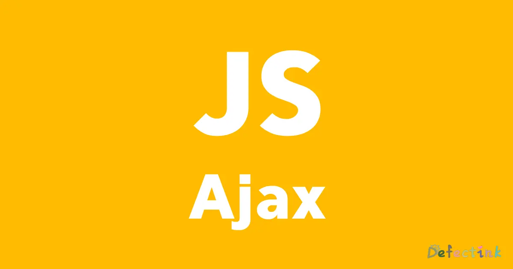

## Ajax

Ajax 是异步的 JavaScript 和 XML（Asynchronous JavaScript And XML）。简单点说，就是使用`XMLHttpRequest`对象与服务器通信。 它可以使用 JSON，XML，HTML 和 text 文本等格式发送和接收数据。Ajax 最吸引人的就是它的“异步”特性，也就是说它可以在不重新刷新页面的情况下与服务器通信，交换数据，或更新页面。

Ajax 最主要的两个特性：

* 在不重新加载页面的情况下发送请求给服务器。
* 接受并使用从服务器发来的数据。



## 发送http请求

`XMLHttpRequest`方法就是发送请求必要的一个方法，通过该方法创建的实例来发送请求。

```js
let httpRequest = new XMLHttpRequest();
```

大部分现代浏览器都实现了`XMLHttpRequest`方法，当然也包括微软。不过早期的IE6或之前的浏览器是通过`ActiveXObject`方法来实现的。为了兼容早期的 IE 浏览器，我们可能需要这要写：

```js
if (window.XMLHttpRequest) { // Mozilla, Safari, IE7+ ...
    httpRequest = new XMLHttpRequest();
} else if (window.ActiveXObject) { // IE 6 and older
    httpRequest = new ActiveXObject("Microsoft.XMLHTTP");
}
```

不过随着时间的流逝，IE6 早已被淘汰，所以目前的兼容性无需多虑。

当发送了一个请求之后，就是得到相应的响应。得到响应后我们需要通知JS如何处理，这时就需要给实例的`onreadystatechange`属性赋值一个方法，当请求状态改变时调用该方法。

```js
httpRequest.onreadystatechange = someFunction;
```

当然也可以使用匿名函数：

```js
httpRequest.onreadystatechange = () => {
    // balabalabala
}
```

当我们能够处理响应的时候，就可以发送一个实际的请求了。通过调用 HTTP 请求对象的`open()`和`send()`方法：

```js
httpRequest.open('GET', 'https://www.defectink.com/balabala.html', true);
httpRequest.send();
```

* `open()`的第一个参数是 HTTP 请求方法 - 有 GET，POST，HEAD 以及服务器支持的其他方法。 保证这些方法一定要是大写字母，否则其他一些浏览器（比如 FireFox）可能无法处理这个请求。
* 第二个参数是要发送的 URL。由于安全原因，默认不能调用第三方 URL 域名。
* 第三个可选参数是用于设置请求是否是异步的。true 为默认值。

## 处理服务器响应

`onreadystatechange`被赋值的函数负责处理响应，这个函数首先要检查请求的状态，根据状态来决定后面执行的任务。

如果状态的值是`XMLHttpRequest.DONE`（对应的值是 4），意味着服务器响应收到了并且是没问题的，然后就可以继续执行。

```js
if (httpRequest.readyState === 4) {
    // Everything is good, the response was received.
} else {
    // Not ready yet.
}
```

全部的`readyState`状态的值为：

* 0 (未初始化) or (请求还未初始化)
* 1 (正在加载) or (已建立服务器链接)
* 2 (加载成功) or (请求已接受)
* 3 (交互) or (正在处理请求)
* 4 (完成) or (请求已完成并且响应已准备好)

当然接下来再继续检查 HTTP 的`response code`。可以通过响应码 200 来判断Ajax有没有成功。

```js
if (httpRequest.status === 200) {
    // Perfect!
} else {
    // There was a problem with the request.
    // For example, the response may have a 404 (Not Found)
    // or 500 (Internal Server Error) response code.
}
```

当检查完请求状态和 HTTP 响应码后， 就可以使用服务器返回的数据了。有两种方法来访问这些数据：

* `httpRequest.responseText` – 服务器以文本字符的形式返回
* `httpRequest.responseXML` – 以 XMLDocument 对象方式返回，之后就可以使用 JavaScript 来处理

当然这一步只有在发起的请求是异步的时候有效。如果发起的请求时同步请求则不必使用函数，但是并不推荐这样做。

## 实例

也算一个总结吧：

1. 通过`XMLHttpRequest`生成一个实例
2. 为实例的`onreadystatechange`方法添加一个处理响应的方法
3. 发送请求，`open()`与`send()`
4. 在处理响应的方法中判断状态值与HTTP响应码(4 && 200)
5. 处理响应`responseText`与`responseXML`

```js
const btn = document.querySelector('.btn');
const title = document.querySelector('.title')
btn.addEventListener('click', makeRequest);

let httpRequest;
function makeRequest() {
    httpRequest = new XMLHttpRequest();
    if (!httpRequest) {
        throw new Error(':( Cannot create an XMLHTTP instance');
        console.error(httpRequest);
        return false;
    }
    httpRequest.onreadystatechange = handler;

    httpRequest.open('GET', 'http://localhost/text.txt');
    httpRequest.send();
}

function handler() {
    if (httpRequest.readyState === 4 && httpRequest.status === 200) {
        title.textContent = httpRequest.responseText;
    } else {
        console.log('There was a problem with the request.');;
        console.log(httpRequest.readyState);
        console.log(httpRequest.status);
    }
}
```

## jQuery中的Ajax

jQuery 极大的简化了原生 JavaScript 的一些繁琐操作，同时它也提供一些 Ajax 方法来简化操作。

### ajax方法

jQuery 提供了一个`$.ajax()`方法，方便去操作 Ajax。该方法是 jQuery 底层 Ajax 实现。简单易用的高层实现见`$.get`,`$.post`等。`$.ajax()`返回其创建的 XMLHttpRequest 对象。大多数情况下无需直接操作该函数。

这个方法接受一个参数，这个参数为键值对集合（对象），其中包含了 Ajax 请求的键值对集合，所有选项都是可选的。也可以通过`$.ajaxSetup()`设置任何选项的默认值。

```js
$.ajax({
    url: 'test.txt',
    async: false
});
```

### 回调

和原生 JavaScript 一样，jQuery 也可以通过参数来设定是否同步执行（async）。当异步执行时，可以使用`success`参数来执行一个回调函数。回调函数支持传递一个参数，参数为 response。

```js
$.ajax({
    url: 'test.txt',
    success: function (result) {
        $('.title').html(result);
    }
});
```

### 其他方法

jQuery 同样提供了一些其他简易易用的方法，例如`load()`方法，通过 Ajax 请求从服务器加载数据，并把返回的数据放置到指定的元素中。

按照传统的方法利用 jQuery 来写一个传递文本到元素可能需要这样：

```js
$(document).ready(function () {
    $('.btn').click(function () {
        $.ajax({
            url: 'test.txt',
            success: function (result) {
                $('.title').html(result);
            }
        });
    })
})
```

而`load()`方法更加简洁，往往只可能需要一行：

```js
$(document).ready(function () {
    $('.btn').click(function () {
        $('.title').load('test.txt');
    })
})
```

不过越是简洁的方法越是难以捉摸以及不方便自定义其他的参数。

无论怎么说，jQuery 提供了更加便利的手段来完成原本繁琐的事情，且仅仅只是多用了 300+kb 的源码。