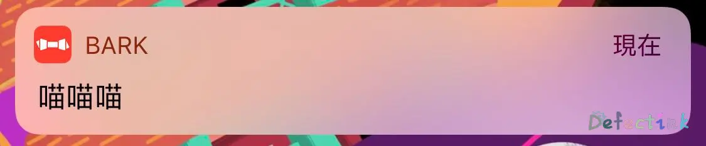
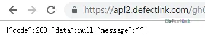
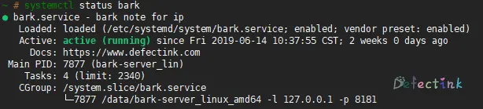

> ding~

用了一段时间的水果了，发现它的通知来的还是非常及时的。基本上只要连接了网络，通知都不会落下。简单了解过IOS的通知机制：APP→水果服务器→你的机器。也就是说这三个步骤都能够正常通信的情况下，我们的机器就能正常的收到通知。

在Android平台也有类似的通知机制，也是由服务端来推送通知到我们的机器，从而到达APP可以不挂后台的情况下收到推送。但是为什么国内的UI用不了我就不清楚了。


## 给自己发通知🐾

上述我们简单了解到，既然是由APP控制的推送通知，那么我们既然想要自定义通知就非常简单了。只需要一个能够由我们控制的APP就可以了。

App Store中有位大佬开发的[Bark](https://apps.apple.com/cn/app/bark-给你的手机发推送/id1403753865)就是为了这事存在的，它的存在目的就是为了让我们自己给自己推送通知。、

Github：[Bark](https://github.com/Finb/Bark)



默认它提供了自己的服务器，如果我们需要推送一些较为隐私的消息，可以使用自建服务端。它提供了http接口，后端简单调用即可给自己的水果设备发送推送。

## 服务端

服务端是一个开源项目，[**bark-server**](https://github.com/Finb/bark-server)，这是一个非常简单易用的服务端软件。

部署非常简单，并且也有docker的部署方式:

```
docker run -dt --name bark -p 8080:8080 -v `pwd`/bark-data:/data finab/bark-server
```

当然和我一样的传统用户喜欢直接部署在主机上的也很方便。相对来说，这种简单易用的服务端的部署和使用docker也差距不大，docker不一定会方便到哪去，说不定还会更加难用。

我们只需要简单的四步就可以部署完成。

- 1、Download precompiled binaries from the [releases](https://github.com/Finb/bark-server/releases) page
- 2、Add executable permissions to the bark-server binary: `chmod +x bark-server`
- 3、Start bark-server: `./bark-server -l 0.0.0.0 -p 8080 -d ./bark-data`
- 4、Test the server: `curl localhost:8080/ping`

对于第三步来说，`-l`定义是监听的地址，`-p`为监听的端口，`./bark-data`默认使用`/data`目录，可以不定义。

当我们使用测试时，返回这样的结果`{"code":200,"data":{"version":"1.0.0"},"message":"pong"}`就意味着我们的服务端已经运行成功了。

此时，我们可以在客户端软件中添加我们的服务器地址`http://server-ip:8080`即可，正常通信后，软件界面上的服务器地址就会全部都变成我们自己刚刚搭建的服务器。

这个时候应该就已经能够正常的使用了。但是既然自己搭建服务端时为了推送一些较为隐私的消息。那么只使用http就显得有点白忙活了。

### https

目前还不太清楚作者有没有直接在服务端添加证书的操作，从目前的文档来看，https需要我们使用其他的思路了。

我目前实现的方法是，既然bark也是基于http接口的，那么我就可以将其只监听`127.0.0.1`，然后使用我的前端apache给它做反代。毕竟apache部署个证书是非常简单的操作。

这样可以达到apache和bark的交互只在机器内部工作，而对外开放的apache使用证书添加上https。达到传输加密的效果。

这样是可以实现了完全加密推送消息到我的设备上了，至于水果那段不太清楚，应该也是加密的吧。

我这里使用的是免费的Let'sEncrypt的证书，他家的不但免费，还有及其方便的脚本直接给apache或其他web服务端配置好证书以及配置文件。并且证书都是保存在相应的目录的，有其他需求时，可以随时使用。

唯一一个缺点就是一次的证书只有3个月时长，需要不停的续期，好在官方也有自动续期的脚本。不是特别的麻烦。

```bash
~ # ls /etc/letsencrypt/live/api2.defectink.com                                           
cert.pem  chain.pem  fullchain.pem  privkey.pem  README
```

### 反代

apache已经有了证书了，接下来直接反代到我们的bark服务端就ok了。

这是我的配置文件：

```bash
VirtualHost *:80
 ProtocolsHonorOrder On
 Protocols h2 h2c http/1.1

        Servername api2.defectink.com
        ServerAdmin webmaster@localhost

        ProxyRequests Off
        ProxyMaxForwards 100
        ProxyPreserveHost On
        ProxyPass / http://127.0.0.1:8181/
        ProxyPassReverse / http://127.0.0.1:8181/

        Proxy *
            Order Deny,Allow
            Allow from all
        /Proxy
RewriteEngine on
RewriteCond %{SERVER_NAME} =api2.defectink.com
RewriteRule ^ https://%{SERVER_NAME}%{REQUEST_URI} [END,NE,R=permanent]
/VirtualHost
```

只需要注意反代的地址就ok了，也就是我们bark监听的地址。

如果一切都没啥问题的话，我们直接打开刚刚配置好证书的apache站点，bark应该就是能够正常运行了。



## Systemd

前不久才水过一篇systemd的水文，简单试了几个服务，发现还是非常方便的。尤其是像bark这样的占用一个终端，用screen又不太方便找的程序。给他使用systemd来控制更是非常的方便。

把配置文件直接放到`/etc/systemd/system/`目录下就可以了。只需要修改一下`ExecStart`字段的启动路劲就可以正常使用了。

```
[Unit]
Description=bark note for ip
Documentation=https://www.defectink.com
After=network.target

[Service]
Type=simple
PIDFile=/run/bark.pid
ExecStart=/data/bark-server_linux_amd64 -l 127.0.0.1 -p 8181
ExecReload=/bin/kill -s HUP $MAINPID
ExecStop=/bin/kill -s QUIT $MAINPID
PrivateTmp=true

[Install]
WantedBy=multi-user.target
```

具体的效果就和平时使用其他的systemd控制的软件一样了，并且不用再那么麻烦了。

