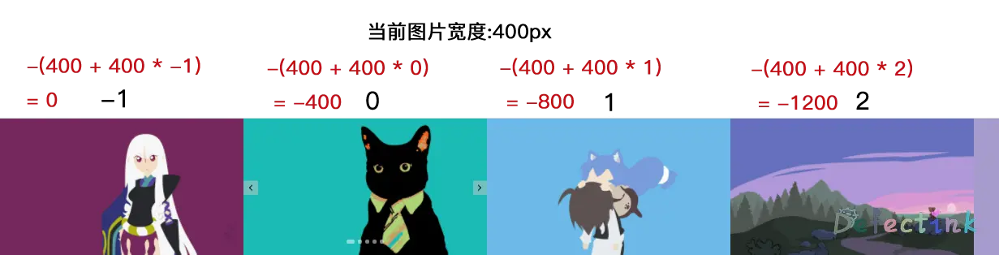

## 迫害移动端

继上次的[经典轮播图的实现方案](/defect/classic-slider-show.html)，这次配合了`TouchEvent`来实现了移动端的触摸轮播图。

这次原生的实现方式和 Vue 基本相同，由于需要实现触摸滑动，仅仅靠`absolute`定位和 Vue 的过渡动画是不够的。所以使用了经典的图片队列，然后克隆两张图片来调换队列。

## 封装组件

这次把整个轮播图图都尝试封装成一个单独的组件，图片的队列和动画延时都由父组件传递 props 过来。

```html
<TouchSlider :images="images" :animeTime="'500'" />
```

组件内：

```js
  props: {
    // 图片队列
    images: Array,
    // 动画时间
    animeTime: String
  },
```

## 经典方案的实现

虽然是用 Vue 来实现的方案，但本质上还是将经典方案封装成一个组件，然后配合上`TouchEvent`来实现了移动端的触摸轮播图。

所以第一步还是先使用 Vue 的方式实现经典的布局方案。

### 布局

组件内的布局和之前的经典方案一模一样，外部的 div 使用`relative`定位，内部的 ul 通过`transform`来进行位移。

```html
<div class="slider">
  <ul class="wrapper">
    <!-- v-for 循环的图片 --> 
    <li></li>
  </ul>
</div>
```

与上次不同的地方是这次 ul 使用的`flex`布局，而不是针对 li 使用`flot`。相对于使用浮动`flot`来说，`flex`布局更加好控制，也更先进。

```css
.slider {
  position: relative;
  overflow: hidden;
}
.wrapper {
  display: flex;
}
```

### 克隆图片

在 Vue 里就不那么依赖操作 DOM 了，克隆第一张和最后一张图片也很方便，，对传过来的图片数组取第一个和最后一个项目就可以了。

整个图片的队列通过`v-for`来循环生成。

```html
<!-- 克隆最后一张图片 -->
<li>
  
</li>
<li v-for="item in images" :key="'img' + item.id">
  
</li>
<!-- 克隆第一张图片 -->
<li>
  
</li>
```

### 队列宽度

经典方案还有个重点就是整个 ul 队列的宽度，它配额偏移量才能准确实现图片的移动。

这里给图片``都上了一个样式，用来决定图片的宽度：

```css
.roll-img {
  width: 600px;
}
```

同时还用了个媒体查询，虽然不能做到实时的响应式，但是根据不同的设备还是能做的刷新后适配不同的设备端的。

```css
@media only screen and (max-width: 376px) {
  .roll-img {
    width: 375px;
  }
}
```

既然图片的宽度确定了，那整个 ul 的宽度就是`单张图片的宽度 * 图片的数量`了。

```html
<ul
  class="wrapper"
  :style="{
    width: imgWidth * images.length + 'px'
  }"
></ul>
```

图片的数量`images.length`很容易确定，单张图片的宽度需要使用 HTMLElement 上的`HTMLElement.offsetWidth`方法。它能返回一个元素的布局宽度，这里使用它来获取单个``的宽度。获取的时机就在组件被挂载时：

```js
mounted() {
  // 计算单个图片的宽度，做移动端适配
  this.imgWidth = this.$refs.img[0].offsetWidth;
}
```

现在在`data()`中还只保存了单张图片宽度`imgWidth`，慢慢来，它会越来越多的。

```js
data() {
  return {
    // 单张图片的宽度
    imgWidth: 0,
  };
```

### 移动方法

这次依然使用`transition`过渡来实现移动的动画，控制位置使用`translateX`。

第一步先封装一个移动的方法，用了前两次的经验，这次修改了移动图片的方法，并且它接受一个参数，用于判断是否开启过渡动画：

```js
move(anime) {
  // 移动方法，添加过渡动画，根据图片序列移动图片
  if (anime) {
    this.transitionX = `all ${this.animeTime}ms`;
  } else {
    this.transitionX = `none`;
  }
  this.translateX = -(this.imgWidth + this.imgWidth * this.imgIndex);
}
```

图片移动的距离也使用了一种更好的公式：`-(单张图片的宽度 + 单张图片的宽度 * 当前图片索引)`。

这个公式的好处就是队列的位移由图片的索引进行驱动，当需要修改队列的位移的位置时，只需要相应的修改索引值，然后调用移动方法内的公式即可。



### 默认位置

上述在`mounted()`挂载后获取了图片的宽度，现在还需要增加一个在挂载后修改下队列的位置。当克隆了两张图片分别在队列的前后时，队列的默认位置需要向左偏移一个图片的宽度。

现在在`data()`中还要再保存一个图片的索引。

```js
data() {
  return {
    // 单张图片的宽度
    imgWidth: 0,
    // 图片索引，用于控制位置
    imgIndex: 0,
  };
```

所以在挂载后，图片的索引为0，调用移动方法即可将队列设置为默认的位置：

```js
mounted() {
  // 计算单个图片的宽度，做移动端适配
  this.imgWidth = this.$refs.img[0].offsetWidth;
  this.move(false);
}
```

### 小圆点

按钮封装的非常基本，就是普通的按钮添加两个点击事件，分别用于操作图片索引加减。这里就不再多说了。

按钮的方法：

```js
previous() {
  if (Date.now() - this.flag > Number(this.animeTime) + 10) {
    this.imgIndex--;
    this.move(true);
    this.flag = Date.now();
  }
},
next() {
  if (Date.now() - this.flag > Number(this.animeTime) + 10) {
    this.imgIndex++;
    this.move(true);
    this.flag = Date.now();
  }
},
```

小圆点也不是非常的复杂，简单封装一个`<ol><li></li></ol>`的结构即可。在父组件中通过`v-for`来循环生成 li，顺便绑定 images 的 index 到 li 的 id 上，用于点击事件。

```html
<IndexPoint
  class="index-point"
  :num="images.length"
  @pointClick="pointClick"
>
  <template>
    <li
      v-for="(item, index) in images"
      :key="'point' + item.id"
      :class="{ active: index == pointIndex }"
      :id="index"
    ></li>
  </template>
</IndexPoint>
```

在点击事件里，将点击的小圆点的 id 赋值到图片的索引，然后再调用`move()`方法就可以正确的移动到对于的图片上。

```js
pointClick(e) {
  this.imgIndex = e.target.id;
  this.move(true);
},
```

### 无限循环

轮播图的重点就在于能够无限轮播，这里使用的还是和往期一样的方案：当移动到克隆的图片时，偷偷替换图片队列。不同的是，这次没有使用`setTimeOut`来进行延时调换，而是使用了`transitionend`事件。该事件就是监听过渡动画完成后调用方法。

监听的方法还是和以前一样，通过判断图片的索引来确定是否是克隆的图片，然后偷偷调换队列。

```js
    transEnd() {
      if (this.imgIndex == -1) {
        // 如果当前序列等于 -1，也就是克隆的图片，则偷偷调整图片队列
        this.imgIndex = this.images.length - 1;
        this.move(false);
      } else if (this.imgIndex == this.images.length) {
        // 反之亦然
        this.imgIndex = 0;
        this.move(false);
      }
    },
```

### 自动播放

自动播放实现的也很简单，定时操作图片的索引即可。

不过这里遇到一个小 Bug，当 Chrome 在后台时，`transitionend`事件不会被监听。这就会导致使用了自动播放在后台放一会之后，所有的图片都消失了。

后来研究了下可以通过[`document.visibilityState`](https://developer.mozilla.org/zh-CN/docs/Web/API/Document/visibilityState)判断浏览器是否处于后台，当其值不等于`hidden`时，就继续播放。

```js
    autoPlay() {
      this.timer = setInterval(() => {
        // 当页面处于后台时，transEnd会失效
        if (document.visibilityState != 'hidden') {
          this.imgIndex++;
          this.move(true);
        }
        console.log(document.visibilityState);
      }, 3000);
    },
```

```
visible
5 hidden
visible
```

## 触摸事件

上述方法都是将以前实现的经典方案封装到 Vue 组件里，本次的重点还是触摸的滑动方法。

触摸由三个事件组成：从 touchstart 到 touchmove 到 touchend。他们分别对应动作：触摸开始、触摸移动和触摸结束。每一次的触摸都会触发这三个事件。

[触摸事件](https://developer.mozilla.org/zh-CN/docs/Web/API/Touch_events)有个事件对象`touches`，它就是实现图片移动的主要原理。`touches`内保存这触摸时的坐标，在不同的触摸事件里可以根据坐标来移动图片。

所以这里现在 ul 上绑定对应的三个事件：

```html
<ul
  class="wrapper"
  :style="{
    width: imgWidth * images.length + 'px',
  }"
  @touchstart="touchStart"
  @touchmove="touchMove"
  @touchend="touchEnd"
>
```

### 触摸开始

第一个是触摸开始的阶段，当第一次触摸到 ul 时，就会触发这个事件。这个事件非常简单，就保存了两个关键的数据：点击时的 X 坐标和当前的图片位置。方便在移动时判断对应的移动位置。

```js
touchStart(e) {
  this.pausePlay();
  // 触摸开始
  if (Date.now() - this.flag > Number(this.animeTime) + 10) {
    // 获取点击时的 X 坐标
    this.startX = e.touches[0].clientX;
    // 点击开始时保存当前图片的位置
    this.lastX = this.translateX;
  }
},
```

### 触摸移动

图片移动的位置就是`原先的位置 + 滑动的距离`。首先判断滑动的距离，使用当前`touchMove`的 X 坐标减去`touchStart`所保存的 X 坐标，就能轻松得出移动了多少距离。

然后再将图片的过渡动画取消`this.transitionX = 'none';`，再给图片添加上移动的距离`this.translateX = this.lastX + this.moveX;`

这里还做了一个简单的判断，当滑动的距离大于单张图片的宽度时`this.moveX >= this.imgWidth`，就不允许再移动了`this.moveX = this.imgWidth;`。同样使用正负值来判断左右移动的方向`this.moveX < 0 && this.moveX <= -this.imgWidth`。

```js
touchMove(e) {
  // 防止在一定时间内过渡滑动
  if (Date.now() - this.flag > Number(this.animeTime) + 10) {
    // 移动时的坐标减去点击时的坐标等于移动的距离
    this.moveX = e.touches[0].clientX - this.startX;
    // 移动图片
    this.transitionX = `none`;
    // 防止滑动过渡
    if (this.moveX >= this.imgWidth) {
      this.moveX = this.imgWidth;
      // 滑动位置等于上次的位置加上手指移动的距离
      this.translateX = this.lastX + this.moveX;
    } else if (this.moveX < 0 && this.moveX <= -this.imgWidth) {
      this.moveX = -this.imgWidth;
      this.translateX = this.lastX + this.moveX;
    } else {
      this.translateX = this.lastX + this.moveX;
    }
  }
},
```

### 触摸结束

当图片正确的移动后，触摸结束的事件就是对图片做一些判断，保证队列是预期的状态。

第一个判断就是当滑动了整张图片时，不需要再调用`move()`方法了，直接对左右方向进行判断，确定图片的索引加减`this.moveX > 0 ? this.imgIndex-- : this.imgIndex++;`。不过还得再调用一次` this.transEnd()`方法来偷偷调换图片队列。

```js
    touchEnd() {
      if (Date.now() - this.flag > Number(this.animeTime) + 10) {
        // 防止滑动过渡
        if (this.moveX == this.imgWidth || this.moveX == -this.imgWidth) {
          this.moveX > 0 ? this.imgIndex-- : this.imgIndex++;
          // 当越界时，调用恢复队列
          this.transEnd();
          // 当触摸大于 70 像素，触发移动动画，移动完整图片
        } else if (this.moveX > 70) {
          this.imgIndex--;
          this.move(true);
          // 当触摸小于 -70 像素，触发移动动画，移动完整图片
        } else if (this.moveX < -70) {
          this.imgIndex++;
          this.move(true);
          // 当在二者之间时，图片归位
        } else {
          this.move(true);
        }
        this.startX = 0;
        this.moveX = 0;
        this.flag = Date.now();
      }
      this.autoPlay();
    },
```

## 🚀

这就是在之前的轮播图上加以实现的移动端轮播图方案，还有一些小方法就没有多嘴了。

几个方法写的比较冗余，感觉可以再简单一点。主要的是对这个组件封装的很烂，整个`TouchSlider.vue`一大串。

[项目地址](https://git.defectink.com/xfy/vue-touch-slider)