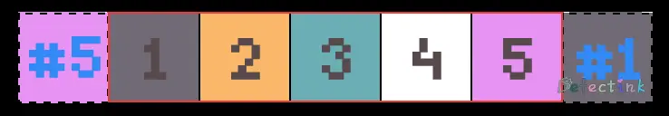
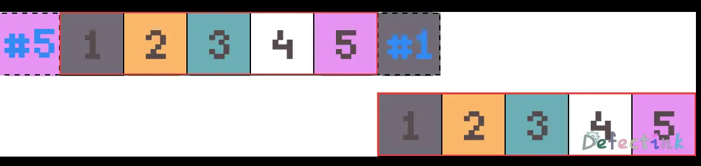

## 传统方式

[项目地址](https://git.defectink.com/xfy/classic-slider)

传统方式实现轮播也算一个不小的工程量了，基本布局就是将所有的图片横向布局，并在首位分别克隆最后和第一张图片。当切换到克隆的图片时，并在动画播放快结束时，将这个图片队列复位。



当整个队列切换完了之后，会切换到克隆的 #1 图片上，再动画完成之后，我们悄悄的将其切换为真正的第一张图片。



## 传统方式的实现

为了给各种数量的图片做适应，所以整个队列的宽度就不固定死了，而使用 JavaScript 动态生成，包括图片索引的小圆点。

### HTML

整个框架非常的简单，一个外层 div 中有三个主要的结构，分别是：用于存放图片的无序列表、左右按钮和小圆点索引。

```html
<div class="wrapper">
  <div class="slider" id="slider">
    <ul class="clear-fix">
      <li></li>
      <li></li>
      <li></li>
      <li></li>
      <li></li>
    </ul>
    <div class="btn btn-left">
      <span><</span>
    </div>
    <div class="btn btn-right">
      <span>></span>
    </div>
    <div class="index-box">
      <ol></ol>
    </div>
  </div>
</div>
```

### CSS

CSS 方面，主要值得注意的就是 ul 和 li，他们分别为绝对定位`position: absolute;`和左浮动`float: left;`。

对 ul 使用绝对定位就可以控制其`left`属性来实现左右移动的动画效果。而对 li 使用左浮动是为了将所有的图片都排列成一行。

```css
.slider {
  transition: all 300ms;
  position: relative;
  height: 100%;
  border-radius: 14px;
  /* overflow: hidden; */
}
.slider ul {
  position: absolute;
  top: 0;
  left: -400px;
  /* width: 700%; */
  /* height: 100%; */
  list-style: none;
}
.slider ul li {
  float: left;
}

.roll-img {
  width: 400px;
}

.clear-fix::after {
  content: "";
  clear: both;
  display: block;
  height: 0;
}
```

## JavaScript

JavaScript 方面内容值得为它写成一个二级标题。它有多个部分组成，在 JavaScript 做的事情有：

* 动态根据图片生成圆点；
* 克隆需要的图片节点；
* 动态添加小圆点样式；
* 左右翻页按钮的监听器；
* 移动方法；
* 重置整个图片队列；

### 初始化

这次使用 ES6 的 class 来创建对象，并初始化整个轮播图。第一步要做的就是在`constructor()`中选中和定义需要的数据：

```js
class Slider {
  constructor(id) {
    // 外层div
    this.wrapper = document.querySelector(id);
    this.pics = this.wrapper.querySelector('ul');
    // 小圆点外层
    this.index = this.wrapper.querySelector('.index-box');
    // 小圆点索引
    this.indexPoint = 1;
    // 单个图片宽度
    this.picWidth = this.wrapper.clientWidth;
    // 总共图片个数
    this.sliders = this.pics.children.length;
    // 按钮点击间隔
    this.startMs = Date.now();
    // 点击小圆点的间隔
    this.movePoint = 0;
    // 初始化方法
    this.init();
  }
}
```

`init()`方法中主要就是其他一些方法的集中运行，他们分别是：初始化圆点、克隆图片和左右按钮：

```js
  init() {
    console.log('init!');
    this.initPoint();
    this.clonePic();
    this.lR();
  }
```

### 初始化圆点

初始化圆点主要做的三件事：

1. 根据图片数量生成圆点个数；
2. 为第一个圆点添加激活的样式；
3. 监听点击事件；

这里使用了 document fragment 来将所有生成的圆点一次性的插入到 DOM 里，从而减少操作 DOM 的频率。

其中比较复杂的部分在于监听点击事件，它不仅仅要为点击的圆点添加相应激活的样式，还要判断圆点的左右和距离来移动对应距离的图片。

在事件代理里，需要做一个小判断`if (e.target.nodeName.toString().toLowerCase() == 'li')`，不然点击到了父 div 元素会取不到对应的属性而报错。

这里判断点击圆点后的左右移动使用时，定义了两个变量，他们分别是：

```js
    // 小圆点索引
    this.indexPoint = 1;
    // 点击小圆点的间隔
    this.movePoint = 0;
```

`this.indexPoint`就是自定义的 Attribute，通过判断`this.indexPoint`上一次和这一次点击的大小，就可以判断出点击的圆点是在左边还是在右边，从而向对应的方向移动图片。

而图片移动的距离使则就是`小圆点的间隔 * 单张图片的宽度`，这里调用的是自定义的`move()`方法，它接受的参数就是图片移动的距离`this.move(-this.picWidth * this.movePoint);`。

`this.picWidth`是提前定义好的单张图片的宽度，通过`this.wrapper.clientWidth;`来获取

```js
  initPoint() {
    // 获取图片的总个数
    let num = this.pics.children.length;
    // 使用 fragment 片段来只操作一次 DOM 插入所有圆点
    let frg = document.createDocumentFragment();
    // 循环生成
    for (let i = 0; i < num; i++) {
      let li = document.createElement('li');
      // 设置自定义 Attribute，用来标识和应用样式；
      li.setAttribute('data-index', i + 1);
      // 默认激活状态
      if (i == 0) {
        li.className = 'active';
      }
      // 插入到 fragment
      frg.append(li);
    }
    // 动态生成 ol 宽度
    this.index.children[0].style.width = num * 10 * 2 + 'px';
    this.index.children[0].append(frg);
    // 添加点击事件，获取index
    this.index.children[0].addEventListener('click', (e) => {
      // 利用事件冒泡做事件代理，只点击到 li 元素生效
      if (e.target.nodeName.toString().toLowerCase() == 'li') {
        let ip = e.target.getAttribute('data-index');
        // 判断点击的圆点间隔，从而决定移动多少图片
        if (this.indexPoint < ip) {
          this.movePoint = ip - this.indexPoint;
          this.indexPoint = Number(ip);
          // 调用 move() 方法来移动图片，移动的距离为圆点的间隔 * 单张图片的宽度
          this.move(-this.picWidth * this.movePoint);
        } else {
          this.movePoint = this.indexPoint - ip;
          this.indexPoint = Number(ip);
          this.move(this.picWidth * this.movePoint);
        }
      }
    });
  }
```

### 克隆节点

前面曾提到过，需要手动的克隆前后两张图片，并再将其放调换放在前后。由于在第一张图片的前面添加了一张克隆的最后一张图，所以需要将 ul 的左偏移提前设置为负的一张图片的宽度。

并且整个 ul 的宽度为所有图片加在一起的宽度。

```js
  clonePic() {
    // 克隆第一个元素
    let first = this.pics.firstElementChild.cloneNode(true);
    // 克隆最后一个元素
    let last = this.pics.lastElementChild.cloneNode(true);
    this.pics.append(first);
    this.pics.insertBefore(last, this.pics.firstElementChild);
    // 动态设定宽度
    this.pics.style.width = this.pics.children.length * 100 + '%';
    // 动态设定漂移
    this.pics.style.left = -1 * this.picWidth + 'px';
  }
```

### 左右按钮

左右翻页按钮的基本框架在 HTML 中已经写好，接下来就是动态的监听事件了。

这两个按钮里主要就是监听点击的事件，主要的功能还是在移动方法`move()`里。

这里还在每次点击结束后记录了下当前的时间戳，当再次点击按钮时会比较当前点击的时间戳和记录的时间戳，如果小于 310ms 则什么也不做。

```js
  lR() {
    // 选中左右按钮，并添加监听器
    this.wrapper.querySelector('.btn-left').addEventListener('click', () => {
      // 记录上一次点击的时间戳，310ms 内的连续点击将不生效
      if (Date.now() - this.startMs > 310) {
        // 圆点越界时重置其 index
        if (this.indexPoint - 1 < 1) {
          this.indexPoint = this.sliders;
        } else {
          this.indexPoint--;
        }
        this.move(this.picWidth);
        this.startMs = Date.now();
      }
    });
    this.wrapper.querySelector('.btn-right').addEventListener('click', () => {
      // 记录上一次点击的时间戳，310ms 内的连续点击将不生效
      if (Date.now() - this.startMs > 310) {
        // 圆点越界时重置其 index
        if (this.indexPoint + 1 > this.sliders) {
          this.indexPoint = 1;
        } else {
          this.indexPoint++;
        }
        this.move(-this.picWidth);
        this.startMs = Date.now();
      }
    });
  }
```

### 移动方法

在前面的按钮里调用了移动方法`move()`，并传递了一个宽度作为参数。这个参数就用作于 css 的`left`值，当为负数时整个队列向左移动，反之，向右移动。

仔细一看也不是非常的复杂，基本的移动方法就是：获取当前的`left`值，然后加上传递进来的 width 参数，最后最为最新的`left`值赋值到 ul 上。

最重要的，也就是整个轮播图的核心部分就是重置队列那部分。当当前的`left`值等于负的第一张图片时，也就是队列滚动到了克隆的 #5 图片上了。图片切换动画的时间是 300ms，在第 295ms 时我们就需要悄悄的将 ul 的动画移除，并将整个队列移动到正真的第五张图片上。这样就可以实现无缝的轮播滚动了。反之亦然。


```js
  move(width) {
    // 获取当前的 left 值
    let left = parseFloat(this.pics.style.left);
    // 添加 300ms 的动画
    this.pics.style.transition = `all 300ms`;
    // 通过移动正负值来确定左右
    this.pics.style.left = left + width + 'px';
    // 狸猫换太子
    if (left == -this.picWidth && width > 0) {
      // 动画为300ms，当为最后一张图的时候，295ms后替换整个ul
      setTimeout(() => {
        this.pics.style.transition = `none`;
        this.pics.style.left = -this.sliders * this.picWidth + 'px';
      }, 295);
    } else if (left == -this.sliders * this.picWidth && width < 0) {
      setTimeout(() => {
        this.pics.style.transition = `none`;
        this.pics.style.left = -this.picWidth + 'px';
      }, 290);
    }
    // 应用圆点样式
    this.modIndexPoint();
  }
```

### 动态添加圆点样式

最后一个小功能就是动态的添加圆点的激活样式，这个部分非常的简单，一些基本操作。

首先将所有的圆点的样式都移除，然后在索引的圆点上添加`active`的样式。

```js
  modIndexPoint() {
    let points = Array.from(this.index.children[0].children);
    for (let i of points) {
      i.className = '';
    }
    points[this.indexPoint - 1].className = 'active';
  }
```

## Vue

[项目地址](https://git.defectink.com/xfy/vue-slider)

Vue 由数据驱动，配合上其过渡样式，可以轻松实现另一种无限轮播的方案。

### 数据驱动

将所有的图片都使用`position: absolute`定位保持在同一个位置，然后配合`v-show`来显示图片。当图片能够成功显示时，配合 Vue 的过渡动画就能够实现无缝的切换了。

这里使用了`v-for`来动态的创建图片 DOM，外层由`transition-group`定义为 ul，而内部 li 则封装为一个组件：

```html
    <transition-group :name="dest" tag="ul" class="img">
      <ImgItem v-for="(item, i) in images" :key="item.id" v-show="show == i">
        <template>
          
        </template>
      </ImgItem>
    </transition-group>
```

而`v-show`呢，则配合 images 列表的下标显示，当图片的下标与定义的变量 show 相同时`v-show="show == i"`则显示这个图片。

```js
data() {
  return {
    images: [
      { id: 1, src: require('../../assets/img/1.webp') },
      { id: 2, src: require('../../assets/img/2.webp') },
      { id: 3, src: require('../../assets/img/3.webp') },
      { id: 4, src: require('../../assets/img/4.webp') },
      { id: 5, src: require('../../assets/img/5.webp') }
    ],
    show: 0,
  }
```

### 切换图片

在考虑过渡动画之前，应该先把切换图片的功能做好。

切换功能非常的简单，刚刚定义的 show 变量便是驱动图片显示的数据。而切换图片只要增加和减少这个 show 变量即可，只需要注意防止其越界。

```html
    <div class="btn btn-left" @click="previous">
      <ImgBtn>
        <template>
          <i class="iconfont icon-next"></i>
        </template>
      </ImgBtn>
    </div>
    <div class="btn btn-right" @click="next">
      <ImgBtn>
        <template>
          <i class="iconfont icon-next"></i>
        </template>
      </ImgBtn>
    </div>
```

这里的`this.dest`是稍后用作动画过渡而定义的方向。

```js
methods: {
  next() {
    this.dest = 'img-next';
    this.show == this.images.length - 1 ? (this.show = 0) : this.show++;
  },
  previous() {
    this.dest = 'img-previous';
    this.show == 0 ? (this.show = this.images.length - 1) : this.show--;
  },
}
```

### 小圆点

同样的小圆点也是封装为一个小组件，外部直接使用 ol 来嵌套。同样的，小圆点的数量由图片来决定，所以它也是遍历`v-for`images 数组。

而小圆点的激活样式同样的也是由变量 show 来进行驱动，当 show 等于当前下标时，则激活样式。小圆点和图片的激活都由同一个变量驱动，这样在修改这一个变量时，小圆点和图片都能正确切换到对应的序列。

```html
    <ol class="img-point" @click="pointClick">
      <ImgPoint v-for="(item, i) in images" :key="item.id + 'point'">
        <template>
          <i :class="{ active: show == i }" :id="i"></i>
        </template>
      </ImgPoint>
    </ol>
```

小圆点这里绑定了一个 id 为数组下标，这样当点击到当前下标的圆点时，就能通过事件修改 show 的值了。这里事件同样使用事件代理。

这里的 if 判断是用来判断后续过渡动画的方向的。

```js
    pointClick(e) {
      console.log(e.target.id);
      if (e.target.nodeName.toString().toLowerCase() == 'i') {
        this.show > e.target.id
          ? (this.dest = 'img-previous')
          : (this.dest = 'img-next');
        this.show = e.target.id;
      }
    },
```

### 过渡动画

这里使用了 Vue 的过渡效果，正向移动时，将即将进入的图片向右偏移一个自身宽度，然后再慢慢的过渡进当前的区域，离开的图片也是同理，慢慢的过渡到向左偏移一个自身宽度。


```css
.img-next-enter-active,
.img-next-leave-active,
.img-previous-enter-active,
.img-previous-leave-active {
  transition: all 300ms;
}
.img-next-enter,
.img-previous-leave-to {
  transform: translateX(100%);
}
.img-next-enter-to,
.img-next-leave,
.img-previous-enter-to,
.img-previous-leave {
  transform: translateX(0);
}
.img-next-leave-to,
.img-previous-enter {
  transform: translateX(-100%);
}
```

稍微复杂一点的就是左右方向移动时，对应的动画顺序是不一样的。所以这里的`<transition-group :name="dest" tag="ul" class="img">`的 name 的值是动态绑定的。当向什么方向移动时，就应用什么方向的 css。

上述左右按钮的点击和小圆点的点击事件里均有修改对应方向的值。

```js
  data() {
    return {
      dest: 'img-next',
    }
```

### 自动播放

图片自动滚动不是什么复杂的事情，设置一个定时器就能解决。

```js
    autoPlay() {
      this.dest = 'img-next';
      this.timer = setInterval(() => {
        this.show == 4 ? (this.show = 0) : this.show++;
      }, 3000);
    },
```

此外在绑定两个鼠标移入和移除的事件，用来设置暂停和继续播放。

```html
@mouseover="pausePlay" @mouseout="continuePlay"
```

```js
    pausePlay() {
      clearInterval(this.timer);
    },
    continuePlay() {
      this.autoPlay();
    }
```

## 🎉

这里的 Vue 实现方案主要是用于 PC 端的，它可以利用 Vue 的 `transition-group`来过渡切换的图片，轻松实现无限循环。

但这个方案的一个缺点就是对于触屏的移动端不是很友好，单靠`transition-group`来给滑动时显示图片会比较复杂。更佳的实现方案还是将上述传统的实现方式封装成一个组件，后续再考虑实现一下。