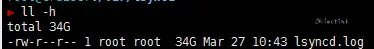

## 引入

最近看到几个数据爆炸的可怕事件，虽然我平时偶尔有手动备份的，但还是不怎么放心。以前有用过lsyncd自动同步到其他机器。但昨天发生了一个更可怕的事情，我重启机器后发现mysql启动不了，apt也不能update了。当时就蒙了，后来发现是我的/var目录满了。mysql与apt都需要用到/var目录，所以爆炸了。但是为什么会满呢…

因为一个lsyncd的日志写了34GB。



## 操作

放弃lsyncd。

以前因为懒，写过一个自动压缩网页根目录的脚本，配合crontab在每天的凌晨自动执行一遍非常不错。

但是最重要的不是根目录，而是数据库。最近有了解到mysqldump，表示可以crontab一下。

### dump为sql文件

导出整个数据库：

```
mysqldump -u 用户名 -p 数据库名 > 导出的文件名
```

例：

```
mysqldump -u root -p typecho > typecho_backup.sql
```

导出一个表

```
mysqldump -u 用户名 -p 数据库名 表名> 导出的文件名
```

例：

```
mysqldump -u root -p typecho users > users_backup.sql
```

导出一个数据库结构

```
mysqldump -u 用户名 -p -d 数据库名 > 导出的文件名
```

例：

```
mysqldump -u root -p -d typecho >  typecho.sql
```

### 导入数据库

```
mysql -u 用户名 -p 数据库名 < 数据库名.sql
```

例：

```
mysql -u root -p typecho < typecho.sql
```

实际操作了一下，确实很简单方便好用。但问题是，对于我这种勤(lan)快的人肯定要脚本自动一体化啊。

### 感觉很厉害的Script

自我感觉，自我感觉。

```bash
#!/bin/bash
#定义数据库信息
USER="root"
PASS="password"
HOST="localhost"
NAME="typecho"
NAME2="wordpress"
#其他信息
BAK_DIR="/root/backup/"
TIME=`date +%F`
#操作
mysqldump -u$USER -p$PASS -h$HOST $NAME > $NAME"_"$TIME.sql
mysqldump -u$USER -p$PASS -h$HOST $NAME2 > $NAME2"_"$TIME.sql
#压缩并移动
#tar -zPcvf /root/backup/tar.gz/sql/$NAME"_"$TIME.tar.gz /root/backup/$NAME"_"$TIME.sql
#tar -zPcvf /root/backup/tar.gz/sql/$NAME2"_"$TIME.tar.gz /root/backup/$NAME2"_"$TIME.sql
#删除多余文件
rm -rf /root/backup/$NAME"_"$TIME.sql /root/backup/$NAME2"_"$TIME.sql
rm -rf /root/$NAME"_"$TIME.sql /root/$NAME2"_"$TIME.sql
#删除三天前的数据
find /root/backup/tar.gz/sql -mtime +3 -name "*.*" -exec rm -rf {} \;
```

只要将其放到crontab中，并按时间进行执行。就能实现完美的sql备份了。

再加上以前写过的一些备份其他文件的Shell Script，就能实现最基本的收据备份了。并且七牛的云储存有个在Linux上的下载备份脚本。正好给了我不小的帮助。

（虽然喜欢写交互式的脚本，但是只要将命令挑出来放crontab就好了）

### 写入crontab

先来简单的介绍下可爱的crontab文件的时间格式吧。


星号（*）：代表所有可能的值，例如month字段如果是星号，则表示在满足其它字段的制约条件后每月都执行该命令操作。

逗号（,）：可以用逗号隔开的值指定一个列表范围，例如，“1,2,5,7,8,9”

中杠（-）：可以用整数之间的中杠表示一个整数范围，例如“2-6”表示“2,3,4,5,6”

正斜线（/）：可以用正斜线指定时间的间隔频率，例如“0-23/2”表示每两小时执行一次。同时正斜线可以和星号一起使用，例如*/10，如果用在minute字段，表示每十分钟执行一次。


然后就是写到Crontab里去了。第一次我也是以为直接找到并编辑crontab这个文件的，后来才发现，原来人家有编辑的命令的：

```
crontab -e
```

然后按照格式讲我们的脚本写进去就好了。

```
# m h  dom mon dow   comman
0 5 * * * /bin/sh /root/backup/c.sh
0 4 * * * /bin/sh /root/backup/d.sh
```

## 结尾

进过超级简单的操作再配合定时任务，就能实现自动化的各种各样的操作了。对于备份这种操作，手动来做的话迟早会累死，就是不累也会感觉到烦。所以将其运用到定时任务上就是非常的人性化了。主要是方便，不需要任何的人工参与。

对于数据这方面的，还是经常性的备份比较重要。不光光是不本机的备份，也要经常性的实施多机备份。