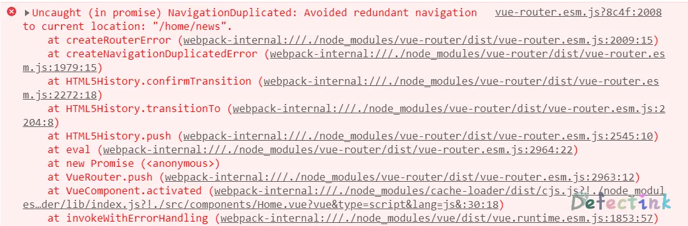

## 真正的动态组件

`<keep-alive>`经常配合`componentIs`来动态的切换组件，当组件再次被切换回来的时候，组件的状态依然被保存。

```js
<keep-alive>
  <component :is="tabName" :postLists="postLists"></component>
</keep-alive>
```

## 在路由中的问题

在研究动态组件`<keep-alive>`的时候发现，如果配置了默认路由跳转的情况下，再子路由上使用`<keep-alive>`就无法达到预期的效果了。因为就算子组件的状态缓存了，但再次访问该组件时，跳转的还是默认的路由。

```html
<!-- App.vue -->
<router-link to="/home" tag="button">首页</router-link>
<router-link to="/about" tag="button">关于</router-link>
  
<keep-alive>
  <router-view></router-view>
</keep-alive>
```

```js
// 默认子路由
{
  path: '/home',
  component: Home,
  meta: {
    title: '首页'
  },
  children: [
    {
      path: '/',
      redirect: '/home/news',
    },
    {
      path: 'news',
      component: HomeNews,
    },
    {
      path: 'message',
      component: HomeMessage,
    }
  ]
},
```

```html
<!-- Home 组件 -->
<router-link to="/home/news" tag="button">新闻</router-link>
<router-link to="/home/message" tag="button">消息</router-link>
<router-view></router-view>
```

在默认的情况下激活 Home 组件会跳转到`/home/news`。在第一次访问了【消息】这个子组件之后，组件的状态会被缓存下来，如果按照之前动态组件的案例来看，再次访问 Home 组件时，对应的依然是【消息】这个子组件。

但仅仅只是缓存了组件的状态还不够，再次访问 Home 组件时，URL 还是会被默认的路由覆盖，不会达到动态组件的效果。

### 手动推送 URL

目前发现的最佳的解决办法就是使用一个变量来保存离开 Home 组件时的 URL，再次激活 Home 组件时，再将 URL 推送回去。

```js
data() {
  return {
    path: "/home/news",
  };
},
```

当使用了`<keep-alive>`时，组件生命周期中会被调用`activated()`和 `deactivated()`两个方法。

使用`activated()`配合上路由的`beforeRouteLeave()`，就可以达到在离开组件时记录当前的 URL，并在重新激活组件时 push 新的 URL。

```js
activated() {
  console.log("activated");
  if (!(this.$route.path === this.path)) {
    this.$router.push(this.path);
  }
},
beforeRouteLeave(to, from, next) {
  console.log("leave");
  (this.path = from.path), next();
},
```

另外这个判断是必须的：`if (!(this.$route.path === this.path))`。如果不判断当前的 URL 是否与缓存的 URL 一致，那么当组件激活时就会无条件的运行`this.$router.push(this.path);`，导致同一条路由被重写两遍。

并得到这样的错误：

```js
Uncaught (in promise) NavigationDuplicated: Avoided redundant navigation to current location: ""
```



这个错误的主要原因是因为同一条路由被重写两遍：NavigationDuplicated。

### 不缓存呢

在组件被创建时，会调用`created`方法，但是`data`方法也会初始化，其中的值也会跟着初始化，没有办法记录路由离开前的 URL。

如果将其`path`存储在组件之外那么也可以实现记录 URL，不过这种情况还是在组件内定义单独的数据为好，并用不上 Vuex。

