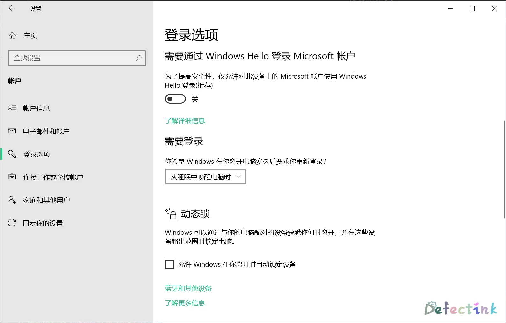
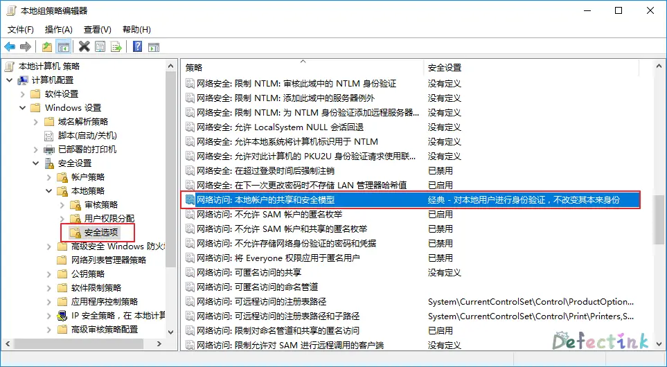

## 触发条件

Windows 10 20H2版，当只登录了一个 Microsoft 账户时。在登录时或系统默认将“**只允许使用 Windows Hello 登录**”打开了，导致无法使用传统密码登入系统。也就直接导致了远程桌面无法登录。

## 可能的其他问题

上述是最新的问题，相比较现在，以前也还有一些老问题会导致无法登录远程桌面。

* [如果凭据未在本地更新，则Windows 10远程桌面登录失败](https://www.dell.com/support/kbdoc/zh-cn/000134994/%e5%a6%82%e6%9e%9c%e5%87%ad%e6%8d%ae%e6%9c%aa%e5%9c%a8%e6%9c%ac%e5%9c%b0%e6%9b%b4%e6%96%b0-%e5%88%99windows-10%e8%bf%9c%e7%a8%8b%e6%a1%8c%e9%9d%a2%e7%99%bb%e5%bd%95%e5%a4%b1%e8%b4%a5)
* 修改注册表

