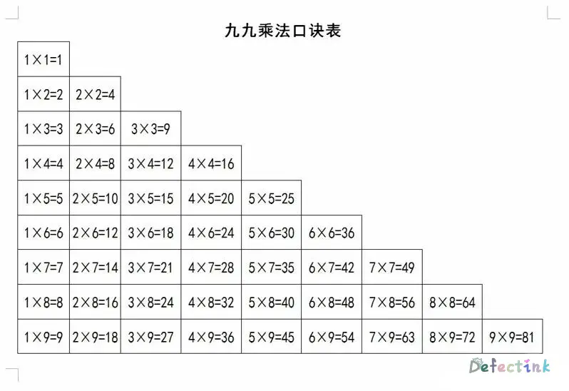

从学习js到现在，也有一段时间了。曾经也尝试过写一些复杂的实践。后来经过测试，就算在入门阶段到了会写，那么距离最优代码还是有一定的差距。可能隔个几天回来自己都看不懂自己写的是什么了，杂乱无章。

最近打算先开始写一些简单的案例做做练习。无意中想到了经典的乘法口诀表，正好for循环也有过实践了，可以尝试一下。

> for循环嵌套的一次练习。

## 思路

有了想法之后，就要开始构建实现的思路。由于css还没跨过门槛，所以决定就打算输出到console里。



而在console输出类似于一个梯形的结构也是需要一个思考的问题。可以打印正确的形状之后，就可以考虑如何输出数字与结果了。

所以构思分为几步：

1. 打印正确的形状
2. 输出内容

## 打印正确的形状

首先先忽略内容，一步一步的打印出所有东西。所以先将内容用`*`代替，只在意形状。

### 正方形

要想正确打印出一个正三角，可以先考虑从一个10x10正方形开始。

第一个想法就是将行和列分别输出。首先定义两个变量，一个用于保存`*`，等会打印再同一行循环打印10次，第一行的`*`就输出完成。另一个变量用于保存第一行输出的内容。

使用一个简单的for循环就能打印出第一行来：

```js
let x = '*';					//输出“*”
let s = '';						//保存列输出
for (let i = 0; i < 10; i++){
    s += x + ' ';               //打印10列“*”
}
console.log(s);
```

此时就能看到第一行的效果：

```js
console.log(s);
//输出：
* * * * * * * * * * 
```

现在已经完成了1x10，也就是说再打印出9行通用的内容就可以打印出一个10x10的正方形了。

那么接下来的思路和上面的也很相似，只需要**再**定义一个变量用于保存最后10行的结果就可以了。for循环也差不多，只需要将`s`加上换行符打印十次就可以了。

```js
let x = '*';					//输出“*”
let s = '';						//保存列输出
for (let i = 0; i < 10; i++){
    s += x + ' ';               //打印10列“*”
}
let t = '';						//保存行输出
for (let i = 0; i < 10; i++){
    t += s + '\n';              //再将10列打印10行
}
console.log(t);
```

这样一个正方形就被打印出来了：

```js
console.log(t);
//输出：
* * * * * * * * * * 
* * * * * * * * * * 
* * * * * * * * * * 
* * * * * * * * * * 
* * * * * * * * * * 
* * * * * * * * * * 
* * * * * * * * * * 
* * * * * * * * * * 
* * * * * * * * * * 
* * * * * * * * * * 
```

### 更好的正方形

现在离乘法表的三角形应该差切掉一半了。但是在此之前，上述打印一个正方形就用掉了三个变量，并且变量`s`在第一个用完之后便没用了，只是个简单的中间人。思路虽然很清晰，但是最后实现的步骤比较繁琐。

后来思索了一下，只需要将两个for循环嵌套一下，就可以节省下来两个变量，并且整体更加的简洁。

此时只需要一个变量`s`来保存最后的输出结果。将两个for循环嵌套在一起时，它们的运算步骤就变成为：

1. 进入第一层循环
2. 第一层循环内的for循环到指定的次数后退出
3. 再次执行第一层循环，并重述步骤2，直到第一层循环达到次数

这样一个步骤就能够更加简洁的打印出一个正方形。步骤总结就是第一个for循环第一次，第二个for循环就循环了10次，正好可以打印以后10个`*`。随后第一个for循环进入第二次，并换行，第二个for循环再次打印10次。这样就两行了，以此类推，就可以打印出10x10。

```js
let s = '';						//保存结果
for (let i = 0; i < 10; i++){
    for (let o=0; o<10; o++){
        s += '* ';				//保存行
    }
    s += '\n';					//换行
}
console.log(s);
```

最后的结果和上述还是一样的，但是整体的代码简洁了很多。

```js
console.log(s);
//输出：
* * * * * * * * * * 
* * * * * * * * * * 
* * * * * * * * * * 
* * * * * * * * * * 
* * * * * * * * * * 
* * * * * * * * * * 
* * * * * * * * * * 
* * * * * * * * * * 
* * * * * * * * * * 
* * * * * * * * * * 
```

### 三角形

有了更好的正方形加持下，就可以轻松的打印出三角形了。

再看一次上述的10x10的步骤，第一个for循环第一次，第二个for循环就循环了10次，正好可以打印以后10个`*`。那么一个正三角形的第一行是只有一个`*`的，也就是说for循环第一次，第二个for循环就循环了1次，这样第一行就只有一个`*`。

实现的整体和打印正方形是没有多少区别的，是需要限制第二个循环的次数，循环到指定的次数后跳出，再由第一个循环换行。

根据“第一行一个`*`，第二行两个`*`”的规律，正好第一个循环的变量`i`是自增的。只需要将内循环的那个限制条件改为第一个循环的变量。就可以正好根据第一个循环打印出一个三角。

```js
let s = '';
for (let i = 0; i < 10; i++){
    for (let o = 0; o <= i; o++){       //条件换成第一个循环的次数，达到“递增换行”的效果
        s += '* ';
    }
    s += '\n';
}
console.log(s);
```

详细工作方式：当`i`等于1时，第一个循环进入第二个循环，第二个循环限制条件为`i`，只循环一次，输出一个`*`。随后跳出到第一个循环打印换行，然后第一个循环进入第二次，`i`等于2。第二个循环正好沿着`i`的自增依次打印出对应数量的`*`。

输出：

```js
console.log(s);
* 
* * 
* * * 
* * * * 
* * * * * 
* * * * * * 
* * * * * * * 
* * * * * * * * 
* * * * * * * * * 
* * * * * * * * * * 
```

## 添加内容

已经跟着第一次打印的正方形，一步一步的能够打印出需要的正三角了。接下来就只需要将`*`替换为乘法表里的内容就可以了。

### 乘法表

要想实现一个有规律的方法，诀窍就是仔细观察其实现的规律。在9行的乘法表中，乘数和被乘数的关系在随着行数和列数增加而增加。被乘数总是与行数相等，而乘数则是与列数相等。

首先第一次的想法是，将乘法表的两个乘数由两个变量代替。只要控制好变量的变化就可以了。这种方法用到的变量比较多，完全用两个变量来代替乘数和被乘数。

第一次的想法没有确切的观察乘法表的规律，在打印正三角的基础上。通过对比大小来控制两个变量的变化。乘数随着行的增加时，是从1开始随着列增加的，被乘数一直等于行数。于是在第二个控制行的for循环中添加if语句，当乘数小于被乘数时++。

被乘数是随着行增加而增加的，于是当第二个for循环结束后，被乘数也++。而乘数则是从头开始，所以重新复制=1。

```js
let a = 1;
let b = 1;
let s = '';
for (let i = 0; i < 9; i++) {
    for (let o = 0; o <= i; o++) {
        s += a + '*' + b + '=' + a * b + ' ';
        if (a < b) {
            a++;
        }
    }
    b++;
    a = 1;
    s += '\n';
}
```

这样的方法可以成功的实现所有的效果，但是用的变量还是比较多的。并且语句结构也比较复杂。

### 更好的乘法表

前面都是没有仔细去观察乘法表的规律而写出来的，从而使用了好几个变量以及复杂的多的语句。

只需要详细观察了乘法表里的乘数与被乘数之间的变化关系，就能够发现两次嵌套循环之间变量的关系刚好一样。

```js
let res = '';
// i随着行变化（被乘数）
for (let i = 1; i <= 9; i++) {
    // o始终从1开始，小于行数（乘数）
    for (let o = 1; o <= i; o++) {
        res += `${o}*${i}=${o * i} `;
    }
    res += '\n'
}
```

也就是说`i`相当于乘数，它随着每行的增加而增加，并且每行都一样，同时它控制着换行。而变量`o`相当于被乘数，每行从1开始，并且小于等于`i`。

## 操作DOM

当时水这篇的时候我还没有学到使用js操作DOM，时隔一年以后，我才想起来这篇还没水完。同时一年后，我还在乘法口诀表(◎﹏◎)

操作DOM并不是很复杂，打印乘法口诀表的主要方法也还是相同的。

### 插入节点

本次操作DOM最主要的一点还是循环添加DOM节点，通过`document.appendChild()`方法来添加生成的节点。HTML结构也非常简单，外部一个`div`，内部通过`span`和`br`来插入内容。就类似于这样： 

```html
    <div class="wrapper">
        <span>1 ✖ 1 ＝ 1</span>
        <br>
        <span>2 ✖ 1 ＝ 2</span>
    </div>
```

虽然这是个小测试，这里还是使用了文档片段( [`DocumentFragment`](https://developer.mozilla.org/en-US/docs/DOM/DocumentFragment))来插入节点。

```js
    wrapper = document.querySelector('.wrapper');
    fragment = document.createDocumentFragment();

        for (let i = 1; i <= 9; i++) {
            for (let o = 1; o <= i; o++) {
                cont = fragment.appendChild(document.createElement('span'));
                cont.textContent = `${i} ✖ ${o} ＝ ${i * o}`;
            }
            fragment.appendChild(document.createElement('br'));
        }
        wrapper.appendChild(fragment);
```

思维也很简单，`appendChild()`方法会将插入的节点返回，返回后就可以直接使用`textContent`来插入生成的内容。同样的换行也是在外部的for循环内插入一个`<br>`标签。

```js
let wrapper,
    cont,
    fragment;

window.onload = function () {
    wrapper = document.querySelector('.wrapper');
    fragment = document.createDocumentFragment();

    function x99() {
        for (let i = 1; i <= 9; i++) {
            for (let o = 1; o <= i; o++) {
                cont = fragment.appendChild(document.createElement('span'));
                cont.textContent = `${i} ✖ ${o} ＝ ${i * o}`;
            }
            fragment.appendChild(document.createElement('br'));
        }
        wrapper.appendChild(fragment);
    }
    x99();
}
```

<p class="codepen" data-height="265" data-theme-id="light" data-default-tab="js,result" data-user="Defectink" data-slug-hash="BaLQZZQ" style="height: 265px; box-sizing: border-box; display: flex; align-items: center; justify-content: center; border: 2px solid; margin: 1em 0; padding: 1em;" data-pen-title="Multiplication formula table">
  <span>See the Pen <a href="https://codepen.io/Defectink/pen/BaLQZZQ">
  Multiplication formula table</a> by Defectink (<a href="https://codepen.io/Defectink">@Defectink</a>)
  on <a href="https://codepen.io">CodePen</a>.</span>
</p>
<script async src="https://cpwebassets.codepen.io/assets/embed/ei.js"></script>