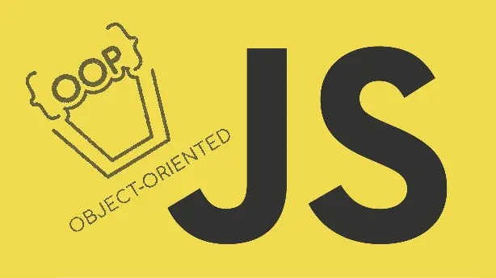
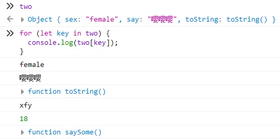

> Standing on Shoulders of Giants.
>
> 本篇参考与《JavaScript高级程序设计》第六章：面向对象的程序设计。

面向对象（Object-Oriented，OO）的语言都有一个标志，那就是他们都有类的概念。通过类来创建任意多个具有相同属性和方法的对象。

ECMAScript中没有类的概念，所以它的对象也与基于类的语言中的对象有所不同。

ECMAScript-262的对象定义为：“无序属性的集合，其属性可以是基本值、对象和函数。”也就是说对象是一个没有属性的键值映射对，其值可以是数据和函数。



## 属性类型

虽然在JavaScript中不能直接访问属性类型，但是为了表示特性是内部值，ECMA-262将其放在了两对方括号中。

**ECMAScript中有两种属性：数据属性和访问器类型属性。**

* [[Configurable]]：表示能否通过delete删除属性从而定义属性，能否修改属性特性，或者能否把属性修改为访问器属性。默认为true
* [[Enumerable]]：表示能否通过for-in循环返回属性。默认为true
* [[Writable]]：表示能否修改属性的值。默认为true
* [[Value]]：包含这个属性的数据值。读取属性的时候从这个位置读取，写入属性值的时候把新值保存在这个位置。默认值为undefined

使用对象字面量创建一个对象时，上述四个特性都为true。value则为属性的值。

### 修改属性的默认特性

要修改默认的特性必须要使用ECMAScritpt5的`Object.prototype.defineProperty()`方法。

Syntax：

```js
Object.defineProperty(obj, prop, descriptor)
```

```js
let obj = {
    name: 'xfy',
    age: 18,
    saySomthing: function () {
        console.log(this.name);
    }
}
Object.defineProperty(obj, 'name', {
    writable: false,
    value: 'xxxxfy',
    configurable: false
})
```

> 将configurable修改为false之后就无法再进行配置了，也就说无法再修改回来了。其他特性都是可以再修改的。

### 访问器属性

为对象设置一个访问器的属性，这个属性不包含数据值，它包含一对setter和getter函数（不是必需的）。在读取这个访问器属性时，会调用getter函数。在写入这个访问器属性时，会调用setter函数。setter决定了如何处理数据。

访问器属性具有如下4个值：

* [[Configurable]]：表示能否通过delete删除属性从而定义属性，能否修改属性特性，或者能否把属性修改为访问器属性。默认为true
* [[Enumerable]]：表示能否通过for-in循环返回属性。默认为true
* [[Get]]：在读取属性时调用的函数。默认为undefined
* [[Set]]：在写入属性时调用的函数。默认为undefined

访问器属性不能直接定义，必须使用`Object.defineProperty()`方法来定义。

```js
let arr = ['zero', 'one', 'two', 'three', 'four', 'five', 'six', 'seven', 'eight', 'nine', 'ten'];
let xbox = {
    _name: 'xbox ',
    _year: 2020,
    edition: arr[1],
    name: function () {
        return this._name + this.edition;
    }
}
console.log(xbox.name());
Object.defineProperty(xbox, 'year', {
    get: function () {
        // 返回对象方法访问的属性
        return this._year;
    },
    set: function (value) {
        // 值不小于2020且不大于2030（因为数组就10个🤣）
        if (!(value < 2020) && !(value > 2030)) {
            // 根据值判断版本，并在数组取值
            this.edition = arr[value - this._year + 1];
            // 将属性访问的方法同时也设置
            this._year = value;
        }
    }
})
xbox.year = 2021;
console.log(xbox.year);
console.log(xbox.name());

// PlayStation？
let ps = {
    _name: 'PlayStation ',
    _year: 2020,
    edition: 4,
    name: function () {
        return this._name + this.edition;
    }
}
Object.defineProperty(ps, 'year', {
    get: function () {
        // 返回对象方法访问的属性
        return this._year;
    },
    set: function (value) {
        // 值不小于2020且不大于2030（xbox也10个🤣）
        if (!(value < 2020) && !(value > 2030)) {
            // 根据值判断版本，并加上基础版本：4
            this.edition = value - this._year + 4;
            // 将属性访问的方法同时也设置
            this._year = value;
        }
    }
})
ps.year = 2021
console.log(ps.name());
```

访问器属性还有一个能够同时定义多个属性的方法。与单个定义对象相同，唯一区别是这里的属性都是同一时间创建的。

```js
// 同时定义多个属性
let ps = {};
Object.defineProperties(ps, {
    _name: {
        value: 'PlayStation',
        writable: true,
        configurable: true
    },
    _year: {
        value: 2020,
        writable: true,
        configurable: true
    },
    edition: {
        value: 4,
        writable: true,
        configurable: true
    },
    name: {
        value: function () {
            return this._name + ' ' + this.edition;
        },
        writable: true,
        configurable: true
    },
    year: {
        get: function () {
            return this._year;
        },
        set: function (value) {
            if (!(value < 2020) && !(value > 2030)) {
                this.edition = value - this._year + 4;
                this._year = value;
            }
        }
    }
})
```

### 读取属性的特性

属性的特性可以很方便的设置，当然也可以方便的读取。使用ECMAScript5的`Object.getOwnPropertyDescriptor()`方法就可以读取属性的特性。

继上述案例：

```js
Object.getOwnPropertyDescriptor(ps, 'year');
// 输出：
// configurable: false
// enumerable: false
// get: function get()
// set: function set(value)
// <prototype>: Object { … }
```

可以详细的看到属性的特性。

```js
Object.getOwnPropertyDescriptor(ps, '_year').value
// 2021
```

> 在JavaScript中可以针对任何对象--包括DOM和BOM对象使用`Object.getOwnPropertyDescriptor()`方法。

## 创建对象

使用Object构造函数和对象字面量可以用来创建单个对象。但是这些方法都不能使用同一个接口创建大量的对象。

### 工厂模式

工厂模式应该是软件设计领域中一种广为人知的设计模式。但是在ECMAScript中无法创建类，早期的人们使用一种函数，来封装以特定接口创建对象的细节。

```js
function createOne(name, age, sex) {
    let o = {};
    o.name = name;
    o.age = age;
    o.sex = sex;
    o.say = function () {
        console.log(this.name);
    }
    return o;
}
let person1 = createOne('xfy', 18, 'male');
let person2 = createOne('dfy', 81, 'female');
console.log(person1);
console.log(person2);
```

工厂模式在函数内显式的创建一个空对象，然后让函数的参数传为对象属性。最后返回函数。这样就可以多次调用这个函数来创建多个相似对象。但这样却无法解决对象试别的问题。

### 构造函数

像`Object()`和`Array()`都是原生的构造函数。在现在，可以创建自定义的构造函数，从而自定义对象类型的属性和方法。

重写上述工厂模式：

```js
function One(name, age, sex) {
    this.name = name;
    this.age = age;
    this.sex = sex;
}
let person1 = new One('xfy', 18, 'female');
let person2 = new One('dfy', 81, 'male');
console.log(person1);
console.log(person2);
```

使用构造函数创建对象必须使用new操作符。此外构造函数的函数名通常为首字母大写，非构造函数首字母小写。这个做法借鉴自其他OO语言。

使用构造函数创建的对象，constructor都指向这个构造函数。

```js
console.log(person1.constructor);	// function One(name, age, sex) { … }
```

这就是构造函数胜过工厂模式的一个地方，工厂模式无法将其实例标记为一种特定的类型。在工厂模式下创建的实例，constructor都将指向`Object()`这个构造函数，因为工厂模式返回的对象是显式创建的，它继承自Object。

#### 内部原理

```js
function Make() {
    this.name = 'xfy';
}
```

一个构造函数在生成时使用`new`操作符，此时的函数内部隐式的声明了一个对象：

```js
function Make() {
    // this = {};
    this.name = 'xfy';
}
```

有了this这个对象之后，函数的作用域赋给新对象（所以this指向了这个对象）：

```js
function Make() {
    // this = {
    	// name : 'xfy'
	// };
    this.name = 'xfy';
}
```

最后再隐式的return this：

```js
function Make() {
    // this = {
    	// name : 'xfy'
	// };
    this.name = 'xfy';
    // return this;
}
```

总结四步：

1. 隐式的创建一个新对象；
2. 将构造函数的作用域赋值给新对象（this指向）；
3. 执行构造函数内的代码（添加属性）；
4. 返回新对象；

也就是说可以不使用`new`来使用一个构造函数（工厂模式）：

```js
function Xfy() {
    let that = {};
    that.name = 'xfy';
    that.age = 18;
    return that;
}
let xfy = Xfy();
```

不赋值给一个对象，直接返回执行的结果：

```js
new Person().say();
```

若给构造函数显示的返回了一个空对象，则显示的返回优先级高于隐式的返回结果：

```js
function Make() {
    this.name = 'xfy';
    return {};
}
```

但是如果显示的返回不是对象值，而是一个基本值，则构造函数不会收到影响：

```js
function Make() {
    this.name = 'xfy';
    return 123;  // 不受影响
}
```

#### 普通函数

构造函数也是函数，它也能当作普通函数来使用。在全局作用域下，直接使用构造函数将会使其this指向全局对象。

```js
function One(name, age, sex) {
    this.name = name;
    this.age = age;
    this.sex = sex;
}
One('xfy');
window.name
// "xfy"
```

所以可以将构造函数使用call/apply来调用：

```js
let obj = {};
One.call(obj, 'xfy', 18, 'female');
console.log(obj);
```

那么自然多个构造函数也可以互相利用，使用call/apply来改变调用函数的this为当前构造函数的this就可以利用上已经写过的代码。

```js
function Two(name, age, sex, say) {
    One.call(this, name, age, sex);
    this.say = function () {
        console.log(say);
    }
}
let two = new Two('xfy', 18, 'female', '嘤嘤嘤');
console.log(two.say());
```

### 构造函数的问题

构造函数虽然好用，但也并非没有缺点。构造函数的主要问题就是每个方法都要在实例上重新创建一遍。

```js
function Two(name, age, sex, say) {
    One.call(this, name, age, sex);
    this.say = function () {
        console.log(say);
    }
    // this.say = new Function('console.log(say)')
}
let two = new Two('xfy', 18, 'female', '嘤嘤嘤');
let two1 = new Two('xfy', 18, 'female', '咕咕咕');
console.log(two.say === two1.say);
```

继上述例子中，每个构造函数内都包含一个不同的Function实例。以这种方式创建函数，会导致不同的作用域链和标识解析符。但创建Function新实例的机制任然是相同的。所以导致由构造函数创建的实例的方法只是同名而不相等。

```js
console.log(two.say === two1.say);	// false
```

创建这样两个完成相同任务的Function实例根本没有必要；况且有this对象存在，根本不用在执行代码前就把函数绑定到特定的对象上面。

所以可以考虑将特定的方法转移出构造函数内部来解决这个问题

```js
function Two(name, age, sex, say) {
    One.call(this, name, age, sex);
    this.say = say;
    this.saySome = saySome;
}
let two = new Two('xfy', 18, 'female', '嘤嘤嘤');
let two1 = new Two('xfy', 18, 'female', '咕咕咕');
console.log(two.saySome);

function saySome() {
    console.log(this.say);
}
```

在构造函数的内部将方法指定为外部的全局函数，这样saySome包含的是一个函数的指针，因此创建出的对象的方法就共享了在全局作用域中定义的同一个函数。这样就能解决两个函数做同一件事的问题。当然这样还无法解决所有问题，如果对象需要很多的方法，那么就需要在全局作用域定义很多的函数，于是这个自定义的引用类型就毫无封装性可言了。

好在，原型模式可以帮我们解决这些问题。

## 原型

每创建一个函数都有一个prototype（原型）属性，这个属性是一个指针，指向一个对象。这个对象的好处就在于可以包含特定类型的所有实例共享的方法和属性。也就是说，构造函数的prototype（原型）这个对象的属性，可以包含到所有由这个构造函数创建的实例上。

这样，上述出现的全局函数不需要去污染全局环境，可以定义在原型上。另外，一些固有的属性也可以直接放在原型上。

```js
Two.prototype.name = 'xfy';
Two.prototype.age = 18;
Two.prototype.saySome = function () {
    console.log(this.say);
}

function Two(sex, say) {
    this.sex = sex;
    this.say = say;
}
let two = new Two('female', '嘤嘤嘤');
let two1 = new Two('male', '咕咕咕');
console.log(two.saySome);
```

### 理解原型对象

无论在何时，只要创建了一个新的函数，就会根据一组特定规则为该函数创建一个prototype属性，这个属性指向函数的原型对象。在默认情况下，原型对象会自动获得一个constructor属性。这个属性指向prototype属性所在函数的指针。也就是说指向构造函数本身`Two.prototype.constructor = Two`。

创建了自定义的构造函数之后，其原型对象默认只会取得constructor属性。其他的方法都是由Object继承而来。当使用构造函数创建新实例后，这个实例会包含一个指针（内部属性），指向构造函数的原型。ECMA-262第5版管这个指针叫做[[Prototype]]。虽然在js中没有标准访问[[Prototype]]的方法。但在多数浏览器中都支持一个属性：`__proto__`。

不过真正要明确的是，这个连接只存在与实例与构造函数的原型对象之间，而不存在与实例与构造函数之间。

```js
(Two Prototype)
Two.prototype --> Two.prototype
two1.__proto__ --> Two.prototype
```

所有在原型上的属性与方法都能被创建的实例所调用。这是通过查找对象属性的过程来实现的。就和作用域链类似，在实例上没有找到的属性会继续向上至原型链查找。

有两种方法来检测/访问到实例的原型对象：`isPrototypeOf()`和`Object.getPrototypeOf()`。

* `isPrototypeOf()`用来检测函数是否是实例的原型；
* `Object.getPrototypeOf()`返回的就是实例的原型；

```js
console.log(Two.prototype.isPrototypeOf(two));
console.log(Object.getPrototypeOf(two) == Two.prototype);
```

> constructor属性也是共享的，可以通过实例对象访问。

### 无法重写

实例无法重写原型上的属性。虽然对象实例可以访问原型，但是对于原型上的属性的增、删操作都是不可以的。如果对象实例上设置了一个和原型属性同名的属性，那么就会优先访问实例本身的属性。

```js
Two.prototype.name = 'xfy';
Two.prototype.age = 18;
Two.prototype.saySome = function () {
    console.log(this.say);
}
function Two(sex, say) {
    this.sex = sex;
    this.say = say;
}
let two = new Two('female', '嘤嘤嘤');
let two1 = new Two('male', '咕咕咕');
two.name = 'dfy';
console.log(two.name);	// dfy
console.log(two1.name);	// xfy
```

就相当于屏蔽了实例去访问原型上的同名属性，即使将实例本身的属性设置为null也不会恢复其指向原型的连接。不过使用delete操作符删除这个属性后，就能重新访问原型上的属性。

```js
two.name = 'dfy';
console.log(two.name);	// dfy
delete two.name;
console.log(two.name);	// xfy
```

当然它也有检测的方法：`hasOwnProperty()`。

```js
two.name = 'dfy';
console.log(two.hasOwnProperty('name'));	// true
delete two.name;
console.log(two.hasOwnProperty('name'));	// false
```

### in操作符

in操作符可以单独使用和在for-in循环中使用。在单独使用时，in用于检测给定的属性通过对象能否访问，无论是继承还是自有属性。

```js
console.log('saySome' in two);
```

配合`hasOwnProperty()`来使用就能检测属性是否是继承来的。

```js
function inheritProperty(target, prep) {
    return !target.hasOwnProperty(prep) && (prep in target);	// 不是自有属性，同时能够访问
}
```

for-in循环会便利所有能访问、可枚举(enumerated)的属性。无论是否是继承来的属性。另外，屏蔽了原型中不能枚举的实例属性也能在for-in循环中返回。因为根据规定，所有开发人员定义的属性都是可枚举的。（只有IE8及更早的版本除外）

这里的two实例重写了`toString()`方法，可以被for-in循环遍历出来。



若要更方便的取出实例的自有属性，可以使用`Object.keys()`方法。它会返回所有自有的可枚举的属性。返回结果为一个数组，出现顺序与for-in循环相同。

```js
Object.keys(two)
// Array(3) [ "sex", "say", "toString" ]
```

可以使用`Object.getOwnPropertyNames()`来访问所有属性，包括不可枚举的属性

```js
Object.getOwnPropertyNames(Two.prototype)
// vArray(4) [ "constructor", "name", "age", "saySome" ]
```

### 更简单的原型语法

前面给原型添加属性都是一行一行的写的，每添加一个属性都要`Two.prototype`一遍。为了减少输入，常见的做法是使用对象字面量来重写整个原型对象。

```js
Two.prototype = {
    name: 'xfy',
    age: 18,
    saySome: function () {
        console.log(this.say);
    }
}
```

将构造函数的prototype以对象字面量形式重新创建一个对象。最终结果没有任何变化，除了constructor不在指向这个构造函数以外。因为重写了prototype，所有constructor也就不存在了。

可以手动将constructor设置为正确是值，但此时的constructor就会变为可枚举的属性。在支持ECMAScript5的环境下，可以再手动设置为不可枚举的属性。

```js
Two.prototype = {
    name: 'xfy',
    age: 18,
    saySome: function () {
        console.log(this.say);
    }
}
Object.defineProperty(Two.prototype, 'constructor', {
    enumerable: false,
    value: Two
})
```

### 原型的动态性

由于在原型中查找值的过程是一次搜索，所以可以随时的修改原型的属性，并立即的在实例上反应出来。即使是先创建了实例再修改的原型也是如此。

实例与原型之间的连接不过是一个指针，而非一个副本。因此在后面的语句中可以找到新的属性。

```js
Two.prototype = {
    name: 'xfy',
    age: 18,
    saySome: function () {
        console.log(this.say);
    }
}
Object.defineProperty(Two.prototype, 'constructor', {
    enumerable: false,
    value: Two
})

function Two(sex, say) {
    this.sex = sex;
    this.say = say;
}
let two = new Two('female', '嘤嘤嘤');
let two1 = new Two('male', '咕咕咕');

console.log(two.name);
Two.prototype.name = 'xxxfy';
console.log(two.name);
```

尽管原型可以随时的修改属性和方法，并且能够在所有对象实例中立即反应出来。但是如果重写整个原型对象，那么情况就不一样了。

在调用构造函数时会为实例添加一个**指向最初原型**的[[prototype]]指针，而重写整个原型对象之后，就相当于切断了构造函数与最初原型之间的联系。实例中的指向仅指向原型，而不指向构造函数。

所以在实例之后重写整个原型并不会生效，且**实例的指针还是指向最初的原型**。

```js
Two.prototype.name = 'xxxfy';

function Two(sex, say) {
    this.sex = sex;
    this.say = say;
}
let two = new Two('female', '嘤嘤嘤');
let two1 = new Two('male', '咕咕咕');

console.log(two.name);	// xxxfy
console.log(two.constructor);

Two.prototype = {
    name: 'xfy',
    age: 18,
    saySome: function () {
        console.log(this.say);
    }
}
Object.defineProperty(Two.prototype, 'constructor', {
    enumerable: false,
    value: Two
})
```

### 原生对象的原型

毫不意外的，原生的引用类似也是采用这种模式。可以像修改自定义对象的原型一样修改原生对象的原型。

由于声明了一个字符串变量，那么后台就会自动调用String来基本包装这个字符串，因此str这个变量可以直接调用String原型上的方法。

```js
String.prototype.yyy = function () {
    return '嘤嘤嘤';
}
let str = 'xfy';
console.log(str.yyy());
```

原生对象的原型是可以被重写的。

### 原型对象的问题

原型虽然很大程度上解决了很多问题，但它也是有缺点的。首先它省略了为构造函数传递初始化参数这一环节，导致了所有实例再默认情况下都将取得相同的属性值。但这并不是主要问题，主要问题还是其共享性的特征导致的。

对于函数来说，这种共享性特别合适。对于包含基本值的属性也还行。但是对于引用值来说，就有很大的问题了。

通过该构造函数创建的两个实例，当一个实例修改了原型上的引用值时，另一个实例也被一起更改。

```js
function Person() {

}
Person.prototype = {
    name: 'xfy',
    age: 18,
    job: null,
    consoles: ['xbox', 'playstation'],
    sayName: function () {
        console.log(this.name);
    }
}
Object.defineProperty(Person.prototype, 'constructor', {
    enumerable: false,
    value: Person
})

let xfy = new Person();
let dfy = new Person();

xfy.consoles.push('nintendo');
console.log(xfy.consoles);
console.log(dfy.consoles);
```

### 组合使用构造函数与原型

在了解构造函数的时候，了解到一个问题所在就是构造函数的每个属性/方法对于每个实例都是重新创建的。而原型则有着共享性。所以将二者组合使用就能互补其缺点。

这种方法的使用，每个实例就有自己的一份实例属性副本，但是同时又共享着对方法的引用，最大限度的节省了内存。

```js
function Person(name, age, job) {
    this.name = name;
    this.age = age;
    this.job = job;
    this.consoles = ['xbox', 'playstation'];
}
Person.prototype = {
    sayName: function () {
        console.log(this.name);
    }
}
Object.defineProperty(Person.prototype, 'constructor', {
    enumerable: false,
    value: Person
})

let xfy = new Person();
let dfy = new Person();

xfy.consoles.push('nintendo');
console.log(xfy.consoles);	// [ "xbox", "playstation", "nintendo" ]
console.log(dfy.consoles);	// [ "xbox", "playstation" ]
```

### 动添原型模式

原型的动态性把所有信息都封装在了构造函数中。这样可以在构造函数中初始化原型（必要情况下），又保持了原型和构造函数的优点。也就是说，可以通过检查某个应该存在的方法是否有效，来决定是否需要初始化原型。

对于这种模式创建的对象，还可以是使用`instanceof`来确定它的类型。

```js
function Person(name, age, job) {
    this.name = name;
    this.age = age;
    this.job = job;
    this.consoles = ['xbox', 'playstation'];
    if (typeof(sayName) != 'function') {
        Person.prototype.sayName = function () {
            console.log(this.name);
        }
    }
}

let xfy = new Person('xfy', 18, null);
let dfy = new Person();

xfy.consoles.push('nintendo');
xfy.sayName();
```

> 如果在已经创建了实例的情况下重写原型，则会切断实例与新原型的联系。

### 寄生构造函数模式

在前面几种模式都不适用的情况下，可以适用寄生(parasitic)构造函数模式。在这个模式下会新建一个对象，并以相应的属性和方法初始化该对象，最后返回该对象。除了使用new操作符之外，这个模式与工厂模式一模一样。

构造函数在不返回值的情况下，默认会返回新对象实例。而在构造函数末尾添加一个return语句，可以重写调用构造函数时返回的语句。

这个模式可以用在特殊的情况下为对象创建构造函数。如果需要一个具有额外方法的特殊数组，而且不能直接Array构造函数，可以使用这个模式。

在这个模式下返回的对象与构造函数的原型直接没有任何关系。构造函数返回的对象与外部创建的对象没有任何的不同。无法用instanceof来确定对象类型。

```js
function myArray() {
    // 创建一个数组
    let val = new Array();
    // 将参数全部传递进去
    val.push.apply(val, arguments);
    // 自定义一个方法
    val.pid = function () {
        return val.join('|');
    }
    return val
}
let arr = new myArray(1, 2, 3, 4, 5, 6, 7, 8, 9, 0);
console.log(arr.pid());
```

### 稳妥构造函数模式

所谓稳妥对象，指的是没有公共属性，而且其方法也不能引用this的对象。稳妥对象最时候在一些安全的环境中（禁用this和new的环境）使用。

稳妥与寄生构造函数类似，但有两点不同：

1. 创建新对象的实例方法不引用this；
2. 不适用new操作符调用构造函数；

除了调用定义的方法外，没有其他方法去访问传递的参数。

```js
function Person(name, age) {
    let o = new Object();
    o.sayName = function () {
        console.log(name);
    }
    o.sayAge = function () {
        console.log(age);
    }
    return o;
}

let xfy = Person('yyy', 18);
console.log(xfy.name);
xfy.sayName();
```

它和私有化变量也很相似，同样的也是不引用this和不使用new操作符。

> 它也和寄生构造函数一样，与构造函数的原型没有多大关系，也无法通过instanceof来确定类型。

## 私有化变量

闭包的另一种应用，在构造函数上的应用。

在使用构造函数构造对象时，属性中的函数会向闭包一样返回为对象的功能，因为闭包的特征，所以构造函数中AO中的变量能被属性内的函数保存和读取。

而构造函数中创建的变量不能使用通常的方法被对象直接访问，只有对象调用指定的方法才能访问。

```js
function Xfy(name, consoled) {
    let anotherConsole = 'ps4';
    this.name = name;
    this.consoled = consoled;
    this.changeConsole = function () {
        this.console = anotherConsole;
    }
    this.buyConsole = function (target) {
        anotherConsole = target;
    }
    this.sayTrueth = function () {
        console.log(anotherConsole);
    }
}
let xfy = new Xfy('xfy', 'xbox');
```

> console.log中的console也是关键字，和变量等不能重名……

## 继承

继承是OO语言中的一个最为人津津乐道的概念。许多OO语言都支持两种继承方式：接口继承和实现继承。接口继承只继承方法签名，而实现继承则继承实际的方法。由于JS的函数没有签名，所有无法实现接口继承，只有实现继承。而实现继承主要依靠的是原型链。

### 原型链

ECMAScript中描述的原型链的概念，并将原型链作为实现继承的主要方法。其基本思想就是让一个引用类型继承另一个引用类型的属性和方法。

构造函数和原型与实例的关系：每个构造函数都一个原型对象，原型对象都包含一个指向构造函数的指针。而实例都包含一个指向原型对象的内部指针。

如果让构造函数的原型对象等于另一个类型的实例，另一个原型也包含另一个构造函数的指针，如果另一个原型又是另一个类型的实例，那么原型的关系就会层层递进，呈链式结构。这就是原型链的基本概念。

```js
function SuperType() {
    // 为实例设置属性
    this.property = true;
}
// 在原型上添加一个方法，通过该构造函数创建的实例就会有该方法。
SuperType.prototype.getProperty = function() {
    console.log(this.property);
}

function SubType() {

}
// 将次级构造函数的原型对象设置为上级构造函数的实例。上级构造函数的实例包含其原型对象，将其设置到该构造函数的原型对象上。
SubType.prototype = new SuperType();

// 通过该构造函数创建的实例就会继承最高级构造函数的原型对象。
let xfy = new SubType();
xfy.getProperty();  // true
```

由于SubType的原型对象是SuperType的实例，相当于重写了SubType的原型对象，所以通过SubType创建的实例对象的constructor指向的是SuperType。

```js
xfy instanceof SubType;
// true
xfy instanceof SuperType;
// true
xfy.constructor;
// function SuperType()
```

### 默认原型

所有引用类型都继承了Object，这个继承也是通过原型链来实现的。**所有函数的默认原型都是Object的实例**，因此默认原型都会包含一个内部指针，指向Object.prototype。这也就是所有自定义类型都会继承`toString()`、`valueOf()`等方法的根本原因。

```js
String instanceof Object;	// true
```

### 确定原型与实例的关系

可以使用instanceof，instanceof用于检测该对象的原型链中有没有该函数的原型。

```js
String instanceof Object;	// true
SuperType instanceof Object;	// true
xfy instanceof SubType;		// true
xfy instanceof SuperType;	// true
xfy instanceof Object;		// true
```

`isPrototypeOf()`方法与instanceof类似，只要是原型链中出现过的原型，都可以说是该原型链所派生的实例的原型。

```js
Object.prototype.isPrototypeOf(xfy);	// true
SuperType.prototype.isPrototypeOf(xfy);	// true
SubType.prototype.isPrototypeOf(xfy);	// true
```

### 谨慎的定义方法

在原型链中，如果给子类型添加一个与超类型的同名的方法，那么子类型的实例就会继承覆盖超类型的方法。

```js
function SuperType() {
    this.property = true;
}
SuperType.prototype.getProperty = function() {
    console.log(this.property);
}

function SubType() {

}
SubType.prototype = new SuperType();
SubType.prototype.getProperty = function() {
    return false;
}

let xfy = new SubType();
xfy.getProperty();  // false
```

此外，重写原型链的方法时，不能使用对象字面量的方法来创建方法。这样会切断刚刚创建的原型链的联系。

```js
function SuperType() {
    this.property = true;
}
SuperType.prototype.getProperty = function() {
    console.log(this.property);
}

function SubType() {

}
SubType.prototype = new SuperType();
SubType.prototype = {
    getProperty: function () {
        return false;
    }
}

let xfy = new SubType();
xfy.property // undefined
```

### 原型链的问题

原型链和原型一样非常的强大，但是它也有和原型一样的问题。那就是对引用值的问题。

修改子类型任何一个实例原型上的值，都是对`SubType.prototype`这个原型对象的修改。并且会实时的反应到SubType创建的实例上去。

```js
function SuperType() {
    this.arr = [1, 2, 3, 4, 5];
    this.property = true;
}
SuperType.prototype.getProperty = function () {
    console.log(this.property);
}

function SubType() {

}
SubType.prototype = new SuperType();


let xfy = new SubType();
let dfy = new SubType();
console.log(xfy.arr);	// [1, 2, 3, 4, 5]
console.log(dfy.arr);	// [1, 2, 3, 4, 5]

// 修改子类型任何一个实例原型上的值
dfy.arr.push(6, 7, 8, 9)

console.log(xfy.arr);	// [ 1, 2, 3, 4, 5, 6, 7, 8, 9 ]
console.log(dfy.arr);	// [ 1, 2, 3, 4, 5, 6, 7, 8, 9 ]
console.log(SubType.prototype.arr);	// [ 1, 2, 3, 4, 5, 6, 7, 8, 9 ]
```

除此之外，原型链创建实例还有另外一个问题。在子类创建实例时无法向超类传递参数。实际上，无法在布影响所有对象实例的情况下，给超类的构造函数传递参数。

### 借用构造函数

原型链中所出现的问题可以配合构造函数使用来解决。这种方法称之为（constructor stealing）有时候也称为伪造对象或经典继承。

这种思想非常简单，即在子类型构造函数的内部调用超类型的构造函数。函数只不过是在特定环境中执行代码的对象，通过使用apply/call来调用另个构造函数也可以创建实例。

当然为了确保没有重写子类型的属性，可以先调用超类型的构造函数，在其后添加自定义属性。

这样创建出的实例就会有自己的属性副本了，而不是从原型链上继承得来的。所以修改其他实例的属性就不会影响到原型链，也就不会影响到其他实例了。

```js
function SuperType(name, age) {
    this.name = name;
    this.age = age;
    this.arr = [1, 2, 3, 4, 5];
}

function SubType(name, age) {
    // 可以称之为继承自SuperType
    // 同时还能传递参数
    SuperType.call(this, name, age);
}

let xfy = new SubType('xfy', 18);
let dfy = new SubType('dfy', 188);

console.log(xfy);

xfy.arr.push(6, 7, 8, 9);

console.log(xfy.arr);	// [ 1, 2, 3, 4, 5, 6, 7, 8, 9 ]
console.log(dfy.arr);	// [ 1, 2, 3, 4, 5 ]
```

不过借用构造函数也有问题，就和构造函数本身的问题一样，无法解决函数复用的问题。

### 组合继承

组合继承，有时候也称之为伪继承。指的是将原型链和构造函数的技术结合使用，从而发挥二者之长的一种模式。

这种方法将实例的属性通过借用构造函数来实现继承，让实例都有自己的属性副本，而不是在原型链上。为了解决方法能够复用的问题，将方法定义在原型链上，并通过原型链来继承。

组合继承避免了原型链和构造函数的缺点，融合了它们的优点。而且`instanceof`和`isPrototypeOf()`也能够识别基于组合继承创建的对象。

```js
function SuperType(name, age) {
    this.name = name;
    this.age = age;
    this.arr = [1, 2, 3, 4, 5];
}
SuperType.prototype.sayName = function () {
    console.log(this.name);
}

function SubType(name, age) {
    // 借用构造函数继承属性
    SuperType.call(this, name, age);
}
// 原型链继承方法
SubType.prototype = new SuperType;

let xfy = new SubType('xfy', 18);
let dfy = new SubType('dfy', 188);

console.log(xfy.sayName());

xfy.arr.push(6, 7, 8, 9);

console.log(xfy.arr);
console.log(dfy.arr);
```

### 原型式继承

道格拉斯·克罗克在06年写了一篇题为Prototypal Inheritance in JavaScript（JavaScript中的原型式继承）的文章。他介绍了一种实现继承的方法。这种方法没有使用严格意义上的构造函数，他的想法是借助原型可以基于**已有的对象创建对象**，同时还不必因此创建自定义类型。

在object函数内部先创建一个临时性的构造函数，然后将传入的对象作为这个构造函数的原型，最后返回了这个临时构造函数的一个新实例。从本质上来说，对传入的构造函数进行了一次浅复制。

```js
function object(o) {
    function F() {};
    F.prototype = o;
    return new F();
}
```

ECMAScript5通过新增`Object.create()`规范化了原型式继承。并且它接受两个参数：

1. 作为新对象原型的对象；
2. 为新对象定义额外属性的对象；

第二个参数与`Object.defineProperties()`方法的第二个参数格式相同：每个属性都是通过自己的描述符定义了。以这种方式指定的属性都会覆盖原型对象上的同名属性。

```js
let one = {
    name: 'xfy',
    age: 18
}
let two = Object.create(one, {
    name: {
        configurable: false,
        value: 'dfy'
    }
})

two.name = 123;
console.log(two.name);
console.log(two.age);	// 18
```

### 寄生式继承

寄生式继承式与原型式继承紧密相关的一种思路。它也是用克罗克福德推广而之的。寄生式继承的思路和寄生构造函数和工厂模式类似，即创建一个仅用于封装继承过程的函数，该函数在内部以某种方式来增强对象，最后在真的像它做了所有工作一样返回对象。

基于寄生式继承的对象，不仅仅有了继承的对象属性方法，而且还有自己自定义的方法。

```js
let person = {
    name: 'xfy',
    age: 18
}
function test(target) {
    let clone = Object.create(target);
    clone.hello = function () {
        console.log('hi(｡･∀･)ﾉﾞ');
    }
    return clone;
}
let xfy = new test(person);

console.log(xfy.name);
console.log(xfy.hello());
```

> 这种方法同样不能做到复用函数。

### 寄生组合继承

组合继承式一个常用的继承模式，不过它也有自己的不足。那就是无论在什么情况下，它都需要调用两次超类型的构造函数。

```js
function SubType(name, age) {
    // 借用构造函数继承属性
    SuperType.call(this, name, age);
}
// 原型链继承方法
SubType.prototype = new SuperType;
```

调用两次超类型构造函数就会导致同样的属性和方法会分别出现在子类型的prototype上和子类型创建的实例上。

寄生组合继承便可以解决这个问题：

```js
function inherit(subtype, supertype) {
    let prototype = Object.create(supertype.prototype);
    prototype.constructor = subtype;
    subtype.prototype = prototype;
}

function One(name) {
    this.name = name;
}
One.prototype.sayName = function () {
    console.log(this.name);
}

function Two(name, age) {
    One.call(this, name);
    this.age = age;
}
Two.prototype.sayAge = function () {
    console.log(this.age);
}

inherit(Two, One);

let xfy = new Two('xfy', 18);

console.log(xfy.name);
```

这种方法解决了多次调用超类型函数，已经在子类型原型上创建多余不必要的属性。同时原型链还能保持不变。

同样，所谓的圣杯模式也是同样的道理。这里直接就使用`Object.create()`方法来代替寄生式继承的详细写法。

```js
function inherit(target, origin) {
    function F() {};
    F.prototype = origin.prototype;
    target.prototype = new F();
    target.prototype.constructor = target;
    target.prototype.uber = origin;
}
```

## 小结

​	ECMAScript支持面向对象（OO）编程，但不使用类或者接口。对象可以在代码执行过程中创建和增强，因此具有动态性而非严格定义的实体。在没有类的情况下，可以采用下列模式创建对象：

* 工厂模式，使用简单的函数传教对象，为对象添加属性和方法，然后返回对象。这个模式后来被构造函数模式所取代。
* 构造函数模式，可以创建自定义引用类型，可以像创建内置对象实例一样使用new操作符。不过，构造函数模式也有缺点，即它的每个成员都无法得到复用，包括函数。由于函数不局限于任何对象（即与对象具有松散耦合的特点），因此没有理由不在多个对象间共享函数。
* 原型模式，使用构造函数的prototype属性来指定那些应该共享的属性和方法。组合使用构造函数模式和原型模式时，使用构造函数定义实例属性，而使用原型定义共享的属性和方法。

​	JavaScript主要通过原型链实现继承。原型链的构建时通过将一个类的实例赋值给另一个构造函数的原型实现的。这样，子类型就能够访问超类型的所有属性和方法，这一点与基于类的继承很相似。原型链的问题是对象实例共享所有继承的属性和方法，因此不宜单独使用。解决这个问题的技术是借用构造函数，即在子类型构造函数的内部调用超类型构造函数。这样就可以做到每个实例都具有自己的属性，同时还能保证只使用构造函数模式来定义类型。使用最多的继承模式是组合继承，这种模式使用原型链继承共享的属性和方法，而通过构造函数继承实例属性。

​	此外，还存在下列可供选择的继承模式：

* 原型式继承，可以在不必预先定义构造函数的情况下实现继承，其本质式执行对给定对象的浅复制。而复制得到的副本还可以得到进一步改造。
* 寄生式继承，与原型式继承非常相似，也是基于某个对象或某些信息创建一个对象，然后增强对象，最后返回对象。为了解决组合继承模式由于多次调用超类型构造函数而导致的低效率问题，可以将这个模式与组合继承一起使用。
* 寄生组合式继承，集寄生式继承和组合继承的优点于一身，是实现基于类型继承的最有效方式。

> 我更加喜欢寄生组合式继承，也就是常说的“圣杯模式”。