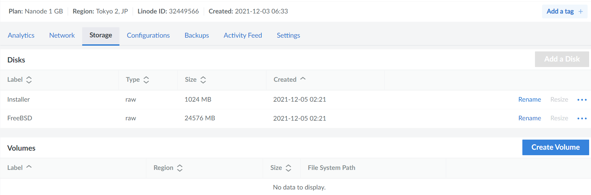
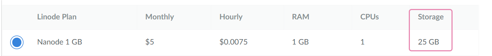
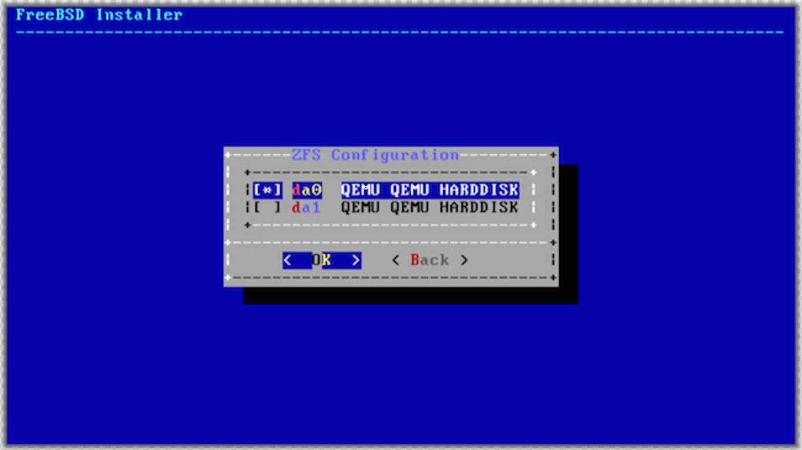
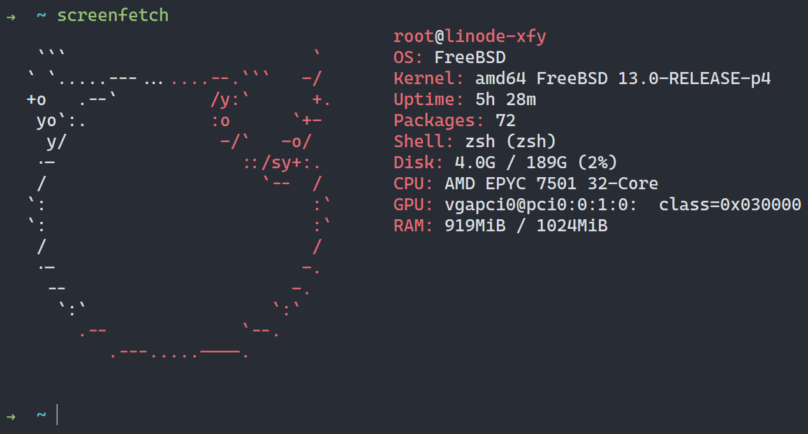

FreeBSD 是一款基于 [Berkeley Software Distribution](https://en.wikipedia.org/wiki/Berkeley_Software_Distribution) 开源的操作系统。可惜 Linode 自带的镜像中是只有 Linux，官方文档中的做法就是自己 `dd` 安装。

## 安装前的准备

原理很简单，将 FreeBSD 的 `memstick.img` 镜像使用 `dd` 写入到事先准备好的磁盘中。然后再通过这个镜像启动进行安装即可。

## 创建磁盘

首先将实例关机（Power Off），然后在实例详情中能看到存储（Storage）的选项卡，将其所有的磁盘删除：



这里创建的 Disks，都会成为在实例上挂载的磁盘设备，大小限制就是选择实例时标注的那个：



将所有现有的磁盘都删除之后，我们需要创建两个新的磁盘，分别是用于安装与启动的磁盘：

- 第一块是 Label 为 _Installer_ 的 1024MB 磁盘。
- 第二块用来安装 FreeBSD，所以利用剩下所有空间。

### 启动配置文件

再来到旁边的 Configuration 的选项卡，将之前的默认系统的启动文件删除，创建两个新的配置文件。分别是：

**Installer profile**

- Label: Installer
- Kernel: Direct Disk
- `/dev/sda`: FreeBSD disk image.
- `/dev/sdb`: Installer disk image.
- root `/` boot device: Standard `/dev/sdb`

**Boot profile**

- Label: FreeBSD
- Kernel: Direct Disk
- `/dev/sda`: FreeBSD disk image.
- root `/` boot device: Standard `/dev/sda`

它们分别用于制作安装镜像和启动系统的配置。

### 制作安装镜像

在实例列表中可以 [启动到救援模式](https://www.linode.com/docs/troubleshooting/rescue-and-rebuild/#booting-into-rescue-mode)，选择之前创建的 installer 磁盘挂载到 `/dev/sda`，并通过 Linode 的 Lish 连接上 SSH。我们就是在这个救援模式中使用 `dd` 制作镜像的。

可以在 FreeBSD 的 [网站](https://www.freebsd.org/where/) 上下载到用于 `dd` 的镜像 `memstick.img`，但是我测试的 13.0 安装会出现问题，所以我使用了 12.2 来安装，然后再更新到 13.0。

使用下载链接替换 `$latest`，将 `/dev/sda` 来制作为镜像

```bash
curl $latest | dd of=/dev/sda
```

`dd` 完成之后，通过 Configuration 中选择之前创建好的 **Installer profile** 来启动。这样就可以进入到系统的安装环节了。

后续的安装得使用 [Glish](https://www.linode.com/docs/guides/using-the-linode-graphical-shell-glish/) 有点类似与 VNC。

## 安装 FreeBSD

安装按照基本流程来就可以了，需要注意的几点细节是最好选择 ZFS 格式的文件系统，并在随后的 ZFS Configuration 中选择 `da0`。



在结尾阶段 **Apply configuration and exit installer** 后会提示在重启之前给我们个 Shell 进去修改一些自定义的配置。选择 Yes，并在 `/boot/loader.conf` 中添加：

```bash
boot_multicons="YES"
boot_serial="YES"
comconsole_speed="115200"
console="comconsole,vidconsole"
```

## 更新到 13.0

由于 13.0 的镜像安装不成功，只能先用 12.2 的安装，之后再更新到 13.0。更新的步骤还是蛮多的。首先是获取更新，并重启：

```bash
freebsd-update fetch
freebsd-update install
pkg upgrade
reboot
```

然后是安装 Kernel 更新并重启：

```bash
freebsd-update -r 13.0-RELEASE upgrade
freebsd-update install
```

重启之后需要再安装一遍：

```
freebsd-update install
```

完事之后还要再来一遍，移除旧的 shared libraries 并完成更新：

```
freebsd-update install
```

之后可以顺便把 pkg 以及 ports 更新一下：

```
pkg-static install -f pkg
pkg bootstrap -f
pkg update -y
pkg upgrade -y
```

```
portsnap fetch
portsnap extract
pkg bootstrap -f
pkg update -f
pkg upgrade -f
```

## All done

现在就有一台在 Linode 上的 FreeBSD 啦。🎉


