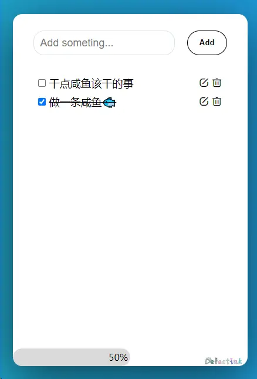
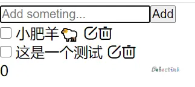
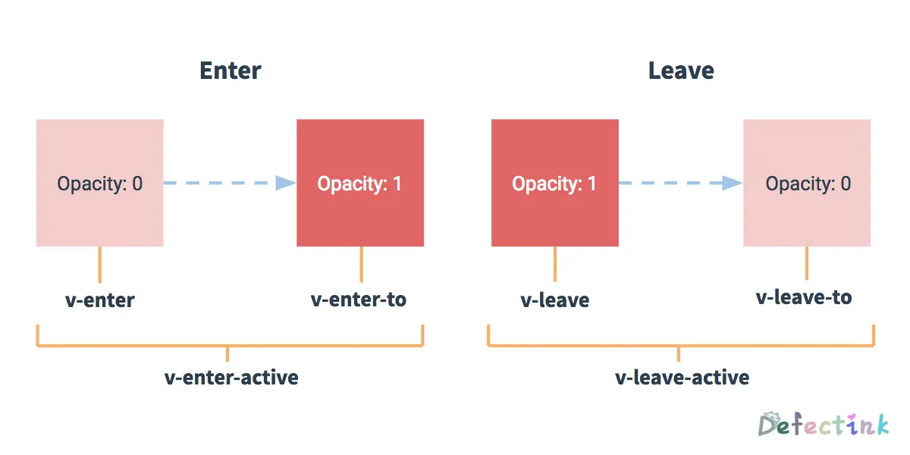

## 为什么要迫害 ToDoList

摸鱼了也挺长时间，是时候该尝试写个小[案例](https://defectingcat.github.io/todolist/)安慰下自己了。



## 组件划分

对于 ToDoList 来说，没有多少组件化的东西。主要还是对一些基本知识的练习。所以我将其划分了一个父组件和两个子组件，他们分别是：用于输入的 Button 和用于展示数据 List。

两个子组件分别对存在于父组件内保存的列表进行增删改的操作。

## 整体功能

目录结构：

```
$ tree -l 4 --ignore 'node_modules'
└── src
   ├── App.vue
   ├── assets
   |  ├── css
   |  |  └── base.css
   |  └── logo.png
   ├── components
   |  ├── common
   |  |  ├── InputButton.vue
   |  |  └── Lists.vue
   |  └── content
   |     └── MainTab.vue
   └── main.js
```

MainTab 作为两个子组件 InputButton 和 Lists 的父组件：

```html
<div class="main-tab">
  <InputButton @addMsg="addMsg" />
  <Lists :lists="lists" @removeItem="removeItem" @editMsg="editMsg" />
</div>
```

### 添加数据

InputButton 在 DOM 上添加一个 Input 与 Button 按钮，负责向父组件的 data 添加数据。在 InputButton 内：

```html
<div>
  <input type="text" v-model="msg" @keyup.enter="emitMsg" />
  <button @click="emitMsg">+</button>
</div>
```

先使用`v-model`将其输入的数据双向绑定到子组件内的一个变量，然后再在按钮上绑定对应的方法将其发送给父组件。

```js
export default {
  data() {
    return {
      msg: ''
    };
  },
  methods: {
    emitMsg() {
      this.$emit('addMsg', this.msg);
      this.msg = '';
    }
  }
};
```

父组件这边使用一个数组来保存数据：

```
[{"id":1,"msg":"这是一个添加测试"},{"id":0,"msg":"这是一个测试"}]
```

id 主要用于给`v-for`做`key`绑定用，在父组件内添加时，按照`{"id":1,"msg":"这是一个添加测试"}`的对象格式来添加即可，值得注意的就是 id 需要递增。

### 展示数据

Lists 组件通过接受父组件传递的 props 来展示数据。通过一个简单的 `v-for`循环来遍历所有数据：

```html
<li v-for="(item, i) in lists" :key="item.id" :id="item.id">
    <span v-show="isEdit != item.id">
      {{ item.msg }}
    </span>
    <button @click="editItem(i, item.id)">编辑</button>
    <button @click="removeItem(i)">删除</button>
  </li>
</ul>
```

目前的 id 用来绑定 key

### 操作数据

在 Lists 组件内还需要实现删除某一项和编辑某一项的功能，由于数据都保存在父组件，所有在 Lists 内所有操作都通过`$emit`将事件发射出去。

```js
methods: {
  removeItem(i) {
    this.$emit('removeItem', i);
  },
  editItem(i, id) {
    this.isEdit = id;
    this.editedMsg = this.lists[i].msg;
  },
  editMsg(i) {
    this.$emit('editMsg', i, this.editedMsg);
    this.isEdit = -1;
  }
}
```

`removeItem(i)`是一个简单的删除当前项的方法，它通过传递 lists 的下标来确定当前项。在父组件中通过数组方法`splice()`来删除当前项：

```js
    removeItem(i) {
      this.lists.splice(i, 1);
    },
```

较为复杂的是编辑当前项的文字，首先需要解决的就是隐藏当前的文字，显示出一个`<input>`框。

```html
<input
  type="text"
  v-show="isEdit == item.id"
  v-model="editedMsg"
  @keyup.enter="editMsg(i)"
  :key="item.id"
  @blur="editMsg(i)"
/>
<span v-show="isEdit != item.id">
  {{ item.msg }}
</span>
```

第一个想法就是通过`v-show`来判断是否显示，这里相比使用`v-if`要好点，因为这里需要来回切换。而简单的通过`true`与`false`来判断的条件是不够的，当一个添加满足了，所有的`<input>`框都会被显示出来，最终导致数据混乱。

这里使用一个经典的方法，以前做 tab 切换的选项卡的时候用到过。通过给`<li>`标签添加一个 ID，并保存当前数据内的 id 来判断选中的哪一个`<li>`标签。

```js
data() {
  return {
    isEdit: -1,
    editedMsg: ''
  };
},
editItem(i, id) {
this.isEdit = id;
this.editedMsg = this.lists[i].msg;
},
```

然后通过`v-model`来绑定已经有的数据，再编辑完之后，发送一个事件到父组件，并传递修改的数据，在父组件内完成修改。现在使用`$emit`传递多个参数时可以直接在后面追加参数，在父组件中可以接受到多个参数。

并且在事件发送后就表示编辑结束，需要将用于判断`v-show`的值`isEdit: -1`修改为默认状态。

```js
editMsg(i) {
  this.$emit('editMsg', i, this.editedMsg);
  this.isEdit = -1;
}
```

父组件内接受到下标和数据中可以轻松实现修改：

```js
editMsg(i, message) {
  this.lists[i].msg = message;
}
```

`$emit`方法发送事件时可以传递多个参数，现在的版本支持多个参数分开传递，而不是对象的方式存储多个参数。在父组件中可以接受到多个参数。

### Done！

既然是 Todolist，那么少不了的必然是完成项目。这里用的是一个 checkbox 的`<input>`来做完成的勾选框。所以 List 组件内的结构也需要稍微变动下：

```html
<input
  type="checkbox"
  :name="item.id"
  :id="item.id"
  :key="item.id"
  @change="doneItem(i)"
/>
<label :for="item.id">
  <span
    v-show="isEdit != item.id"
    :class="{ done: item.done }"
    @dblclick="editItem(i, item.id)"
    class="message"
  >
    {{ item.msg }}
  </span>
</label>
```

通知父组件修改数据的方法还是同样的简单，监听`@change`属性，当 checkbox 被勾选时，发送一个下标给父组件用于定位当前的数据即可。

```js
doneItem(i) {
  this.$emit('doneItem', i);
}
```

这里给 lists 数组内的对象额外增加了一个`done`属性，默认值为`false`，它现在类似于这样`{ id: this.id, msg: msg, done: false }`。

在父组件中接受到下标时，定位到指定的属性中，将`done`属性修改为`true`则为项目完成。

```js
doneItem(i) {
  this.lists[i].done
    ? (this.lists[i].done = false)
    : (this.lists[i].done = true);
}
```

自然完成了一个项目后，需要将其使用~~删除线~~进行标记。这里能够轻松的拿到 boolean 值的数据，配合`v-bind`一个 class 即可实现样式的切换。

```html
:class="{ done: item.done }"
```

```css
.done {
  text-decoration: line-through;
}
```

## 美化

基本功能已经完成的差不多了，但是它还缺少一样灵魂，那就是 CSS。现在的样子惨目忍睹



本🐟 CSS 比较差，所以在添加样式上花了不少的时间。不过期间也学习到了一些东西，所以也所了一些记录。

### scoped 继承

在父组件中`<style>`添加`scoped`属性后，因为子组件的根组件会被渲染到父组件内，所以随机添加的 Attribute 会被继承的添加到子组件渲染后**根**的标签上。


### 基本样式

样式的主要思路是：将父组件`fixed`到中央，其中两个子组件通过父组件上的`flex`定位，使用`align-items: center;`实现垂直居中。组件内的垂直居中也是使用同样的方法实现的。

### 进度条

已标记为完成的项目除以总项目再乘以 100% 就是完成进度了，既然现在可以轻松绑定到 style，那么根据完成的进度就可以轻松绑定其宽度`:style="{ width: process }"`。配合上 500ms 的 transition，一个简易的进度条就做好了🎈

首先是使用一个 computed 来计算完成的百分比：

```js
computed: {
  process() {
    let doneItem = [];
    let result = 0;
    let len = this.lists.length;
    for (let i of this.lists) {
      if (i.done) {
        doneItem.push(i);
      }
    }
    result = (doneItem.length / len) * 100;
    if (Math.floor(result)) {
      return `${Math.floor(result)}%`;
    } else {
      return 0;
    }
  }
}
```

然后就是创建一个用于显示的标签：

```html
<div class="processed" :style="{ width: process }">
```

## 动画

Vue 提供了 transition 的封装组件，可以为我们的元素过渡添加优美的动画。



在本次的案例中，使用`<transition-group>`可以为列表添加一个过渡。

```html
<transition-group name="list" tag="ul">
  <li>...</li>
<transition>
```

`enter`和`leave-to`分别是进入和离开时的过渡：

```css
.list-enter {
  opacity: 0;
  transform: translateY(-30px);
}
.list-leave-to {
  opacity: 0;
  transform: translateX(30px);
}
```

我们可以只在进入或离开时添加过渡动画:

```css
.list-enter-active,
.list-leave-active {
  transition: all 500ms ease;
}
```

但是这样还不够，这时只是被添加的那一个元素有了过渡动画，而其他元素都是“闪现”到其他位置的。Vue 使用了一个叫 FLIP 简单的动画队列使用 `transforms`将元素从之前的位置平滑过渡新的位置。

这时不需要单独的设置`.list-enter-active, .list-leave-active`的变换效果了，可以将`li`添加一个` transition: all 500ms ease;`所有变换的效果。

并且，在删除元素时，需要在`.list-leave-active`上添加`position: absolute`才能触发剩下元素的`v-move`属性。

```css
.list-leave-active {
  /* 脱离文档才能触发v-move */
  position: absolute;
}
```

这样在添加新数据时看上去就不再那么突兀了。