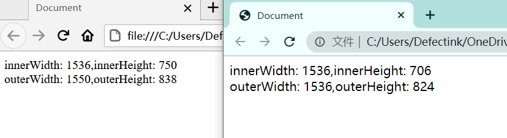

ECMAScript才是JavaScript的核心，在浏览器中，BOM无疑才是真正的核心（浏览器对象模型：BrowerObjectModel)。多年来，缺少事实上的规范导致BOM既有意思又有问题，因为浏览器提供商会按照各自的想法去随意拓展它。于是，浏览器之间共有的对象就成为了事实上的标准。

## window对象

BOM的核心对象是window，它表示浏览器的一个实例。在浏览器中，window对象有双重角色，它既是通过JavaScript访问浏览器的一个接口，又是ECMAScript规定的Global对象。

### 全局作用域

由于window在浏览器环境中扮演着Global对象，所以在全局作用域中声明的变量、函数都会变成window对象的属性和方法。（拥有块级作用域的声明则不会）

```js
var age = 18;
function sayAge() {
    console.log(this.age);
}
window.age;
sayAge();
window.sayAge();
```

虽然使用`var`声明的全局变量会成为window的属性，但是经过声明的变量是无法使用delete操作符删除的，而在window对象上直接定义的属性是可以删除的。

```js
let test = 123;
delete test; // false;

window.xfy = 'xfy';
delete window.xfy; // true;
```

通过`var`声明的变量的属性有一个名为'configurable'的特性。这个特性的值被设置为`false`，并且无法更改。

> IE8以及更早的版本在遇到使用delete删除window属性的时候都会抛出错误。

尝试未经声明的变量会抛出错误，但是可以通过查询window对象知道由`var`声明的变量是否存在；

```js
let t = test; // test id not defined

let t = window.test // 不会抛出错误，因为这是一次属性查询
```

### 窗口关系及框架

如果页面包含框架，则每个框架都有自己的window对象，并且保存在frames集合中。在frames集合中，可以通过数值索引（从0开始，从左至右，从上到下）或者框架名称来访问相应的window对象。每个window对象都有一个name属性，其中包含框架名称。

```html
    <frameset rows="160,*">
        <frame src="frame1.html" name="topFrame">
            <frameset cols="50%,50%">
                <frame src="frame2.html" name="leftFrame">
                <frame src="frame3.html" name="rightFrame">
            </frameset>
    </frameset>
```

上述代码的框架集看上去像这样，对于引用框架可以使用如下方法：

```js
window.frames[0] // 引用第一个
window.frames["rightFrame"] // 引用指定name的
top.frames[0]   // 使用top引用
top.frames["topFrame"]  // 使用top引用
```

<escape> 
<table style="text-align: left">    
  <tr>
  <td colspan="2">
window.frames[0]<br/>
window.frames["topFrame"]<br/>
top.frames[0]<br/>
top.frames["topFrame"]<br/>
frames[0]<br/>
frames["topFrame"]<br/>
</td>
</tr>
  <tr>
  <td>
window.frames[1]<br/>
window.frames["leftFrame"]<br/>
top.frames[1]<br/>
top.frames["leftFrame"]<br/>
frames[1]<br/>
frames["leftFrame"]<br/>
  </td>
  <td>
window.frames[2]<br/>
window.frames["rightFrame"]<br/>
top.frames[2]<br/>
top.frames["rightFrame"]<br/>
frames[2]<br/>
frames["rightFrame"]<br/>
  </td>
  </tr>
</table>   
</escape>

使用window的属性frames可以方便的去引用指定的框架，不过使用top将更好。top对象始终执行最外层的框架，也就是浏览器窗口。使用它类似于使用绝对路径。而window是相对的，指的都是那个框架的特定实例，而非最高层框架。

与top相对的是parent。parent始终指向当前框架的直接上层框架。在某些情况下，parent等于top；在没有框架的情况下parent一定等于top（都等于window）。

```html
<frameset rows="100,*">
    <frame src="frame.htm" name="topFrame">
    <frameset cols="50%,50%">
        <frame src="anotherframe.htm" name="leftFrame">
        <frame src="anotherframeset.htm" name="rightFrame">
    </frameset>
</frameset>
```

在这个例子里，在rightFrame中又嵌入了另外两个frame，分别叫redFrame和blueFrame。

```html
<frameset cols="50%,50%">
    <frame src="red.htm" name="redFrame">
    <frame src="blue.htm" name="blueFrame">
</frameset>
```

当浏览器加载完第一个框架集以后，会继续将第二个框架集加载到rightFrame中。如果代码位于redFrame或blueFrame中，那么parent就等于rightFrame。如果代码位于topFrame中，那么parent就等于top，因为topFrame的直接上层就是最外层的框架。

除非最高层窗口用`window.open()`打开，否则其window对象的name属性不会包含值。

与框架有关的最后一个对象时self，它始终指向window。实际上，self和window对象可以互换使用。引入self对象的目的只是为了与top和parent对象对应起来，因此它不格外包含其他值。

所有的这些对象都是window的属性，都可以通过`window.parent`、`window.top`等形式来访问。同时也意味着可以将不同层级的window对象连缀起来，例如`window.parent.parent.frames[0]`。

> 在使用框架的情况下，浏览器中会存在多个Global对象。在每个框架中定义的全局变量会自动成为框架中window对象的属性。由于每个window对象都包含类型的构造函数，因此每个框架都有一套自己的构造函数，这些构造函数一一对应，但并不相等。例如，`top.Object`并不等于`top.frames[0].Object`。这个问题会影响到对跨框架传递的对象使用instanceof操作符。

### 窗口位置

用来确定和修改window对象位置的属性和方法有很多。IE、Safari、Opera和Chrome都提供了`screenLeft`和`screenTop`来确定相对于屏幕左边和上边的位置。Firefox则在`screenX`和`screenY`属性中提供相同的窗口位置信息。

目前Chrome和Firefox均支持这两个属性。不过难免会出现只支持其中一个的情况，可以使用个简单的判断语句来进行判断。

```js
let leftPos = (typeof window.screenLeft == 'number') ? window.screenLeft : window.screenX;

let topPos = (typeof window.screenTop == 'number') ? window.screenTop : window.screenY;
```

各家浏览器对BOM多数没有统一的标准，最后导致的结果就是确定窗口位置不一，不同的浏览器给出的相对位置都不太一样。

最总结果，就是无法在跨浏览器的条件下去的窗口左边和上边的精确位置。不过，使用`moveTo()`和`moveBy()`倒是有可能将窗口精确的移动到一个新的位置。

`moveTo()`接收的是新位置的x和y坐标的值，而`moveBy()`接收的是在水平和垂直方向移动的像素数。

```js
// 移动窗口到屏幕左上角
window.moveTo(0, 0);

// 向下移动100像素
window.moveBy(0 ,100);

window.moveTo(200, 200);
window.moveBy(-50, 0);
```

不过这几种方法在目前的浏览器里几乎都是被禁用的。另外这两个方法都不适用于框架，只能对最外层的window对象使用。

### 窗口大小

同样的原因，跨浏览器确定窗口大小可不是一件简单的事情。各个主流浏览器均提供了4个属性：innerWidth、innerHeight、outerWidth和outerHeight。不同的浏览器对其返回的值，以及相对的计算位置都不同。所以这里就不详记了。

Chrome与Firefox在1080p分辨率下输出的inner和outer的值：



另外一些浏览器在`document.documentElement.clientWidth`和`document.documentElement.clientHeight`保存了页面视口的信息。在IE6中，这些属性必须是在标准模式下才有效；如果是混杂模式，就必须通过`document.body`中的`clientWidth`和`clientHeight`取得相同的信息。

> 远离IE有益身体健康。

虽然最终无法确定浏览器本身的大小，但是可以取得页面视口的大小。

```js
let pageWidth = window.innerWdith;
let pageHeight = window.innerHeight;

if (typeof pageWidth != 'number') {
    if (document.compatMode == "CSS1Compat"){
        pageWidth = document.documentElement.clientWidth;
        pageHeight = document.documentElement.clientHeight;
    } else {
        pageWidth = document.body.clientWidth;
        pageHeight = document.body.clientHeight;
    }
}
```

> 对于移动设备，以及移动设备的IE浏览器情况则更加的有趣。移动开发咨询师Peter-Paul Koch记录他的研究：[https://quirksmode.org/mobile/viewports2.html](https://quirksmode.org/mobile/viewports2.html)

另外，使用`resizeTo()`和`resizeBy()`方法可调整浏览器窗口的大小。这两个方法都接收两个参数，其中To接收浏览器窗口的新高度和新宽度，By接收新值与旧值之差。

```js
// 调整到100*100
window.resizeTo(100, 100);

// 调整到200*150
window.resizeBy(100, 50);

// 300*300
window.resizeTo(300, 300);
```

现代的浏览器几乎都是禁用这两个方法的，同样，这两个方法也不适用于框架，只能对最外层的window对象使用。

### 导航和打开窗口

`window.open()`方法既可以导航到一个特定的URL，也可以打开一个新的浏览器窗口。这个方法可以接收4个参数：要加载的URL、窗口目标、一个特性字符串以及一个表示新页面是否取代浏览器历史记录中当前加载页面的布尔值。

如果第二个参数为当前已有的窗口或框架的名称，那么就会在具有该名称的窗口或框架打开参数指定的URL。

```js
window.open('https://www.defectink.com', 'topFrame');
// 同等于：<a href="https://www.defectink.com" target="topFrame"></a>
```

