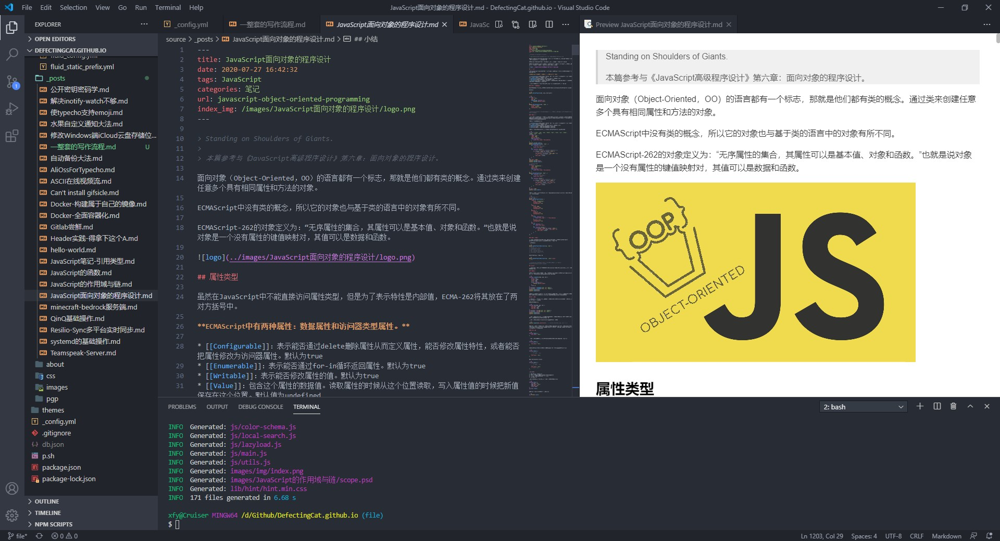

出于对速度无理的追求，最终还是放弃了使用动态内容。转战静态blog。以前也稍微尝试过hexo，所以决定还是主要为hexo为主了。

在之前试过的typecho、wordpress之中，越是臃肿复杂的程序，1M的带宽越是不够。再详细的折腾了hexo之后，发现了最佳的解决方案。

在早期的一些常识之后，我也学会了很多。在刚入坑hexo的时候是盯上了阿里云的ECS+OSS和CDN的。虽然部署还是比较麻烦，但起码已经有了一套比较完善的流程了。


## VS Code - 不只是代码

软软的Visual Studio Code是一款很棒的编辑器。很早之前我就用它来尝试写一些东西，但只是用作于编辑器，主要功能就是代码补全和着色。

在早期的时候我比较喜欢用Typora来写作，它的风格我很喜欢，还能换主题，整体看上去很漂亮。但最近发现了一些比较难以容忍的毛病；就是当它的一篇文章字符超过10K的时候，性能略差一点的电脑就会很卡，打字都不出来的那种。我猜想可能和它是electron写的有关系。

就在我还没放弃它的时候，我无意中找到了VScode的Markdown插件。反正装插件也不是很麻烦是事情，于是就是尝试了一下。

没想到一时间我便爱上了它，虽然整体界面没有以前那么整洁、那么清新脱俗。但整体给人给感觉没有非常杂乱，反而看上去倒有点像剪辑软件？

除了外观从清新脱俗到繁重了一点，余下就只剩方便了。对于我这种才转到hexo的写作半吊子，一直很想找个与hexo契合度高的写作姿势。之前需要在Typora中写完，然后再将文章和单独的图片文件夹复制到hexo的`souce/_post`目录。像我这种半年产出一篇文章的还好，要是天天写，那样会被麻烦死。况且，如果有某一篇文章出了点小差错需要改。那就要同时动两个md文件和两组图片文件夹，对着资源管理翻来覆去的找，极为麻烦！🌚



## 压缩插件

我用的是[Hexo-all-minifier](https://github.com/chenzhutian/hexo-all-minifier)，可以静态文件以及图片。还可以分别设置压缩等级来权衡质量与大小。

```bash
npm install hexo-all-minifier --save
```


## Git加速

使用Linux主机或者在Windows中使用git bash时，修改（新建）在用户目录下的`~/.ssh/config`文件，新加如下内容。

```bash
host github.com
HostName github.com
PreferredAuthentications publickey
IdentityFile ~/.ssh/id_rsa
ProxyCommand connect -S 127.0.0.1:1080 %h %p
```

macos的connect可以用brew安装，而windows的git bash中已有：

```bash
brew install connect
```

对于Ubuntu：

```bash
apt-get install connect-proxy
```

某些发行版可能没有connect软件包，这个地址下载源码编译一下就好了。

```
https://bitbucket.org/gotoh/connect/src/default/
```

对于http：

```bash
git config --global http.proxy "socks5://127.0.0.1:1080"
git config --global https.proxy "socks5://127.0.0.1:1080"
```

node的淘宝源

```bash
npm config set registry https://registry.npm.taobao.org
```

```bash
npm config set registry https://registry.npmjs.org
```

## Visual Studio Code

关于vs code的一些小设置

### Quick Suggestions

Editor > Suggest: Snippets Prevent Quick Suggestions

在代码段中依然显示建议。

### 自定义Suggestions


可以自定义快捷键。

* 挂载oss到ecs

* [ossfs](https://help.aliyun.com/document_detail/32196.html?spm=a2c4g.11186623.6.749.72b73adfsKCqTT)
* [hexo-douban](https://github.com/mythsman/hexo-douban)

```bash
git config --global user.name "github's Name"
git config --global user.email "github@xx.com"
git config --list
git config --global --unset user.name
git config --global user.signingkey E011C31AC42BEB98
git config --global commit.gpgsign true
gpg --edit-key
gpg --list-secret-keys --keyid-format LONG
```

## 早期计划

### 内容分发网络

之前就有在使用cdn来加速图片的访问，效果也还是不错的。但是整体blog的内容还都是有1M服务器上的php生成的。所以就算异地图片加载速度再快，终端也需要连接到身在华南的服务器。无论是人多还是人少，速度总是不理想。

最后打算使用纯静态的blog，直接部署到cdn上，速度肯定是无可比拟的。但是还是有一点弊端的，例如cdn节点可能更新不及时等问题。

### 解决方案

正好手头有个1M出口的ECS，嫌它太慢。而它的真正作用在于和阿里云的oss进行通信，因为走的是阿里云的内网，所以通过ECS上传文件到oss是不需要收流量费用的。而ECS仅仅只是出口1M而已，入口是不限速的。如果需要最大化节约的上传文件到oss，可以通过ECS传。

阿里云的oss在linux上有个可以连接oss的软件，但是那个操作并不是我想需要的。好在阿里云还有一款[ossfs](https://help.aliyun.com/document_detail/32196.html?spm=a2c4g.11186623.6.749.72b73adfsKCqTT)软件。它可以将对象存储OSS的存储空间（Bucket）挂载到本地文件系统中，能够像操作本地文件一样操作OSS的对象（Object），实现数据的共享。

这对于写静态blog来说实在是太方便了，只需要将Bucket挂载到本地文件夹，就像挂载磁盘那样操作。随后就可以不用流量的将静态文件上传到oss。

开启OSS的静态网站托管，将hexo生成的静态blog都放到挂载的目录下即可。非常的方便，文章内的图片也可以使用相对路径，而不需要一张一张的插入外链那么麻烦了。

需要注意一点的是：使用OSS默认域名访问时，Response Header中会自动加上` Content-Disposition:'attachment=filename;'`。即从浏览器访问网页类型文件时，不会显示文件内容，而是以附件形式进行下载。也就是说需要绑定自己的域名才能静态托管。

### 多重备份

这种方案解决的好处就是，可以在多个地方实现多重的数据备份。且不需要在备份数据库了。

* Github一份备份
* CDN一份备份
* ECS一份备份
* 自己的电脑还可以有多份备份

一步直接实现异地多备份。

### OSSFS

目前有多个发行版的安装包：

| Linux发行版        | 下载                                                         |
| :----------------- | :----------------------------------------------------------- |
| Ubuntu 18.04 (x64) | [ossfs_1.80.6_ubuntu18.04_amd64.deb](http://gosspublic.alicdn.com/ossfs/ossfs_1.80.6_ubuntu18.04_amd64.deb) |
| Ubuntu 16.04 (x64) | [ossfs_1.80.6_ubuntu16.04_amd64.deb](http://gosspublic.alicdn.com/ossfs/ossfs_1.80.6_ubuntu16.04_amd64.deb) |
| Ubuntu 14.04 (x64) | [ossfs_1.80.6_ubuntu14.04_amd64.deb](http://gosspublic.alicdn.com/ossfs/ossfs_1.80.6_ubuntu14.04_amd64.deb) |
| CentOS 7.0 (x64)   | [ossfs_1.80.6_centos7.0_x86_64.rpm](http://gosspublic.alicdn.com/ossfs/ossfs_1.80.6_centos7.0_x86_64.rpm) |
| CentOS 6.5 (x64)   | [ossfs_1.80.6_centos6.5_x86_64.rpm](http://gosspublic.alicdn.com/ossfs/ossfs_1.80.6_centos6.5_x86_64.rpm) |

下载到主机内后，根据不同的发行版进行安装就好了。而对于Ubuntu需要使用gdebi：

```bash
sudo apt-get update
sudo apt-get install gdebi-core
sudo gdebi your_ossfs_package
```

#### 配置账号信息

成功了安装了之后就可以配置oss的账号信息来登陆。使用AccessKeyId/AccessKeySecret来代替账号密码进行访问。如果担心安全问题还可以使用阿里云的子账号只赋予oss的访问权限，来最大程度的保护账户资产。在阿里云的[RAM访问控制](https://ram.console.aliyun.com/overview)中可以进行添加子账户并赋予特定的权限。


AccessKeyId/AccessKeySecret信息存放在`/etc/passwd-ossfs`文件中。并且文件的权限必须正确设置，建议设为640。

格式为：`bucket名:AccessKeyId:AccessKeySecret`

```bash
echo my-bucket:my-access-key-id:my-access-key-secret > /etc/passwd-ossfs
chmod 640 /etc/passwd-ossfs
```

如果需要配置多个账号或者多个bucket，可以直接将账号信息写在后面，ossfs会根据挂载的存储空间名称匹配到正确的账号上。

```bash
echo my-second-bucket:my-access-key-id:my-access-key-secret >> /etc/passwd-ossfs
```

#### 挂载到指定目录

账号信息填写的非常简单，写到指定文件里就可以了。填完之后就可以将oss挂载到本地的指定目录上。

格式为：`ossfs bucket名 本地挂载点 -ourl=oss url`

```
ossfs my-bucket my-mount-point -ourl=my-oss-endpoint
```

如果正好使用的是阿里云的ECS机器，可以走oss的内网，在上传文件时就不会产生多余的流量费用。通常oss的内网域名包含internal。例如：

```
oss-cn-beijing-internal.aliyuncs.com
```

只需要将近4条左右的命令就可以将oss成功挂载到本地上，就如同一个文件夹。

#### 开机自动挂载

和开机自动挂载分区一样，Ubuntu需要在`/etc/fstab`中进行操作。

```bash
ossfs#bucket_name mount_point fuse _netdev,url=url,allow_other 0 0
```

对应的填入了信息之后，可以使用`mount -a`进行测试。如果没有任何报错，即代表成功。

### 阿里云子目录

阿里云oss的默认配置是不会去访问子目录下的首页的，子目录下的`index.html`必须访问全部的静态链接。否则会跳转回主页的`index.html`。

网上的大多数解决办法就是修改hexo的配置，把所有的子目录的绝对路径都生成出来。这是一种解决办法，但不能从根源上解决所有问题。

并且阿里云也早就支持了子目录首页了。只需要简单开一下就能解决这个问题。


