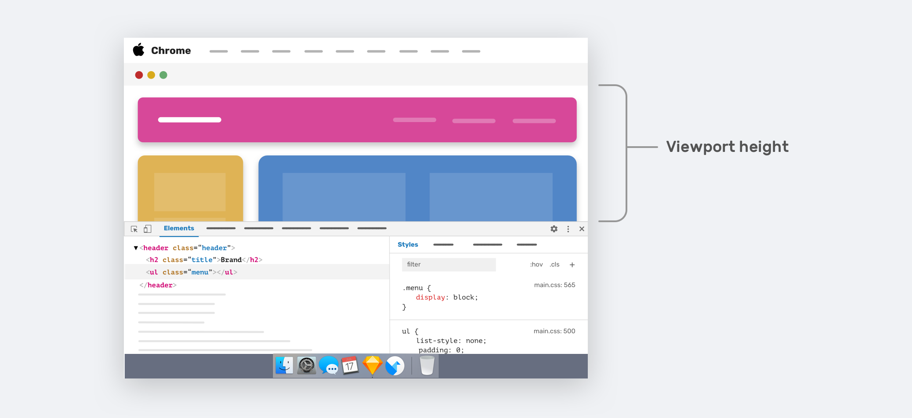

在移动端领域，由于屏幕分辨率，比例等，通常与桌面端都是不一致的。要想我们的网页能够正确的显示在各个终端上，我们就需要响应式的 Web 设计来设计我们的网页。

响应式通常有很多解决方案，如：vw、vh 布局，rem 布局，媒体查询等。这些都是基于 CSS 来根据特定的条件格式化文档。

现代的`<meta>`元素可以指定其`name`为`viewport`，用来规定浏览器的可视区域大小。从而在移动设备上获得更好的浏览体验。

## 一些基本的单位

在了解 viewport 之前，需要先了解一些基本单位。以及常见的分辨率与 CSS 单位值`px`的一些不同。

### 像素

像素（pixel），是现代显示设备为影像显示的基本单位。pix 是英语单词 picture 的常用简写，加上英语单词“元素” element ，就得到 pixel ，故“像素”表示“画像元素”之意。

一个显示器显示的画面若干个像素组成。像素只是一个通用名词，不代表任何宽高等。显示器通常使用的是方形像素。

常说的分辨率又称为设备像素，例如一个常见的横向显示器的分辨率为 1920*1080，指的是横向 1920 个像素，纵向 1080 个像素。

Wiki：[像素](https://zh.wikipedia.org/wiki/%E5%83%8F%E7%B4%A0)。

### 设备独立像素

设备独立像素（Device Independent Pixels），独立于设备的用于逻辑上衡量长度的单位，由底层系统的程序使用，会由相关系统转换为物理像素。

> 为什么会需要设备独立像素？举个例子：iPhone 3GS 和 iPhone 4/4s 的尺寸都是 3.5 寸，但 iPhone 3GS 的分辨率是 320x480，iPhone 4/4s 的分辨率是 640x960，这也就是意味着同样长度的屏幕，iPhone 3GS 有 320 个物理像素，iPhone 4/4s 有 640 个物理像素。
> 
> 如果我们按照真实的物理像素进行布局，比如说我们按照 320 物理像素进行布局，到了 640 物理像素的手机上就会有一半的空白，为了避免这种问题，就产生了虚拟像素单位。我们统一 iPhone 3GS 和 iPhone 4/4s 都是 320 个虚拟像素，只是在 iPhone 3GS 上，最终 1 个虚拟像素换算成 1 个物理像素，在 iphone 4s 中，1 个虚拟像素最终换算成 2 个物理像素。
> 
> 链接：https://www.zhihu.com/question/26653449/answer/541637971

在 CSS 领域，我们使用的单位`px`像素（未缩放情况下），指的就是设备独立像素。所以想要画一个横向铺满一个 iPhone X 的盒子，宽度可以指定为`width: 375px`。

> iPhone X 的设备独立像素为 375*812

### PPI

PPI（pic per inch）：每英寸的物理像素数。也就是每英寸对角线上所拥有的像素（pixel）数目。

PPI 的计算很简单，长跟高的像素数计算出对角方向的像素数（直角三角形），然后再用对角的像素数除以屏幕尺寸。得到的就是 PPI。

其公式为：

$$\sqrt(W^2 + H^2) / Z$$

> （W：宽度像素数；H：宽度像素数；Z：屏幕大小）

讲人话就是：

```js
const ppi = Math.sqrt(Math.pow(width, 2) + Math.pow(height, 2)) / screenSize
```

举个例子，iPhone X 的分辨率为 2436 x 1125 像素，屏幕为 5.8 英寸。所以它的 PPI 就是 463[^1] ：

```js
const ppi = Math.sqrt(Math.pow(1125, 2) + Math.pow(2436, 2)) / 5.8
//  462.62579033027964
```

## viewport

了解完基本像素之后就可以来深入研究 viewport 了。

首先，浏览器的可视区域，或者叫视口（viewport）。是浏览器呈现 web 可视内容的界面。也就是这样的一个区域：



> viewport 不包含浏览器滚动条。

默认情况下（未使用 CSS 控制），当网页内容超出视口区域时，浏览器会为我们添加滚动条，以便通过滚动的方式浏览器超出视口的内容。

但在窄屏（Narrow Screen）上，通常是移动设备。渲染在视口中的页面通常比屏幕要宽，然后缩放页面以便于一次可以全部浏览。

举个例子：现在有个移动设备宽度为 640px（设备独立像素），但页面在虚拟视口中的宽度为 980px。结果页面就会被缩放到 640px 以适合移动设备的宽度。这样用户需要看清字体就需要手动进行放大页面。

### meta

meta viewport 就是为了让那些没有做移动端适配的网站，在无需用户手动缩放的情况下就能看清字体。

苹果在早期在 safari 上介绍了"viewport meta tag"。使开发者能够控制 viewport 的尺寸以及缩放。现在许多移动端浏览器也都支持这个属性。虽然还不是 web 标准之一。[水果的文档](https://developer.apple.com/library/archive/documentation/AppleApplications/Reference/SafariWebContent/UsingtheViewport/UsingtheViewport.html) 给了详细的实例。

## meta 标签用法

最典型的用法

```html
<meta name="viewport" content="width=device-width, initial-scale=1.0">
```

## 参考

* [像素](https://zh.wikipedia.org/wiki/%E5%83%8F%E7%B4%A0)
* [什么叫物理像素值，什么叫设备独立像素值（dips）?](https://www.zhihu.com/question/26653449)
* [iPhone X - 技术规格](https://support.apple.com/kb/SP770?locale=zh_CN)

[^1]: 苹果官网标注其 PPI 为 458。[iPhone X - 技术规格](https://support.apple.com/kb/SP770?locale=zh_CN)