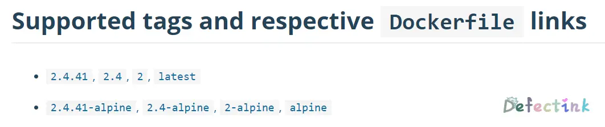

自上篇[Docker - 构建属于自己的镜像](https://www.defectink.com/defect/docker-build-own-images.html)以来，发现Docker非常的有意思。主要是非常的方便，并且在可以跨平台的情况下部署环境对于以后迁移也是一件极其有利的事。研究了Dockerfile的编写以及实践。一些基础的实践之后，对于Docker的工作方式以及操作命令都有了一些熟悉。也逐渐了发现了它的一些优点。

翻开自己的旧机器里的多种环境交杂在一起的配置，时间长了连配置文件在哪都找不到了。管理起来比较复杂。那些服务器的管理面板并不是很喜欢，而且相对于Docker来说，管理面板只是简化了部署的操作，并没有达到方便管理的目的。到最后可能它的软件目录，镜像源都是按照它的想法去放的。对于自己并没有完全的掌控。当然不能完全拿管理面板与Docker来相比，二者完全是两种技术。只是相较于方便管理这方面来对比一下。

而最近研究的Docker，无疑是最满意的了。在保持宿主机不乱的情况下，可以完全的掌控自己的运行环境。于是就有了将自己目前跑了挺长时间的一套blog环境都迁移到Docker上。对于以后若是迁移机器也会更加的方便。

## 涉及到的操作

* Dockerfile
* docker-compose.yml
* apache virtualhost
* php-fpm
* http2
* apache https
* certbot with docker
* apache proxy

## 目前环境

先来简单看下当前跑在机器上的环境：

基本的LAMP环境，加上一些自定义的应用，与一个服务器监控软件。其中apache有多个虚拟主机，全部都使用了https。

咋一看是一套很简单的环境，其中apache配置稍多一点。但是实际在迁移到Docker的操作起来还是比较复杂的。并且为了镜像的最小化，apache基于的镜像都是alpine。配置与常用的Ubuntu略有不同。

## 容器化

### 思路

将多个运行LAMP分别拆分出三个运行环境，使用docker-compose来捆绑运行。

目录树

```
.
├── apache
│   ├── Dockerfile
│   ├── httpd.conf
│   └── sites
│       ├── 000-default-ssl.conf
│       └── 000-default.conf
├── docker-compose.yml
├── mysql
│   └── backup
├── php
│   └── Dockerfile
└── www
    └── html
        └── index.php
```

首先创建一个用于存放整个运行环境的`Docker`父文件夹。然后根据不同的镜像来划分不同的子文件夹，子文件夹内存放的就是各个镜像的`Dockerfile`与配置文件等。将docker-compose.yml存放与父目录下。

apache与php-fpm通信借助Docker的网络，实现内部的通信。

## Apahce

在当前的apache目录下，主要文件夹的划分为`Dockerfile`、`httpd.conf`和sites文件夹。

### Dockerfile

虽然httpd有了一个单独的镜像，但是还是需要使用Dockerfile来对其进行自定义配置。为了尽量减小镜像的大小。这里使用基于alpine的apache。

在Docker hub中的[httpd](https://hub.docker.com/_/httpd)当前支持的tag：



整个Dockerfile：

```dockerfile
FROM httpd:alpine
RUN sed -i 's/dl-cdn.alpinelinux.org/mirrors.aliyun.com/g' /etc/apk/repositories \
	&& apk update \
        && apk upgrade
COPY sites/ /usr/local/apache2/conf/sites/
COPY httpd.conf /usr/local/apache2/conf/httpd.conf
```

所以`FROM`里使用的就是带alpine的tag了。我还尝试过测试使用基于alpine的空载运行apache大概节约了1MB的内存。

```
176d166ee52a        testa               0.00%             4.484MiB / 3.607GiB   0.12%         
3dac39c11385        test                0.00%             5.664MiB / 3.607GiB   0.15%         
```

对于跑在国内的机器上，alpine也有国内的源。并且替换的也很简单，一句话就好了。这样在后续的更新源和安装软件就没有那么苦恼了。

```
sed -i 's/dl-cdn.alpinelinux.org/mirrors.aliyun.com/g' /etc/apk/repositories
```

剩下的`COPY`就是复制自定义的配置文件到容器里去了。

### 配置文件

首先，之前的环境中apache是有多个虚拟主机，并且每个主机都启用了ssl以及一些其他的配置。所以第一步是需要修改容器的配置文件。也就是要先获取默认的配置文件。

优雅的获取apache默认配置文件：

```
docker run --rm httpd:2.4 cat /usr/local/apache2/conf/httpd.conf > httpd.conf
```

默认的ssl配置文件：

```
docker run --rm httpd:2.4 cat /usr/local/apache2/conf/extra/httpd-ssl.conf > ssl.conf
```

容器的配置文件路径：

```
/usr/local/apache2/conf/httpd.conf
```

获取到了默认的配置文件之后，在apache的文件夹内可以先自定义`httpd.conf`。并且尝试启动一次，没用问题后可以继续配置虚拟主机。

由于不同的站点都交给了虚拟主机的配置文件来处理。所以`httpd.conf`主要是负责一些mod的配置，和一些全局的配置了。还有就是将余下的配置文件`Include`进来了。

后期还有需要添加更多的虚拟主机的配置文件，到时候一个一个的`Include`操作太过繁琐。所以创建个专门存放配置文件的文件夹，再在`httpd.conf`里将整个文件夹`Include`进去。这样就最简单的解决了操作繁琐的问题。

创建一个`sites`文件夹用于存放配置文件，`COPY`到容器内相应的目录：

```
COPY sites/ /usr/local/apache2/conf/sites/
```

在`httpd.conf`中相应的引入：

```
Include /usr/local/apache2/conf/sites/*.conf
```

{*}这一操作方法还是学自Ubuntu下的apache，它的配置目录下有两个文件夹`sites-available`和`sites-enabled`。在主要的apache2.conf中引入配置文件。

```http
# Include generic snippets of statements
IncludeOptional conf-enabled/*.conf

# Include the virtual host configurations:
IncludeOptional sites-enabled/*.conf
```

`httpd.conf`中的虚拟主机配置不需要修改了。所有的站点可以都在Include中的配置文件中准备。基本上`httpd.conf`就是为引入配置文件和启用mod所准备的。

### Module

在基于alpine中的apache，所有的mod加载都写在了配置文件`httpd.conf`里。只需要取消注释就可以加载/启用模组了。

这次添加的module：

```
LoadModule deflate_module modules/mod_deflate.so
LoadModule proxy_module modules/mod_proxy.so
LoadModule proxy_connect_module modules/mod_proxy_connect.so
LoadModule proxy_ftp_module modules/mod_proxy_ftp.so
LoadModule proxy_http_module modules/mod_proxy_http.so
LoadModule proxy_fcgi_module modules/mod_proxy_fcgi.so
LoadModule setenvif_module modules/mod_setenvif.so
LoadModule mpm_event_module modules/mod_mpm_event.so
LoadModule http2_module modules/mod_http2.so
LoadModule proxy_http2_module modules/mod_proxy_http2.so
LoadModule ssl_module modules/mod_ssl.so
LoadModule socache_shmcb_module modules/mod_socache_shmcb.so
LoadModule rewrite_module modules/mod_rewrite.so
LoadModule headers_module modules/mod_headers.so
#LoadModule mpm_prefork_module modules/mod_mpm_prefork.so
```

这些mod都是作用于何？

* mod_deflate是一个压缩算法。

* mod_socache_shmcb共享对象缓存提供程序。

* 因为需要配置反代和与php-fpm工作，所以需要启用多个proxy配置文件。

* 因为需要用到http2，所以工作模式得修改为event。同时注释掉默认的工作模式prefork。自然也需要mod_http2

* https是不可或缺的，所以mod_ssl不可缺少。

* 后续的博客需要用到伪静态，mod_rewrite也不可少。

* 在最近也添加了多个header头，需要用到mod_headers。

> info：根据自己需要启用module是一个良好的习惯，过多的module会影响性能。

### 虚拟主机

前面提到，专门创建了一个sites文件夹来存放虚拟主机的配置文件，目前sites文件夹还是空的。既然`httpd.conf`以及准备就绪，那么接下来就是填满sites文件夹了。

在还未添加虚拟主机时，默认的站点配置文件全部都写在`httpd.conf`里。默认的根目录在htdocs。所以在第一次启动测试时，访问的时这里的html文件。

```
DocumentRoot "/usr/local/apache2/htdocs"
```

这里的配置可以不用动，全部操作交给虚拟主机就好。

整个虚拟主机（default.conf）配置文件：

```
<VirtualHost *:80>
ProtocolsHonorOrder On
Protocols h2 h2c
Header set X-Frame-Options "SAMEORIGIN"
Header always set Strict-Transport-Security "max-age=63072000; includeSubdomains;"
Header set Content-Security-Policy "default-src 'self' https://cdn.defectink.com; script-src 'self' 'unsafe-inline' 'unsafe-eval' https://maxcdn.bootstrapcdn.com https://ajax.googleapis.com https://cdn.defectink.com; img-src *; style-src 'self' 'unsafe-inline' https://cdn.defectink.com https://maxcdn.bootstrapcdn.com https://fonts.googleapis.com/; font-src 'self' https://cdn.defectink.com https://fonts.gstatic.com/ https://maxcdn.bootstrapcdn.com; form-action 'self' https://cdn.defectink.com; upgrade-insecure-requests;"
Header set X-Content-Type-Options nosniff
Header always set Referrer-Policy "no-referrer-when-downgrade"
Header always set Feature-Policy "vibrate 'self'; sync-xhr 'self' https://cdn.defectink.com https://www.defectink.com"
    # Proxy .php requests to port 9000 of the php-fpm container
    ProxyPassMatch ^/(.*\.php(/.*)?)$ fcgi://php:9000/var/www/html/$1
    ServerName www.defectink.com
    DocumentRoot /var/www/html/
    <Directory /var/www/html/>
        DirectoryIndex index.php
        Options Indexes FollowSymLinks
        AllowOverride All
        Require all granted
    </Directory>
    # Send apache logs to stdout and stderr
    CustomLog /proc/self/fd/1 common
    ErrorLog /proc/self/fd/2
RewriteEngine on
RewriteCond %{SERVER_NAME} =www.defectink.com
RewriteRule ^ https://%{SERVER_NAME}%{REQUEST_URI} [END,NE,R=permanent]
</VirtualHost>
```

#### 虚拟主机优先级

在apache中，虚拟主机的配置文件是拥有优先级的。优先级的意思就是，当一个域名指向当前机器的ip，而配置文件中没有绑定的ServerName时，默认被引导到的页面。

优先级的顺序是根据虚拟主机的配置文件名来决定的。名称首字母越靠前，优先级越高。使用数字开头将大于子母开头。

> 000-default will be the default, because it goes “numbers, then letters”.

可以使用命令来查看当前的默认站点：

```bash
httpd -S
```

```bash
apache2ctl -S
```

### SSL

这里的ssl配置文件是来自于容器内的默认配置文件，使用上述的方法可以很方便的导出。

整个ssl（default-ssl.conf）配置文件：

```
Listen 443

SSLCipherSuite HIGH:MEDIUM:!MD5:!RC4:!3DES
SSLProxyCipherSuite HIGH:MEDIUM:!MD5:!RC4:!3DES
SSLHonorCipherOrder on 
SSLProtocol all -SSLv3
SSLProxyProtocol all -SSLv3
SSLPassPhraseDialog  builtin
SSLSessionCache        "shmcb:/usr/local/apache2/logs/ssl_scache(512000)"
SSLSessionCacheTimeout  300

<VirtualHost *:443>
ProtocolsHonorOrder On
Protocols h2 h2c
Header set X-Frame-Options "SAMEORIGIN"
Header always set Strict-Transport-Security "max-age=63072000; includeSubdomains;"
Header set Content-Security-Policy "default-src 'self' https://cdn.defectink.com; script-src 'self' 'unsafe-inline' 'unsafe-eval' https://maxcdn.bootstrapcdn.com https://ajax.googleapis.com https://cdn.defectink.com; img-src *; style-src 'self' 'unsafe-inline' https://cdn.defectink.com https://maxcdn.bootstrapcdn.com https://fonts.googleapis.com/; font-src 'self' https://cdn.defectink.com https://fonts.gstatic.com/ https://maxcdn.bootstrapcdn.com; form-action 'self' https://cdn.defectink.com; upgrade-insecure-requests;"
Header set X-Content-Type-Options nosniff
Header always set Referrer-Policy "no-referrer-when-downgrade"
Header always set Feature-Policy "vibrate 'self'; sync-xhr 'self' https://cdn.defectink.com https://www.defectink.com"
# Proxy .php requests to port 9000 of the php-fpm container
ProxyPassMatch ^/(.*\.php(/.*)?)$ fcgi://php:9000/var/www/html/$1
# General setup for the virtual host
DocumentRoot "/var/www/html/"
ServerName www.defectink.com:443
ServerAdmin i@defect.ink
    <Directory /var/www/html/>
        DirectoryIndex index.php
        Options Indexes FollowSymLinks
        AllowOverride All
        Require all granted
    </Directory>
ErrorLog /proc/self/fd/2
TransferLog /proc/self/fd/1

SSLEngine on
SSLCertificateFile "/etc/letsencrypt/live/www.defectink.com/fullchain.pem"
SSLCertificateKeyFile "/etc/letsencrypt/live/www.defectink.com/privkey.pem"
<FilesMatch "\.(cgi|shtml|phtml|php)$">
    SSLOptions +StdEnvVars
</FilesMatch>
<Directory "/usr/local/apache2/cgi-bin">
    SSLOptions +StdEnvVars
</Directory>
BrowserMatch "MSIE [2-5]" \
         nokeepalive ssl-unclean-shutdown \
         downgrade-1.0 force-response-1.0
CustomLog /proc/self/fd/1 \
          "%t %h %{SSL_PROTOCOL}x %{SSL_CIPHER}x \"%r\" %b"

</VirtualHost>                                  
```

这里的主要配置点就在`SSLCertificateFile`和`SSLCertificateKeyFile`。关于配合certbot申请证书，在前一篇水过。有兴趣的小伙伴可以去了解更多。[Docker - 构建属于自己的镜像](https://www.defectink.com/defect/docker-build-own-images.html#menu_index_8)。

值得注意的是，在一个`httpd.conf`文件中只能有一个`Listen 443`字段。而默认的ssl配置文件中就包含一个`Listen 443`字段。当复制多个默认的配置文件时，会导致apache运行错误。因为所有的配置文件都会被引入到`httpd.conf`，而一个apache只能监听一次端口，也就是说只能有一个`Listen 443`在配置文件中。

可以考虑将其写在监听80端口下面：

```
#Listen 12.34.56.78:80
Listen 80
Listen 443
```

### 日志

这里虚拟主机的默认配置时将日志发送到stdout和stderr。可以理解为输出到终端上。

```
    # Send apache logs to stdout and stderr
    CustomLog /proc/self/fd/1 common
    ErrorLog /proc/self/fd/2
```

当然也可以实现日志的持久化保存。将其映射到宿主机的目录下就好了。

```
    CustomLog /var/log/access.log common
    ErrorLog /var/log/error.log
```

## PHP

PHP这里使用fpm，配合docker-compose的内部网络与apache进行通信。

### Dockerfile

```
FROM php:7.4-fpm-alpine
RUN mv "$PHP_INI_DIR/php.ini-production" "$PHP_INI_DIR/php.ini"
COPY php.ini $PHP_INI_DIR/conf.d/
RUN sed -i 's/dl-cdn.alpinelinux.org/mirrors.aliyun.com/g' /etc/apk/repositories \
        && apk update \
        && apk upgrade \
        && docker-php-ext-install mysqli \
        && docker-php-ext-install pdo_mysql
```

### php.ini

优雅的获取容器内的php.ini文件：

```
docker cp somephp:/usr/local/etc/php/ /root
```

修改过后的配置文件可以在Dockerfile中copy，也可以在compose.yml中映射。只要到了宿主机的正确位置就可以生效。

官方的描述是这样的方法：

```dockerfile
RUN mv "$PHP_INI_DIR/php.ini-production" "$PHP_INI_DIR/php.ini"
COPY php.ini $PHP_INI_DIR/conf.d/
```

### 拓展

如果需要安装typecho这样的blog程序的话，再连接sql时需要安装mysql的拓展，写在Dockerfile就好了：

```
docker-php-ext-install pdo_mysql
```

如果还需要其他的拓展的话，还可以在Dockerfile里自定义安装。可以使用`pecl`来安装，然后使用`docker-php-ext-enable`来启用它。

> use `pecl install` to download and compile it, then use `docker-php-ext-enable` to enable it:

```
FROM php:7.4-cli
RUN pecl install redis-5.1.1 \
    && pecl install xdebug-2.8.1 \
    && docker-php-ext-enable redis xdebug
```

或者直接使用`docker-php-ext-install`来安装：

        && docker-php-ext-install mysqli \
        && docker-php-ext-install pdo_mysql
至于更多的拓展，还可以编译安装：

```
FROM php:5.6-cli
RUN curl -fsSL 'https://xcache.lighttpd.net/pub/Releases/3.2.0/xcache-3.2.0.tar.gz' -o xcache.tar.gz \
    && mkdir -p xcache \
    && tar -xf xcache.tar.gz -C xcache --strip-components=1 \
    && rm xcache.tar.gz \
    && ( \
        cd xcache \
        && phpize \
        && ./configure --enable-xcache \
        && make -j "$(nproc)" \
        && make install \
    ) \
    && rm -r xcache \
    && docker-php-ext-enable xcache
```

## MySql

mysql主要修改的一些配置使用启动时的环境变量就可以了，不需要修改其配置文件的情况下，便用不到Dockerfile了。直接使用官方的镜像就好了。

### Docker Secrets

如果担心密码写在docker-compose.yml里不安全的话，可以考虑使用docker secret。不过secret需要使用swarm集群。单台主机只使用docker-compose可能会更加方便一点。

并且在compose中生成的是两个虚拟网络，只有apache在前端网络映射了端口。mysql完全放在后端，除了虚拟网络和宿主机都无法与其通信。所以密码的安全并不用太过于担心。如果mysql需要对外提供服务，那就需要多担心一下了。

```
$ docker run --name some-mysql -e MYSQL_ROOT_PASSWORD_FILE=/run/secrets/mysql-root -d mysql:tag
```

> 映射了目录后，配置的密码都会被持久化保存。再次修改docker-compose.yml中的变量将不会生效。

### 数据持久化

对于docker来说，尽量不要在容器内发生写的操作为好。此外，对于数据库来，数据肯定是需要持久化存储的。官方推荐的是：

> Important note: There are several ways to store data used by applications that run in Docker containers. We encourage users of the `mysql` images to familiarize themselves with the options available, including:
>
> - Let Docker manage the storage of your database data [by writing the database files to disk on the host system using its own internal volume management](https://docs.docker.com/engine/tutorials/dockervolumes/#adding-a-data-volume). This is the default and is easy and fairly transparent to the user. The downside is that the files may be hard to locate for tools and applications that run directly on the host system, i.e. outside containers.
> - Create a data directory on the host system (outside the container) and [mount this to a directory visible from inside the container](https://docs.docker.com/engine/tutorials/dockervolumes/#mount-a-host-directory-as-a-data-volume). This places the database files in a known location on the host system, and makes it easy for tools and applications on the host system to access the files. The downside is that the user needs to make sure that the directory exists, and that e.g. directory permissions and other security mechanisms on the host system are set up correctly.

说白了就是映射出来为最佳解决方案。如果在compose.yml中使用`-v`映射，而不添加宿主机的目录位置的话。文件将会被映射到一个随机的目录。

推荐方案：

```
$ docker run --name some-mysql -v /my/own/datadir:/var/lib/mysql -e MYSQL_ROOT_PASSWORD=my-secret-pw -d mysql:tag
```

### 备份与恢复

针对单个或多个数据库都可以导出为sql文件。在docker中当然也是同样。甚至密码可以使用变量`$MYSQL_ROOT_PASSWORD`来代替。

导入：

```bash
docker exec -i mysql sh -c 'exec mysql -uroot -p"$MYSQL_ROOT_PASSWORD" typecho' < /data/docker/typecho.sql
```

导出：

```bash
docker exec mysql sh -c 'exec mysqldump typecho -uroot -p"$MYSQL_ROOT_PASSWORD"' > /data/docker/mysql/backup/typecho.sql
```

## Docker-compose

整个配置文件：

docker-compose.yml

```dockerfile
version: "3.2"
services:
  php:
    container_name: php
    build: './php/'
    networks:
      - backend
    volumes:
      - ./www/:/var/www/
  apache:
    container_name: apache
    build: './apache/'
    depends_on:
      - php
      - mysql
    networks:
      - frontend
      - backend
    ports:
      - "80:80"
      - "443:443"
    volumes:
      - ./www/:/var/www/
      - /etc/letsencrypt/:/etc/letsencrypt/
      - ./apache/logs/:/var/log/
  mysql:
    container_name: mysql
    image: mysql:5.7
    volumes:
      - ./mysql/sqldata/:/var/lib/mysql
    networks:
      - backend
    environment:
      - MYSQL_ROOT_PASSWORD=password
    command: ['mysqld', '--character-set-server=utf8mb4']
  bark: 
    container_name: bark
    build: './bark'
    ports: 
      - "8181"
    depends_on:
      - apache
    networks:
      - backend
networks:
  frontend:
  backend:
```

### 网络

## 问题

```
It does not belong to any of this network's subnets
```

这个问题很有意思，在配置文件中设置了网络段。也在服务下写了相同的地址段，它依然说我的网段不一样。

导致这个问题的原因是在自定义配置网段之前启动过相同的网络，在docker网络下它已经定义过网段了。再次重新手动指定网络地址时，会和之前的不一样。

只需要删除之前的网络，在重新运行`docker-sompose up`一遍就可以了。

查看网络：

```bash
docker network ls
```

删除：

```bash
docker network rm docker_backend
```

### 此外

```
   - backend
	ipv4_address: 172.18.0.10
```

不同的语法写在一起也会导致错误。

## 参考

* [How to set the default virtual host on Apache 2?](https://www.digitalocean.com/community/questions/how-to-set-the-default-virtual-host-on-apache-2)
* [docker-compose up error, Invalid address](https://stackoverflow.com/questions/45648821/docker-compose-up-error-invalid-address)
* [Networking in Compose](https://docs.docker.com/compose/networking/)
* [Containerize This! How to use PHP, Apache, MySQL within Docker containers](https://www.cloudreach.com/en/insights/blog/containerize-this-how-to-use-php-apache-mysql-within-docker-containers/)

```
docker run -it --rm --name certbot \
   -v "/etc/letsencrypt:/etc/letsencrypt" \
   -v "/var/lib/letsencrypt:/var/lib/letsencrypt" \
   -v "/data/docker/web/www/:/data/docker/web/www/" \
   certbot/certbot certonly -n --webroot \
   -w /data/docker/web/www/test -d test.defectink.com \
   -w /data/docker/web/www/html -d www.defectink.com \
   -w /data/docker/web/www/index -d index.defectink.com \
   -w /data/docker/web/www/api -d api.defectink.com
```

```
docker run --rm --name myadmin -d --network docker_backend --link mysql_db_server:mysql -e PMA_HOST=172.20.0.4 -p 3002:80 phpmyadmin/phpmyadmin
```

```
certbot certonly -n --webroot -w /data/docker/web/www/html -d www.defectink.com --post-hook "docker restart apache"
```

```
certbot certonly -n --webroot -w /data/docker/web/www/html -d www.defectink.com
certbot certonly -n --webroot -w /data/docker/web/www/index -d index.defectink.com
certbot certonly -n --webroot -w /data/docker/web/www/test -d test.defectink.com
certbot certonly -n --webroot -w /data/docker/web/www/api -d api.defectink.com
```

