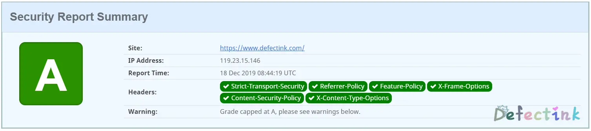
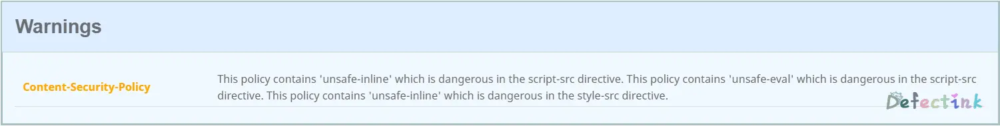

[Header安全检测](https://securityheaders.com/)

之前在学习HTML时候研究过`X-Frame-Options`，它也是header头中的一个安全策略。用于给浏览器指示是否允许一个页面能否嵌入`<iframe>`等嵌入元素。

下述所有apache2的操作都需要先启用`header`模块（Model）才能使用。

所有参考/摘录来自于[MDN](https://developer.mozilla.org/)

## X-Frame-Options

https://www.defectink.com/defect/HTML-practice-x-frame-option.html

## Strict-Transport-Security

` HTTP Strict Transport Security`（通常简称为HSTS）是一个安全功能，它告诉浏览器只能通过HTTPS访问当前资源，而不是HTTP。

一个网站接受一个HTTP的请求，然后跳转到HTTPS，用户可能在开始跳转前，通过没有加密的方式和服务器对话，比如，用户输入http://foo.com或者直接foo.com。

这样存在中间人攻击潜在威胁，跳转过程可能被恶意网站利用来直接接触用户信息，而不是原来的加密信息。

网站通过HTTP Strict Transport Security通知浏览器，这个网站禁止使用HTTP方式加载，浏览器应该自动把所有尝试使用HTTP的请求自动替换为HTTPS请求。

### Apache配置

在配置文件中添加：

```
Header always set Strict-Transport-Security "max-age=63072000; includeSubdomains;"
```

### 浏览器工作方式

你的网站第一次通过HTTPS请求，服务器响应`Strict-Transport-Security` 头，浏览器记录下这些信息，然后后面尝试访问这个网站的请求都会自动把HTTP替换为HTTPS。

当HSTS头设置的过期时间到了，后面通过HTTP的访问恢复到正常模式，不会再自动跳转到HTTPS。

每次浏览器接收到Strict-Transport-Security头，它都会更新这个网站的过期时间，所以网站可以刷新这些信息，防止过期发生。

Chrome、Firefox等浏览器里，当您尝试访问该域名下的内容时，会产生一个307 Internal Redirect（内部跳转），自动跳转到HTTPS请求。

### 语法

```
Strict-Transport-Security: max-age=<expire-time>
Strict-Transport-Security: max-age=<expire-time>; includeSubDomains
Strict-Transport-Security: max-age=<expire-time>; preload
```

* `max-age=<expire-time>`：设置在浏览器收到这个请求后的<expire-time>秒的时间内凡是访问这个域名下的请求都使用HTTPS请求。
* `includeSubDomains`：如果这个可选的参数被指定，那么说明此规则也适用于该网站的所有子域名。
* `preload`：查看 [预加载 HSTS](https://developer.mozilla.org/zh-CN/docs/Security/HTTP_Strict_Transport_Security#预加载_HSTS) 获得详情。不是标准的一部分。

## Content-Security-Policy

内容安全策略  ([CSP](https://developer.mozilla.org/en-US/docs/Glossary/CSP)) 是一个额外的安全层，用于检测并削弱某些特定类型的攻击，包括跨站脚本 ([XSS](https://developer.mozilla.org/en-US/docs/Glossary/XSS)) 和数据注入攻击等。无论是数据盗取、网站内容污染还是散发恶意软件，这些攻击都是主要的手段。

### Apache配置

在配置文件中添加：

```html
Header set Content-Security-Policy "default-src 'self' https://cdn.defectink.com; script-src 'self' 'unsafe-inline' 'unsafe-eval' https://maxcdn.bootstrapcdn.com https://ajax.googleapis.com https://cdn.defectink.com; img-src *; style-src 'self' 'unsafe-inline' https://cdn.defectink.com https://maxcdn.bootstrapcdn.com https://fonts.googleapis.com/; font-src 'self' https://cdn.defectink.com https://fonts.gstatic.com/ https://maxcdn.bootstrapcdn.com; form-action 'self' https://cdn.defectink.com; upgrade-insecure-requests;"
```

说白了就是添加允许加载的脚本、样式等内容的白名单。配置相应的值，以控制用户代理（浏览器等）可以为该页面获取哪些资源。比如一个可以上传文件和显示图片页面，应该允许图片来自任何地方，但限制表单的action属性只可以赋值为指定的端点。一个经过恰当设计的内容安全策略应该可以有效的保护页面免受跨站脚本攻击。

### 跨站脚本攻击

CSP 的主要目标是减少和报告 XSS 攻击 ，XSS 攻击利用了浏览器对于从服务器所获取的内容的信任。恶意脚本在受害者的浏览器中得以运行，因为浏览器信任其内容来源，即使有的时候这些脚本并非来自于它本该来的地方。

CSP通过指定有效域——即浏览器认可的可执行脚本的有效来源——使服务器管理者有能力减少或消除XSS攻击所依赖的载体。一个CSP兼容的浏览器将会仅执行从白名单域获取到的脚本文件，忽略所有的其他脚本 (包括内联脚本和HTML的事件处理属性)。

作为一种终极防护形式，始终不允许执行脚本的站点可以选择全面禁止脚本执行。

### 实例

一个网站管理者想要所有内容均来自站点的同一个源 (不包括其子域名)

```html
Content-Security-Policy: default-src 'self'
```

一个网站管理者允许网页应用的用户在他们自己的内容中包含来自任何源的图片, 但是限制音频或视频需从信任的资源提供者(获得)，所有脚本必须从特定主机服务器获取可信的代码.

```html
Content-Security-Policy: default-src 'self'; img-src *; media-src media1.com media2.com; script-src userscripts.example.com
```

在这里，各种内容默认仅允许从文档所在的源获取, 但存在如下例外:

- 图片可以从任何地方加载(注意 "*" 通配符)。
- 多媒体文件仅允许从 media1.com 和 media2.com 加载(不允许从这些站点的子域名)。
- 可运行脚本仅允许来自于userscripts.example.com。

## X-Content-Type-Options

`X-Content-Type-Options` 响应首部相当于一个提示标志，被服务器用来提示客户端一定要遵循在 [`Content-Type`](https://developer.mozilla.org/zh-CN/docs/Web/HTTP/Headers/Content-Type) 首部中对 [MIME 类型](https://developer.mozilla.org/en-US/docs/Web/HTTP/Basics_of_HTTP/MIME_types) 的设定，而不能对其进行修改。

注意: `nosniff` 只应用于 "`script`" 和 "`style`" 两种类型。事实证明，将其应用于图片类型的文件会导致[与现有的站点冲突](https://github.com/whatwg/fetch/issues/395)。

### Apache配置

在配置文件中添加：

```
Header set X-Content-Type-Options nosniff
```

### 语法

`nosniff`

下面两种情况的请求将被阻止：

- 请求类型是"`style`" 但是 MIME 类型不是 "`text/css`"，
- 请求类型是"`script`" 但是 MIME 类型不是 [JavaScript MIME 类型](https://html.spec.whatwg.org/multipage/scripting.html#javascript-mime-type)。

## Referrer-Policy

**`Referrer-Policy`** 首部用来监管哪些访问来源信息——会在 [`Referer`](https://developer.mozilla.org/zh-CN/docs/Web/HTTP/Headers/Referer) 中发送——应该被包含在生成的请求当中。

### Apache配置

在配置文件中添加：

```
Header always set Referrer-Policy "no-referrer-when-downgrade"
```

### 语法

注意 `Referer` 实际上是单词 "referrer" 的错误拼写。`Referrer-Policy` 这个首部并没有延续这个错误拼写。

```
Referrer-Policy: no-referrer
Referrer-Policy: no-referrer-when-downgrade
Referrer-Policy: origin
Referrer-Policy: origin-when-cross-origin
Referrer-Policy: same-origin
Referrer-Policy: strict-origin
Referrer-Policy: strict-origin-when-cross-origin
Referrer-Policy: unsafe-url
```

## Feature-Policy

**这是一个实验中的功能**

**`Feature-Policy`**响应头提供了一种可以在本页面或包含的iframe上启用或禁止浏览器特性的机制。

### Apache配置

在配置文件中添加：

```
Header always set Feature-Policy "vibrate 'self'; sync-xhr 'self' https://cdn.defectink.com https://www.defectink.com"
```

### 语法

```
Feature-Policy: <directive> <allowlist>
```

`<allowlist>`

- `*`: 允许在当前文档和所有包含的内容（比如iframes）中使用本特性。
- `'self'`: 允许在当前文档中使用本特性，但在包含的内容（比如iframes）仍使用原值。
- `'src'`: (只在iframe中允许) 只要在[src](https://developer.mozilla.org/zh-CN/docs/Web/HTML/Element/iframe#Attributes) 中的URL和加载iframe用的URL相同，则本特性在iframe中允许，
- `'none'`: 从最上层到包含的内容都禁止本特性。 <origin(s)>: 在特定的源中允许，源URL以空格分割。

- `*`: 本特性默认在最上层和包含的内容中（iframes）允许。
- `'self'`: 本特性默认在最上层允许，而包含的内容中（iframes）使用源地址相同设定。也就是说本特性在iframe中不允许跨域访问。
- `'none'`: 本特性默认在最上层和包含的内容中（iframes）都禁止。

`*`(在所有源地址启用)`或'none'`(在所有源地址禁用)只允许单独使用，而`'self'`和`'src'`可以与多个源地址一起使用。

所有的特性都有一个如下的默认的allowlist

- `*`: 本特性默认在最上层和包含的内容中（iframes）允许。
- `'self'`: 本特性默认在最上层允许，而包含的内容中（iframes）使用源地址相同设定。也就是说本特性在iframe中不允许跨域访问。
- `'none'`: 本特性默认在最上层和包含的内容中（iframes）都禁止。

## 测试



### 为什么没有A+？

因为CSP的一个报错，拒绝加载内联的JS脚本。可以使用`unsafe-inline`来启用内联脚本。但是启用了`unsafe-inline`之后，就得不到A+了。



```
Refused to execute inline script because it violates the following Content Security Policy directive: "script-src 'self' 'unsafe-eval' https://maxcdn.bootstrapcdn.com https://ajax.googleapis.com https://cdn.defectink.com". Either the 'unsafe-inline' keyword
```

## 参考

* [HTTP Strict Transport Security](https://developer.mozilla.org/zh-CN/docs/Security/HTTP_Strict_Transport_Security)
* [内容安全策略( CSP )](https://developer.mozilla.org/zh-CN/docs/Web/HTTP/CSP)
* [X-Content-Type-Options](https://developer.mozilla.org/zh-CN/docs/Web/HTTP/Headers/X-Content-Type-Options)
* [Referrer-Policy](https://developer.mozilla.org/zh-CN/docs/Web/HTTP/Headers/Referrer-Policy)
* [Feature-Policy](https://developer.mozilla.org/zh-CN/docs/Web/HTTP/Headers/Feature-Policy)