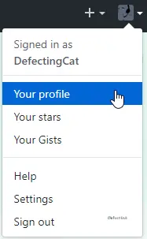
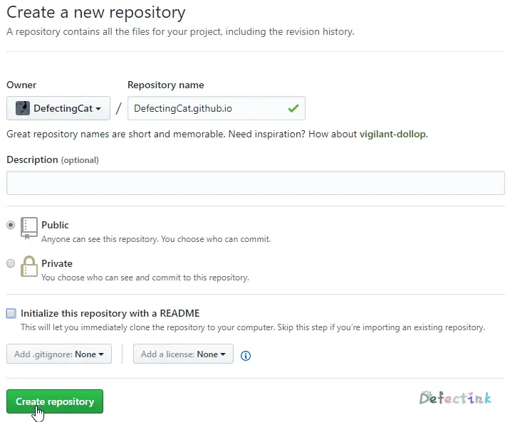
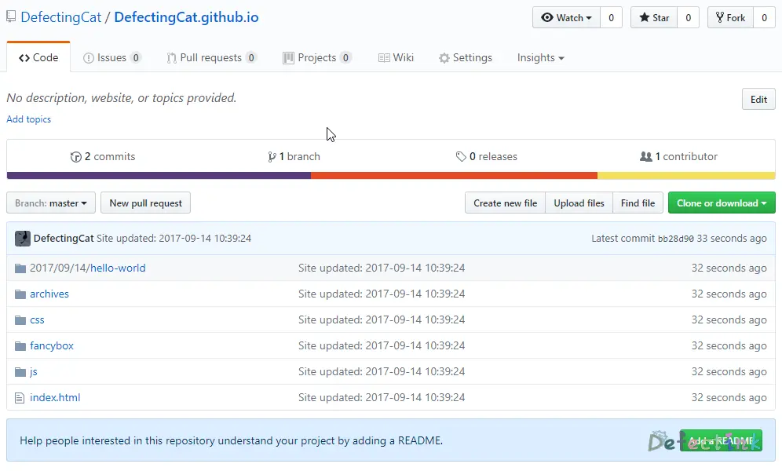

> 这是一篇写于较早期的文章，当时水平有限，文章质量不高。

上次搭建hexo的时候是直接在服务器上使用hexo -server仍在服务器发布的。这次决定配合github，将hexo生成的静态页面部署至github，不仅有了github.io的域名，还能在github上做备份、版本控制等。

关于hexo安装的，可以去参考上一篇文章 →

安装完成后就是将hexo与github关联起来了

## 创建Repositories

为了将网页部署到github并发布，需要先创建一个仓库

在个人资料页面选择仓库（Repositories），并单击New来创建一个新的仓库：




• Repository name：仓库名称（需要使用格式为"Your_github_name.github.io"。Your_github_name一定要为你的github昵称，否则出现404状况）
• Description：仓库描述（选填）
• Public/Private：仓库类型（公开/私有）
• Initialize this repository with a README：是否生成一个README文件初始化仓库（可选）

所有选项都填写完成后，点击Create Repository来创建仓库

随后便能看到自己刚刚创建的仓库了（下图为未创建一个README文件来初始化仓库）



## 关联Github

创建好仓库后，需要配置Github信息，以便于等会部署。

```bash
git config --global user.name "name"
git config --global user.email "mail"
```

### 生成SSH密钥

```bash
ssh-keygen -t rsa
```

在生成时可以全部保持默认路径即可。

生成完毕后可以看到公钥的默认路径为：

```bash
/root/.ssh/id_rsa.pub
```

直接编辑并将所有内容复制至Github

```bash
vim .ssh/id_rsa.pub
```

### 部署至Github

直接修改_config.yml文件，并找到Deployment，修改为如下内容

```yml
deploy: 
  type: git 
  repo : git@github.com:DefectingCat/DefectingCat.github.io.git 
  branch: master
```
repo：仓库的路径

branch：分支（默认为master）

```bash
hexo g
hexo d
hexo d -g
```

部署前生成静态页面

Deployer not found：git？

尝试如下命令：

```bash
npm install hexo-deployer-git --save
```

成功部署

查看刚刚所部署的仓库



访问域名测试


到此就成功部署到Github并运行成功了呢。

## Over

这个只是最基本的部署发布页面，hexo还有很多高级操作。官方文档写的也非常详细，更多操作可以去参考官方文档 https://hexo.io/zh-cn/
