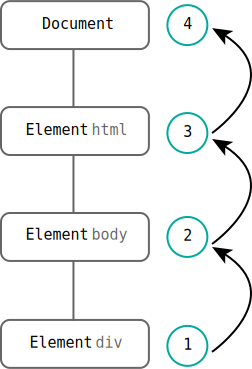

JavaScript 和 HTML 直接的交互是通过事件实现的。当文档或者浏览器发生交互时，使用侦听器（处理程序）来预定事件，以便事件发生时执行相应的代码。在传统软件工程中被称之为观察员模式。

事件最早是在 IE3 和 Netscape Navigator 2 中出现的。

## 事件流

经常在一些文章中看到的事件冒泡或者捕获就是用于描述事件流的两种方式。在浏览器发展到 IE4 的时代时，人们开始考虑：如何确定页面的哪一部分拥有某个特定的事件？

要理解这个问题很简单，在 Web 文档中，需要绝大部分元素进行嵌套。如果我们单击了嵌套中的某个元素，那么也相当于同时单击了它的父元素。

就像将手指指向在一张纸上的同心圆最中心的那个圆上，相当于同时也指向了纸上所有的圆。

而我们的 HTML 结构也是同理，如同下发被弯曲成三个同心圆的`<div>`元素一样。当单击最中心的粉色圆时，外层的绿色和蓝色的圆圈都同时被点击了。因为他们是父级元素，包裹着中心的粉色圆圈。


<p class="codepen" data-height="265" data-theme-id="light" data-default-tab="css,result" data-user="Defectink" data-slug-hash="ZEBjowz" data-preview="true" style="height: 265px; box-sizing: border-box; display: flex; align-items: center; justify-content: center; border: 2px solid; margin: 1em 0; padding: 1em;" data-pen-title="同心圆">
  <span>See the Pen <a href="https://codepen.io/Defectink/pen/ZEBjowz">
  同心圆</a> by Defectink (<a href="https://codepen.io/Defectink">@Defectink</a>)
  on <a href="https://codepen.io">CodePen</a>.</span>
</p>
<script async src="https://cpwebassets.codepen.io/assets/embed/ei.js"></script>

```html
<div class="wrapper">
  <div class="w1">
    <span>1</span>
    <div class="w2">
      <span>2</span>
      <div class="w3">
        <span>3</span>
      </div>
    </div>
  </div>
</div>
```

**事件流**就是描述从页面接受事件的顺序。有意思的是，历史的竞争者居然提出了几乎相反的事件流概念。软软提出的是事件冒泡流，而 Netscape 提出的是事件捕获流。

### 事件冒泡

IE 的事件叫做**事件冒泡**（event bubbling），即事件最开始时，由最具体的元素接受，然后逐级向上层父级元素传播，直到根 document。

拿上述同心圆结构来说：

```html
<div class="wrapper">
  <div class="w1">
    <span>1</span>
    <div class="w2">
      <span>2</span>
      <div class="w3">
        <span>3</span>
      </div>
    </div>
  </div>
</div>
```

如果单击最里面的`<div>` w3，那么事件冒泡流按照如下顺序传播：

1. div.w3
2. div.w2
3. div.w1
4. div.wrapper
5. body
6. html
7. document



当在传播顺序中的某个元素上注册了对应事件的监听器，那么就会在当前元素上触发对应的事件：

1. div.w3 <---点击的是 w3 元素
2. div.w2
3. div.w1
4. div.wrapper <---在 wrapper 上注册了监听器
5. body
6. html
7. document

wrapper 上的监听器：

```js
wrapper.addEventListener('click', (e) => {
  console.log('wrapper');
  console.log(e.target); // div.w3
})
```

> `addEventListener`默认在事件冒泡时触发事件，见后续。

事件代理的原理就是由事件流来实现的，点击的事件会一层一层的传播，当传播到了有监听器的那个元素时，就会触发对应的方法。不过`event.target`依然是点击的目标元素。

所有的现代浏览器都支持事件冒泡，在一些老版本中的实现上可能会有一些差距。

### 事件捕获

Netscape Communicator 提出的另一种事件流叫做**事件捕获**（event capturing）。事件捕获传递事件的方式基本上与事件冒泡相反。它的用意在于事件到达预定的目标之前捕获它。

还是上述同心圆的例子，点击了`<div>` w3 时，事件捕获的传播顺序为：

1. document
2. html
3. body
4. div.wrapper
5. div.w1
6. div.w2
7. div.w3

> ~~我就是想和你反着来~~

触发对应的事件也是同理，也是在传播顺序当中有某个外层元素注册了对应的事件，就会触发该事件。

1. document
2. html
3. body
4. div.wrapper <---在 wrapper 上注册了监听器
5. div.w1
6. div.w2
7. div.w3 <---点击的是 w3 元素

wrapper 上的监听器：

```js
wrapper.addEventListener('click', (e) => {
  console.log('wrapper');
  console.log(e.target); // div.w3
}, false)
```

> `addEventListener`第三个参数就是控制事件是冒泡还是捕获，见后续。

### DOM 事件流

上述俩家整出了几乎完全想法的概念，好在 DOM 规定将其整合到了一起。“DOM2 级事件”规定事件为三个阶段：

1. 事件捕获阶段
2. 处于目标阶段
3. 事件冒泡阶段

首先发生的是事件捕获，为截获事件提供了机会。然后是实际的目标接受到的事件。最后一个阶段是冒泡阶段，可以在这个阶段对事件做出响应。

在事件捕获阶段，实际的目标不会接受到事件。这意味着事件捕获阶段在实际目标之前就停止了（图例中到`<body>`停止）。接下来就是“处于目标”阶段，如果在目标元素上监听了对应的事件，那么这个事件的触发被看成冒泡阶段的一部分。

## 事件处理程序

事件就是用户或者浏览器自身执行的某种动作。诸如 click、load 和 mouseover等。这些都是对应的事件名称，而对某个事件做出响应的函数就叫做**事件处理程序**。有多种规定规定了为事件指定处理程序的方式。

### HTML 事件处理程序

HTML 元素支持使用一个与事件名称同名的 Attribute 来监听对应的事件，这个特性的值就是可执行的 JavaScript 代码。

```html
<input type="button" value="Click Me!" onclick="alert('嘤嘤嘤')">
```

当然也可以定义一个函数来处理：

```html
<input type="button" value="Click Me!" onclick="showMessage()">
```

现在的前端编程方式推荐解耦合，即专门的语言处理专门的事情。这种在 HTML 元素上定义事件的方式也会导致很多的问题：

1. 如果函数定义在按钮下发，那么在函数还未加载完成时用户就点击了对应的按钮就会导致一个错误。
2. 使用 with 拓展作用域时会在不同浏览器中导致不同的结果。
3. HTML 与 JavaScript 代码紧密耦合。

### DOM0 级事件处理程序

DOM0 级事件处理程序是以前时代常见的传统方式，它是将一个函数赋值给一个事件处理程序属性。这和 HTML 事件处理程序有点类似，不够它将 JavaScript 代码和 HTML 完美的解耦合了。

```js
let btn = document.querySelector('#b');
btn.onclick = function() {
  alert('test');
}
```

DOM0 级方法指定的事件处理程序被认为是元素的方法，所以这时候的函数是在元素的作用域中运行的。也就是说，this 引用的是当前元素：

```js
let btn = document.querySelector('#b');
btn.onclick = function() {
  alert(this);
}
```

以这种方式添加的事件处理程序会在事件流的冒泡流阶段被处理。

### DOM2 级事件处理程序

DOM2 级不再是元素的方法，它通过定义的两个方法来为元素添加或删除事件处理程序。这也是目前现代比较常用的方法。

DOM2 级定义了两个方法：

* `addEventListener()`
* `removeEventListener()`

他们都接受三个三个参数：

```js
element.addEventListener('事件名', '事件处理程序函数', '捕获/冒泡')
```

为 true 时表示在捕获阶段调用函数，为 false 时表示在冒泡阶段调用函数。默认为冒泡流。

此外，因为对象的引用性，当使用匿名函数时，`removeEventListener()`无法移除一个匿名的处理程序。

`addEventListener()`还可以将第三个参数接收为一个配置对象：

```js
document.addEventListener('click', handleClick, {
    capture: true,
    once: true,
    passive: true
})
```

* capture：在捕获阶段调用函数；
* once：事件监听器在触发一次后自动移除；
* passive：表示事件处理程序永远不会调用`preventDefault()`；

## 自定义事件

客户端 JavaScript 的事件 API 非常强大，使用它可以自定义和派发自己事件。也就是说除了已经定义好的事件类型之外，我们还可以定义自定义的事件类型。

如果某个 JavaScript 对象上有`addEventListener()`方法，那它就是一个事件目标。着意味着该对象也有一个`dispatchEvent()`方法。`dispatchEvent()`就是下发自定义事件的，它下发的事件可以被`addEventListener()`监听到。

而自定义的事件可以通过`new CustomEvent()`来创建。`CustomEvent()`的第一个参数是一个字符串，表示事件类型；第二个参数是一个对象，用于指定事件对象的属性。

来看一个刻意设计的例子：

```js
    const btn = document.querySelector('#btn');
    const p = document.querySelector('#state');

    btn.addEventListener('click', () => {
      document.dispatchEvent(
        new CustomEvent('busy', {
          detail: true,
        })
      );
      setTimeout(() => {
        document.dispatchEvent(
          new CustomEvent('busy', {
            detail: false,
          })
        );
      }, 1000);
    });

    document.addEventListener('busy', (e) => {
      if (e.detail) {
        p.textContent = 'Now loading...';
        p.style.color = 'red';
      } else {
        p.textContent = 'Idle.';
        p.style.color = 'green';
      }
    });
```

这里自定义了一个 busy 事件，用于表示正在请求某些内容。这里的例子在点击了按钮后模拟开始加载，并使用`document.dispatchEvent()`下发了一个新的事件。同样在加载完成后，再下发一个同样的事件，并在事件对象中携带不同的属性用于表示加载完成。

后面为`document.addEventListener('busy')`监听了下发的事件，并根据传递的事件对象中的属性值来修改状态。

<iframe src="https://codesandbox.io/embed/jovial-hooks-zmfce?fontsize=14&hidenavigation=1&theme=light&view=preview"
     style="width:100%; height:500px; border:0; border-radius: 4px; overflow:hidden;"
     title="自定义事件"
     allow="accelerometer; ambient-light-sensor; camera; encrypted-media; geolocation; gyroscope; hid; microphone; midi; payment; usb; vr; xr-spatial-tracking"
     sandbox="allow-forms allow-modals allow-popups allow-presentation allow-same-origin allow-scripts"
   ></iframe>