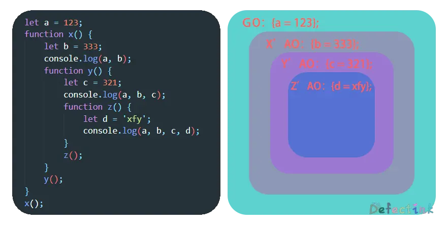

JavaScript是一门动态语言，也常称呼为弱类型/解释型的语言。除了不需要明确写出数据类型外，JavaScript的作用域也和其他类型的语言不同。并且作用域还以链的方式互相连接。

## 预编译

要想彻底的了解作用域与变量提升，就得先了解js语言的执行过程。 

JavaScript语言会分为三步来解释执行代码，分别是：

1. 语法分析
2. 预编译
3. 解释执行

语法分析主要是检查整体代码中有没有明显的会导致程序无法执行的语法错误，在解释执行之前找出并提示错误。语法分析只是餐前甜点，真正发生变化的还是在预编译阶段。

由于预编译的阶段，存在了函数以及变量的提升。所谓的预编译就是在代码真正执行之前做好一些准备，例如声明变量，声明函数等。

函数的预编译需要经过几个阶段：

1. 创建AO（执行期上下文，Activation Object）

   ```js
   // 创建AO对象
   AO {
      	
   }
   ```

2. 寻找形参和变量声明，将变量和形参名作为AO的属性名，值为undefined。（**变量声明提升**）

   ```js
   // 创建AO对象
   AO {
      	a: undefined,
       b: undefined
   }
   ```

3. 寻找函数声明，赋值为函数体（**函数整体提升**）

   ```js
   // 创建AO对象
   AO {
       a : function a() {},
       b : undefined
   }
   ```

> 预编译阶段不会为变量赋值。

预编译阶段结束后就会进入解释执行阶段，此时函数就会真正准备执行了。

```js
function test(a) {
    console.log(a);
    // 结果：function a() {},
    var a = 123;
    // let a = 123;变量不会提升
    console.log(a);
    // AO对象中的a被变量赋值，结果：123
    function a() {}
    console.log(a);
    // 函数声明已经被提升，结果：123
    let b = function() {}
    console.log(b);
    // b是函数表达式，刚刚被赋值为函数体。结果：function() {}
}
test(1);
```

## 作用域

JavaScript也有作用域。不过和其他强类型语言相比，JavaScript并不是以花括号`{}`来产生作用域的。

作用域可以直接的理解为一块独立的区域，在该区域内声明的函数、变量等都属于这个区域。使得在不同区域内的同重名变量和函数等不会冲突。在通常情况下作用域内的变量等不会被外部所访问到。

在预编译环境中，函数会创建一个执行期上下文的内部对象，这个AO就定义了一个函数执行时的环境。AO就可以理解为函数的作用域。

全局环境下也有一个执行环境：GO（Global Object），它存储了全局环境下的变量和函数等。也就是全局作用域。

执行期上下文：当函数运行时，会创建一个执行期上下文的内部对象（AO，Activation Object）。一个执行期上下文定义了一个函数执行时的环境。函数每次执行时对应的执行上下文是独一无二的，所以多次调用一个函数会导致创建多个执行期上下文。当函数执行完毕，它所产生的执行期上下文会被销毁。

在函数的AO中保存的**经过声明的变量**等，除了特意保存到外部，否则无论函数执行与否，在AO外部是无法被访问的：

```js
function test() {
    var a = 123;
    let b = 333;
    function c() {
        console.log('xfy');
    }
}
console.log(a);	// a is not defined.
c(); // c is not defined.
```

> 未经声明而直接赋值的变量将会转化为全局变量。

### 变量声明提升

除了新的关键字`let`，`cont`之外，JavaScript只在函数中产生作用域。并且和全局作用域一样，在函数作用域内使用`var`声明和函数声明也会提升。

```js
(function () {
    a = 123; // 未经声明前使用
    console.log(a);
    var a;  // 声明提升
}())
```

变量仅仅只是声明会提升到作用域顶部，变量的赋值还是在原有的位置被赋值。因为预编译环境不会为变量赋值。

### 函数声明提升

函数的声明提升与变量提升类似，都是经过预编译阶段将函数的声明提升到作用域的顶端。所以和使用`var`声明的变量一样，可以将调用写在函数声明之前。

```js
someFun()	//声明前调用
function someFun() {
    console.log('xfy');
}
```

但必须是声明函数体才会在预编译中提升，将函数赋值给变量并不属于函数声明。此时在声明前调用函数就会得到`ReferenceError: Cannot access 'foo' before initialization`的提示。

```js
foo();
let foo = function () {
    console.log('xfy');
}
```

### 全局作用域

最外层的作用域，在代码的任何地方都能访问到的作用域。

```js
let a = 123;	// 全局作用域内的变量
function foo() {
    let b = 333;	// 函数作用域内的变量
    return b;
}
```

在window/global的属性也是全局作用域。

如果变量没有使用关键字声明，那么将会创建出一个全局变量。并且值得注意的是在连等赋值时，容易产生没有被声明的变量，因为关键字只能声明第一个变量，等号后的变量将不会被关键字声明。

```js
function foo() {
    a = 123;    // 全局变量
    let b = c = 100;    // c没有被声明
}
foo();
console.log(a);  // 123
// console.log(b);
console.log(c);  // 100
```

### 块级作用域

新增的`let`和`const`关键字可以产生块级作用域。在其他的强类型语言中可能会经常容易见到块级作用域，常见的就是在大括号`{}`中的代码为一个作用域。

js的大括号`{}`是不会产生作用域的，也就是在没有这两个新增的关键字之前，js的块级作用域并不是那么容易产生。

块级作用域在日常的代码中也有很多方便的用途，例如最常见的`for`循环就很容易因为没有块级作用域而导致在循环中调用的是同一个计数器的值。

在下面这段代码中，计数器`i`使用`var`来声明的，并不会产生块级作用域。也就是说：**无论循环多少次，最后作用域里保存的`i`只有一个值，那就是最后一次循环的值`10`。**所以在这个数组内保存的十个函数在执行时，读取的到作用域里的`i`都是10

```js
let arr = [];
for (var i = 0; i < 10; i++) {
    arr[i] = function () {
        console.log(i);
    }
}
arr[2]();  // 10
```

而将`var`换成`let`之后，由于块级作用域的存在，每次循环，都能将`i`的值保存在作用域里。等到数组内的函数执行时，它所访问的`i`就是那一次循环所保存在作用域里的值。所以使用了`let`就不会出现所有的`i`都是10的情况了。

```js
let arr = [];
for (let i = 0; i < 10; i++) {
    arr[i] = function () {
        console.log(i);
    }
}
arr[2]();  // 2
```

因为js中的函数是可以产生作用域的，所以除了使用`let`来生成块级作用域，还能使用函数来模拟块级作用域。上述的例子中，可以使用立即执行函数来模拟出一个块级作用域。

由于立即执行函数是立即执行的，所以每次循环它都会执行一次，并产生一个AO（作用域）来保存参数。将`i`作为参数传递给立即执行函数，就能把每次循环`i`的值给保存下来。

```js
let arr = [];
for (var i = 0; i < 10; i++) {
    (function (j) {
        arr[j] = function () {
            console.log(j);
        }
    }(i))
}
arr[2]()	// 2
```

> 目前官方也是推荐使用`let`替换`var`。

## 链

[[scope]]：每个js函数都是一个对象，对象中有些属性可以访问，但有些不可以。这些属性仅供JavaScript引擎存取，[[scope]]就是其中一个。

[[scope]]中所存储的**执行期上下文对象的集合**，这个集合呈链式链接，我们把这种链式链接叫做作用域链。

通俗的来说，作用域链就是将多个函数的AO包括GO呈链式的保存起来，并按照一定的顺序来访问。

作用域链将函数与其内部的函数和全局作用域串接在一起，呈一条链式的连接。在需要访问其变量或其他属性时，函数会顺着作用域依次向上查找，直到找到顶部GO。

```js
let a = 123;
function x() {
    let b = 333;
    console.log(a, b);
    function y() {
        let c = 321;
        console.log(a, b, c);
        function z() {
            let d = 'xfy';
            console.log(a, b, c, d);
        }
        z();
    }
    y();
}
x();
```



在作用域链内部的函数可以向上方位外部函数作用域内的变量，直至全局作用域。而作用域外的函数不能访问内部函数的变量。

### 父级作用域中的变量

由于作用域链的特性，子作用域内可以任意访问外部作用域，也就是父级作用域内的变量。但它也有一些值得注意的地方。

与`this`的指向不同的是，它并不是谁调用就会去访问谁的作用域。下述代码，虽然**fun调用了foo**，但是foo并不在fun作用域链内，也就是说foo并不能访问fun内的变量。

```js
let a = 123;
function foo() {
    console.log(a);
}
function fun() {
    let a = 'xfy';
    foo();
}
fun();	// 123
```

```js
let a = 123;
function foo() {
    console.log(b);
}
function fun() {
    let b = 'xfy';
    foo();
}
fun();	// b is not defined.
```

