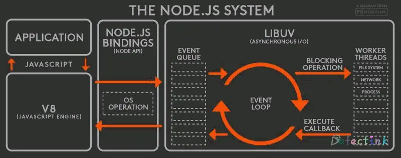

> Node.js® is a JavaScript runtime built on Chrome's V8 JavaScript engine.

Node.js不仅仅是服务器上的JavaScript。



## 并不熟悉的JavaScript

虽然说Node直接般来了个V8来运行JavaScript，但它毕竟不运行在浏览器上，并且是由事件驱动的异步程序，它的本来的目的就是用来搭建高性能的Web服务器。在极少情况下，编写的 JavaScript 代码没有按期望的方式运行。

在客户端的运行环境下，只要是在同一个浏览器窗口运行的JS环境就属于同一个全局环境。无论是在哪里引入的JS文件，都属于同一个运行环境，全局变量能够正常工作，例如有两个js被引入：

```html
<script src="a.js"></script>
<script src="b.js"></script>
```

他们分别有一段代码：

```js
// a.js
let a = 'xxxxxfy!';

// b.js
alert(a);
```

正常情况下全局变量`a`是可以被正常访问的，而在node中，a.js和b.js分别是两个文件，不做其他操作的情况下，他们分别是两个全局变量。

## 基础架构

Node 运行时的基础架构由两大组件构成：

* JavaScript 引擎
* 非阻塞 I/O 库

### JavaScript引擎

众所周知，node使用的是Chrome大排自吸V8，它可以运行任何JS代码。启动时，它会启动一个V8的引擎实例，且node可以充分的利用这个引擎实例。

V8可嵌入（/绑定）到任何C++程序中，。这意味着，除了纯 JavaScript 库外，还可以扩展 V8 来创建全新的函数（或函数模板），方法是将其与 V8 绑定在一起。并且node还支持使用编译好的二进制的C++程序。

### 事件循环

JavaScript是一门单线程的语言，无论换到什么地方运行，它也是单线程语言。单线程语言面临的最大的问题就是阻塞，在前面的代码没有被执行完，后面的代码都将处于等待状态。

node使用[libuv](http://libuv.org/)来实现事件循环。要使用事件循环可以使用异步API，可将回调函数作为参数传递到该 API 函数，在事件循环期间会执行该回调函数。node异步编程的直接体现就是回调函数。异步编程基于回调函数来实现，但不能说是使用了回调后程序就异步化了。Node 所有 API 都支持回调函数。

```
   ┌───────────────────────────┐
┌─>│           timers          │
│  └─────────────┬─────────────┘
│  ┌─────────────┴─────────────┐
│  │     pending callbacks     │
│  └─────────────┬─────────────┘
│  ┌─────────────┴─────────────┐
│  │       idle, prepare       │
│  └─────────────┬─────────────┘      ┌───────────────┐
│  ┌─────────────┴─────────────┐      │   incoming:   │
│  │           poll            │<─────┤  connections, │
│  └─────────────┬─────────────┘      │   data, etc.  │
│  ┌─────────────┴─────────────┐      └───────────────┘
│  │           check           │
│  └─────────────┬─────────────┘
│  ┌─────────────┴─────────────┐
└──┤      close callbacks      │
   └───────────────────────────┘
```

例如，我们可以一边读取文件，一边执行其他命令，在文件读取完成后，我们将文件内容作为回调函数的参数返回。这样在执行代码时就没有阻塞或等待文件 I/O 操作。这就大大提高了 Node.js 的性能，可以处理大量的并发请求。

事件循环包含多个调用回调函数的阶段：

* 计时器阶段：将运行 setInterval() 和 setTimeout() 过期计时器回调函数
* 轮询阶段：将轮询操作系统以查看是否完成了所有 I/O 操作，如果已完成，将运行回调函数
* 检查阶段：将运行 setImmediate() 回调函数

一个常见的误区是，认为 V8 和事件循环回调函数在不同线程上运行。但事实并非如此。V8 在同一个线程上运行所有 JavaScript 代码。

## 非阻塞I/O

已经简单的了解过node基于v8的单线程来使用回调函数实现异步编程，从而达到高性能与高并发。

### 异步I/O

异步I/O能够大大的提升程序的工作效率，且不会影响剩下的代码执行。

#### 同步读取文件

首先来看下同步读取文件

```js
let fs = require('fs');
console.log('starting process...');
let data = fs.readFileSync('test.txt');
console.log(data);
console.log('the end');
```

同步读取文件会按照从上到下的顺序来执行代码，到遇到读取I/O时，剩下的代码将处于等待状态。并且在读取I/O时遇到错误（例如文件不存在），将会直接返回错误，剩下的代码将不执行完。

#### 异步读取文件

```js
let fs = require('fs');
console.log('starting process...');
fs.readFile('test.txt', (err, data) => {
    if (err) {
        console.log('something was wrong: ' + err);
    } else {
        console.log(data);
    }
})
console.log('the end');
```

异步读取文件调用了回调函数，它设置了一个事件循环，在等待读取I/O的同时，将继续执行剩下的代码。当文件读取完成之后，将会返回回调函数，并输出结果。并且当读取文件遇到错误时，在等待读取期间执行的代码将正常执行。

异步的结果看起来像是这样的：

```
starting process...
the end
<Buffer 64 66 6a 61 73>
```

在等待其读取`test.txt`的期间，JS将剩下的`console.log`语句先执行了。

### 同步I/O

node的设计理念就是使用异步编程，使用阻塞编程可无法写出一个高性能的web服务器。

但这不代表着同步I/O就一无是处，在某些情况下，同步 I/O 通常比异步 I/O 更快，原因在于设置和使用回调函数、轮询操作系统来获取 I/O 状态等操作都涉及到一定的开销。

如果需要写一个一次性的使用程序，仅用于处理一个文件，从命令行中启动 Node，并向其传递 JavaScript 实用程序的文件名。此时，该实用程序是唯一运行的程序，因此，即使它阻塞了 V8 线程，也没有任何影响。在此情况下，适合使用同步 I/O。

只要是谨慎使用同步 Node API 调用，就不会出现什么问题。

## 小结

* V8是有八个气缸的V型发动机.
* JavaScript是单线程语言，它通过V8 引擎提供的异步执行回调接口实现了异步编程。

全文均是笔记

* [Node.js 之旅](https://developer.ibm.com/zh/tutorials/learn-nodejs-tour-node/)
* [The Node.js Event Loop](https://nodejs.org/en/docs/guides/event-loop-timers-and-nexttick/)
* [Node.js 回调函数](https://www.runoob.com/nodejs/nodejs-callback.html)
* [V8发动机](https://zh.wikipedia.org/wiki/V8%E5%8F%91%E5%8A%A8%E6%9C%BA)