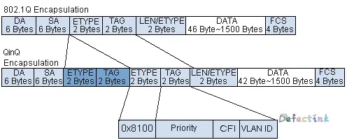
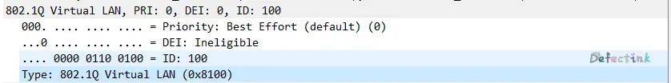
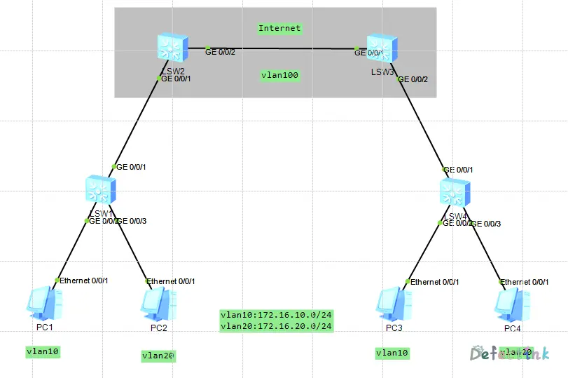
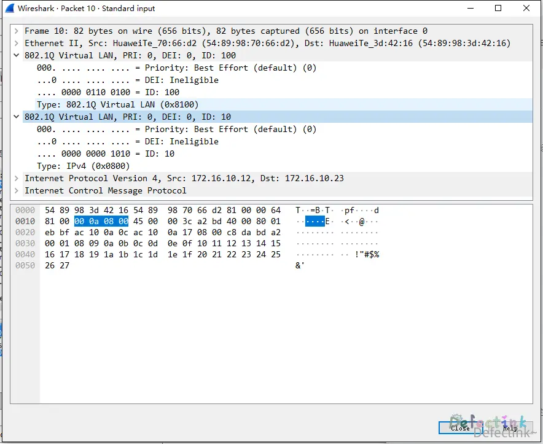
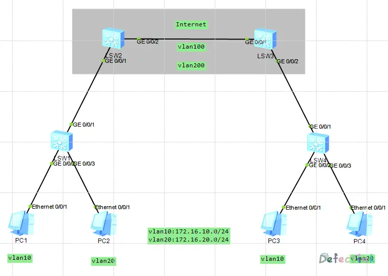
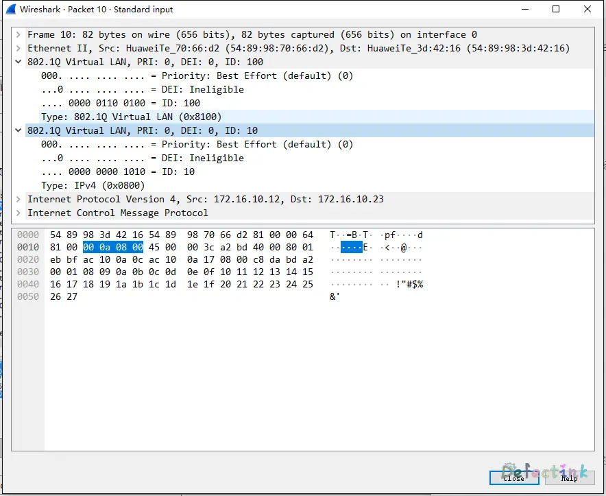
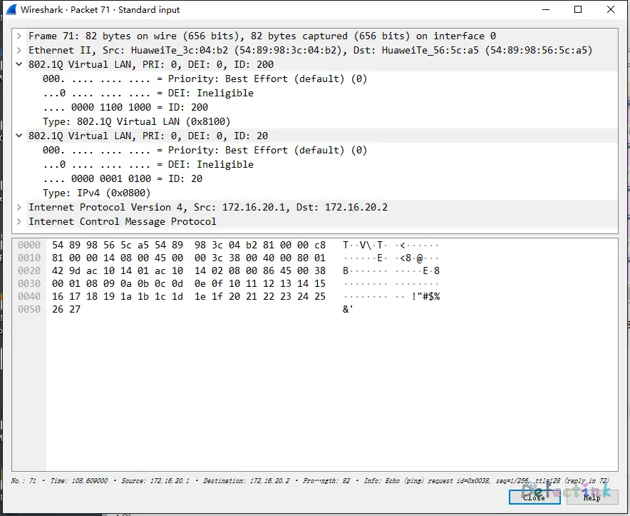

> QwQ♥

## QinQ简介

QinQ技术（或称为IEEE 802.1ad、Vlan stacking）。是802.1q协议（Virtual Bridged Local Area Networks）为基础衍生出的一种通讯协议。

它是一项拓展vlan空间的技术，通过在原有的以太网帧中再堆叠一个802.1q的报头来达到拓展vlan空间的功能。使其vlan数量最多可以达4094(inner)*4094(outer)。即802.1Q-in-802.1Q，所以称之为QinQ协议。

### 目的

随着当前的以太网技术的发展，利用传统802.1q vlan来对用户进行隔离和标识收到很大限制。因为IEEE802.1Q中定义的VLAN Tag域只有12个比特，仅能表示4096个VLAN，无法满足以太网中标识大量用户的需求，于是QinQ技术应运而生。

而运用了QinQ协议之后，可以在原有的vlan标签中再堆叠一层vlan标签，使其vlan的数量达到翻倍，极大的拓展了vlan的空间。

### 优点

- 扩展VLAN，对用户进行隔离和标识不再受到限制。
- QinQ内外层标签可以代表不同的信息，如内层标签代表用户，外层标签代表业务，更利于业务的部署。
- QinQ封装、终结的方式很丰富，帮助运营商实现业务精细化运营。

1. 解决日益紧缺的公网VLAN ID 资源问题
2. 用户可以规划自己的私网VLNA ID
3. 提供一种较为简单的二层VPN解决方案
4. 使用户网络具有较高的独立性

### 实现方式

QinQ拥有两种实现方式：

1. 基本QinQ

   1. 如果收到的是带有VLAN Tag的报文，该报文就成为带双Tag的报文。
   2. 如果收到的是不带VLAN Tag的报文，该报文就成为带有本端口缺省VLAN Tag的报文。

2. 灵活QinQ

   1. 为具有不同内层VLAN ID的报文添加不同的外层VLAN Tag。
   2. 根据报文内层VLAN的802.1p优先级标记外层VLAN的802.1p优先级和添加不同的外层VLAN Tag。通过使用灵活QinQ技术，在能够隔离运营商网络和用户网络的同时，又能够提供丰富的业务特性和更加灵活的组网能力。


* 基本QinQ

  基本QinQ是基于接口的封装，是指进入一个接口的所有流量都将全部封装为一个相同的外层Vlan tag。封装方式不够灵活，用户业务区分不够细致。这种封装方式称之为基本QinQ。

* 灵活QinQ

  * 基于Vlan ID的QinQ封装：这种封装方式可以针对不同的vlan tag来决定是否封装外层vlan tag、封装何种vlan tag。这种封装方式称之为灵活QinQ。
  * 基于802.1q优先级的QinQ封装：这种封装方式可以针对用户不同优先级的数据流来决定是否封装外层vlan tag、封装何种vlan tag。这种封装方式亦称之为灵活QinQ。

## 终结子接口

“终结”意思为设备对传过来的报文tag进行识别，然后根据后续的转发行为来对单层或双层的tag进行玻璃或继续传输。

“终结”一般作用于子接口上，故称之为：终结子接口

QinQ技术在和MPLS/IP核心网连接时，根据不同的情况，会用到不同的终结方法：

* 如果路由子接口是对报文的单层Tag终结，那么该子接口称为Dot1q终结子接口；
* 如果路由子接口是对报文的双层Tag终结，那么该子接口称为QinQ终结子接口。

Tips：Dot1q终结子接口和QinQ终结子接口不支持透传不带VLAN的报文，收到不带VLAN的报文会直接丢弃。

## 帧格式

QinQ报文有着固定的格式，就是在802.1Q的标签上再堆叠一层802.1Q标签。QinQ报文比普通的vlan标签多4个字节。vlan帧最小帧长为68字节。



| 字段                | 长度        | 含义                                                         |
| ------------------- | ----------- | ------------------------------------------------------------ |
| Destination address | 6字节       | 目的MAC地址。                                                |
| Source address      | 6字节       | 源MAC地址。                                                  |
| Type                | 2字节       | 长度为2字节，表示帧类型。取值为0x8100时表示802.1Q Tag帧。如果不支持802.1Q的设备收到这样的帧，会将其丢弃。对于内层VLAN tag，该值设置为0x8100；对于外层VLAN tag，有下列几种类型0x8100：思科路由器使用0x88A8：Extreme Networks switches使用0x9100：Juniper路由器使用0x9200：Several路由器使用 |
| PRI                 | 3比特       | Priority，长度为3比特，表示帧的优先级，取值范围为0～7，值越大优先级越高。用于当交换机阻塞时，优先发送优先级高的数据包。 |
| CFI                 | 1比特       | CFI (Canonical Format Indicator)，长度为1比特，表示MAC地址是否是经典格式。CFI为0说明是经典格式，CFI为1表示为非经典格式。用于区分以太网帧、FDDI（Fiber Distributed Digital Interface）帧和令牌环网帧。在以太网中，CFI的值为0。 |
| VID                 | 12比特      | LAN ID，长度为12比特，表示该帧所属的VLAN。在VRP中，可配置的VLAN ID取值范围为1～4094。 |
| Length/Type         | 2字节       | 指后续数据的字节长度，但不包括CRC检验码。                    |
| Data                | 42~1500字节 | 负载（可能包含填充位）。                                     |
| CRC                 | 4字节       | 用于帧内后续字节差错的循环冗余检验（也称为FCS或帧检验序列）。 |

### 报文示例


### TPID（Tag Protocol Identifier）

TPID：标签协议标识ID（Tag Protocol Identifier）是Vlan tag中的一个字段，标识该vlan tag的协议类型。IEEE 802.1Q协议规定QinQ的外层vlan标签的type值为：（0x8100）。



> IEEE802.1Q协议定义的以太网帧的VLAN Tag。802.1Q Tag位于SA（Source Address）和Length/Type之间。通过检查对应的TPID值，设备可确定收到的帧承载的是运营商VLAN标记还是用户VLAN标记。接收到帧之后，设备将配置的TPID值与帧中TPID字段的值进行比较。如果二者匹配，则该帧承载的是对应的VLAN标记。例如，如果帧承载TPID值为0x8100的VLAN标记，而用户网络VLAN标记的TPID值配置为0x8200，设备将认为该帧没有用户VLAN标记。也就是说，设备认为该帧是Untagged报文。
> 另外，不同运营商的系统可能将QinQ帧外层VLAN标记的TPID设置为不同值。为实现与这些系统的兼容性，可以修改TPID值，使QinQ帧发送到公网时，承载与特定运营商相同的TPID值，从而实现与该运营商设备之间的互操作性。以太网帧的TPID与不带VLAN标记的帧的协议类型字段位置相同。为避免在网络中转发和处理数据包时出现问题，不可将TPID值设置为下表中的任意值：

| 协议类型 |        对应值        |
| :------: | :------------------: |
|   ARP    |        0x0806        |
|   RARP   |        0x8035        |
|    IP    |        0x0800        |
|   IPV6   |        0x86DD        |
|  PPPoE   |    0x8863/0x8864     |
|   MPLS   |    0x8847/0x8848     |
| IPX/SPX  |        0x8137        |
|   LACP   |        0x8809        |
|  802.1x  |        0x888E        |
|   HGMP   |        0x88A7        |
| 设备保留 | 0xFFFD/0xFFFE/0xFFFF |

## 基本QinQ配置

拓扑：



如图示，SW2和SW3用于模拟运营商之间的Internet，SW1和SW4为客户内网。基本QinQ的配置就作用于SW2和SW3之间，将客户内网内的vlan10与vlan20封装上一层vlan100，用于再SW2和SW3之间传输。

* SW1和SW4配置相同：

```
sysname SW1
#
vlan batch 10 20
#
interface GigabitEthernet0/0/1
 port link-type trunk
 port trunk allow-pass vlan 10 20
#
interface GigabitEthernet0/0/2
 port link-type access
 port default vlan 10
#
interface GigabitEthernet0/0/3
 port link-type access
 port default vlan 20
```

SW1和SW4只需做基本配置，用作普通二层交换。

* SW2和SW3配置相同：

```
sysname SW2
#
vlan batch 100
#
interface GigabitEthernet0/0/1
 port link-type dot1q-tunnel	//开启基本二层QinQ功能
 port default vlan 100		//并划分为vlan100
#
interface GigabitEthernet0/0/2
 port link-type trunk		//普通trunk
 port trunk allow-pass vlan 100
```

SW1的`G 0/0/1`为trunk接口，对应连接的SW2的`G 0/0/1`为基本二层QinQ接口，划分vlan为vlan 100。

使用PC1发送ICMP包到PC3，数据包内容为：



其中，可以看到内层的802.1q的vlan标签ID为10，type为（0x0800）；外层的，也就是SW2封装的vlan标签ID为100，type为（0x8100）。

## 灵活QinQ配置

拓扑和上述一样：



我们在模拟internet的SW2和SW3之间添加了一个vlan 200，用于配置灵活的QinQ的vlan 20堆叠一个vlan 200的tag。

SW1和SW4的配置与普通的QinQ的配置相同，无需改变。

* SW2与SW3配置相同：

```
sysname SW2
#
vlan batch 100 200
#
interface GigabitEthernet0/0/1
 port link-type hybrid 	//必须是hybrid接口模式
 qinq vlan-translation enable	//开启vlan转换
 port hybrid untagged vlan 100 200	//出方向时剥离vlan100和200的标签
 port vlan-stacking vlan 10 stack-vlan 100	//vlan10堆叠vlan100tag
 port vlan-stacking vlan 20 stack-vlan 200	////vlan20堆叠vlan200tag
#
interface GigabitEthernet0/0/2
 port link-type trunk
 port trunk allow-pass vlan 100 200
```

从vlan10和vlan20的PC分别向各自的vlan发包，可以看到数据包内容：

* vlan10



* vlan20


当两台PC机正常通信的时候，可以看到不同vlan封装的外层vlan tag也是不一样的。这就是基于vlan的灵活QinQ。

## 上述拓扑

* [灵活QinQ](http://cloud.defect.ink/s/s9l4h9rx)
* [接口QinQ](http://cloud.defect.ink/s/5ttw9ett)

## 参考

* [QinQ帧格式](http://www.023wg.com/message/message/cd_feature_eth_qinq.html)
* [QinQ基础知识](https://blog.csdn.net/qq_38265137/article/details/80404320)