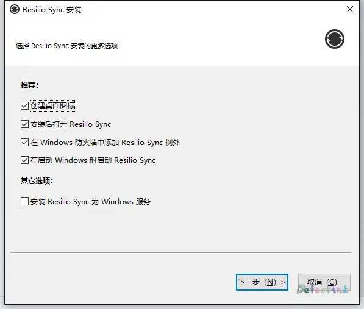
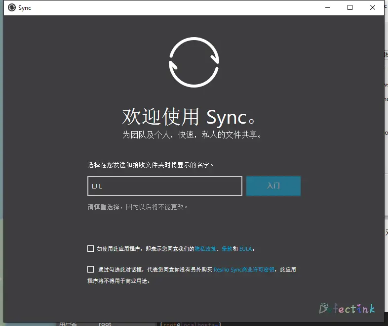
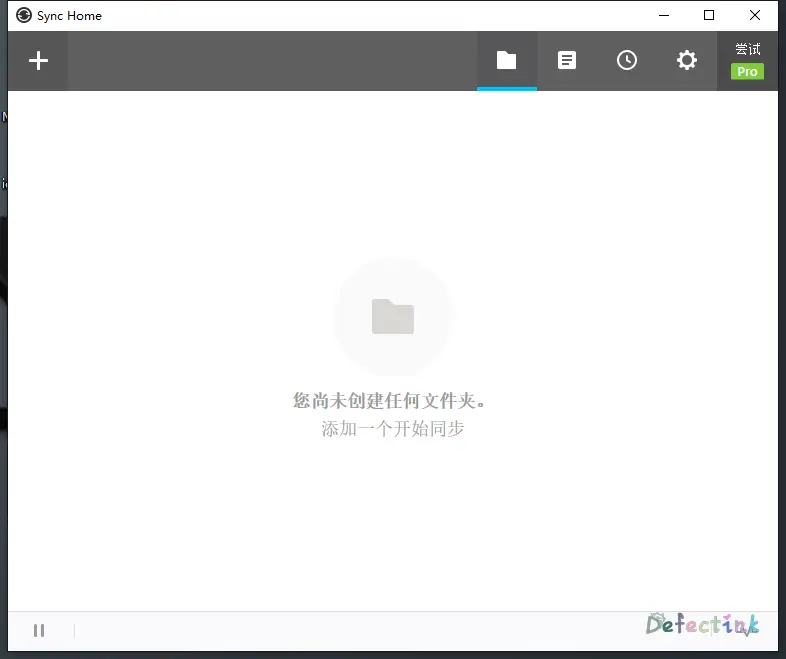
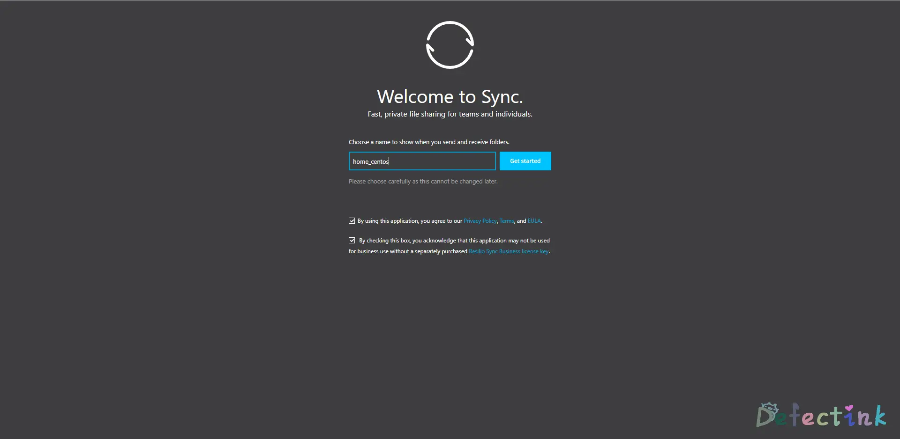
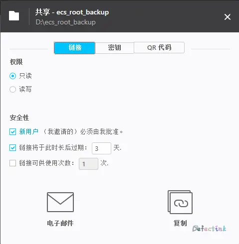
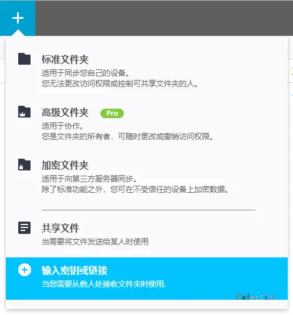
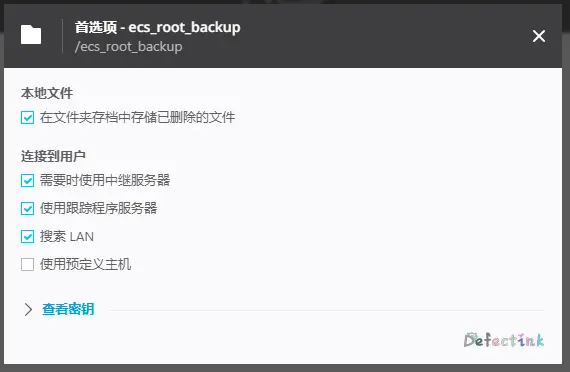

> 备份，同步一步到位。🏹

## 什么是Resilio Sync

[Resilio Sync](https://www.resilio.com/individuals/)是一款多平台的文件同步工具，能够实现几乎实时的同步效果。原名BitTorrent Sync，看到的原名就能想到，它的运作原理类似于我们的BitTorrent。

它是由[BitTorrent](https://en.wikipedia.org/wiki/BitTorrent_(company))开发的一款基于P2P的协议来进行传输文件的。

它和我以前用过的一款运作于Linux发行版之上的同步软件[lsyncd](https://github.com/axkibe/lsyncd)类似，都能达到几乎实时监控指定文件夹变动的一款同步工具。

相比较二者之间的不同的是，Resilio Sync在Windows平台是拥有GUI的（亦是使用WebUI），但是在其他服务端的操作系统上，类似于各种Linux发行版与Windows Server。它的GUI是以WebUI的方式提供给我们使用的。

这也是它的优点之一了，在不用反复的修改配置文件的情况下，我们可以使用基于WebUI的一种交互方式来对其进行操作。

这也是我很喜欢它的地方之一了❤

### 优点

如果我们用作同步工具来使用的话，它还是有很多的优点的：

1. 可以纯内网工作(P2P)
2. 多人实时同步，原理是人越多速度越快(BitTorrent)
3. 存储空间及流量等不受限制
4. 多平台、多网络环境同步
5. Free for home
6. WebUI

### 缺点

事物都是拥有两面性的，既然它拥有不少优点。那么缺点肯定也不会缺席：

1. 闭源软件(Free for home)
2. 公共网络可能会使用中转服务器
3. 类似BT的原理，机器需要保持在线才能保证传输

### 多平台

- Windows
- Mac OS
- Linux
- FreeBSD
- NAS设备
- [Android](https://play.google.com/store/apps/details?id=com.resilio.sync&hl=en_US)
- [IOS](https://itunes.apple.com/us/app/resilio-sync/id1126282325?mt=8)

两个移动设备上目前还是一款免费软件，不知道功能是什么样的。但是身为一个闭源软件在多平台都有免费使用的方案还是很欣慰的。

## 同类

[Syncthing](https://syncthing.net/)几乎就是Resilio Sync的另一面了，有人说它就是Resilio Sync的替代品。它不但能够实现相应的实时同步的所有功能，并且还是一款开源的自由软件。

对于我们来说，一款开源软件不仅仅是不收费这么简单。当一款开源软件由社区进行驱动时，人人都可以完全查看它的源代码以及改进。因此，一款开源软件对我们最大的益处就是真正安全与尊重隐私。

但闭源软件也有它存在的合理处，如果我们未来需要可靠稳定的支持，与更多的付费服务。Resilio Sync肯定也是一个不错的选择。毕竟顾客即是上帝🍡

总之各个实时同步的软件之间都是各有各的优缺点，具体想要使用哪一款，完全根据我们自身的需要与心情就OK了。

## 安装

上述我们有提到Resilio Sync支持多种平台，这里的我只使用到了Windows与Linux的两个发行版之间。所以其他平台的安装没有相应的记录。

### Windows

Windows是我们平常接触最多的一款GUI操作系统了，对于安装软件来说，差距都不会太大的。Resilio Sync也是同样。直接前往[官网](https://www.resilio.com/individuals/#hero)选择合适的授权下载安装即可。

安装界面仅仅只需要一步


合适的选择后，对于较新的Windows平台可是直接打开一个软件窗口



接受了几个隐私政策与EULA之后（有空还是要多留意条款之类的），我们就可以正常使用了。

打开后的简洁的界面



配置之类的稍后再说，再将自己的其他平台的机器也给完成安装。

### Linux

对于在各个Linux平台的安装，官方有给一个完整的[帮助文档](https://help.resilio.com/hc/en-us/articles/206178924-Installing-Sync-package-on-Linux)其中有各个版本的不同数位版的下载链接。以及一些发行版的手动添加源的二进制安装方式。

- 下载安装包

对于网络环境不好的时候，可以考虑使用离线安装包的方式来安装。官方给了两个包，分别是deb和rpm。

DEB：

```
sudo dpkg -i <resilio-sync.deb>
```

RPM

```
sudo rpm -i <resilio-sync.rpm>
```

由于我的服务器因为网络环境无法与其官方源通信，所以只好选择使用下载离线安装包的方式来进行安装了。

相比较之下，个人感觉Linux平台的安装甚至比带有GUI的Windows更加方便。对于此软件，至需要一条命令即可。速度也很快。

- 使用软件仓库安装

使用软件仓库安装，我们需要简单的三个步骤：

1. 添加仓库源
2. 添加GPG公钥用于验证
3. 安装✨

对于Debian-based Linux（Debian, Ubuntu, Mint, Zorin, Elementary）

创建用于安装的仓库源列表：

```
echo "deb http://linux-packages.resilio.com/resilio-sync/deb resilio-sync non-free" | sudo tee /etc/apt/sources.list.d/resilio-sync.list
```

添加公钥：

```
curl -LO http://linux-packages.resilio.com/resilio-sync/key.asc && sudo apt-key add ./key.asc
```

更新源与安装：

```
sudo apt-get update
sudo apt-get install resilio-sync
```

对于RPM-based Linux（Red Hat, Fedora, CentOS）

创建用于安装的仓库源列表：

```
printf "[resilio-sync]\nname=Resilio Sync\nbaseurl=https://linux-packages.resilio.com/resilio-sync/rpm/\$basearch\nenabled=1\ngpgcheck=1\n" | sudo tee /etc/yum.repos.d/resilio-sync.repo
```

添加公钥：

```
sudo rpm --import https://linux-packages.resilio.com/resilio-sync/key.asc
```

安装：

```
sudo yum install resilio-sync
```

更新：

```
sudo yum check-update
sudo yum update resilio-sync 
```

## 运行与配置

Windows上的打开软件不需要任何多嘴了，双击快捷方式打开就好了。

对于Linux发行版上，几款目前常用的较新的发行版运行软件的方式都是差不多的。

可以使用Systemd进行控制

自动运行服务：

```
sudo systemctl enable resilio-sync
```

启动与停止：

```
sudo systemctl start resilio-sync
sudo systemctl stop resilio-sync
```

对于在没有GUI的机器的环境下，是可以使用WebUI通过其他机器的浏览器访问来进行控制操作。

所以我们可以修改其配置文件来进行启动操作。

### 默认的配置文件

```
/etc/resilio-sync/config.json
```

而对于基本的使用，配置文件也是非常的简单易读的。

```
{
    "storage_path" : "/var/lib/resilio-sync/",
    "pid_file" : "/var/run/resilio-sync/sync.pid",

    "webui" :
    {
        "listen" : "127.0.0.1:8888"
    }
}
```

对于，官方文档称为了安全选择，软件默认监听`127.0.0.1`。如果需要在其他机器上直接访问的话，我们需要修改监听地址为：

```
"listen" : "0.0.0.0:8888"
```

并且可以根据自己的需求修改监听的端口。

其中`storage_path`为软件的一些设置，log等文件的存放目录。也可以根据自身的需要修改。

```
╰─# ls /var/lib/resilio-sync/
debug.txt        history.dat      http.port     settings.dat.old  storage.db-wal  sync.dat.old  sync.log
FileDelayConfig  history.dat.old  settings.dat  storage.db        sync.dat        sync.lng
```

### 示例配置文件

上述运行的配置文件那么的简单易懂，同时可自定义的功能也就是更少了。而对于软件的一些其他功能在配置文件中的写法，官方是有留给我们示例的配置文件的。

我们只需要使用一条命令就可以将示例的配置文件导出到当前目录下：

```
rslsync --dump-sample-config > sync.conf
```

并且其中注释说明等都是非常完善的：

```
╰─# cat sync.conf 
{
   "device_name": "My Sync Device",
// "listening_port" : 0, // 0 - randomize port

/* storage_path dir contains auxilliary app files if no storage_path field: .sync dir created in current working directory */
// "storage_path" : "/home/user/.sync",

/* set location of pid file */
// "pid_file" : "/var/run/resilio/resilio.pid",

/* use UPnP for port mapping */
  "use_upnp" : true,

/* 这里只截取部分配置 */
```

当我们修改的差不多的使用，我们就可以使用上述命令启动了。启动后，可以在进程中看到默认读取的配置文件的路径：

```
╰─# ps -aux | grep rslsync                  
rslsync   88730  0.5  1.5 772560 15316 ?        Ssl  01:12   0:05 /usr/bin/rslsync --config /etc/resilio-sync/config.json
```

### 用户

同样是为了安全原因，软件默认是使用最小权限的**rslsync**的用户来运行的。这样就会导致一个问题，在**rslsync**这个用户没有权限的目录就无法打开，就会导致无法使用该目录了。

最简便的解决办法就是将需要的文件夹给予用户**rslsync**可使用的权限，我们可以将**rslsync**添加到当前的用户组，并保证需要同步的文件夹用于上述组的权限：

```
sudo usermod -aG user_group rslsync
sudo chmod g+rw synced_folder
```

亦或者直接修改rslsync用户为当前使用的用户来运行程序，编辑文件**/usr/lib/systemd/user/resilio-sync.service**将文件中的：

```
WantedBy = multi-user.target
```

修改为：

```
WantedBy = default.target
```

随后需要reload systemd并重启程序：

```
systemctl daemon-reload
systemctl --user start resilio-sync
```

此处的`--user`与普通启动可以分别守护两个进程，默认的分别为：

```
rslsync  27519  0.4  0.8 670144 16928 ?        Ssl  15:36   0:01 /usr/bin/rslsync --config /etc/resilio-sync/config.json
root     29385  0.3  0.4 589864  9676 ?        Ssl  15:43   0:00 /usr/bin/rslsync --config /root/.config/resilio-sync/config.json
```

且`--user`的用户成功被更改为当前用户root。当然配置文件也是独立的。	

### 除此之外

软件还可以直接在终端中使用`rslsync`命令来进行运行等其他控制。上述的打印示例配置文件就是一个例子。关于该方式的更多可以在官方的帮助文档[Guide To Linux, And Sync Peculiarities](https://help.resilio.com/hc/en-us/articles/204762449-Guide-to-Linux)中找到。

成后运行后的界面与Windows完全一样。毕竟二者是同一种方式展示的UI界面。



## 同步

安装均已经完成，接下来就是简单从操作来实现需要的同步效果了。

在保证权限都是正常的情况下，添加在A机器添加我们需要进行同步的文件夹。选择好了之后就是三种分享链接的方式。



分别是“链接”、“密钥”和二维码三种方式。

随后我们就可以使用三种方式的其中一种，例如使用我最喜欢的密钥，选择好读写权限后，在需要同步的B机器上输入复制过来的密钥。



然后等着他们自己开始同步就OK了。在多平台的环境下也是不会影响正常工作的。

除此之外，对于同步的文件夹还有一些其他的选项可以配置。具体就看自己的需要来配置了🌭



## 参考&推荐阅读

* [Installing Sync Package On Linux](https://help.resilio.com/hc/en-us/articles/206178924-Installing-Sync-package-on-Linux)
* [Legal](https://www.resilio.com/legal/eula/)
* [BitTorrent (company)](https://en.wikipedia.org/wiki/BitTorrent_(company))
* [Resilio Sync](https://en.wikipedia.org/wiki/Resilio_Sync)
* [Resilio Sync Android](https://play.google.com/store/apps/details?id=com.resilio.sync&hl=en_US)
* [Resilio Sync IOS](https://itunes.apple.com/us/app/resilio-sync/id1126282325?mt=8)
* [Resilio Sync Help Center](https://help.resilio.com/hc/en-us)