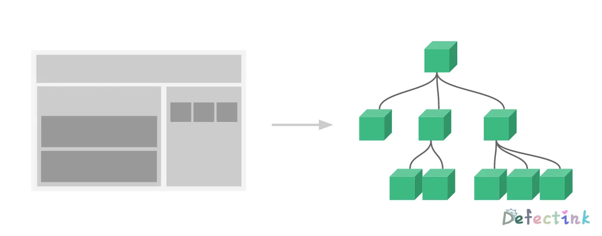
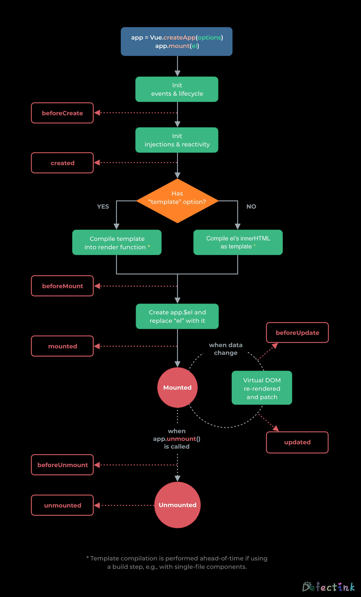

在我打算学习vue的时候，正是其3.0版本发布不久的时候。很庆幸生活在这个时代，但困扰我的是是否应该由旧版本的2.x开始学习？一向选择困难的我最终打算两个版本一起学习，从2.x开始入门，顺便还能一睹其与3.0版本的变化。

## 起步

Vue (读音 /vjuː/，类似于 view) 是一套用于构建用户界面的渐进式框架。与其它大型框架不同的是，Vue 被设计为可以自底向上逐层应用。Vue 的核心库只关注视图层，不仅易于上手，还便于与第三方库或既有项目整合。另一方面，当与现代化的工具链以及各种支持类库结合使用时，Vue 也完全能够为复杂的单页应用提供驱动。

### 安装

从最基础的开始，可以在单html文件中引入vue。

```js
<script src="https://cdn.jsdelivr.net/npm/vue/dist/vue.js"></script>
```

### 声明式渲染

Vue的核心是采用简介的模板语法来声明式地将数据渲染进DOM系统：

```html
    <div class="app">
        {{ message }}
    </div>
```

```js
        let app = new Vue({
            el: '.app',
            data: {
                message: 'Hello world!'
            }
        })
```

不得不说Vue的教程确实简单易懂，也可能是因为Vue本身的语法简洁，第一次看到教程里的这个实例时，大部分都是能够理解的。目前为止，已经成功的创建了第一个Vue应用。

现在数据和DOM已经被建立的关联，所有的东西都是响应式的，刚刚新建的`app`实例拥有一个`app.message`的值，在console中修改就能实时的看到相应的属性更新。

目前就不再和HTML直接进行交互了，一个Vue应用会将其挂在到一个DOM元素上：`el: '.app'`，然后对其进行完全控制。那个 HTML 是我们的入口，但其余都会发生在新创建的 Vue 实例内部。

除此之外，Vue还能直接对DOM元素attribute进行绑定

```html
    <div class="app">
        
    </div>

    <script>
        let app = new Vue({
            el: '.app',
            data: {
                src: 'https://cdn.defectink.com/images/file_4963947.png',
                alt: 'ヽ(✿ﾟ▽ﾟ)ノ',
                message: 'ヽ(✿ﾟ▽ﾟ)ノ'
            }
        })
    </script>
```

这样的操作方法被称之为**指令**。指令带有`v-`前缀，以表示他们是Vue提供的特殊attribute。它们会在渲染的 DOM 上应用特殊的响应式行为。

### 条件与循环

Vue提供了一个类似于条件语句的指令，切换一个元素的显示也非常的简单，使用`v-if`语句。

```html
    <div class="app">
        
    </div>

    <script>
        let app = new Vue({
            el: '.app',
            data: {
                src: 'https://cdn.defectink.com/images/file_4963947.png',
                alt: 'ヽ(✿ﾟ▽ﾟ)ノ',
                message: 'ヽ(✿ﾟ▽ﾟ)ノ',
                seen: true
            }
        });
    </script>
```

继上一个例子，添加一个和绑定DOM attribute类似的指令：`v-if`。相应的，它也类似于常见的if语句，当值为`true`时，则显示这个DOM，反之亦然。当然，所有的内容还都是动态的，在console中继续使用`app.seen = false`时，DOM元素将会隐藏。

既然有了if语句，那自然是不能少了for循环的。

```html
    <ol class="app">
        <li v-for="todo in items">
            {{ todo.txt }}
        </li>
    </ol>

    <script>
        let app = new Vue({
            el: '.app',
            data: {
                items: [
                    { txt: '小' },
                    { txt: '小小' },
                    { txt: '小小小肥羊' }
                ]
            }
        });
    </script>
```

Vue里的for循环可以用来创建列表等，并且是以数组的方式对其DOM进行控制的。指令`v-for="todo in items"`中的`items`就对应了`data`中的`items`数组，而DOM里的参数`{{ todo.txt }}`就相当于`items[i].txt`。

并且后续可以使用数组方法对DOM进行直接的操作：

```js
app.items.push({txt: 'test'});
// 4
app.items.shift();
// {__ob__: Observer}
```

### 处理用户输入

Vue可以使用指令`v-on`来对DOM绑定一个事件监听器，通过它来调用在实例中定义的方法

```html
    <div class="app">
        <input type="button" v-on:click="disableImage" value="切换！"><br>
        
    </div>

    <script>
        let app = new Vue({
            el: '.app',
            data: {
                src: 'https://cdn.defectink.com/images/file_4963947.png'
            },
            methods: {
                disableImage: function () {
                    if (this.src) {
                        this.src = '';
                    } else {
                        this.src = 'https://cdn.defectink.com/images/file_4963947.png';
                    }
                }
            }
        });
    </script>
```

这是对事件监听器的一个实例，通过在`input`上绑定一个事件监听器来触发对实例中定义的方法。在实例中的方法中的`this`指向于当前实例。

在实例方法中，我们更新了应用状态，但没有触碰DOM——所有的 DOM 操作都由 Vue 来处理，我们编写的代码只需要关注逻辑层面即可。

Vue还提供了`v-model`指令，它能够轻松实现对表单的双向绑定

```html
    <div id="app">
        <input type="text" v-model="message"><br>
        <p>
            {{ message }}
        </p>
    </div>

    <script>
        let app = new Vue({
            el: '#app',
            data: {
                message: 'Input something...'
            }
        });
    </script>
```

## 组件化应用构建

组件系统是Vue的另一个重要概念，它是一种抽象，允许我们使用小型、独立和通常可复用的组件构建大型应用。一个大型的页面应用将由几个可重复利用的组件构成。



在 Vue 里，一个组件本质上是一个拥有预定义选项的一个 Vue 实例。在 Vue 中注册组件很简单：

```js
        Vue.component('todo-item', {
            template: '<li>这是一个测试</li>'
        });

        let app = new Vue(...)
```

注册完成后就可以使用使用它来构建一个模板：

```html
    <ol id="app">
        <todo-item></todo-item>
    </ol>
    <script>
        Vue.component('todo-item', {
            template: '<li>这是一个测试</li>'
        });
        let app = new Vue({
            el: '#app'
        })
    </script>
```

这样一个组件简而易懂，定义一个特定内容的组件，然后在html中渲染出来其内容。但这样还不够，内容都是特定的，每次渲染的都是同样的文本。我们应该能从父作用域将数据传到子组件才对。

稍微修改一下定义的组件，使其能够接收一个prop。这类似于一个自定义的attribute。

```js
Vue.component('todo-item', {
  // 这个 prop 名为 todo。
  props: ['todo'],
  template: '<li>{{ todo.text }}</li>'
})
```

现在，我们可以使用 v-bind 指令将待办项传到循环输出的每个组件中：

```html
    <div id="app">
        <ol>
            <todo-item v-for="item in list" v-bind:todo="item" v-bind:key="item.id"></todo-item>
        </ol>
    </div>
    <script>
        Vue.component('todo-item', {
            props: ['todo'],
            template: '<li>{{ todo.text }}</li>'
        });
        let app = new Vue({
            el: '#app',
            data: {
                list: [
                { id: 0, text: '蔬菜' },
                { id: 1, text: '奶酪' },
                { id: 2, text: '随便其它什么人吃的东西' }
                ]
            }
        });
    </script>
```

这个实例中，父作用域中的数据通过组件的`prop`接口进行了良好的解耦。在一个大型应用中，有必要将整个应用程序划分为组件，以使开发更易管理。类似于这样：

```html
<div id="app">
  <app-nav></app-nav>
  <app-view>
    <app-sidebar></app-sidebar>
    <app-content></app-content>
  </app-view>
</div>
```

### 与自定义元素的关系

Vue组件非常类似于**自定义元素**——它是 Web 组件规范的一部分，这是因为 Vue 的组件语法部分参考了该规范。例如 Vue 组件实现了 Slot API 与 is attribute。但是，还是有几个关键差别：

1. Web Components 规范已经完成并通过，但未被所有浏览器原生实现。目前 Safari 10.1+、Chrome 54+ 和 Firefox 63+ 原生支持 Web Components。相比之下，Vue 组件不需要任何 polyfill，并且在所有支持的浏览器 (IE9 及更高版本) 之下表现一致。必要时，Vue 组件也可以包装于原生自定义元素之内。

2. Vue 组件提供了纯自定义元素所不具备的一些重要功能，最突出的是跨组件数据流、自定义事件通信以及构建工具集成。

虽然 Vue 内部没有使用自定义元素，不过在应用使用自定义元素、或以自定义元素形式发布时，依然有很好的互操作性。Vue CLI 也支持将 Vue 组件构建成为原生的自定义元素。

## Vue 3!

对于一个初学者来说，同时学习两个版本可能有些吃力。但我依然想从最基本的开始时就了解了它的变化，并且还发现了一些有意思的收获。

### 更简洁的声明

第一次学习2.x版本时，发现确实如其介绍的那样：

> Vue.js 的核心是一个允许采用简洁的模板语法来声明式地将数据渲染进 DOM 的系统

用最直白的方式来看，2.x使用的方式是类似于构造函数来声明一个实例，并且有着固定的搭配：`el`为DOM的element，`data`为数据，后续还能继续添加方法：

```js
        let app = new Vue({
            el: '.app',
            data: {
                message: 'Hello world!'
            }
        })
```

而Vue3使用了另一种方法：

```html
    <div id="test">
        <p>
            {{ message }}
        </p>
    </div>
    <script>
        let count = {
            data() {
                return {
                    message: 'Hello world!'
                }
            }
        }

        Vue.createApp(count).mount('#test');
    </script>
```

Vue3首先使用一个对象字面量创建一个带有`data()`函数的变量，该函数使用的是一种更简短的[定义方法的方法](https://developer.mozilla.org/zh-CN/docs/Web/JavaScript/Reference/Functions/Method_definitions)。`data()`函数的返回值就是实例的数据。

当变量声明完成后，使用Vue的一个`createApp()`方法传入，并接着使用`mount()`方法传入DOM。这样一个Vue的实例就创建挂载完成了，相比较之下，我觉得这种方式对其生命周期有着更清晰的显示。

当然，也可以跳过创建变量这一步，直接传参，这样看上去更像Vue2。

```html
    <div id="app">
        <p>
            {{ message }}
        </p>
    </div>
    <script>
        let app = Vue.createApp({
            data() {
                return {
                    message: 'xfy!'
                }
            },
            mounted() {
                let id = setInterval(() => {
                    this.message = 'x' + this.message;
                }, 1000);
                setTimeout(() => {
                    clearInterval(id);
                }, 10000)
            }
        }).mount('#app')
    </script>
```

就拿其官方文档的实例来看，再创建实例时还能方便的为其的添加其他方法，并且其方法名就是生命周期名。例如在挂载后执行`mounted()`。

```html
    <div id="test">
        <p>
            {{ message }}
        </p>
    </div>
    <script>
        let count = {
            data() {
                return {
                    message: 'Hello world!'
                }
            },
            mounted() {
                let id = setInterval(() => {
                    this.message += this.message;
                }, 1000);
                setTimeout(() => {
                    clearInterval(id);
                },9000)
            }
        }

        Vue.createApp(count).mount('#test');
```

> 入门到这里时，2和3目前接触到的只是写法不同。后续以3为基础学习，并和2做比较。

## 应用实例

所有的 Vue 组件都是实例，并且接受相同的选项对象。

### 创建一个实例

每个 Vue 应用都是通过用`createApp`函数创建一个新的应用实例开始的，而2.x则是以一个构造函数开始的。

```js
Vue.createApp(...);
```

创建实例后，我们可以挂载它，将容器传递给`mount`方法。`mount`方法接收DOM的选择器（class、ID等）。

```js
Vue.createApp(...).mount('#id');
```

### 根组件

`Vue.createApp()`方法用于创建一个根组件，当我们挂载一个应用程序时，该组件将为渲染起点。

一个应用需要被挂载到一个DOM节点上。例如我们需要挂载实例到`<div id="app"></div>`上，通常的步骤如下：

```js
        let rootComponent = { /* some data */ };
        let app = Vue.createApp(rootComponent);
        let vm = app.mount('#app');
```

不像大多数的应用程序方法，`mount`不会返回应用。相反，它会返回根节点实例。也就说变量`vm`是根节点的实例。

Vue2和3虽然都没有完全遵循MVVM模型，但是 Vue 的设计也受到了它的启发。

一个 Vue 应用由一个通过 createApp 创建的根实例，以及可选的嵌套的、可复用的组件树组成。举个例子，一个 todo 应用的组件树可以是这样的：

```
根实例
└─ TodoList
   ├─ TodoItem
   │  ├─ DeleteTodoButton
   │  └─ EditTodoButton
   └─ TodoListFooter
      ├─ ClearTodosButton
      └─ TodoListStatistics
```

### 节点实例属性

前面我们遇到了`data`属性，`data`中定义的属性通过节点实例暴露出来：

```js
        let app = Vue.createApp({
            data() {
                return {
                    meg: 'greeting something...'
                }
            }
        });
        let vm = app.mount('#app');
        console.log(vm.meg) // 'greeting something...'
```

`data`中暴露出的属性都会加如其响应式系统，整个实例会被设置一个Proxy代理拦截其行为，从而监听数据的变化并实时渲染到DOM上。

还有其他各种用户自定义属性的组件选项能够添加到实例，例如`methods`, `props`, `computed`, `inject`和`setup`。

Vue同样也暴露了一些内建的属性，例如`$attrs`和`$emit`。他们都有`$`前缀与用户自定义的属性区分开来。

## 生命周期钩子

每个组件在创建后都要经历一系列初始化的步骤，例如，它需要设置数据监控，编译模板，挂载实例到DOM节点和当数据变化时更新DOM。这一系列操作也被称之为生命周期钩子。

简单来说，就是一个实例在从最初始的声明到最后的卸载期间不同阶段对其操作的API。

例如，调用`create()`钩子，在实例被创建后运行的操作：

```js
        let app = Vue.createApp({
            data() {
                return {
                    meg: 'test'
                }
            },
            created() {
                // `this`指向当前实例
                console.log('instance created!' + this.meg);
            }
        });
        let vm = app.mount('#app');
```

所有的一系列钩子，他们的`this`都指向当前调用的活动实例。

> 注意，不要在一个组件属性或回调中使用箭头函数。例如：`created: () => {console.log(this.a);};`或者`vm.$watch('a', newValue => this.myMethod());`。箭头函数没有自己的`this`，`this`会和其他变量一样，向上层作用域中查找，直到找到为止。通常会遇到这样的报错：`Uncaught TypeError: Cannot read property of undefined`或`Uncaught TypeError: this.myMethod is not a function.`

## 生命周期图

下图可以很清晰的看到Vue3的实例的一个生命周期。

