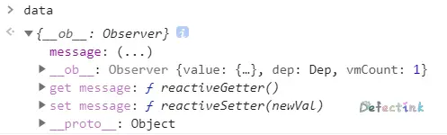
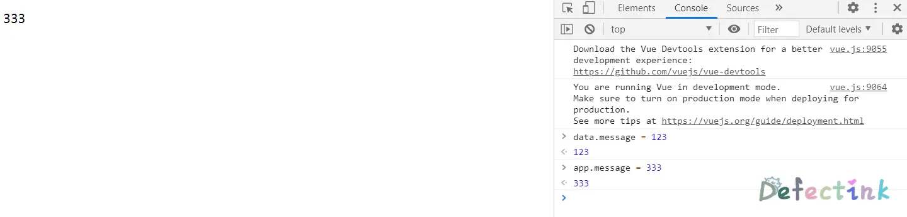
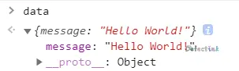
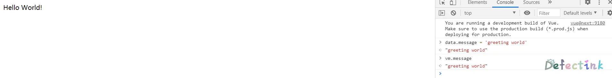
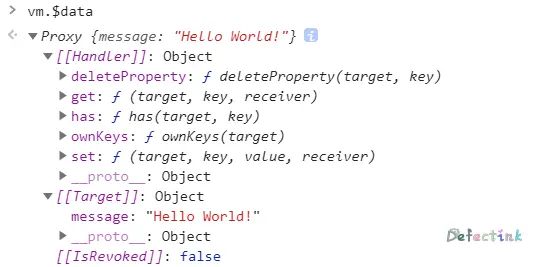

## 实时渲染

在学习 Vue2.x 的过程中，做过一个更改数据从而触发实时渲染 DOM 的小实例。期间很顺利，而后在同样方法测试 Vue3 的时候发现遇到了一些不同的行为。根据查阅了一些文档以及源码，做出了一些推测。

## 数据与方法

当一个 Vue 实例被创建时，它将 data 对象中的所有的 property 加入到 Vue 的响应式系统中。当这些 property 的值发生改变时，视图将会产生“响应”，即匹配更新为新的值。

在 Vue2.x 中，可以创建一个数据对象，为实例提供数据。虽然这样的写法和直接在实例中为`data`添加属性没有多少差别：

```html
    <div id="app">
        <p>
            {{ message }}
        </p>
    </div>
    <script>
        let data = {
            message: 'Hello World!'
        }
        let app = new Vue({
            el: '#app',
            data: data
        });
    </script>
```

这时我们单独创建的`data`对象与实例中的`data`成立了引用关系：

```js
app.$data.message === data.message
// true
```

并且他们三者是互等的：

```js
app.message === app.$data.message
app.$data.message === data.message
```

并且我们单独创建的`data`对象也被转换成了检测数据变化的 Observer 对象



因此，我们在修改`data`对象的内容时，app 实例的属性也会被改变，从而实时渲染到 DOM 上。



但在 Vue3 上发生了一些小小的改变。在 Vue3 上，我们将实例的`data`函数直接 return 为我们在父作用域中创建的对象，这个对象不会被修改为检测属性数据变化的对象。

```html
    <div id="app">
        <p>
            {{ message }}
        </p>
    </div>
    <script>
        let data = {
            message: 'Hello World!'
        };
        let app = Vue.createApp({
            data() {
                return data;
            }
        });
        let vm = app.mount('#app');
    </script>
```

这里的app是我们创建的实例，但最终挂载 DOM 后返回的实例为 vm。不同于 2.x 的地方是，这里我们在父作用域中创建的对象并没用任何的变化，它还是一个普通的对象。



并且，他们也互相建立了引用的关系；

```js
vm.message === data.message
// true
```

虽然他们已经是互相引用，但是`data`还是一个普通的对象。这里就会发现一个有意思的现象，只更新`data.message`的值，`vm.message`或者说`vm.$data.message`的值会同样更新，保持和`data`对象一样。但是DOM却没用被实时渲染。



这一点 2 和 3 有着很大的差距，在 Vue2 中，我们是可以通过`data`对象来实时更新 DOM 的。而在 3 中就不行了。

据我的猜测，主要是 Vue3 没有对父作用域的`data`对象设置 Proxy 代理的原因。虽然二者已经是互相引用，修改一个对象值，另一个对象也会被修改。**但是通过修改`data`的属性，并不会触发`vm.$data`对象的`set()`方法。**

## 模仿行为

我使用了一个小例子，模仿了一下 Vue3 的行为：

```js
// 这是在父作用域中的data对象，它是一个普通对象
let data = {
    message: 'xfy'
}

// 这是模拟set方法，成功set时会打印一条信息
let handler = {
    set: (obj, prop, value) => {
        obj[prop] = value;
        console.log('set success: ' + value);
    }
}

// 通过proxy创建一个继承自data属性的实例
let vm = new Proxy(data, handler);
```

这是一个很简单的例子，我们为`vm`对象设置了一个来自`data`对象的代理。现在二者就是互相引用的关系了，就和 Vue3 一样。

```js
data.message === vm.message
// true
```

我在代理的拦截中配置了一个 setter，当`vm`对象成功设置了值后，就会触发这个 setter ，并在控制台打印一则信息。用来模拟更新 DOM。也就是说，现在的`vm`实例就相当于 Vue 实例，当我更新其属性时，会在控制台动态的打印信息，就相当于实时更新了 DOM。就和 Vue 实例一样。

现在我们直接对`vm.message`赋值，则会成功触发预先设置的 setter 函数，成功的更新了值并且在控制打印了消息。

```js
vm.message
// "xfy"
vm.message = 'hello xfy';
// set success: hello xfy
// "hello xfy"
```

并且`data`对象也同样的被修改了。

```js
data.message
// "hello xfy"
```

直接设置`data.message`可以成功修改`vm.message`的值，但是却不会触发`vm`对象的 setter 方法。

```js
data.message = '嘤嘤嘤';
// "嘤嘤嘤"
vm.message
// 属性被修改，但是没有触发setter
// "嘤嘤嘤"
```

这里的小例子最简化的模拟了 Vue3 的实例行为，在真正的 Vue3 的实例上，我们也可以很清晰的看到其 Proxy 属性:



## 总结

总的来说就是因为 data 对象修改时不会触发实例的 set 方法，但数据依然会改变，只是 DOM 不会实时更新。