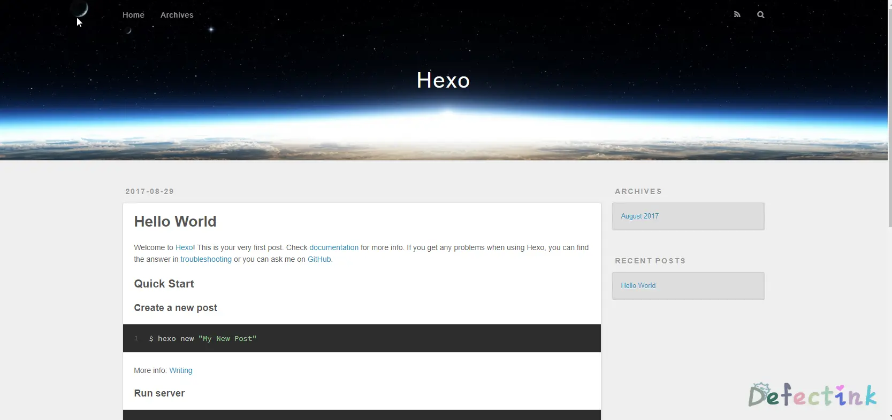

> 这是一篇写于较早期的文章，当时水平有限，文章质量不高。

好久不见

## Hexo?

Hexo是一款博客页面框架。特点是简洁、高效。使用markdown语法渲染文章。

其大概原理将本地markdown编写的.md文件经过多次渲染为html等静态页面文件。再由hexo服务发布。

可参考：

* https://www.zhihu.com/question/51588481
* http://coderunthings.com/2017/08/20/howhexoworks/
* 中文官网： https://hexo.io/zh-cn/

## 安装

Ubuntu

hexo的安装过程简便，工作原理与其他blog程序都大不相同。

安装前提

安装 Hexo 相当简单。然而在安装前，必须检查电脑中是否已安装下列应用程序：

• Node.js
• Git

官方文档中提到安装所需要的上述应用程序，在ubuntu环境下Git在默认情况下为已经安装的。

若无git，可使用如下命令进行安装

```bash
apt install git
```

首先安装npm与node.js

```bash
apt install npm nodejs-legacy
npm install -g hexo-cli
```

界面可能会如下


等待npm install -g hexo-cli命令完成后，hexo就已经安装在系统中了

接下来就是使用hexo建立站点了，可参考官方文档： https://hexo.io/zh-cn/docs/setup.html

```bash
$ hexo init <folder>
$ cd <folder>
$ npm install
```

## 配置

```bash
hexo init web
```


过程略长，稍等即可

init文件夹完成后，进入并安装

```bash
cd web && npm install
```

完成后文件目录为如下。

新建完成后，指定文件夹的目录如下：

```
.
├── _config.yml
├── package.json
├── scaffolds
├── source
|   ├── _drafts
|   └── _posts
└── themes
```

* _config.yml：站点的配置文件
* package.json：应用程序信息
* scaffolds：模版文件夹
* source：用户资源存放文件夹
* themes：主题文件夹

关于_config.yml的详细配置说明可参考官方文档： https://hexo.io/zh-cn/docs/configuration.html

## 服务端hexo-server

Hexo 3.0 把服务器独立成了个别模块，需要安装才能够使用。

```bsah
npm install hexo-server --save
```

安装完毕后，启动服务。（_config.yml需要先配置好）

```bash
hexo server -p 80 -s
```

正常情况下便可以直接进行访问，为如下页面。



Cannot GET /  ？

如出现运行服务端后访问提示为"Cannot GET / "，请尝试：

• 确保在init的目录下运行过npm install
• 添加了-s 参数，需要运行"hexo generate"命令生成静态文件。


无法打开？

• Hexo server默认端口号为4000，可用-p参数进行修改
• 需要在_config.yml配置文件中配置域名。

• 也可以使用-i命令修改监听的ip地址。默认为0.0.0.0
• 需要在所init的目录下运行server命令

Hexo server会占用整个shell，对于ssh连接来说，断开后便会中断服务。

我们可以使用screen命令搭配运行hexo server

```
screen hexo s -p 80 -s
```

运行后按下`Ctrl+a+d`将当前窗口放置后台运行

查看`screen -ls`

重新连接会话`screen -r 25211`

## 写作
可以执行下列命令来创建一篇新文章。

```bash
$ hexo new [layout] <title>
```

可以直接使用命令来创建文章，默认文件名为title

```bash
hexo new TEST
```

可以看到创建的文章会被创建为source目录下的.md文件，可以直接使用markdown语法写作修改。

> 若是静态运行，每次修改文章后需要使用hexo generate命令渲染。

更多方式可以了解官方说明： https://hexo.io/zh-cn/docs/writing.html

## 结尾

Hexo是一款不同与其他的博客框架，其简洁、高效和多样性的用法也是吸引人的一大特点。无需数据库，所有文章都在统一文件夹内，真正纯静态化的站点。新颖、特殊的工作方式让人眼前一亮。由于与众不同的特点，hexo与markdown的方式还得日后慢慢学习使用。

此文完全参照与官方说明文档。