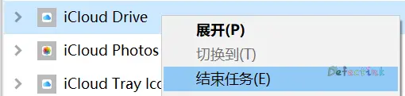
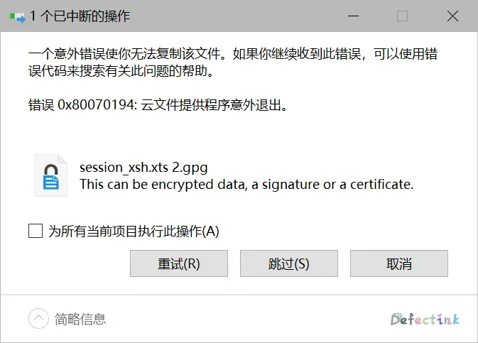

自从有了水果之后，除了天天被人嘲讽之外，还花了大手笔买了一个月6块的iCloud 50GB存储空间。但是光有手机来用还是略微有点大。以前一直以为iCloud就是手机上存个照片的，都忘了它其实也是一个云盘来着。于是决定利用一下剩下的空间，在Windows也用它来同步。

果然在试用了一段时间过后，水果没有让我失望过。iCloud照片可以跟着Windows系统的【图片】文件夹跑，但是iCloud云盘就不那么听话了，它只会在`User`目录下直接怼一个目录，并且**无法修改**，连个设置都没有。对于我这种C盘小的可怜的来说，就非常难受了。

所以只能用最基本的方法，创建符号链接 : 软链接来解决问题了。

## 操作

1. 找到当前的iCloud云盘文件夹位置，并剪切到目的位置。当然先复制更加稳妥。
2. 关掉不听话的iCloud。
3. 以管理员身份运行cmd，创建符号链接到新的存储位置。需要删除已经存在c盘的文件夹。

```cmd
C:\WINDOWS\system32>mklink /D C:\Users\Defectink\iCloudDrive D:\iCloudDrive
为 C:\Users\Defectink\iCloudDrive <<===>> D:\iCloudDrive 创建的符号链接
```

4. 重新运行iCloud。

没有退出按钮？



> 如果先退出再复制文件可能会导致意外



## 启动文件夹

我的iCloud不知道为什么就是无法开机自启，无奈只好放到Windows的启动文件夹里了。~~效果还可以~~

```cmd
shell:startup
```


