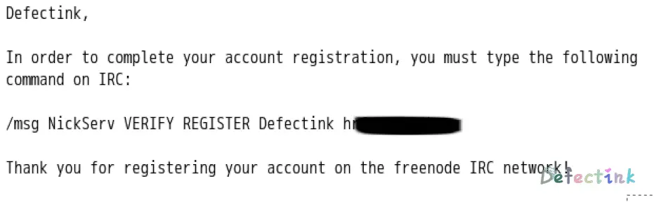
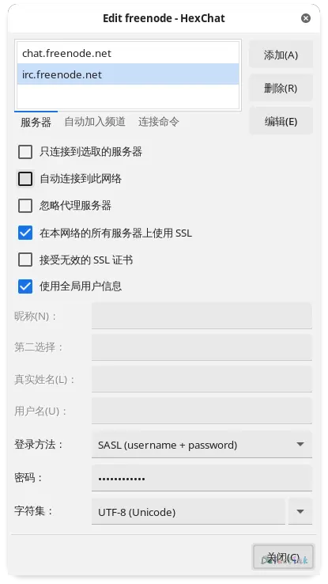

## IRC

IRC的全称为Internet Relay Chat，是一种应用层的协议。主要用于聊天，是早期互联网中主流的聊天工具，在今天依然也有不少人活跃。要使用它需要使用客户端来连接到服务器。

## IRC的组成

### 服务器

IRC是一个分布式的C/S架构。通过连接到一个服务器，就可以访问其连接的其他服务器上的频道。目前常见的有`irc.freenode.net`。

### 频道

频道存在于一个IRC服务器上。一个频道类似于一个聊天室，频道名称必须以#符号开始，例如#irchelp。

### 客户端

客户端用于连接至服务器，目前有很多种基于字符/GUI的跨平台软件。我用的是HexChat，一款基于GUI的软件。

## 使用

简单的了解了IRC是一款用于聊天的应用协议之后，就是开始使用了。既然是基于C/S架构的，那么首先是准备好自己的客户端。我挑了一个常见的GUI客户端：HexChat。

### 昵称注册

IRC并不像现代的聊天软件一样，需要先注册账号才能使用。它可以输入一个昵称后就进入服务器的频道内与人聊天。而昵称任然是需要唯一的，所以想要使用自己的昵称而不被别人占用，就需要注册昵称。类似于注册账号，基于邮箱与密码。

注册过程很简单，首先需要在聊天窗口中输入注册的命令：

```
/msg nickserv register password email
```

因为是在聊天框里输入命令，所以一定要注意命令格式，否则一不小心可能就会将明文的密码发到频道里。在注册昵称时推荐不加入任何频道，这样就不会不小心发出去了。

输入注册命令后就会收到认证的邮件，邮件大概是这样的（freenode）：



将邮件里的内容再输入一遍就注册完成了。

```
/msg NickServ VERIFY REGISTER Defectink hr*********
```

### 认证

当注册昵称过后，下次再使用这个昵称登录的时候就需要认证了。使用同样的`/msg`来进行认证：

```
/msg nickserv identify password
```

另一种说明身份的方法是设置服务器密码为您注册时提供的密码。

还可以对昵称设置进行保护，即在登录认证时，必须在30秒内向服务器表明身份，否则就强制改为其他昵称，并在一段时间内禁止此人使用此昵称（即便是在说明身份后）。在任意窗口中键入：`/msg nickserv set enforce on`。如果你登陆时在30秒内未能表明身份且被改为其他名字，请在改回原有名称前，输入`/msg nickserv release username password`以解除。

### SASL

不少 IRC 客户端都支持使用 SASL 自动登录。只需找到相应的选项，在 SASL 用户名密码部分分别填入自己的昵称和NickServ密码，就可以获得自动登录的效果。

不同的客户端有不同的设置方法，文档也很多。这是对于HexCaht的：

1. Open the Network List (Ctrl + S)
2. The freenode network may already exist; find it in the list then click on Edit
3. In the `User name` field, enter your primary nick
4. Select `SASL (username + password)` for the `Login method` field
5. In the `Password` field, enter your NickServ password



## 频道

以#号开头的字符串就是频道名，可以使用命令`/join`来加入频道。

`/join #archlinux-cn`

### 建立频道

创建频道同样也是使用`/join`来创建，如果创建的频道已经存在，则直接进入。建立频道可用于与自己的小伙伴聊天，也可以用于熟悉频道命令。

如果频道成功建立，那么我们就会成为频道的管理员。因为频道名和昵称一样需要具有唯一性，所以频道也需要注册。

`/msg ChanServ REGISTER <#channel> <passwd>`

一般频道都通过ChanServ这个机器人管理. 

`/msg ChanServ SET <频道名> GUARD ON`

在已注册的频道上委任管理员OP

`/msg ChanServ op #xfy Defectink`

设置频道简介

`/topic <your_topic>`

### 频道模式

频道的模式用于设置频道的一些功能与限制。通过`/mode #channel`来列出频道模式，通过`/msg chanserv info #channel`来列出有MLOCK的模式。

使用`/mode #channel +(mode)`或者`/mode #channel -(mode)`来增加或删除模式。带有MLOCK的模式需要使用`/msg ChanServ SET #foo MLOCK +c`

一些常用的模式：

| Mode(name)                | Description                                                  |
| :------------------------ | ------------------------------------------------------------ |
| b (channel ban)           | Prevent users from joining or speaking. Sending /mode #channel +b alone will return the current ban list. While on the channel, banned users will be unable to send to the channel or change nick. The most common form for a ban is +b nick!user@host. The wildcards * and ? are allowed, matching zero-or-more and exactly-one characters, respectively. Bans set on IP addresses will apply even if the affected user joins with a resolved or cloaked hostname. CIDR notation is supported in bans. The second form can be used for bans based on user data. You can append $#channel to any ban to redirect banned users to another channel. |
| q (quiet)                 | Works like +b (ban user), but allows matching users to join the channel. |
| c (colour filter)         | Strip colour and formatting codes from channel messages.     |
| C (block CTCPs)           | Blocks CTCP commands (other than /me actions).               |
| i (invite only)           | Users are unable to join invite-only channels unless they are invited or match a +I entry. |
| k (password)              | To enter the channel, you must specify the password on your /join command. Keep in mind that modes locked with ChanServ's MLOCK command can be seen by anyone recreating the channel; this includes keys. Also keep in mind that users being on the channel when +k is set will see the key as well. |
| n (prevent external send) | Users outside the channel may not send messages to it. Keep in mind that bans and quiets will not apply to external users. |
| l (join limit)            | Takes a positive integer parameter. Limits the number of users who can be in the channel at the same time. |
| m (moderated)             | Only opped and voiced users can send to the channel. This mode does not prevent users from changing nicks. |
| t (ops topic)             | Only channel operators may set the channel topic.            |

### 管理员

频道管理员称为operation channel。通常为：

1. sop (super operator) 频道的註册者，拥有操作频道所有权限，包括踢人。
2. aop (auto operator) 频道註册者信任的共同管理者，拥有部分权限，和第三个的差异在於，离开频道后再进入还是能拥有管理权限。
3. op 普通管理者，可能一旦离开频道就失去op。

## weechat

weechat是一款基于命令行的客户端。

### 添加服务器

```
/server add freenode chat.freenode.net
```

### 服务器选项

weechat的一些选项加油默认值，昵称默认为终端用户名。

```
/set irc.server.freenode.nicks "mynick,mynick2,mynick3,mynick4,mynick5"
```

设置用户和真实姓名：

```
/set irc.server.freenode.username "My user name"
/set irc.server.freenode.realname "My real name"
```

在启动时启用自动连接到服务器：

```
/set irc.server.freenode.autoconnect on
```

使用SSL连接：

```
/set irc.server.freenode.addresses "chat.freenode.net/7000"
/set irc.server.freenode.ssl on
```

SASL：

```
/set irc.server.freenode.sasl_username "mynick"
/set irc.server.freenode.sasl_password "xxxxxxx"
```

nickserv：

```
/set irc.server.freenode.command "/msg nickserv identify xxxxxxx"
```

autojoin：

```
/set irc.server.freenode.autojoin "#channel1,#channel2"
```

### 连接服务器

```
/connect freenode
```

```
/disconnect freenode
```

### 窗口/缓冲区管理

```
/buffer
/window
```

例如，将屏幕垂直分割为一个小窗口（1/3宽度）和一个大窗口（2/3），使用命令：

```
/window splitv 33
```

删除分割：

```
/window merge
```

## 一些常用的命令

| 示例命令                                     | 备注                                         |
|:---------------------------------------------|:---------------------------------------------|
| `/server irc.freenode.net`                   | 连接到 `freenode` 网络                       |
| `/nick myName`                               | 更换昵称为 myName                            |
| `/msg nickserv register password me@163.com` | 注册昵称, 密码为 password, 邮箱为 me@163.com |
| `/join #java`                                | 进入 #java 聊天室                            |
| `/exit`                                      | 退出账户                                     |
| `/nick zhijia`                               | 登陆或切换用户名                             |
| `/msg NickServ identify <password>`          | 切换用户后登陆验证用户身份                   |
| `/help`                                      | 帮助                                         |
| `/quit`                                      | 退出服务器                                   |
| `/whois 昵称`                                | 查看某人的资料                               |
| `/part`                                      | 离开频道                                     |
| `/query 昵称`                                | 和某人开小窗口私聊                           |
| `/away 原因`                                 | 离开                                         |
| `/away`                                      | 取消离开。当您不写原因时，就会取消离开状态   |

## 坑中

在今天日异月新的IM中，IRC肯定是较小众。虽然几乎就是上个世纪流行的沟通方式了，不过在今天回味一下也很棒，如果有人在一起聊天的话就更棒了。

freenode有个web版，入门体验很好。[webchat](https://webchat.freenode.net/)

另外，#xfy on freenode.