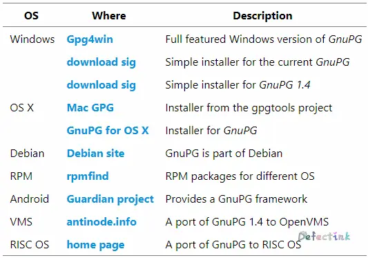
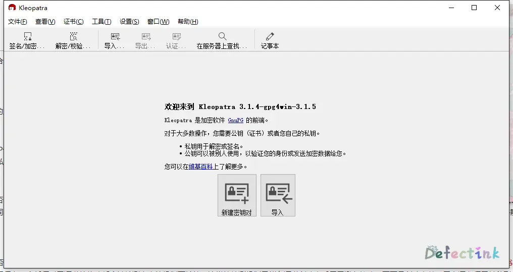
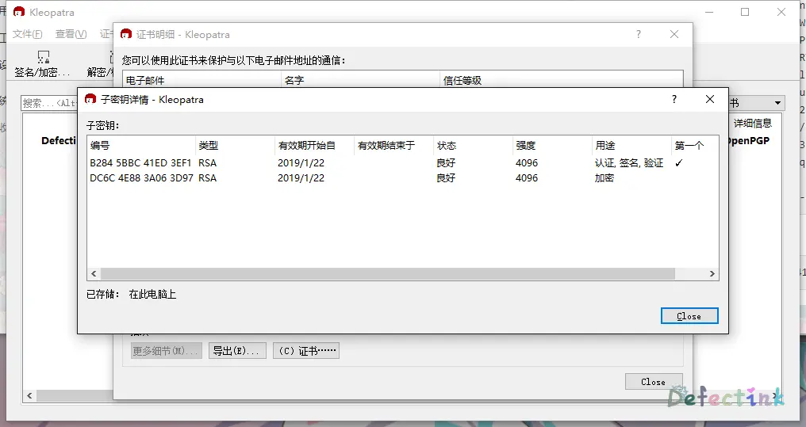

GPG/PGP赛高！

## 什么是非对称加密？

人类的历史上加密走了很长的一段路程。想尽了各种办法来保护自己那不想让不该知道的人知道的东西。 加密这东西，在密码学中最直白的解释就是将一般的明文信息改变为难以读取的内容，使其不可读的过程只有拥有解密方法的对象，经由解密过程，才能将密文还原为正常可读的内容。 

大概在1970年代中期，所谓的“强加密”的使用开始从政府保密机构延申至公共的领域了，也就是说开始到我们大众都开始接触了。当今世界，加密已经是我们的日常生活中常常见到的东西了。 

例如我们常常访问的带有SSL/TLS的网站，这也是非对称加密的一种。 所谓的对称加密，它也是密码学中的一种。但他与对称加密不同的是，它需要两个密钥，一个是公开密钥，另一个是私有密钥；一个用作加密，另一个则用作解密。使用其中一个密钥把明文加密后所得的密文，只能用相对应的另一个密钥才能解密得到原本的明文；甚至连最初用来加密的密钥也不能用作解密。

 由于加密和解密需要两个不同的密钥，故被称为非对称加密； 不同于加密和解密都使用同一个密钥的对称加密。虽然两个密钥在数学上相关，但如果知道了其中一个，并不能凭此计算出另外一个；因此其中一个可以公开，称为公钥，任意向外发布；不公开的密钥为私钥，必须由用户自行严格秘密保管，绝不透过任何途径向任何人提供，也不会透露给被信任的要通信的另一方。

### 加密

如果任何人使用公钥加密明文，得到的密文可以透过不安全的途径（如网络）发送，只有对应的私钥持有者才可以解密得到明文；其他人即使从网络上窃取到密文及加密公钥，也无法（在数以年计的合理时间内）解密得出明文。 

典型例子是在网络银行或购物网站上，因为客户需要输入敏感消息，浏览器连接时使用网站服务器提供的公钥加密并上传数据，可保证只有信任的网站服务器才能解密得知消息，不必担心敏感个人信息因为在网络上传送而被窃取。 

在现实世界上可作比拟的例子是，一个传统保管箱，开门和关门都是使用同一条钥匙，这是对称加密；而一个公开的邮箱，投递口是任何人都可以寄信进去的，这可视为公钥；而只有信箱主人拥有钥匙可以打开信箱，这就视为私钥。 

常见的公钥加密算法有：RSA、ElGamal、背包算法、Rabin（RSA的特例）、迪菲－赫尔曼密钥交换协议中的公钥加密算法、椭圆曲线加密算法（英语：Elliptic Curve Cryptography, ECC）。使用最广泛的是RSA算法（由发明者Rivest、Shmir和Adleman姓氏首字母缩写而来）是著名的公开秘钥加密算法，ElGamal是另一种常用的非对称加密算法。

#### 加密过程

直白的解释： Tom 和 Jerry想发送一些消息/文件，而不被隔壁的Spike知道文件的内容。于是它们机智的采用了非对称加密来保证内容的安全性。

1. Tom先生产非对称的两个密钥，分别为公钥A，私钥B
2. 为了能让Jerry发过来的消息被加密了，Tom先将可公开的公钥A发给Jerry
3. 因为公钥A是完全可公开的，所以Spike知道也没关系
4. Jerry收到Tom发的公钥A，并将自己的文件X使用公钥A进行加密
5. 随后Jerry就可以将加密的文件A(X)正大光明的发送给Tom了
6. 此时的Spike就算截取到加密过的文件A(X)也没有用
7. 因为Tom收到的加密文件A(X)只有它自己的私钥B能够解密，于是它收到后可以使用私钥B正常解密
8. 所以如果Tom丢失了它的私钥B，那么Tom and Jerry都无法读取加密的文件A(X)了
9. （没有私钥就无法解开公钥加密过的信息）
10. 相反，Jerry也可以将自己的公钥发给Tom，使其加密要发给自己的信息。

#### 数字签名

如果某一用户使用他的私钥加密明文，任何人都可以用该用户的公钥解密密文；由于私钥只由该用户自己持有，故可以肯定该文件必定出自于该用户。 

公众可以验证该用户发布的数据或文件是否完整、中途有否曾被篡改，接收者可信赖这条信息确实来自于该用户，该用户亦无法抵赖，这被称作数字签名。 所以我们常常见到提示一定要保护好自己的私钥，因为不仅仅会使得加密失效，还会直接影响签名验证。

## 非对称加密的软件

对于软件来说，我们可能经常听说到GPG这一词。GPG的全称是GNU Privacy Guard（GnuPG或GPG）。它是一款非对称加密的软件，是PGP加密软件的满足GPL的替代物。 也就是说它相对于PGP加密来说，它是一款开源软件。

因为PGP的非对称的算法是开源的，所以GPG和PGP原理是完全一样的。通常我们会见到GPG/PGP。 所以PGP就可以简单了解到它是一款非开源的非对称加密软件了。 PGP（英语：Pretty Good Privacy，中文翻译“优良保密协议”）是一套用于讯息加密、验证的应用程序，采用IDEA的散列算法作为加密和验证之用。

### 多平台的安装与使用

既然上述已经介绍了它是自由软件，那么它跨平台的几率就很大了，支持的平台也非常的多。在官方网站里，我们可以看到它支持很多平台。



#### Windows GPG4win

安装就不再多说，GPG4win的官网有打包好的exe可执行程序，我们直接下载双击安装就好，安装过程也非常的简单，不需要进行任何配置。也就是常说的“无脑next☀”。 

[Download](<https://www.gpg4win.org/get-gpg4win.html>)

 GPG4win是GPG在Windows平台的一款可视化的非对称加密软件。对于可视化的软件来说，使用也非常的简单明了。 几乎常用的一些功能都非常直白的写在了刚开打的页面中。基本上只要使用者了解大概的非对称加密的运作原理，就可以很轻松的使用该软件了。





#### Ubuntu & CentOS

目前最新的Ubuntu与CentOS的发行版中都带有GnuPrivacyGuard。也就是GPG的一种，所以使用的方法也是大同小异了。 以Ubuntu为例： * 创建密钥

```
gpg --gen-key
```

不知道为啥我的机器在生成密钥的时候会卡住很长时间，导致我没有生成出来。等以后再考虑填这个坑吧。

- 查看秘钥

```
查看公钥：gpg --list-key
查看私钥：gpg --list-secret-keys
```

- 提取秘钥

```
提取公钥：gpg -a --export newkey > newkey.asc
提取私钥：gpg -a --export-secret-keys newkey > newkey_pirv.asc
```

- 导入秘钥

```
导入公钥或私钥：gpg --import newkey
```

- 使用公钥加密

```
gpg -ea -r newkey filename
```

- 解密并导出为文件

```
gpg -d test.asc > test
```

- 设置密钥信任程度

```
gpg --edit-key [导入的密钥ID]
trust
您是否相信这位用户有能力验证其他用户密钥的有效性(查对身份证、通过不同的渠道检查
指纹等)？
  1 = 我不知道或我不作答
  2 = 我不相信
  3 = 我勉强相信
  4 = 我完全相信
  5 = 我绝对相信
  m = 回到主菜单
```

## 我的公钥

如果有小伙伴想和我扮演Tom and Jerry的话，或者想校验我的签名的文件的话。欢迎使用下述公钥 

[我的公钥🔒！](https://1drv.ms/u/s!ArC4gW7Dc7wWhd5PD8R_o6Mmhp2LxA?e=Ivpa8X)

## 参考

* [传输层安全性协议](https://zh.wikipedia.org/wiki/%E5%82%B3%E8%BC%B8%E5%B1%A4%E5%AE%89%E5%85%A8%E6%80%A7%E5%8D%94%E5%AE%9A)
* [对称密钥加密](https://zh.wikipedia.org/wiki/對稱密鑰加密)
* [公开密钥加密](https://zh.wikipedia.org/wiki/公开密钥加密)
* [GnuPG](https://zh.wikipedia.org/wiki/GnuPG)
* [PGP](https://zh.wikipedia.org/wiki/PGP)
* [GnuPrivacyGuardHowto](https://help.ubuntu.com/community/GnuPrivacyGuardHowto)