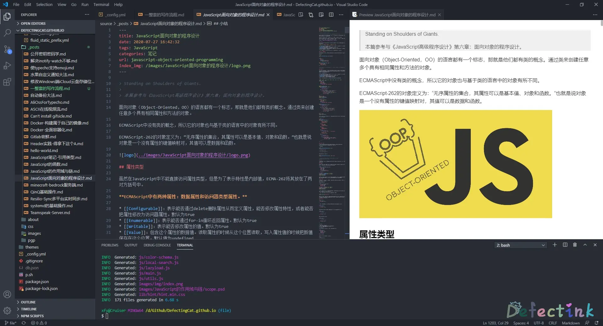
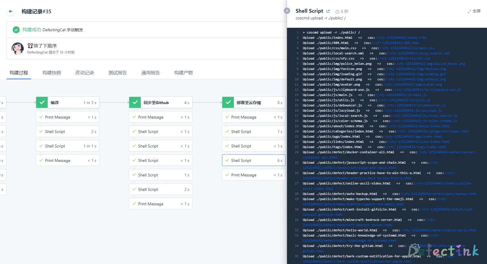
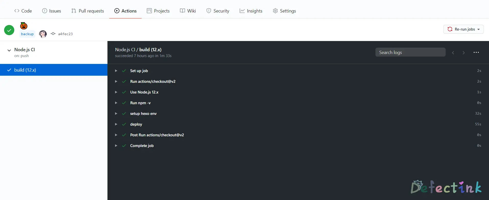
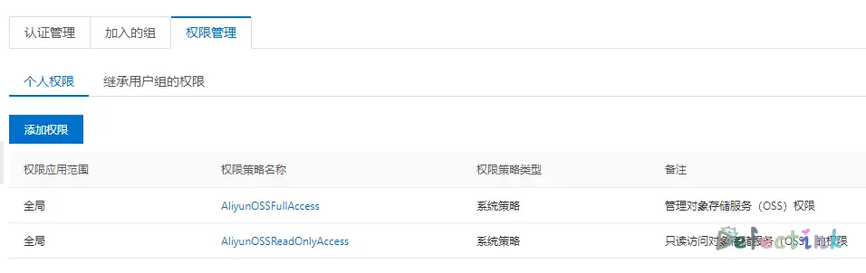
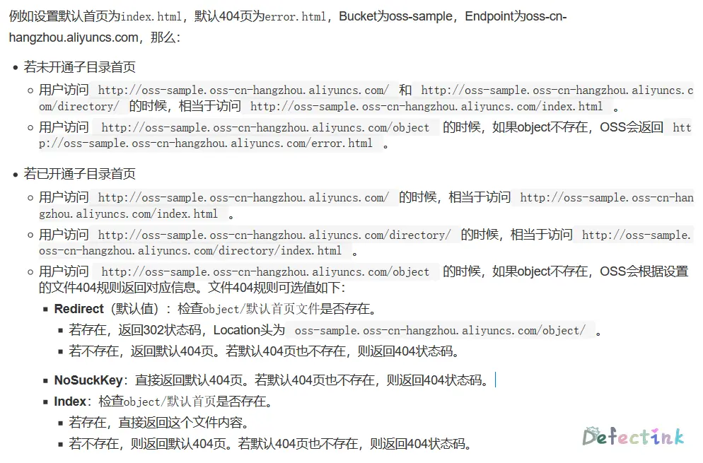

出于对速度无理的追求，最终还是放弃了使用动态内容。转战静态blog。以前也稍微尝试过hexo，所以决定还是主要为hexo为主了。

在之前试过的typecho、wordpress之中，越是臃肿复杂的程序，1M的带宽越是不够。再详细的折腾了hexo之后，发现了最佳的解决方案。

在早期的一些常识之后，我也学会了很多。在刚入坑hexo的时候是盯上了阿里云的ECS+OSS和CDN的。虽然部署还是比较麻烦，但起码已经有了一套比较完善的流程了。

## 从前的写作流程✍

Typora + OneDrive + VScode

以前买过软软的365，于是就用Onedrive来同步写的东西了。Onedrive对windows用起来还好，虽然有时会出些莫名其的问题，但基本上的备份与同步都是正常的。

但对于这套流程的问题不只是Onedrive它卡，这三个软件的契合度并不是很高。写一段代码要切到VScode，写完了再切回来复制到Typora。Onedrive在后台的实时同步还占用一定的性能。

相比较而下，我的部署流程就更为复杂了。因为我的Markdown文件都是放在Onedrive里的，而Hxeo因为`node_modules`的原因并不在Onedrive里，我需要写完了之后再将图片和MD放到Hexo的目录。之后再手动执行生成文章的命令。随后再将生成好的文章手动上传到ECS里挂载的OSS目录。

为什么要通过ECS再传到OSS呢？因为ECS和OSS再同一个区域是不会产生流量费用的。😅

Hexo --> ECS --> OSS

## 现在的流程

VScode + git

将步骤的简化带来的不只是效率，从之前的两个编辑器来回切换到现在的只需要一个编辑器，在文字多的情况下也能保证一定的性能。此外，整体流程的步骤也更加契合，写完了之后可以直接在VScode里打开Terminal进行push。

配上CI持续集成，只需要写完push，之后就可以等着全新的文章上线。

Hexo --> CI --> COS

Hexo的仓库直接push，之后CI持续集成就会按照预设好的步骤来进行部署，除了可以部署到几个仓库的Pages外，还可以直接部署到云存储。

### VS Code - 不只是代码

软软的Visual Studio Code是一款很棒的编辑器。很早之前我就用它来尝试写一些东西，但只是用作于编辑器，主要功能就是代码补全和着色。

在早期的时候我比较喜欢用Typora来写作，它的风格我很喜欢，还能换主题，整体看上去很漂亮。但最近发现了一些比较难以容忍的毛病；就是当它的一篇文章字符超过10K的时候，性能略差一点的电脑就会很卡，打字都不出来的那种。我猜想可能和它是electron写的有关系。

就在我还没放弃它的时候，我无意中找到了VScode的Markdown插件。反正装插件也不是很麻烦是事情，于是就是尝试了一下。

没想到一时间我便爱上了它，虽然整体界面没有以前那么整洁、那么清新脱俗。但整体给人给感觉没有非常杂乱，反而看上去倒有点像剪辑软件？

除了外观从清新脱俗到繁重了一点，余下就只剩方便了。对于我这种才转到hexo的写作半吊子，一直很想找个与hexo契合度高的写作姿势。之前需要在Typora中写完，然后再将文章和单独的图片文件夹复制到hexo的`souce/_post`目录。像我这种半年产出一篇文章的还好，要是天天写，那样会被麻烦死。况且，如果有某一篇文章出了点小差错需要改。那就要同时动两个md文件和两组图片文件夹，对着资源管理翻来覆去的找，极为麻烦！🌚



#### 粘贴图片🖼

之前在使用Typora写作的时候，最为方便的莫非是粘贴图片了。目前Windows上的Typora也支持将粘贴的图片复制到指定的路径或者是云存储。我的图片存放路径都是相对于文章的目录下的`images`目录：

```bash
../images/postName/
```

Typora可以设置将图片复制到指定文件夹，还能创建文件夹。不过好在在VScode里也有插件能够实现同样的操作。使得插图剩下了一大笔麻烦的操作。

我用的是开源的[Paste Images](https://marketplace.visualstudio.com/items?itemName=mushan.vscode-paste-image)。

只需要将插件稍微改下设置，将path修改下就能达到想要的效果。

```bash
../images/${currentFileNameWithoutExt}/
```

#### 一些小设置

**Quick Suggestions**

Editor > Suggest: Snippets Prevent Quick Suggestions

在代码段中依然显示建议。

**自定义Suggestions**

```js
{
	// Place your snippets for javascript here. Each snippet is defined under a snippet name and has a prefix, body and 
	// description. The prefix is what is used to trigger the snippet and the body will be expanded and inserted. Possible variables are:
	// $1, $2 for tab stops, $0 for the final cursor position, and ${1:label}, ${2:another} for placeholders. Placeholders with the 
	// same ids are connected.
	// Example:
	"Print to console": {
		"prefix": "cl",
		"body": [
			"console.log($1);",
		],
		"description": "Log output to console"
	}
}
```

### Coding - 持续构建⏰

之前最大的问题还是手动部署hexo的繁琐操作，每新增一篇文章都是几个重复的机械性操作。对于我这种半年才写一篇文章的咸鱼来说都感觉到烦了。

使用CI持续部署的好处就是，可以完全专心与创作，而不用再去管部署之类的问题。只需要第一次写好流程，剩下的就全部交给自动化吧。



之前的我从来没有用过Coding，对CI/CD也没有什么了解，从来没考虑过自动化部署这类操作。后来在研究静态化网站时发现了新大陆，完全可以将复杂重复的工作交给机器。并且随着后面文章的增加，渲染markdown文件肯定会越来越慢，于其手动繁琐的操作，不如完全交给CI。

### Github Action

在我研究CI姿势的这段时间里，Github也推出了自己的CI（钞能力）。无论是谁家的CI，除了部署步骤不一样，其结果肯定是相同的。Github action也是能达到同样的效果，对于各个厂家的云存储，action也有同样的解决方法，甚至是比coding的jenkins还要灵活一点。



## Hexo插件📥

### 压缩

我用的是[Hexo-all-minifier](https://github.com/chenzhutian/hexo-all-minifier)，可以静态文件以及图片。还可以分别设置压缩等级来权衡质量与大小。

```bash
npm install hexo-all-minifier --save
``` 

不过它使用到了已经编译好的二进制包gifsicle等，在安装时需要走个脚本编译一下，在网络不好的情况下大概率会安装失败。为此我还特地水过一次：[Can't install gifsicle](https://www.defectink.com/defect/cant-install-gifsicle.html)

Hexo-all-minifier用到的也是gulp和一些图片压缩的工具，相对于gulp来说，它的配置更简单，更适合像我这种比较懒的咸鱼。

只需要在站点配置文件添加一段聚合好的配置文件就好了，像这样：

```yml
# minifier
all_minifier: ture

html_minifier:
  enable: true
  ignore_error: false
  silent: false
  exclude:

css_minifier:
  enable: true
  silent: false
  exclude: 
    - '*.min.css'

js_minifier:
  enable: true
  mangle: true
  silent: false
  output:
  compress:
  exclude: 
    - '*.min.js'

image_minifier:
  enable: true
  interlaced: false
  multipass: false
  optimizationLevel: 2
  webpquant: false
  progressive: false
  silent: false
```

### Sitemap与RSS

两个小功能吧，虽然也不会有人来订阅我的小破站🤣。

```bash
npm install hexo-generator-sitemap --save
npm install hexo-generator-feed --save
```

和压缩插件一样，都是在站点的`_config.yml`里添上相应的配置文件就好了。

```yml
# feed
feed:
  type:
    - atom
    - rss2
  path:
    - /xml/atom.xml
    - /xml/rss.xml
  limit: 20
  hub:
  content:
  content_limit: 140
  content_limit_delim: ' '
  order_by: -date
  icon: icon.webp
  autodiscovery: true
  template:

# sitemap
sitemap:
  path: /xml/sitemap.xml
  template: ./source/_data/sitemap_template.xml
  rel: false
  tags: true
  categories: true
```

另外，可以来试一下：

* [Atom](/xml/atom.xml)
* [RSS](/xml/rss.xml)
* [Sitemap](/xml/sitemap.xml)

## Git加速

使用Linux主机或者在Windows中使用git bash时，修改（新建）在用户目录下的`~/.ssh/config`文件，新加如下内容。

```bash
host github.com
HostName github.com
PreferredAuthentications publickey
IdentityFile ~/.ssh/id_rsa
ProxyCommand connect -S 127.0.0.1:1080 %h %p
```

macos的connect可以用brew安装，而windows的git bash中已有：

```bash
brew install connect
```

对于Ubuntu：

```bash
apt-get install connect-proxy
```

某些发行版可能没有connect软件包，这个地址下载源码编译一下就好了。

```
https://bitbucket.org/gotoh/connect/src/default/
```

对于http：

```bash
git config --global http.proxy "socks5://127.0.0.1:1080"
git config --global https.proxy "socks5://127.0.0.1:1080"
```

node的淘宝源

```bash
npm config set registry https://registry.npm.taobao.org
```

```bash
npm config set registry https://registry.npmjs.org
```

## 早期计划

### 内容分发网络

之前就有在使用cdn来加速图片的访问，效果也还是不错的。但是整体blog的内容还都是有1M服务器上的php生成的。所以就算异地图片加载速度再快，终端也需要连接到身在华南的服务器。无论是人多还是人少，速度总是不理想。

最后打算使用纯静态的blog，直接部署到cdn上，速度肯定是无可比拟的。但是还是有一点弊端的，例如cdn节点可能更新不及时等问题。

### 解决方案

正好手头有个1M出口的ECS，嫌它太慢。而它的真正作用在于和阿里云的oss进行通信，因为走的是阿里云的内网，所以通过ECS上传文件到oss是不需要收流量费用的。而ECS仅仅只是出口1M而已，入口是不限速的。如果需要最大化节约的上传文件到oss，可以通过ECS传。

阿里云的oss在linux上有个可以连接oss的软件，但是那个操作并不是我想需要的。好在阿里云还有一款[ossfs](https://help.aliyun.com/document_detail/32196.html?spm=a2c4g.11186623.6.749.72b73adfsKCqTT)软件。它可以将对象存储OSS的存储空间（Bucket）挂载到本地文件系统中，能够像操作本地文件一样操作OSS的对象（Object），实现数据的共享。

这对于写静态blog来说实在是太方便了，只需要将Bucket挂载到本地文件夹，就像挂载磁盘那样操作。随后就可以不用流量的将静态文件上传到oss。

开启OSS的静态网站托管，将hexo生成的静态blog都放到挂载的目录下即可。非常的方便，文章内的图片也可以使用相对路径，而不需要一张一张的插入外链那么麻烦了。

需要注意一点的是：使用OSS默认域名访问时，Response Header中会自动加上` Content-Disposition:'attachment=filename;'`。即从浏览器访问网页类型文件时，不会显示文件内容，而是以附件形式进行下载。也就是说需要绑定自己的域名才能静态托管。

### 多重备份

这种方案解决的好处就是，可以在多个地方实现多重的数据备份。且不需要在备份数据库了。

* Github一份备份
* CDN一份备份
* ECS一份备份
* 自己的电脑还可以有多份备份

一步直接实现异地多备份。

### OSSFS

目前有多个发行版的安装包：

| Linux发行版        | 下载  |
| :----------------- |   :------ |
| Ubuntu 18.04 (x64) | [ossfs_1.80.6_ubuntu18.04_amd64.deb](http://gosspublic.alicdn.com/ossfs/ossfs_1.80.6_ubuntu18.04_amd64.deb) |
| Ubuntu 16.04 (x64) | [ossfs_1.80.6_ubuntu16.04_amd64.deb](http://gosspublic.alicdn.com/ossfs/ossfs_1.80.6_ubuntu16.04_amd64.deb) |
| Ubuntu 14.04 (x64) | [ossfs_1.80.6_ubuntu14.04_amd64.deb](http://gosspublic.alicdn.com/ossfs/ossfs_1.80.6_ubuntu14.04_amd64.deb) |
| CentOS 7.0 (x64)   | [ossfs_1.80.6_centos7.0_x86_64.rpm](http://gosspublic.alicdn.com/ossfs/ossfs_1.80.6_centos7.0_x86_64.rpm) |
| CentOS 6.5 (x64)   | [ossfs_1.80.6_centos6.5_x86_64.rpm](http://gosspublic.alicdn.com/ossfs/ossfs_1.80.6_centos6.5_x86_64.rpm) |

下载到主机内后，根据不同的发行版进行安装就好了。而对于Ubuntu需要使用gdebi：

```bash
sudo apt-get update
sudo apt-get install gdebi-core
sudo gdebi your_ossfs_package
```

#### 配置账号信息

成功了安装了之后就可以配置oss的账号信息来登陆。使用AccessKeyId/AccessKeySecret来代替账号密码进行访问。如果担心安全问题还可以使用阿里云的子账号只赋予oss的访问权限，来最大程度的保护账户资产。在阿里云的[RAM访问控制](https://ram.console.aliyun.com/overview)中可以进行添加子账户并赋予特定的权限。



AccessKeyId/AccessKeySecret信息存放在`/etc/passwd-ossfs`文件中。并且文件的权限必须正确设置，建议设为640。

格式为：`bucket名:AccessKeyId:AccessKeySecret`

```bash
echo my-bucket:my-access-key-id:my-access-key-secret > /etc/passwd-ossfs
chmod 640 /etc/passwd-ossfs
```

如果需要配置多个账号或者多个bucket，可以直接将账号信息写在后面，ossfs会根据挂载的存储空间名称匹配到正确的账号上。

```bash
echo my-second-bucket:my-access-key-id:my-access-key-secret >> /etc/passwd-ossfs
```

#### 挂载到指定目录

账号信息填写的非常简单，写到指定文件里就可以了。填完之后就可以将oss挂载到本地的指定目录上。

格式为：`ossfs bucket名 本地挂载点 -ourl=oss url`

```
ossfs my-bucket my-mount-point -ourl=my-oss-endpoint
```

如果正好使用的是阿里云的ECS机器，可以走oss的内网，在上传文件时就不会产生多余的流量费用。通常oss的内网域名包含internal。例如：

```
oss-cn-beijing-internal.aliyuncs.com
```

只需要将近4条左右的命令就可以将oss成功挂载到本地上，就如同一个文件夹。

#### 开机自动挂载

和开机自动挂载分区一样，Ubuntu需要在`/etc/fstab`中进行操作。

```bash
ossfs#bucket_name mount_point fuse _netdev,url=url,allow_other 0 0
```

对应的填入了信息之后，可以使用`mount -a`进行测试。如果没有任何报错，即代表成功。

### 阿里云子目录

阿里云oss的默认配置是不会去访问子目录下的首页的，子目录下的`index.html`必须访问全部的静态链接。否则会跳转回主页的`index.html`。

网上的大多数解决办法就是修改hexo的配置，把所有的子目录的绝对路径都生成出来。这是一种解决办法，但不能从根源上解决所有问题。

并且阿里云也早就支持了子目录首页了。只需要简单开一下就能解决这个问题。



