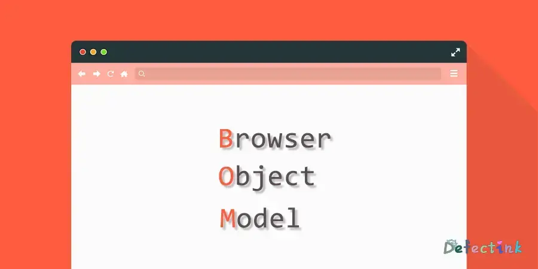

ECMAScript才是JavaScript的核心，在浏览器中，BOM无疑才是真正的核心（浏览器对象模型：BrowerObjectModel)。多年来，缺少事实上的规范导致BOM既有意思又有问题，因为浏览器提供商会按照各自的想法去随意拓展它。于是，浏览器之间共有的对象就成为了事实上的标准。



## window对象

BOM的核心对象是window，它表示浏览器的一个实例。在浏览器中，window对象有双重角色，它既是通过JavaScript访问浏览器的一个接口，又是ECMAScript规定的Global对象。

### 全局作用域

由于window在浏览器环境中扮演着Global对象，所以在全局作用域中声明的变量、函数都会变成window对象的属性和方法。（拥有块级作用域的声明则不会）

```js
var age = 18;
function sayAge() {
    console.log(this.age);
}
window.age;
sayAge();
window.sayAge();
```

虽然使用`var`声明的全局变量会成为window的属性，但是经过声明的变量是无法使用delete操作符删除的，而在window对象上直接定义的属性是可以删除的。

```js
let test = 123;
delete test; // false;

window.xfy = 'xfy';
delete window.xfy; // true;
```

通过`var`声明的变量的属性有一个名为'configurable'的特性。这个特性的值被设置为`false`，并且无法更改。

> IE8以及更早的版本在遇到使用delete删除window属性的时候都会抛出错误。

尝试未经声明的变量会抛出错误，但是可以通过查询window对象知道由`var`声明的变量是否存在；

```js
let t = test; // test id not defined

let t = window.test // 不会抛出错误，因为这是一次属性查询
```

### 窗口关系及框架

如果页面包含框架，则每个框架都有自己的window对象，并且保存在frames集合中。在frames集合中，可以通过数值索引（从0开始，从左至右，从上到下）或者框架名称来访问相应的window对象。每个window对象都有一个name属性，其中包含框架名称。

```html
    <frameset rows="160,*">
        <frame src="frame1.html" name="topFrame">
            <frameset cols="50%,50%">
                <frame src="frame2.html" name="leftFrame">
                <frame src="frame3.html" name="rightFrame">
            </frameset>
    </frameset>
```

上述代码的框架集看上去像这样，对于引用框架可以使用如下方法：

```js
window.frames[0] // 引用第一个
window.frames["rightFrame"] // 引用指定name的
top.frames[0]   // 使用top引用
top.frames["topFrame"]  // 使用top引用
```

<escape> 
<table style="text-align: left">    
  <tr>
  <td colspan="2">
window.frames[0]<br/>
window.frames["topFrame"]<br/>
top.frames[0]<br/>
top.frames["topFrame"]<br/>
frames[0]<br/>
frames["topFrame"]<br/>
</td>
</tr>
  <tr>
  <td>
window.frames[1]<br/>
window.frames["leftFrame"]<br/>
top.frames[1]<br/>
top.frames["leftFrame"]<br/>
frames[1]<br/>
frames["leftFrame"]<br/>
  </td>
  <td>
window.frames[2]<br/>
window.frames["rightFrame"]<br/>
top.frames[2]<br/>
top.frames["rightFrame"]<br/>
frames[2]<br/>
frames["rightFrame"]<br/>
  </td>
  </tr>
</table>   
</escape>

使用window的属性frames可以方便的去引用指定的框架，不过使用top将更好。top对象始终执行最外层的框架，也就是浏览器窗口。使用它类似于使用绝对路径。而window是相对的，指的都是那个框架的特定实例，而非最高层框架。

与top相对的是parent。parent始终指向当前框架的直接上层框架。在某些情况下，parent等于top；在没有框架的情况下parent一定等于top（都等于window）。

```html
<frameset rows="100,*">
    <frame src="frame.htm" name="topFrame">
    <frameset cols="50%,50%">
        <frame src="anotherframe.htm" name="leftFrame">
        <frame src="anotherframeset.htm" name="rightFrame">
    </frameset>
</frameset>
```

在这个例子里，在rightFrame中又嵌入了另外两个frame，分别叫redFrame和blueFrame。

```html
<frameset cols="50%,50%">
    <frame src="red.htm" name="redFrame">
    <frame src="blue.htm" name="blueFrame">
</frameset>
```

当浏览器加载完第一个框架集以后，会继续将第二个框架集加载到rightFrame中。如果代码位于redFrame或blueFrame中，那么parent就等于rightFrame。如果代码位于topFrame中，那么parent就等于top，因为topFrame的直接上层就是最外层的框架。

除非最高层窗口用`window.open()`打开，否则其window对象的name属性不会包含值。

与框架有关的最后一个对象时self，它始终指向window。实际上，self和window对象可以互换使用。引入self对象的目的只是为了与top和parent对象对应起来，因此它不格外包含其他值。

所有的这些对象都是window的属性，都可以通过`window.parent`、`window.top`等形式来访问。同时也意味着可以将不同层级的window对象连缀起来，例如`window.parent.parent.frames[0]`。

> 在使用框架的情况下，浏览器中会存在多个Global对象。在每个框架中定义的全局变量会自动成为框架中window对象的属性。由于每个window对象都包含类型的构造函数，因此每个框架都有一套自己的构造函数，这些构造函数一一对应，但并不相等。例如，`top.Object`并不等于`top.frames[0].Object`。这个问题会影响到对跨框架传递的对象使用instanceof操作符。

### 窗口位置

用来确定和修改window对象位置的属性和方法有很多。IE、Safari、Opera和Chrome都提供了`screenLeft`和`screenTop`来确定相对于屏幕左边和上边的位置。Firefox则在`screenX`和`screenY`属性中提供相同的窗口位置信息。

目前Chrome和Firefox均支持这两个属性。不过难免会出现只支持其中一个的情况，可以使用个简单的判断语句来进行判断。

```js
let leftPos = (typeof window.screenLeft == 'number') ? window.screenLeft : window.screenX;

let topPos = (typeof window.screenTop == 'number') ? window.screenTop : window.screenY;
```

各家浏览器对BOM多数没有统一的标准，最后导致的结果就是确定窗口位置不一，不同的浏览器给出的相对位置都不太一样。

最总结果，就是无法在跨浏览器的条件下去的窗口左边和上边的精确位置。不过，使用`moveTo()`和`moveBy()`倒是有可能将窗口精确的移动到一个新的位置。

`moveTo()`接收的是新位置的x和y坐标的值，而`moveBy()`接收的是在水平和垂直方向移动的像素数。

```js
// 移动窗口到屏幕左上角
window.moveTo(0, 0);

// 向下移动100像素
window.moveBy(0 ,100);

window.moveTo(200, 200);
window.moveBy(-50, 0);
```

不过这几种方法在目前的浏览器里几乎都是被禁用的。另外这两个方法都不适用于框架，只能对最外层的window对象使用。

### 窗口大小

同样的原因，跨浏览器确定窗口大小可不是一件简单的事情。各个主流浏览器均提供了4个属性：innerWidth、innerHeight、outerWidth和outerHeight。不同的浏览器对其返回的值，以及相对的计算位置都不同。所以这里就不详记了。

Chrome与Firefox在1080p分辨率下输出的inner和outer的值：


另外一些浏览器在`document.documentElement.clientWidth`和`document.documentElement.clientHeight`保存了页面视口的信息。在IE6中，这些属性必须是在标准模式下才有效；如果是混杂模式，就必须通过`document.body`中的`clientWidth`和`clientHeight`取得相同的信息。

> 远离IE有益身体健康。

虽然最终无法确定浏览器本身的大小，但是可以取得页面视口的大小。

```js
let pageWidth = window.innerWdith;
let pageHeight = window.innerHeight;

if (typeof pageWidth != 'number') {
    if (document.compatMode == "CSS1Compat"){
        pageWidth = document.documentElement.clientWidth;
        pageHeight = document.documentElement.clientHeight;
    } else {
        pageWidth = document.body.clientWidth;
        pageHeight = document.body.clientHeight;
    }
}
```

> 对于移动设备，以及移动设备的IE浏览器情况则更加的有趣。移动开发咨询师Peter-Paul Koch记录他的研究：[https://quirksmode.org/mobile/viewports2.html](https://quirksmode.org/mobile/viewports2.html)

另外，使用`resizeTo()`和`resizeBy()`方法可调整浏览器窗口的大小。这两个方法都接收两个参数，其中To接收浏览器窗口的新高度和新宽度，By接收新值与旧值之差。

```js
// 调整到100*100
window.resizeTo(100, 100);

// 调整到200*150
window.resizeBy(100, 50);

// 300*300
window.resizeTo(300, 300);
```

现代的浏览器几乎都是禁用这两个方法的，同样，这两个方法也不适用于框架，只能对最外层的window对象使用。

### 导航和打开窗口

`window.open()`方法既可以导航到一个特定的URL，也可以打开一个新的浏览器窗口。这个方法可以接收4个参数：要加载的URL、窗口目标、一个特性字符串以及一个表示新页面是否取代浏览器历史记录中当前加载页面的布尔值。

如果第二个参数为当前已有的窗口或框架的名称，那么就会在具有该名称的窗口或框架打开参数指定的URL。

```js
window.open('https://www.defectink.com', 'topFrame');
// 同等于：<a href="https://www.defectink.com" target="topFrame"></a>
```

**弹出窗口**

`window.open()`会返回一个对新窗口的引用，引用的对象与其他window对象大致相同。

```js
let gg = window.open('https://google.com/', '_blank');
// global {window: global, self: global, location: {…}, closed: false, frames: global, …}
```

目前的大部分浏览器都不允许跨标签页的操作，不过`window.close()`方法依然可以用，用来关闭创建的窗口。弹窗关闭后，对其的引用还在，但是除了检测窗口是否已经关闭以外，已经没有其他用处了。

```js
gg.closed;
// true
```

新创建的window对象有一个opner属性，其中保存着打开它的原始窗口对象。这个属性旨在弹出窗口中的最外层window对象(top)中有定义，而且指向调用`window.open()`的窗口或框架

```js
gg.opener == window
true
gg.opener === window
true
```

有些浏览器会在单独的进程中运行每个标签页。当一个标签页打开另一个标签页时，如果两个window对象需要互相通信，那么新标签页就不能运行在单独的进程中。在Chrome中，将新创建的标签页的opener属性设置为null，即表示在单独的进程中运行新标签页。

```js
gg.opener = null
```

将opener属性设置为null就是告诉浏览器新创建的标签页不需要与打开它的标签页通信，因此可以在独立的进程中运行。标签页之间的联系一旦切断，将没有办法恢复。

**安全限制**

曾经有段时间，广告商在网上使用弹出窗口达到了肆无忌惮的水平。他们经常把弹出窗口打扮成系统对话框的模样，引诱用户去点击其中的广告。

目前的主流浏览器对`window.open()`打开的窗口都会强制的显示状态栏或者地址栏，也禁止其模仿系统对话框的样子。此外，有的浏览器只根据用户操作来创建窗口。这样一来，在页面尚未加载完成时嗲用`window.open()`的语句根本不会执行。而且还可能将错误消息提示给用户。

**弹出窗口屏蔽程序**

现代的大多数浏览器都带有内置的弹窗屏蔽程序，而没有此类程序的浏览器也可以通过安装拓展来实现此功能。于是，在弹窗被屏蔽时，就应该考虑两种情况。如果是浏览器屏蔽的弹窗，那么`window.open()`很可能返回null；如果是拓展程序，那么很可能报错一个错误。利用这个返回值就能确定弹窗是否被屏蔽。

```js
let blocked = false;
try {
    let gg = window.open('https://google.com', '_blank');
    if (gg == null) {
        blocked = true;
    }
} catch (ex) {
    blocked = true;
}
if (blocked == true) {
    console.error('The popup was blocked!');
}
```

上述利用`try...catch`语句来检测弹窗是被浏览器屏蔽还是被拓展程序屏蔽的。检测弹出窗口支是一方面，它并不会阻止浏览器显示与被屏蔽窗口的有关消息。

### 间歇调用与超时调用

JavaScript是单线程的语言，但它允许通过设置超时值和间歇时间值来调度代码在特定的时刻执行。前者在指定时间后执行代码，后者是每隔指定的时间就执行一次代码。

超时调用所用到的是window对象的`setTimeout()`方法，它接受两个参数：要执行的代码和以毫秒表示的时间（即在代码执行前等待的毫秒数）。其中，第一个参数可以是包含JS代码的字符串（就和在`eval()`函数中使用的字符串一样），也可以是一个函数，不过更加推荐使用函数而不是字符串，传递字符串可能会导致性能损失。

```js
setTimeout(() => {
    console.log('xfy!');
}), 1000);
```

第二个参数是等待的毫秒数，但经过该时间后的指定代码不一定会执行。因为JavaScript是一个单线程的解释器，使用的是类似轮询的工作机制，一定时间内只能工作一段代码。为了控制要执行的代码，就有一个JavaScript任务队列。这些任务会按照将它们添加到队列的顺序执行。`setTimeout()`的第二个参数就是指定时间后添加到任务队列，如果队列是空的，那么添加代码就会立即执行。如果队列不是空的，那么就要等待前面的代码执行完。

`setTimeout()`会返回一个数值ID，表示超时调用。这个超时调用ID是计划执行代码的唯一标识符，可以通过它来去掉超时调用。可以使用`clearTimeout()`来取消超时调用计划，它的参数就是其唯一标识符ID。

```js
// 设置
let timeIdentity = setTimeout(() => {
    console.log('xfy!');
}, 100000);

// 取消
clearTimeout(timeIdentity);
```

> 超时调用的代码都是在全局作用域下执行的，因此函数中的this在非严格模式下指向window，严格模式下是undefined。

间歇调用与超时调用类似，不过它是按照指定的时间间隔来重复的执行代码，直至间隔调用被取消或者被页面卸载。设置间歇调用的方法是`setInterval()`，它接受的参数与`setTimeout()`相同：要执行的代码（字符串或函数）和每次执行之前间隔的毫秒数。

```js
let xfy = 'xf';
setInterval(() => {
    xfy += 'y';
    console.log(xfy); 
}, 1000)

let xfy = 'fy';
setInterval(() => {
    xfy = 'x' + xfy;
    console.log(xfy); 
}, 500)
```

调用`setInterval()`同样也是返回一个间歇调用ID，使用`clearInterval()`方法来取消未执行的间歇调用。不过，间歇调用在不干涉的情况下将会一直执行下去。所以使用`clearInterval()`的重要性远高于`clearTimeout()`。

```js
let xfy = 'fy';
let num = 0;
let max = 100;
let ID;
function xxfy() {
    xfy = 'x' + xfy;
    num ++;
    console.log(xfy);
    if (num == max) {
        clearInterval(ID);
        console.log('--- xfy! ----');
    }
}

ID = setInterval(xxfy, 100);
```

这个例子类似于设置一个有时间间隔的循环。这个模式也可以使用超时调用来实现。

```js
let xfy = 'fy';
let num = 0;
let max = 5;
function xxfy() {
    xfy = 'x' + xfy;
    num ++;
    console.log(xfy);
    if (num < max) {
        // 未达次数则再次调用
        setTimeout(xxfy, 500);
    } else {
        console.log('--- xfy! ----');
    }
}

setTimeout(xxfy, 500);
```

在使用超时调用时就没有必要再跟踪ID，因为每次执行完时其就会自动停止。一般情况下，使用超时调用来模拟间歇调用是一种最佳模式。原因是一个间歇调用可能会在前一个间歇调用执行结束前启动。而使用超时调用来模拟间歇调用以达到相同的效果，则可以完全避免这一点。

## 系统对话框

系统对话框通过`alert()`、`confirm()`和`prompt()`方法调用。系统对话框和正在浏览器中显示的网页没有关系，也不包含HTML。它的外观是由系统及浏览器决定的，而不是CSS。此外，通过这几个方法打开的系统对话框都是同步和模态的。也就是说，显示这几个对话框的时候代码将会暂停运行，而关掉对话框后将继续运行。

`alert()`方法用于生成一个带有文本的弹窗，它接受的参数就是要显示的文本字符串。它只能显示消息，点击确定按钮后将消失。

第二种为`comfirm()`方法，它也是接受一个显示文本的字符串，但是它还有“确认”与“取消”两个按钮。这两个按钮分别返回true和false。可以配合if语句来让用户选择性的执行，这种操作通常在用户想要删除的时候使用，例如删除电子邮件的时候。

```js
if (confirm('Are you sure?')) {
    alert('Of course, sure!');
} else {
    alert('No!');
}
```

第三个是`prompt()`方法，它会出现一个显示文本和输入框。它就收两个参数，分别是用于显示文本的字符串和输入框内的默认字符串（可以为空）。如果点击确定，则返回输入框内的内容，如果取消或者关闭窗口，则返回null。

```js
let h = prompt('Hello!', 'Michael');
if (h != null) {
    alert('Nice to meet you, ' + h);
}
```

除此之外，目前的现代浏览器都会在第二个弹窗开始出现一个复选框，以便用户阻止后续的弹窗，除非用户刷新页面。

还有两个可以通过JavaScript调用的对话框，他们是window对象的`print()`和`find()`方法，分别用于打开打印窗口和查找窗口。

## location对象

location是最有的BOM对象之一，它提供了与当前窗口中加载的文档有关的信息，还提供了一些导航功能。location是一个很特别的对象，它既是window对象的属性，也是document对象的属性。也就是说`window.location`和`document.location`引用的是同一个对象。

### 属性

`Location `接口不继承任何属性，但是实现了那些来自 [`URLUtils`](https://developer.mozilla.org/zh-CN/docs/Web/API/URLUtils) 的属性。

- [`Location.href`](https://developer.mozilla.org/zh-CN/docs/Web/API/Location/href)

  包含整个URL的一个[`DOMString`](https://developer.mozilla.org/zh-CN/docs/Web/API/DOMString)

- [`Location.protocol`](https://developer.mozilla.org/zh-CN/docs/Web/API/Location/protocol)

  包含URL对应协议的一个[`DOMString`](https://developer.mozilla.org/zh-CN/docs/Web/API/DOMString)，最后有一个":"。

- [`Location.host`](https://developer.mozilla.org/zh-CN/docs/Web/API/Location/host)

  包含了域名的一个[`DOMString`](https://developer.mozilla.org/zh-CN/docs/Web/API/DOMString)，可能在该串最后带有一个":"并跟上URL的端口号。

- [`Location.hostname`](https://developer.mozilla.org/zh-CN/docs/Web/API/Location/hostname)

  包含URL域名的一个[`DOMString`](https://developer.mozilla.org/zh-CN/docs/Web/API/DOMString)。

- [`Location.port`](https://developer.mozilla.org/zh-CN/docs/Web/API/Location/port)

  包含端口号的一个[`DOMString`](https://developer.mozilla.org/zh-CN/docs/Web/API/DOMString)。

- [`Location.pathname`](https://developer.mozilla.org/zh-CN/docs/Web/API/Location/pathname)

  包含URL中路径部分的一个[`DOMString`](https://developer.mozilla.org/zh-CN/docs/Web/API/DOMString)，开头有一个“`/"。`

- [`Location.search`](https://developer.mozilla.org/zh-CN/docs/Web/API/Location/search)

   包含URL参数的一个[`DOMString`](https://developer.mozilla.org/zh-CN/docs/Web/API/DOMString)，开头有一个`“?”`。

- [`Location.hash`](https://developer.mozilla.org/zh-CN/docs/Web/API/Location/hash)

  包含块标识符的[`DOMString`](https://developer.mozilla.org/zh-CN/docs/Web/API/DOMString)，开头有一个`“#”。`

- [`Location.username`](https://developer.mozilla.org/zh-CN/docs/Web/API/Location/username)

  包含URL中域名前的用户名的一个[`DOMString`](https://developer.mozilla.org/zh-CN/docs/Web/API/DOMString)。

- [`Location.password`](https://developer.mozilla.org/zh-CN/docs/Web/API/Location/password)

  包含URL域名前的密码的一个 [`DOMString`](https://developer.mozilla.org/zh-CN/docs/Web/API/DOMString)。

- [`Location.origin`](https://developer.mozilla.org/zh-CN/docs/Web/API/Location/origin) 只读

  包含页面来源的域名的标准形式[`DOMString`](https://developer.mozilla.org/zh-CN/docs/Web/API/DOMString)。

### 方法

`Location`没有继承任何方法，但实现了来自[`URLUtils`](https://developer.mozilla.org/zh-CN/docs/Web/API/URLUtils)的方法。

- [`Location.assign()`](https://developer.mozilla.org/zh-CN/docs/Web/API/Location/assign)

  加载给定URL的内容资源到这个Location对象所关联的对象上。

- [`Location.reload()`](https://developer.mozilla.org/zh-CN/docs/Web/API/Location/reload)

  重新加载来自当前 URL的资源。他有一个特殊的可选参数，类型为 [`Boolean`](https://developer.mozilla.org/zh-CN/docs/Web/API/Boolean)，该参数为true时会导致该方法引发的刷新一定会从服务器上加载数据。如果是 `false`或没有制定这个参数，浏览器可能从缓存当中加载页面。

- [`Location.replace()`](https://developer.mozilla.org/zh-CN/docs/Web/API/Location/replace)

  用给定的URL替换掉当前的资源。与 `assign()` 方法不同的是用 `replace()`替换的新页面不会被保存在会话的历史 [`History`](https://developer.mozilla.org/zh-CN/docs/Web/API/History)中，这意味着用户将不能用后退按钮转到该页面。

- [`Location.toString()`](https://developer.mozilla.org/zh-CN/docs/Web/API/Location/toString)

  返回一个[`DOMString`](https://developer.mozilla.org/zh-CN/docs/Web/API/DOMString)，包含整个URL。 它和读取[`URLUtils.href`](https://developer.mozilla.org/zh-CN/docs/Web/API/URLUtils/href)的效果相同。但是用它是不能够修改Location的值的。

### 查询字符串参数

虽然通过location对象可以查询到大部分信息，但是访问URL包含的查询字符串的属性并没有那么方便。尽管可以通过search属性返回从问号到URL末尾的所有内容，但却没有办法逐个访问每个字符串查询参数。为此，可以创建一个方法来解析查询字符串。

```js
function search() {
    let ur = document.location.search;
    // 去除问号
    let qs = ur.length > 0 ? ur.substring(1) : ''; 

    let args = {},
        items,
        item,
        name,
        value;

    // 以&分割为数组
    items = qs.length ? qs.split('&') : [];
    let len = items.length;

    for (let i = 0; i < len; i ++) {
        // 将第一项以=分割
        item = items[i].split('=');
        // =前后分别为键和值
        name = decodeURIComponent(item[0]);
        value = decodeURIComponent(item[1]);
        if (name.length) {
            args[name] = value;
        }
    }
    return args;
}
```

例如百度的查询字符串长这样：

```
ie=utf-8&wd=javascript
```

这个方法并不是很复杂，第一步就是去除查询字符串开头的问号，在它有值的情况下。接下来根据和（&）号来分割查询字符串。分割之后暂存在一个数组中，之后使用for循环，再将查询字符串以等号分割键和值，将键和值分别保存在两个变量之中。如果二者都有值，那么在将其按对象的方式写入对象中。其结果是这样的：

```js
search();
{ie: "utf-8", wd: "javascript"}
```

这样，每个查询字符串参数都成了返回对象的属性。这样就极大的方便了对每个参数的访问。

### 位置操作

location对象可以通过很多方式来修改浏览器的位置。最常用的方式是使用`assign()`方法来为其传递一个URL。

```js
location.assign('https://www.baidu.com');
```

这样，就会立即打开新URL并在浏览器历史记录中生成一条记录。如果将window.location和location.href设置为一个url值，也会以该值调用`assign()`。

```js
window.location = 'https://www.baidu.com';
location.href = 'https://www.baidu.com';
```

其他属性，除了hash以外都会刷新页面。

```js
location.hash = 'test';
location.search = '?q=javascript';
location.hostname = 'www.yahoo.com';
location.pathname = 'dir';
location.port = 8080;
```

上述值修改url之后都会产生浏览器历史记录，并且可以通过“后退”来访问前一个页面。可以通过`replace()`方法来禁用历史记录。

```js
location.replace('https://www.baidu.com/')
```

另外，可以使用`reload()`方法来刷新页面。

```js
location.reload();      // 可能会度缓存
location.reload(true);  // 强制从服务器下载
```

## navigator对象

navigator对象现已成为识别客户端浏览器的事实标准。可以使用只读的`windows.navigator`属性来检索navigator对象

```js
window.navigator
Navigator {vendorSub: "", productSub: "20030107", vendor: "Google Inc.", maxTouchPoints: 0, userActivation: UserActivation, …}
appCodeName: "Mozilla"
appName: "Netscape"
appVersion: "5.0 (Windows NT 10.0; Win64; x64) AppleWebKit/537.36 (KHTML, like Gecko) Chrome/86.0.4240.193 Safari/537.36"
bluetooth: Bluetooth {}
clipboard: Clipboard {}
// ......
```

每个浏览器都有自己的navigator对象的一套属性，不过他们也有一些共同的属性。

### 检测插件

navigator对象还有一个plugins属性，通过`navigator.plugins`来访问到浏览器的插件。不过这并不能用来检测Chrome的拓展。

利用plugins属性，可以这样来做一个间的的检测插件的小方法：

```js
function plus(name) {
    name = name.toLowerCase();
    for (let i of navigator.plugins) {
        let res = i.name.toLowerCase().includes(name);
        return res;
    }
}
```

这里使用了es6的`includes`方法，当然也可以使用es5的`indexOf`来实现

```js
function plus(name) {
    name = name.toLowerCase();
    for (let i of navigator.plugins) {
        if (i.name.toLowerCase().indexOf(name) > -1) {
            return true;
        } else {
            return false;
        }
    }
}
```

使用字符查找的方法来确定其名称是否有指定字符时会有个小缺陷，例如需要查找`chrome pdf viewer`，在传入一个字母`c`的时候，就能够返回`true`，无法确定具体找到哪个插件。只有继续增加参数的长度才能确定，。

我这里根据上述函数稍稍修改了下，将匹配到的结果都由一个数组保存，最后返回整个数组，有点类似于搜索结果。

```js
function plus(name) {
    name = name.toLowerCase();
    let out = [];
    for (let i of navigator.plugins) {
        let res = i.name.toLowerCase().includes(name);
        if (res) {
            out.push(i.name);
        }
    }
    return out;
}
```

这时的数组就会保存所有匹配到的字符：

```js
plus('chrome')
(2) ["Chrome PDF Plugin", "Chrome PDF Viewer"]
```

## history对象

history保存着用户上网浏览的历史记录。history是windows对象的属性，所以每个标签乃至每个框架都有自己的history对象与特定的window对象关联。出于安全考虑，我们没有办法得知用户浏览过的url，但是借由用户访问过的页面，同样可以在不知道实际url的情况下实现前进和后退。

使用`go()`方法可以实现在历史记录中跳转。

```js
// 后退一页
history.go(-1);
// 前进一页
history.go(1);
// 前进两页
history.go(2);
```

另外，还有两个简写的方法`back()`和`forward()`来代替`go()`方法。顾名思义，这两个方法可以模仿浏览器的“后退”和“前进”动作。

history甚至还有一个length属性，用来保存历史记录的数量。

## 总结

浏览器对象模型（BOM）以window对象为依托，表示浏览器窗口以及页面可见区域。同时，window对象还是ECMAScript中的Global对象，因而所有全局变量和函数都是它的属性（`let`声明的变量并不作为window的属性），且所有原生的构造函数以及其他函数也都存在于它的命名空间下。

* 在使用框架时，每个框架都有自己的window对象以及所有原生构造函数以及其他构造函数的副本。每个框架都保存在frames集合中，可以通过位置或通过名称来访问。
* 有一些窗口指针，可以用来引用其他框架，包括父框架。
* top对象始终指向最外围的框架，也就是整个浏览器窗口。
* parent对象标识包含当前框架的框架，而self对象则指回window。
* 使用location对象可以通过编程方式来访问浏览器的导航系统。设置相应的属性，可以逐段或整体性地修改浏览器的URL。
* 使用replace()方法可以导航到一个新URL，同时该URL会替换浏览器历史记录中当前显示的页面。
* navigator对象提供了与浏览器有关的信息。到底提供哪些信息，很大程度上取决于用户的浏览器；不过，也有一些公共的属性（如userAgent）存在于所有浏览器中。

BOM中还有两个对象：screen和history，但它们的功能有限。screen对象中保存着客户端显示器有关的信息，这些信息一般只用于站点分析。history对象为访问该刘安祺的历史记录开了一个小缝隙，开发人员可以据此判断历史记录的数量，也可以在历史记录中向后或向前导航到任意页面。