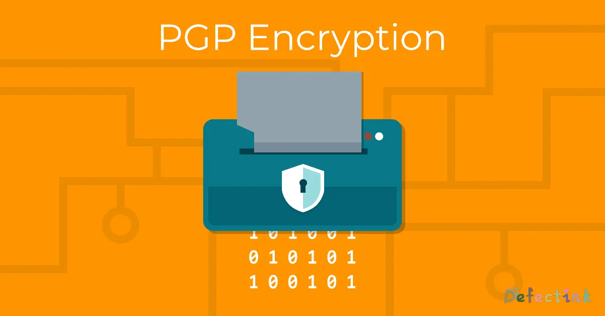

如果想对我说悄悄话，可以使用非对称加密给我发邮件。

## Pretty Good Privac

在这个信息横飞的时代，安全隐私也成为了不可或缺的一部分。非对称加密或许一种优良的解决方案。pgp的形成一定程度上实现了隐私的存在。

有关于非对称加密的一些大体原理，可以参考一下我曾经水过的一篇文：

[公开密钥密码学🔑 ](/defect/public-key-cryptgraphy.html)

## 我的公钥🔒！

* [Gits](https://gist.github.com/DefectingCat/d76be64d0da465e026eb7f17e126df39)

* [Onedrive](https://1drv.ms/u/s!ArC4gW7Dc7wWhd5PD8R_o6Mmhp2LxA?e=Ivpa8X)

